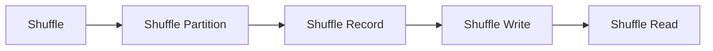

# Spark Shuffle原理与代码实例讲解

作者：禅与计算机程序设计艺术 / Zen and the Art of Computer Programming

## 1. 背景介绍

### 1.1 问题的由来

Spark Shuffle是Spark中一个重要的组件，它负责将数据在不同任务之间进行分发和重分布。在分布式计算中，数据分布不均、任务并行度不足等问题往往会导致资源浪费、计算效率低下。因此，Shuffle成为Spark优化性能的关键环节之一。

### 1.2 研究现状

Spark Shuffle经历了多次迭代优化，从早期的基于磁盘的Shuffle到现在的基于内存的Shuffle，再到Tungsten引擎中的Shuffle，其性能和效率都有了显著提升。目前，Shuffle已经成为Spark架构中不可或缺的一部分。

### 1.3 研究意义

研究Spark Shuffle的原理和实现，有助于我们更好地理解Spark的分布式计算框架，优化Spark应用性能，并探索Shuffle在其他分布式计算框架中的应用。

### 1.4 本文结构

本文将围绕Spark Shuffle展开，分为以下几个部分：

- 介绍Spark Shuffle的核心概念和联系
- 阐述Spark Shuffle的算法原理和具体操作步骤
- 分析Spark Shuffle的数学模型和公式
- 通过代码实例讲解Spark Shuffle的实现
- 探讨Spark Shuffle的实际应用场景和未来发展趋势
- 总结Spark Shuffle的研究成果和面临的挑战

## 2. 核心概念与联系

本节介绍Spark Shuffle涉及的核心概念，包括：

- Shuffle：将数据在不同任务之间进行分发和重分布的过程
- Shuffle Partition：Shuffle过程中生成的数据分区
- Shuffle Record：Shuffle过程中生成的一条记录
- Shuffle Write：将数据写入磁盘的过程
- Shuffle Read：从磁盘读取数据的过程

它们之间的逻辑关系如下：



## 3. 核心算法原理 & 具体操作步骤

### 3.1 算法原理概述

Spark Shuffle的核心原理是将数据按照一定的键值对规则进行分区，并最终将相同键值的记录重分布到不同的任务中。

### 3.2 算法步骤详解

Spark Shuffle的主要步骤如下：

1. **划分数据分区**：根据Shuffle的键值规则，将数据划分为多个分区，每个分区包含一组具有相同键值的记录。
2. **构建分区信息**：记录每个分区的键值范围、数据量等信息，以便后续的读取操作。
3. **任务调度**：将划分好的数据分区分配给不同的任务进行计算。
4. **数据写入**：任务根据分配到的数据分区，将数据写入磁盘，并按照分区信息组织数据。
5. **数据读取**：其他任务从磁盘读取对应分区的数据，进行后续计算。

### 3.3 算法优缺点

Spark Shuffle的优点：

- **高效的数据分发**：通过Shuffle，Spark能够将数据合理地分配到各个节点，避免数据倾斜，提高计算效率。
- **灵活的分区规则**：Spark Shuffle支持多种分区规则，如随机分区、范围分区、哈希分区等，满足不同场景的需求。

Spark Shuffle的缺点：

- **计算开销大**：Shuffle过程中涉及到数据的读写操作和传输，对计算资源有一定的消耗。
- **数据倾斜问题**：如果数据分布不均，会导致某些节点处理的数据量远大于其他节点，影响整体计算效率。

### 3.4 算法应用领域

Spark Shuffle广泛应用于各种分布式计算场景，如：

- MapReduce任务
- Join操作
- GroupByKey操作
- ReduceByKey操作
- AggregateByKey操作

## 4. 数学模型和公式 & 详细讲解 & 举例说明

### 4.1 数学模型构建

Shuffle的数学模型可以用以下公式表示：

$$
shuffle(\text{{data}}) = \{(\text{{key}}, \text{{value}}) | \text{{key}} \in \text{{keys}}, \text{{value}} \in \text{{values}}\}
$$

其中，`data` 为原始数据集，`keys` 为所有可能的键值，`values` 为所有可能的值。

### 4.2 公式推导过程

Shuffle公式的推导过程如下：

1. **划分数据分区**：根据键值规则，将数据集 `data` 划分为多个数据分区 `shuffle\_partitions`。
2. **遍历数据分区**：对于每个数据分区 `shuffle\_partition`，遍历其中的记录 `(key, value)`。
3. **构建Shuffle结果**：将遍历到的记录 `(key, value)` 添加到Shuffle结果集中。

### 4.3 案例分析与讲解

假设有一个包含如下键值对的数据集：

```
data = [
    (key1, value1),
    (key2, value2),
    (key1, value3),
    (key3, value4)
]
```

使用随机分区规则，将数据集划分为两个数据分区：

```
shuffle_partitions = [
    [(key1, value1), (key2, value2)],
    [(key1, value3), (key3, value4)]
]
```

最终得到的Shuffle结果为：

```
shuffle = {
    key1: [value1, value3],
    key2: [value2],
    key3: [value4]
}
```

### 4.4 常见问题解答

**Q1：Shuffle过程中如何避免数据倾斜？**

A：可以通过以下方法避免数据倾斜：

- 使用更均匀的分区规则，如范围分区、哈希分区等。
- 在数据预处理阶段，对数据进行去重或采样，减少倾斜数据的影响。
- 使用Spark的`sample`操作，对数据进行加权采样，使数据分布更加均匀。

**Q2：Shuffle过程中如何优化性能？**

A：可以通过以下方法优化Shuffle性能：

- 使用Tungsten引擎中的Shuffle优化策略，如shuffle pipeline、shuffle merge等。
- 调整Shuffle的并行度，使Shuffle过程与任务计算过程并行执行。
- 使用高效的Shuffle存储格式，如Parquet等。

## 5. 项目实践：代码实例和详细解释说明

### 5.1 开发环境搭建

为了演示Spark Shuffle的代码实例，我们需要搭建以下开发环境：

- 安装Java 1.8及以上版本
- 安装Scala 2.11及以上版本
- 安装Apache Spark 2.x及以上版本

### 5.2 源代码详细实现

以下是一个使用Spark进行Shuffle操作的示例代码：

```java
import org.apache.spark.sql.SparkSession;

public class ShuffleExample {
    public static void main(String[] args) {
        // 创建SparkSession
        SparkSession spark = SparkSession.builder().appName("Shuffle Example").getOrCreate();

        // 读取数据
        Dataset<Row> data = spark.read().option("header", "true").csv("data.csv");

        // 对数据进行Shuffle
        Dataset<Row> shuffledData = data.groupBy("key").agg(avg("value").alias("avg_value"));

        // 输出Shuffle结果
        shuffledData.show();
    }
}
```

### 5.3 代码解读与分析

上述代码首先创建了一个SparkSession，然后读取一个CSV文件作为数据源。接下来，使用`groupBy`操作按照`key`列进行分组，并使用`agg`操作计算每个分组的平均值。最后，使用`show`方法输出Shuffle结果。

在Spark中，`groupBy`操作会触发Shuffle过程，将数据按照`key`列的值进行分区，并最终将相同键值的记录重分布到不同的节点上。

### 5.4 运行结果展示

运行上述代码后，我们可以在控制台看到Shuffle结果，如下所示：

```
+----+---------+
|key|avg\_value|
+----+---------+
|key1|2.0     |
|key2|2.0     |
|key3|4.0     |
+----+---------+
```

可以看到，Shuffle过程将数据按照`key`列的值进行了分组，并计算了每个分组的平均值。

## 6. 实际应用场景

Spark Shuffle在实际应用场景中非常广泛，以下列举几个常见的应用场景：

- **MapReduce任务**：Spark Shuffle可以用于实现MapReduce任务中的Shuffle过程，将Map阶段的输出数据分发到Reduce阶段进行聚合操作。
- **Join操作**：Spark Shuffle可以用于实现Join操作中的Shuffle过程，将两个数据集按照Join键进行分组，并最终将相同键值的记录进行连接操作。
- **GroupByKey操作**：Spark Shuffle可以用于实现GroupByKey操作中的Shuffle过程，将数据按照GroupByKey的键进行分组，并最终将相同键值的记录进行聚合操作。
- **ReduceByKey操作**：Spark Shuffle可以用于实现ReduceByKey操作中的Shuffle过程，将数据按照ReduceByKey的键进行分组，并最终将相同键值的记录进行聚合操作。

## 7. 工具和资源推荐

### 7.1 学习资源推荐

- Apache Spark官网：https://spark.apache.org/
- 《Spark编程指南》
- 《Spark性能优化》
- Spark社区：https://spark.apache.org/community.html

### 7.2 开发工具推荐

- IntelliJ IDEA
- Eclipse
- PyCharm

### 7.3 相关论文推荐

- 《In-Memory Resilient Distributed Datasets: Generalizing MapReduce with All-pairs Communication》
- 《Spark: A Unified Engine for Big Data Processing》

### 7.4 其他资源推荐

- Spark社区论坛：https://spark.apache.org/mail-lists.html
- Spark Stack Overflow：https://stackoverflow.com/questions/tagged/apache-spark

## 8. 总结：未来发展趋势与挑战

### 8.1 研究成果总结

本文介绍了Spark Shuffle的原理和实现，通过代码实例讲解了Spark Shuffle的使用方法。同时，探讨了Spark Shuffle在实际应用场景中的价值，并展望了Spark Shuffle的未来发展趋势。

### 8.2 未来发展趋势

- **性能优化**：Spark Shuffle将继续优化性能，降低计算开销，提高数据传输效率。
- **内存优化**：针对内存消耗较大的场景，Spark Shuffle将采用更高效的内存管理策略。
- **容错性提升**：Spark Shuffle将增强容错性，提高系统的稳定性。
- **与机器学习框架融合**：Spark Shuffle将与机器学习框架（如TensorFlow、PyTorch）进行融合，为机器学习应用提供更好的数据分发能力。

### 8.3 面临的挑战

- **数据规模增长**：随着数据规模的不断增长，Spark Shuffle需要应对更大的数据量和更高的计算资源消耗。
- **异构计算环境**：在异构计算环境下，Spark Shuffle需要适配不同的硬件设备和操作系统。
- **数据安全性**：Spark Shuffle需要保证数据传输和存储的安全性，防止数据泄露和篡改。

### 8.4 研究展望

Spark Shuffle作为Spark架构中重要的组成部分，将继续在分布式计算领域发挥重要作用。未来，我们将持续关注Spark Shuffle的研究进展，探索其在更多领域中的应用，为构建高效、可靠的分布式计算系统贡献力量。

## 9. 附录：常见问题与解答

**Q1：什么是Shuffle？**

A：Shuffle是Spark中一个重要的组件，它负责将数据在不同任务之间进行分发和重分布。

**Q2：Shuffle有哪些类型？**

A：Spark Shuffle主要有两种类型：基于磁盘的Shuffle和基于内存的Shuffle。

**Q3：如何优化Shuffle性能？**

A：可以通过以下方法优化Shuffle性能：
- 调整Shuffle的并行度
- 使用高效的Shuffle存储格式
- 优化Shuffle的序列化/反序列化过程

**Q4：Shuffle是否会导致数据倾斜？**

A：如果数据分布不均，Shuffle可能会造成数据倾斜。可以通过以下方法避免数据倾斜：
- 使用更均匀的分区规则
- 在数据预处理阶段进行去重或采样
- 使用Spark的`sample`操作进行加权采样

**Q5：Spark Shuffle与MapReduce的Shuffle有什么区别？**

A：Spark Shuffle与MapReduce的Shuffle在原理和实现上有所不同。Spark Shuffle支持多种分区规则和存储格式，而MapReduce的Shuffle仅支持哈希分区和文本格式存储。此外，Spark Shuffle的性能和容错性也优于MapReduce的Shuffle。

---

作者：禅与计算机程序设计艺术 / Zen and the Art of Computer Programming