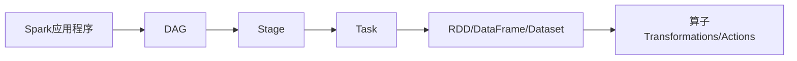

# Spark原理与代码实例讲解

## 1. 背景介绍
### 1.1 问题的由来
随着大数据时代的到来,海量数据的处理和分析成为了许多企业和组织面临的重大挑战。传统的数据处理方式已经无法满足日益增长的计算需求。在这种背景下,Apache Spark应运而生,成为了大数据处理领域的佼佼者。
### 1.2 研究现状 
近年来,学术界和工业界对Spark的研究热度持续升温。众多公司都在生产环境中部署了Spark,用于大规模数据处理、机器学习等任务。同时,Spark的生态系统也在不断完善,涌现出了大量基于Spark的开源项目。
### 1.3 研究意义
深入研究Spark的原理和应用,对于掌握大数据处理技术、提升数据分析能力具有重要意义。通过学习Spark,我们可以了解分布式计算的核心思想,掌握RDD、DAG等关键概念,从而更好地驾驭海量数据。
### 1.4 本文结构
本文将从Spark的核心概念入手,深入剖析其内部原理,并结合具体的代码实例进行讲解。同时,本文还将介绍Spark的实际应用场景,分享学习资源和开发工具,展望Spark的未来发展趋势和挑战。

## 2. 核心概念与联系
Spark的核心是弹性分布式数据集(RDD),它是Spark提供的基本数据结构。RDD具有容错性、可分区性等特点,适合进行大规模并行计算。在RDD的基础上,Spark还提供了DataFrame、Dataset等高阶数据抽象,方便用户进行结构化数据处理。

Spark采用了基于DAG(有向无环图)的任务调度执行机制。Spark应用程序会被转换为DAG形式,每个DAG节点代表一个任务阶段。Spark会对DAG进行优化,尽可能减少数据Shuffle,提高作业执行效率。

下图展示了Spark的核心概念以及它们之间的关联:



## 3. 核心算法原理 & 具体操作步骤
### 3.1 算法原理概述
Spark的核心算法主要包括RDD的创建、转换和控制操作。通过函数式编程模型,用户可以方便地对RDD进行各种操作,Spark会自动将这些操作转换为DAG图,并在集群上并行执行。
### 3.2 算法步骤详解
1. 创建RDD:可以从内存集合、外部存储(如HDFS)等创建RDD。例如sc.parallelize()、sc.textFile()等。
2. 转换操作(Transformations):对RDD进行转换,生成新的RDD。常见的转换操作有map、filter、flatMap、groupByKey等。这些操作都是惰性求值的。
3. 行动操作(Actions):触发RDD的计算,将结果返回给Driver程序或写入外部存储。常见的行动操作有reduce、collect、count、saveAsTextFile等。
4. 持久化RDD:对多次使用的RDD进行持久化,加速后续计算。可以使用persist()或cache()方法。
5. 分区器:自定义数据分区方式,改变RDD的分区数,如repartition()和coalesce()。
6. 共享变量:使用广播变量和累加器,实现变量在集群中的共享和聚合。

### 3.3 算法优缺点
Spark采用内存计算,避免了不必要的磁盘IO,计算速度快。同时,Spark提供了丰富的API和高级抽象,编程模型灵活,使用门槛低。

但是,Spark也存在一些局限性。当数据量远大于集群内存时,可能会出现OOM问题。此外,Spark对流式数据的支持不如Flink等专门的流计算引擎。

### 3.4 算法应用领域
Spark在多个领域得到广泛应用,如批处理、SQL查询、流处理、图计算、机器学习等。典型的应用场景包括日志分析、用户行为挖掘、实时推荐、欺诈检测等。

## 4. 数学模型和公式 & 详细讲解 & 举例说明
### 4.1 数学模型构建
Spark的很多算法都基于统计学和线性代数理论。例如,在MLlib机器学习库中,Spark实现了大量常用的统计和优化算法。下面以线性回归为例,介绍其数学模型。

给定数据集 $\{(x_i,y_i)\}_{i=1}^N$,其中 $x_i$ 为特征向量, $y_i$ 为目标值。线性回归的目标是找到一个线性模型:

$$h_\theta(x) = \theta_0 + \theta_1x_1 + \theta_2x_2 + ... + \theta_dx_d$$

使得预测函数 $h_\theta(x)$ 与真实目标值 $y$ 尽可能接近。

### 4.2 公式推导过程
为了求解最优的模型参数 $\theta$,需要最小化损失函数。常用的损失函数是均方误差(MSE):

$$J(\theta) = \frac{1}{2N}\sum_{i=1}^N(h_\theta(x_i) - y_i)^2$$

我们可以使用梯度下降法来最小化损失函数。参数 $\theta_j$ 的更新公式为:

$$\theta_j := \theta_j - \alpha\frac{1}{N}\sum_{i=1}^N(h_\theta(x_i) - y_i)x_i^{(j)}$$

其中 $\alpha$ 为学习率, $x_i^{(j)}$ 为第 $i$ 个样本的第 $j$ 个特征。

### 4.3 案例分析与讲解
下面通过一个简单的例子来说明线性回归的应用。假设我们要根据房屋面积预测房价,已知如下数据:

| 面积(平方米) | 房价(万元) |
|------------|----------|
| 50         | 150      |
| 70         | 220      |  
| 100        | 350      |
| 120        | 420      |

根据这些数据,我们可以构建一个线性回归模型:

$$h_\theta(x) = \theta_0 + \theta_1x$$

其中 $x$ 为房屋面积, $h_\theta(x)$ 为预测房价。通过梯度下降法,求解出最优参数 $\theta_0$ 和 $\theta_1$,就得到了一个能够根据面积预测房价的线性模型。

### 4.4 常见问题解答
- 如何评估线性回归模型的好坏?
可以使用均方误差(MSE)、决定系数(R-squared)等指标。MSE越小,R-squared越接近1,说明模型拟合效果越好。

- 线性回归对数据有哪些假设?
线性回归假设变量之间是线性关系,残差服从正态分布且相互独立。如果数据不满足这些假设,可能需要对其进行转换,或者考虑使用其他模型。

- 如何处理过拟合问题?  
可以使用正则化技术,如L1/L2正则化,来控制模型复杂度,减轻过拟合。也可以通过交叉验证等方法选择合适的模型。

## 5. 项目实践：代码实例和详细解释说明
### 5.1 开发环境搭建
首先需要搭建Spark开发环境。以下是在Ubuntu系统上安装和配置Spark的步骤:

1. 安装JDK并配置JAVA_HOME环境变量
2. 下载Spark安装包,解压到适当目录
3. 配置SPARK_HOME环境变量
4. 启动Spark Shell进行测试

详细过程可参考Spark官方文档: http://spark.apache.org/docs/latest/

### 5.2 源代码详细实现
下面通过一个词频统计的例子,展示Spark编程的基本流程。需求是统计一个文本文件中每个单词出现的次数。

```scala
val textFile = sc.textFile("hdfs://...")  // 读取HDFS上的文本文件
val counts = textFile.flatMap(line => line.split(" "))  // 分词
                     .map(word => (word, 1))  // 每个单词映射为(单词, 1)
                     .reduceByKey(_ + _)  // 按单词聚合,出现次数相加
counts.saveAsTextFile("hdfs://...")  // 将结果保存回HDFS
```

这个例子包含了几个典型的RDD操作:
- textFile(): 读取外部文件创建RDD
- flatMap(): 将行数据切分为单词
- map(): 将每个单词映射为(单词, 1)形式的键值对
- reduceByKey(): 按单词聚合,出现次数相加 
- saveAsTextFile(): 将结果写回外部存储

可以看到,Spark通过一系列简洁的算子操作,实现了分布式的数据处理过程。

### 5.3 代码解读与分析
1. sc.textFile()创建了一个HadoopRDD,每个分区对应一个HDFS块。这一步是懒执行的,只记录了RDD的元数据信息。
2. flatMap()是一个转换操作,将行切分为单词。输入RDD中每个元素是一行文本,输出RDD中每个元素是一个单词。这一步也是懒执行的。
3. map()将每个单词映射为(单词, 1)形式的键值对。这一步将单词统一为(Key, Value)结构,为后续按Key聚合做准备。
4. reduceByKey()按单词聚合,对于每个Key(单词),将其对应的Value(出现次数)累加。这一步会触发Shuffle,将相同Key的数据聚合到同一个分区。
5. saveAsTextFile()是一个行动操作,触发RDD的实际计算,并将结果写入HDFS。每个Reduce任务生成一个结果文件,写入对应的HDFS目录。

在实际执行过程中,Spark会对这些操作进行优化,生成高效的物理执行计划。很多操作如map和flatMap会进行pipeline,避免不必要的中间结果存储。

### 5.4 运行结果展示
假设我们对以下文本进行词频统计:

```
hello world
hello spark 
hello hadoop
```

在Spark Shell中执行上述代码,运行结果如下:

```
(hadoop,1)
(hello,3)
(spark,1)
(world,1)
```

可以看到,Spark成功地统计出了每个单词的出现次数。这个简单的例子展示了Spark进行数据处理的基本流程。在实际应用中,我们可以进一步结合Spark SQL、Spark Streaming等组件,构建更加复杂的数据处理管道。

## 6. 实际应用场景
Spark在实际生产环境中有广泛的应用,下面列举几个典型场景:

### 6.1 日志处理
互联网公司每天会产生海量的用户行为日志,如网页点击、搜索、购买等。使用Spark可以对这些原始日志进行清洗、转换和聚合分析,挖掘用户行为模式,优化产品策略。

### 6.2 推荐系统
电商网站、视频网站等都会使用推荐系统,根据用户的历史行为和兴趣特征,实时推荐用户可能感兴趣的商品或内容。Spark MLlib提供了ALS、FM等常用的推荐算法。

### 6.3 金融风控
银行、保险、互联网金融等公司需要对用户进行实时风险评估,识别欺诈行为。Spark Streaming可以实时接入交易数据流,结合机器学习算法进行异常检测。

### 6.4 未来应用展望
随着5G、IoT等新技术的发展,数据规模将进一步增长。Spark有望在更多领域发挥重要作用,如无人驾驶、智慧城市、基因组学分析等。Spark也在不断演进,未来将提供更加智能、自动化的数据处理能力。

## 7. 工具和资源推荐
### 7.1 学习资源推荐
- 官方文档:Spark官网提供了详尽的用户指南、API文档、示例程序等。
- 书籍:《Spark: The Definitive Guide》、《Learning Spark》等经典图书。
- 视频教程:B站Spark教程、YouTube上的Spark Summit视频。
- 博客:知名Spark博主如Reynold Xin、Matei Zaharia的博客文章。

### 7.2 开发工具推荐
- IntelliJ IDEA:功能强大的Scala IDE,与Spark深度集成。
- Jupyter Notebook:交互式编程环境,支持Scala、Python等。
- Spark-