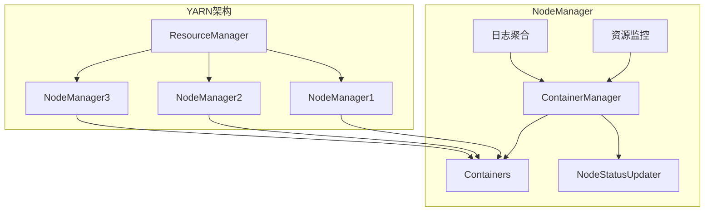

# YARN Node Manager原理与代码实例讲解

## 1. 背景介绍

### 1.1 问题的由来

随着大数据时代的到来，海量数据的存储和计算成为了一个巨大的挑战。Apache Hadoop作为一个分布式系统基础架构,被广泛应用于大数据处理领域。在Hadoop生态系统中,YARN(Yet Another Resource Negotiator)作为一个资源管理和任务调度框架,扮演着至关重要的角色。

YARN的核心组件之一是NodeManager,它在每个工作节点(Worker Node)上运行,负责管理该节点上的资源(CPU、内存等)以及容器的生命周期。NodeManager是YARN集群中实际执行任务的关键组件,它需要高效地管理本地资源,并与ResourceManager(YARN的主节点)进行通信,以确保集群资源的合理利用和任务的顺利执行。

### 1.2 研究现状

虽然YARN已经在业界得到了广泛的应用,但对于NodeManager的工作原理和实现细节,仍然存在一些模糊和疑问之处。许多开发人员和系统管理员在部署和优化YARN集群时,往往会遇到一些棘手的问题,例如资源利用率低下、任务执行效率低等。这些问题的根源往往与NodeManager的内部机制和实现细节有关。

目前,虽然Apache Hadoop官方文档对YARN的架构和组件进行了一定程度的介绍,但对于NodeManager的内部实现细节却缺乏深入的解释和示例。同时,网上也缺乏系统性、全面性的NodeManager原理和实现分析文章。

### 1.3 研究意义

深入理解YARN NodeManager的原理和实现细节,对于优化YARN集群的性能、提高资源利用率、解决实际问题等方面具有重要意义。通过对NodeManager的全面剖析,我们可以更好地理解它的工作机制、优化策略和潜在瓶颈,从而为集群调优和故障排查提供有力支持。

此外,研究NodeManager的实现细节,也有助于我们了解YARN的整体架构设计理念,掌握分布式系统中资源管理和任务调度的核心思想,为我们在其他分布式系统中应用类似的设计模式奠定基础。

### 1.4 本文结构

本文将全面剖析YARN NodeManager的原理和实现细节,内容安排如下:

1. 背景介绍
2. 核心概念与联系
3. 核心算法原理与具体操作步骤
4. 数学模型和公式详细讲解与举例说明
5. 项目实践:代码实例和详细解释说明
6. 实际应用场景
7. 工具和资源推荐
8. 总结:未来发展趋势与挑战
9. 附录:常见问题与解答

## 2. 核心概念与联系

在深入探讨YARN NodeManager的原理和实现之前,我们先来了解一些核心概念及它们之间的关联。

1. **ResourceManager(RM)**: YARN集群的主节点,负责全局资源管理和任务调度。
2. **NodeManager(NM)**: 运行在每个工作节点上的组件,负责管理该节点的资源和容器生命周期。
3. **Container**: YARN中的资源抽象,封装了CPU、内存等资源,用于运行任务。
4. **ContainerManager**: NodeManager中的核心组件,负责管理和监控容器的生命周期。
5. **ResourceMonitoring**: 监控节点资源使用情况,为ContainerManager提供资源信息。
6. **LogsAggregation**: 收集和聚合容器的日志信息。
7. **NodeStatusUpdater**: 定期向ResourceManager汇报节点状态和资源使用情况。

上图展示了YARN的整体架构,以及NodeManager内部组件之间的关系。NodeManager作为YARN的关键组件,与ResourceManager、容器等概念密切相关,共同构建了YARN的分布式资源管理和任务调度框架。

## 3. 核心算法原理与具体操作步骤

### 3.1 算法原理概述

NodeManager的核心算法原理可以概括为以下几个方面:

1. **资源管理**: NodeManager需要高效地管理节点上的CPU、内存等资源,并将这些资源分配给容器用于任务执行。它需要采用合理的资源分配策略,确保资源的高效利用和公平分配。

2. **容器生命周期管理**: NodeManager需要管理容器的整个生命周期,包括容器的创建、启动、监控、停止和清理等过程。它需要采用高效的容器管理算法,确保容器的正常运行和及时回收。

3. **节点状态更新**: NodeManager需要定期向ResourceManager汇报节点的状态和资源使用情况,以便ResourceManager进行全局资源调度和任务分配。这需要一种高效的状态更新算法,确保状态信息的准确性和及时性。

4. **日志聚合**: NodeManager需要收集和聚合容器的日志信息,以便于故障排查和监控。这需要一种高效的日志聚合算法,确保日志信息的完整性和可访问性。

5. **容错和恢复**: NodeManager需要具备容错和恢复能力,能够应对节点故障、网络故障等异常情况,确保任务的可靠执行和数据的安全性。这需要一种健壮的容错和恢复算法。

### 3.2 算法步骤详解

NodeManager的核心算法可以分为以下几个步骤:

1. **启动和初始化**

   在NodeManager启动时,它会进行一系列初始化操作,包括:

   - 加载配置文件,获取节点资源信息(CPU、内存等)。
   - 创建ContainerManager、ResourceMonitoring、LogsAggregation等核心组件。
   - 向ResourceManager注册节点,获取分配的容器。

2. **资源监控和分配**

   NodeManager会持续监控节点的资源使用情况,并根据资源分配策略将可用资源分配给容器。具体步骤如下:

   - ResourceMonitoring组件周期性地收集节点的CPU、内存等资源使用情况。
   - ContainerManager根据资源分配策略(如Fair Scheduler、Capacity Scheduler等)计算可分配的资源。
   - ContainerManager创建新的容器,并为其分配计算资源。

3. **容器生命周期管理**

   ContainerManager负责管理容器的整个生命周期,包括以下步骤:

   - 接收ResourceManager分配的容器启动请求。
   - 为容器准备运行环境,包括设置CPU亲和性、内存限制等。
   - 启动容器进程,执行任务。
   - 监控容器的运行状态,收集容器日志。
   - 当任务完成或出现异常时,停止和清理容器。

4. **节点状态更新**

   NodeStatusUpdater组件会定期向ResourceManager汇报节点的状态和资源使用情况,具体步骤如下:

   - 周期性地收集节点的CPU、内存等资源使用情况。
   - 收集ContainerManager管理的容器状态信息。
   - 将节点状态和容器状态信息打包,发送给ResourceManager。

5. **日志聚合**

   LogsAggregation组件负责收集和聚合容器的日志信息,步骤如下:

   - 监控容器的日志输出。
   - 将日志信息上传到HDFS或其他存储系统。
   - 提供日志访问接口,供用户查询和下载日志。

6. **容错和恢复**

   为了确保NodeManager的高可用性和任务的可靠执行,需要采取以下容错和恢复措施:

   - 定期向ResourceManager发送心跳包,确认节点的存活状态。
   - 当节点出现故障时,ResourceManager会将该节点上的容器重新分配到其他节点上执行。
   - NodeManager支持从故障中恢复,可以在重启后继续执行未完成的任务。

### 3.3 算法优缺点

NodeManager的核心算法具有以下优点:

- **高效资源利用**: 通过合理的资源分配策略和容器生命周期管理,可以最大化节点资源的利用率。
- **可靠性和容错性**: 通过节点状态更新、日志聚合和容错恢复机制,确保了任务执行的可靠性和系统的高可用性。
- **灵活性和扩展性**: YARN的架构设计使得NodeManager具有良好的灵活性和扩展性,可以方便地集成新的资源调度策略和容器执行引擎。

同时,NodeManager的算法也存在一些潜在的缺点和挑战:

- **资源竞争**: 在高负载情况下,多个容器之间可能会出现资源竞争,导致性能下降。
- **资源浪费**: 由于资源分配的粒度有限,可能会出现资源碎片化和浪费的情况。
- **可扩展性挑战**: 随着集群规模的扩大,NodeManager需要处理更多的容器和资源,对算法的性能和可扩展性提出了更高的要求。

### 3.4 算法应用领域

NodeManager的核心算法不仅应用于YARN,同样也可以应用于其他分布式资源管理和任务调度系统,如Kubernetes、Apache Mesos等。这些系统都需要高效地管理分布式节点上的资源,并为任务提供可靠的执行环境。

此外,NodeManager的算法思想也可以应用于其他领域,如云计算、边缘计算等。在这些场景下,也需要对分布式节点进行资源管理和任务调度,以实现高效的资源利用和可靠的任务执行。

## 4. 数学模型和公式详细讲解与举例说明

在NodeManager的实现中,涉及到一些数学模型和公式,用于描述和优化资源分配、任务调度等过程。下面我们将详细讲解这些数学模型和公式,并给出具体的案例分析和常见问题解答。

### 4.1 数学模型构建

#### 资源模型

在YARN中,资源被抽象为一个多维度的向量,表示为:

$$\vec{r} = (r_1, r_2, \ldots, r_n)$$

其中,$$r_i$$表示第$$i$$种资源的数量,如CPU核数、内存大小等。一个节点的总资源可以表示为:

$$\vec{R} = \sum_{i=1}^{m} \vec{r_i}$$

其中,$$m$$是节点上容器的数量。

#### 资源分配模型

假设有$$n$$种资源,我们需要为一个任务分配资源向量$$\vec{x} = (x_1, x_2, \ldots, x_n)$$,满足以下约束条件:

$$\sum_{i=1}^{m} x_i \leq R_i, \quad i = 1, 2, \ldots, n$$

其中,$$R_i$$是第$$i$$种资源的总量。

我们可以构建一个目标函数,用于优化资源分配:

$$\max f(\vec{x}) = \sum_{i=1}^{n} w_i x_i$$

其中,$$w_i$$是第$$i$$种资源的权重系数,反映了该资源的重要性。

通过求解上述优化问题,我们可以得到最优的资源分配方案$$\vec{x}^*$$。

### 4.2 公式推导过程

下面我们将推导资源分配模型中的优化目标函数。

假设我们有一个任务队列$$Q = \{q_1, q_2, \ldots, q_m\}$$,每个任务$$q_i$$需要资源向量$$\vec{r_i} = (r_{i1}, r_{i2}, \ldots, r_{in})$$。我们的目标是最大化所有任务的加权资源利用率,即:

$$\max \sum_{i=1}^{m} \sum_{j=1}^{n} w_j r_{ij}$$

其中,$$w_j$$是第$$j$$种资源的权重系数。

引入决策变量$$x_{ij}$$,表示分配给任务$$q_i$$的第$$j$$种资源的数量,我们可以将目标函数重写为:

$$\max \sum_{i=1}^{m} \sum_{j=1}^{n} w_j x_{ij}$$

同时,我