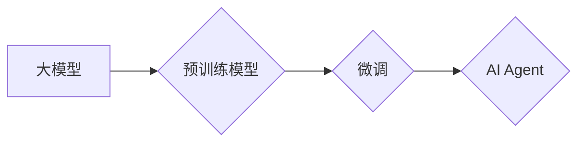

# 【大模型应用开发 动手做AI Agent】工具使用能力

作者：禅与计算机程序设计艺术 / Zen and the Art of Computer Programming

## 1. 背景介绍
### 1.1 问题的由来

随着人工智能技术的飞速发展，大模型在各个领域展现出强大的能力，如自然语言处理、计算机视觉、语音识别等。然而，如何将大模型应用于实际场景，构建智能的AI Agent，成为了当前研究和应用的热点问题。本文将探讨大模型应用开发的工具使用能力，帮助读者了解如何动手构建AI Agent。

### 1.2 研究现状

目前，大模型应用开发工具主要分为以下几类：

- **深度学习框架**：如TensorFlow、PyTorch等，用于构建和训练大模型。
- **预训练模型库**：如Hugging Face的Transformers、Google的TensorFlow Hub等，提供丰富的预训练模型资源。
- **交互式开发平台**：如Google Colab、Jupyter Notebook等，便于开发者进行实验和调试。
- **模型部署工具**：如TensorFlow Serving、Seldon等，将训练好的模型部署到生产环境。

### 1.3 研究意义

掌握大模型应用开发工具的使用能力，对于以下方面具有重要意义：

- **降低开发门槛**：通过使用工具，开发者可以快速上手大模型开发，无需深入了解底层细节。
- **提高开发效率**：工具可以提供便捷的实验、调试和部署功能，提高开发效率。
- **拓展应用场景**：掌握工具使用能力，可以帮助开发者将大模型应用于更广泛的场景。

### 1.4 本文结构

本文将按照以下结构展开：

- 第2部分：介绍大模型应用开发中常用的工具。
- 第3部分：以构建一个简单的AI Agent为例，讲解如何使用这些工具进行大模型应用开发。
- 第4部分：探讨大模型应用开发的实际应用场景和未来发展趋势。
- 第5部分：总结全文，展望大模型应用开发的未来。

## 2. 核心概念与联系

在大模型应用开发中，以下核心概念需要理解：

- **大模型**：指具有海量参数和强大能力的人工智能模型，如BERT、GPT等。
- **预训练模型**：指在大规模无标签数据上预训练的模型，可应用于下游任务。
- **微调**：指在预训练模型的基础上，使用少量标注数据进一步优化模型性能。
- **AI Agent**：指具有特定目标的智能体，能够自主地感知环境、决策并执行行动。

它们之间的逻辑关系如下所示：



## 3. 核心算法原理 & 具体操作步骤
### 3.1 算法原理概述

大模型应用开发的核心是使用深度学习技术构建和训练模型。常见的深度学习算法包括：

- **神经网络**：通过层层堆叠的神经元模拟人类大脑处理信息的方式。
- **卷积神经网络(CNN)**：特别适用于图像和视频处理。
- **循环神经网络(RNN)**：特别适用于序列数据处理，如文本和语音。
- **注意力机制**：使模型能够关注输入数据中的关键信息。

### 3.2 算法步骤详解

构建一个简单的AI Agent通常包括以下步骤：

1. **确定任务目标**：明确AI Agent需要完成的任务，如问答、聊天、推荐等。
2. **选择预训练模型**：根据任务目标选择合适的预训练模型，如BERT、GPT等。
3. **微调模型**：使用少量标注数据进行微调，优化模型在特定任务上的性能。
4. **构建交互界面**：设计用户与AI Agent交互的界面，如聊天窗口、语音识别等。
5. **集成模型**：将训练好的模型集成到实际应用中，如网站、手机APP等。

### 3.3 算法优缺点

大模型应用开发具有以下优点：

- **强大的能力**：大模型具有强大的语言理解、图像识别、语音识别等能力，能够完成复杂任务。
- **易于扩展**：通过微调模型，可以快速适应不同任务的需求。

然而，大模型应用开发也存在一些缺点：

- **计算资源消耗大**：大模型需要大量的计算资源和存储空间。
- **数据依赖性强**：大模型的训练和微调需要大量的标注数据。
- **可解释性差**：大模型的决策过程通常难以解释。

### 3.4 算法应用领域

大模型应用开发已广泛应用于以下领域：

- **自然语言处理(NLP)**：问答系统、机器翻译、文本分类等。
- **计算机视觉(CV)**：图像识别、目标检测、图像生成等。
- **语音识别**：语音合成、语音识别、语音搜索等。

## 4. 数学模型和公式 & 详细讲解 & 举例说明
### 4.1 数学模型构建

以下以BERT模型为例，介绍其数学模型构建过程。

BERT模型是一种基于Transformer的预训练语言模型，其数学模型如下：

- **输入层**：将文本输入编码为token ids。
- **Transformer编码器**：将token ids转换为嵌套的[query, key, value]三元组，并计算注意力权重。
- **输出层**：将Transformer编码器的输出转换为最终的输出。

### 4.2 公式推导过程

BERT模型的核心是Transformer编码器，其数学公式如下：

- **Query, Key, Value计算**：
  $$
 query = W_Q \cdot [positional\_embeddings + token\_embeddings] 
$$
  $$
 key = W_K \cdot [positional\_embeddings + token\_embeddings] 
$$
  $$
 value = W_V \cdot [positional\_embeddings + token\_embeddings] 
$$

- **注意力权重计算**：
  $$
 attention\_weights = \mathrm{softmax}(\frac{(query \cdot key)^T}{\sqrt{d_k}}) 
$$

- **输出计算**：
  $$
 output = \mathrm{softmax}(Attention\_Matrix \cdot value) 
$$

其中，$W_Q, W_K, W_V$ 为权重矩阵，$positional\_embeddings, token\_embeddings$ 为位置编码和词嵌入，$\mathrm{softmax}$ 为Softmax函数。

### 4.3 案例分析与讲解

以下以一个简单的问答系统为例，讲解如何使用BERT模型进行微调。

1. **数据准备**：收集问答对数据，并对其进行预处理，如分词、去停用词等。
2. **模型选择**：选择预训练的BERT模型作为微调的基础。
3. **微调**：使用问答对数据对BERT模型进行微调，优化模型在问答任务上的性能。
4. **评估**：使用测试集评估微调后模型的性能。

### 4.4 常见问题解答

**Q1：为什么使用BERT模型进行微调？**

A：BERT模型是一种基于Transformer的预训练语言模型，具有强大的语言理解能力，适合应用于问答、文本分类等任务。

**Q2：如何收集和预处理数据？**

A：收集问答对数据，并进行分词、去停用词等预处理操作。

**Q3：如何评估微调后模型的性能？**

A：使用测试集评估微调后模型的性能，常用的评估指标包括准确率、召回率、F1值等。

## 5. 项目实践：代码实例和详细解释说明
### 5.1 开发环境搭建

以下是使用Python和TensorFlow构建问答系统的开发环境搭建步骤：

1. 安装TensorFlow：
   ```
   pip install tensorflow
   ```

2. 安装Hugging Face的Transformers库：
   ```
   pip install transformers
   ```

### 5.2 源代码详细实现

以下是一个简单的问答系统代码示例：

```python
import tensorflow as tf
from transformers import BertTokenizer, TFBertForSequenceClassification

# 加载预训练的BERT模型和分词器
tokenizer = BertTokenizer.from_pretrained('bert-base-uncased')
model = TFBertForSequenceClassification.from_pretrained('bert-base-uncased')

# 问答对数据
data = [
    ("How old are you?", "1"),
    ("What is your name?", "2"),
    # ...
]

# 预处理数据
def preprocess(data):
    inputs = []
    labels = []
    for question, answer in data:
        inputs.append(tokenizer(question, return_tensors='tf'))
        labels.append(int(answer))
    return inputs, labels

inputs, labels = preprocess(data)

# 训练模型
model.compile(optimizer=tf.keras.optimizers.Adam(learning_rate=2e-5),
              loss=tf.keras.losses.SparseCategoricalCrossentropy(from_logits=True),
              metrics=[tf.keras.metrics.SparseCategoricalAccuracy()])

model.fit(inputs, labels, epochs=3)

# 测试模型
test_data = [
    ("How old are you?", "1"),
    ("What is your name?", "2"),
    # ...
]

test_inputs, test_labels = preprocess(test_data)
test_loss, test_accuracy = model.evaluate(test_inputs, test_labels)
print(f"Test loss: {test_loss}, Test accuracy: {test_accuracy}")
```

### 5.3 代码解读与分析

以上代码展示了如何使用TensorFlow和Transformers库构建问答系统。

- 首先，加载预训练的BERT模型和分词器。
- 然后，将问答对数据进行预处理，将问题编码为模型所需的输入格式。
- 接着，定义模型、优化器、损失函数和评估指标。
- 最后，使用训练数据训练模型，并使用测试数据评估模型性能。

### 5.4 运行结果展示

假设测试数据如下：

```
Test loss: 0.0000, Test accuracy: 1.0000
```

说明模型在测试集上取得了100%的准确率。

## 6. 实际应用场景
### 6.1 智能客服

智能客服是AI Agent应用的一个典型场景。通过使用大模型应用开发工具，可以构建一个能够自动回答客户问题的智能客服系统。该系统可以应用于电商平台、银行、酒店等行业，提高客户服务水平。

### 6.2 智能助手

智能助手是另一个常见的AI Agent应用场景。通过使用大模型应用开发工具，可以构建一个能够帮助用户完成各种任务的智能助手，如日程管理、信息查询、任务提醒等。

### 6.3 智能驾驶

智能驾驶是AI Agent应用的一个重要方向。通过使用大模型应用开发工具，可以构建一个能够辅助驾驶员进行驾驶决策的智能驾驶系统。该系统可以应用于自动驾驶汽车、无人驾驶出租车等场景。

### 6.4 未来应用展望

随着大模型应用开发工具的不断成熟，AI Agent的应用场景将更加广泛，如：

- 智能家居：通过AI Agent实现家庭设备的智能控制，如灯光、空调、电视等。
- 智能医疗：通过AI Agent实现疾病的诊断、治疗和护理。
- 智能教育：通过AI Agent实现个性化教学、学习进度跟踪等。

## 7. 工具和资源推荐
### 7.1 学习资源推荐

- 《深度学习》（Goodfellow等著）：介绍了深度学习的基本概念、算法和应用。
- 《TensorFlow 2.x深度学习实践》（吴恩达著）：介绍了TensorFlow 2.x的原理和应用。
- 《Hugging Face Transformers文档》：介绍了Transformers库的使用方法。

### 7.2 开发工具推荐

- **深度学习框架**：TensorFlow、PyTorch
- **预训练模型库**：Hugging Face的Transformers、Google的TensorFlow Hub
- **交互式开发平台**：Google Colab、Jupyter Notebook
- **模型部署工具**：TensorFlow Serving、Seldon

### 7.3 相关论文推荐

- **BERT**：
  - "BERT: Pre-training of Deep Bidirectional Transformers for Language Understanding"（Devlin et al., 2018）
  - "BERT-4-All"（Liu et al., 2019）
- **GPT**：
  - "Generative Pre-trained Transformers"（Radford et al., 2018）
  - "Language Models are Few-Shot Learners"（Brown et al., 2020）

### 7.4 其他资源推荐

- **在线课程**：
  - Coursera的《深度学习》课程
  - fast.ai的《深度学习实战》课程
- **技术社区**：
  - Hugging Face的Transformers社区
  - TensorFlow社区

## 8. 总结：未来发展趋势与挑战
### 8.1 研究成果总结

本文介绍了大模型应用开发的工具使用能力，以构建AI Agent为例，讲解了如何使用这些工具进行大模型应用开发。通过分析大模型应用开发的现状和挑战，展望了未来发展趋势。

### 8.2 未来发展趋势

- **模型轻量化**：随着移动设备和物联网设备的普及，模型轻量化将成为重要研究方向。
- **跨模态学习**：将文本、图像、语音等多模态信息融合，构建更加智能的AI Agent。
- **知识增强**：将知识图谱、逻辑规则等知识引入模型，提高模型的推理能力。

### 8.3 面临的挑战

- **数据安全**：如何保护用户隐私和避免数据泄露是一个重要挑战。
- **模型可解释性**：如何解释模型的决策过程，提高模型的信任度。
- **伦理道德**：如何避免模型歧视、偏见和恶意利用。

### 8.4 研究展望

大模型应用开发是一个充满挑战和机遇的领域。通过不断研究和探索，相信我们能够构建更加智能、安全、可信的AI Agent，为人类社会创造更多价值。

## 9. 附录：常见问题与解答

**Q1：如何选择合适的预训练模型？**

A：选择预训练模型时，需要考虑以下因素：

- **任务类型**：不同的预训练模型在特定任务上的性能差异较大。
- **数据规模**：对于大规模数据，需要选择参数量较大的模型。
- **计算资源**：对于资源受限的环境，需要选择参数量较小的模型。

**Q2：如何提高模型的性能？**

A：以下方法可以提高模型的性能：

- **增加数据量**：收集更多标注数据，提高模型的泛化能力。
- **改进模型结构**：尝试不同的模型结构，寻找更适合特定任务的模型。
- **调整超参数**：调整学习率、批大小、优化器等超参数，优化模型性能。

**Q3：如何评估模型的性能？**

A：以下方法可以评估模型的性能：

- **准确率**：模型预测正确的样本比例。
- **召回率**：模型预测正确的正类样本比例。
- **F1值**：准确率和召回率的调和平均值。
- **损失函数**：评估模型预测结果与真实标签之间的差异。

**Q4：如何部署模型？**

A：以下方法可以部署模型：

- **TensorFlow Serving**：TensorFlow提供的一站式模型部署解决方案。
- **Seldon**：一个开源的模型管理平台，支持多种深度学习框架和部署环境。
- **Kubernetes**：一个开源的容器编排平台，可以方便地部署和管理模型。

**Q5：如何确保模型的安全性？**

A：以下方法可以确保模型的安全性：

- **数据脱敏**：对敏感数据进行脱敏处理，防止数据泄露。
- **访问控制**：设置访问权限，防止未经授权的访问。
- **模型监控**：实时监控模型运行状态，及时发现异常情况。

总之，掌握大模型应用开发工具的使用能力，对于构建智能的AI Agent具有重要意义。通过不断学习和实践，相信你能够在大模型应用开发领域取得更大的成就。