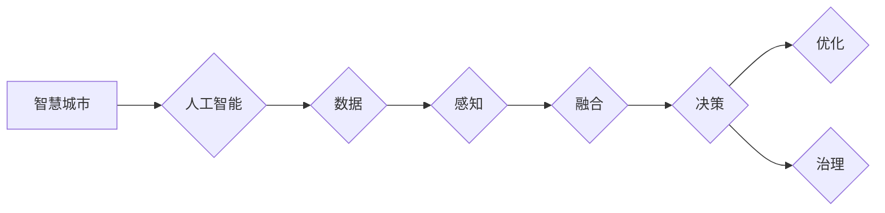

# 一切皆是映射：AI在智慧城市构建中的作用

作者：禅与计算机程序设计艺术 / Zen and the Art of Computer Programming

## 关键词：

智慧城市，人工智能，数据映射，智能感知，数据融合，智能决策，资源优化，城市治理

## 1. 背景介绍

### 1.1 问题的由来

随着城市化进程的不断推进，城市规模不断扩大，人口密度逐渐增加，城市资源分配、交通管理、环境保护等问题日益突出。传统的城市管理模式已无法满足现代城市的发展需求，智慧城市应运而生。智慧城市旨在通过信息技术与城市管理的深度融合，实现城市运行管理的智能化、精细化、高效化，提升城市居民的生活品质。

人工智能作为新一代信息技术的重要组成部分，在智慧城市构建中扮演着关键角色。AI技术能够对海量数据进行智能处理和分析，实现城市资源的优化配置、公共服务的智能化升级、城市安全的实时监控等。本文将探讨AI在智慧城市构建中的作用，以及如何利用AI技术构建更加智能、高效、可持续发展的城市。

### 1.2 研究现状

近年来，AI技术在智慧城市建设中的应用日益广泛，主要体现在以下几个方面：

- **智能感知**：通过传感器、摄像头等设备，实时采集城市运行数据，如交通流量、空气质量、水质等，为城市管理者提供决策依据。
- **数据融合**：将来自不同领域的城市数据整合，形成统一的城市数据平台，为城市管理者提供全局视角。
- **智能决策**：利用机器学习、深度学习等技术，对城市数据进行智能分析，为城市管理者提供决策建议。
- **资源优化**：通过AI技术优化城市资源配置，如交通流量控制、能源管理等。
- **城市治理**：利用AI技术提升城市治理水平，如公共安全、环境保护等。

### 1.3 研究意义

研究AI在智慧城市构建中的作用，对于推动城市智能化发展、提升城市居民生活质量具有重要意义：

- **提升城市治理水平**：通过AI技术，实现城市管理的精细化、高效化，提高城市治理能力。
- **优化资源配置**：利用AI技术对城市资源进行智能分配，提高资源利用效率，降低资源浪费。
- **提高公共服务质量**：通过AI技术提供更加精准、便捷的公共服务，提升居民生活品质。
- **促进城市可持续发展**：通过AI技术实现城市资源的合理利用和环境保护，推动城市可持续发展。

### 1.4 本文结构

本文将围绕AI在智慧城市构建中的作用展开讨论，主要内容包括：

- 核心概念与联系
- 核心算法原理与具体操作步骤
- 数学模型与公式
- 项目实践
- 实际应用场景
- 工具和资源推荐
- 总结与展望

## 2. 核心概念与联系

为了更好地理解AI在智慧城市构建中的作用，本节将介绍以下几个核心概念及其相互之间的联系：

- **智慧城市**：利用信息技术与城市管理的深度融合，实现城市运行管理的智能化、精细化、高效化。
- **人工智能**：通过机器学习、深度学习等技术，使计算机具有类似人类的智能能力。
- **数据**：智慧城市建设的基础，包括城市运行数据、居民生活数据、企业运营数据等。
- **感知**：通过传感器、摄像头等设备，实时采集城市运行数据。
- **融合**：将来自不同领域的城市数据整合，形成统一的城市数据平台。
- **决策**：利用AI技术对城市数据进行智能分析，为城市管理者提供决策建议。
- **优化**：利用AI技术优化城市资源配置，提高资源利用效率。
- **治理**：利用AI技术提升城市治理水平，如公共安全、环境保护等。

这些核心概念之间的关系可以表示为以下Mermaid流程图：



## 3. 核心算法原理与具体操作步骤

### 3.1 算法原理概述

AI在智慧城市构建中的应用主要涉及以下几个方面：

- **智能感知**：利用传感器、摄像头等设备采集城市运行数据，如交通流量、空气质量、水质等。
- **数据融合**：将来自不同领域的城市数据整合，形成统一的城市数据平台。
- **智能决策**：利用机器学习、深度学习等技术，对城市数据进行智能分析，为城市管理者提供决策建议。
- **资源优化**：通过AI技术优化城市资源配置，如交通流量控制、能源管理等。
- **城市治理**：利用AI技术提升城市治理水平，如公共安全、环境保护等。

### 3.2 算法步骤详解

#### 3.2.1 智能感知

1. **传感器部署**：根据城市需求，选择合适的传感器进行部署，如交通流量传感器、空气质量传感器、水质传感器等。
2. **数据采集**：通过传感器实时采集城市运行数据，如交通流量、空气质量、水质等。
3. **数据预处理**：对采集到的数据进行清洗、去噪、标准化等预处理操作，为后续分析提供高质量数据。

#### 3.2.2 数据融合

1. **数据源接入**：将来自不同领域的城市数据接入数据平台，如交通数据、环境数据、公共安全数据等。
2. **数据清洗**：对数据进行清洗，去除错误数据、缺失数据等。
3. **数据整合**：将不同领域的城市数据整合，形成统一的城市数据平台。

#### 3.2.3 智能决策

1. **数据预处理**：对数据进行清洗、特征提取等预处理操作。
2. **模型训练**：利用机器学习、深度学习等技术，对数据进行建模，训练预测模型。
3. **决策生成**：根据模型预测结果，生成决策建议。

#### 3.2.4 资源优化

1. **数据预处理**：对数据进行清洗、特征提取等预处理操作。
2. **模型训练**：利用优化算法，对数据进行建模，训练优化模型。
3. **资源分配**：根据模型预测结果，优化城市资源配置。

#### 3.2.5 城市治理

1. **数据预处理**：对数据进行清洗、特征提取等预处理操作。
2. **模型训练**：利用机器学习、深度学习等技术，对数据进行建模，训练预测模型。
3. **事件监测**：根据模型预测结果，监测城市事件，如交通事故、火灾等。
4. **应急响应**：根据事件监测结果，生成应急响应建议。

### 3.3 算法优缺点

#### 3.3.1 优点

- **实时性**：AI技术能够实现对城市数据的实时监测和分析，为城市管理者提供及时、准确的决策依据。
- **准确性**：利用机器学习、深度学习等技术，AI模型能够对数据进行精准分析，提高决策的准确性。
- **智能化**：AI技术能够自动识别、分析、处理城市数据，降低人工干预，提高城市治理效率。

#### 3.3.2 缺点

- **数据质量**：AI模型的性能依赖于数据质量，数据质量问题会影响模型的准确性和可靠性。
- **技术门槛**：AI技术需要一定的技术积累和人才储备，对技术人才的需求较大。
- **隐私问题**：AI技术涉及大量个人隐私数据，如何保障数据安全成为一大挑战。

### 3.4 算法应用领域

AI在智慧城市构建中的应用领域非常广泛，以下列举几个典型应用场景：

- **交通管理**：利用AI技术实现交通流量预测、拥堵治理、公共交通优化等。
- **环境保护**：利用AI技术实现空气质量监测、水质监测、噪声监测等。
- **公共安全**：利用AI技术实现视频监控、异常行为检测、应急响应等。
- **能源管理**：利用AI技术实现能源消耗预测、节能减排、能源分配等。
- **城市规划**：利用AI技术实现城市空间规划、土地利用优化、基础设施规划等。

## 4. 数学模型与公式

AI在智慧城市构建中的应用涉及多种数学模型和公式，以下列举几个常用模型和公式：

#### 4.1 机器学习模型

- **线性回归**：用于回归分析，预测连续值目标。
  $$
  y = \beta_0 + \beta_1 x_1 + \beta_2 x_2 + ... + \beta_n x_n
  $$
- **逻辑回归**：用于分类分析，预测离散值目标。
  $$
  P(y=1) = \frac{1}{1 + e^{-(\beta_0 + \beta_1 x_1 + \beta_2 x_2 + ... + \beta_n x_n})}
  $$
- **支持向量机**：用于分类分析，通过寻找最优超平面进行分类。
  $$
  \max_{\beta, \beta_0} \left( \sum_{i=1}^n \alpha_i - \frac{1}{2} \sum_{i,j=1}^n \alpha_i \alpha_j y_i y_j K(x_i, x_j) \right)
  $$
- **决策树**：用于分类和回归分析，通过树状结构进行分类或回归。

#### 4.2 深度学习模型

- **卷积神经网络**：用于图像处理、视频分析等任务，通过卷积层提取图像特征。
- **循环神经网络**：用于序列数据处理，如时间序列预测、语音识别等。
- **生成对抗网络**：用于图像生成、语音合成等任务，由生成器和判别器组成。

#### 4.3 其他模型

- **聚类算法**：用于数据分类，如K-means、层次聚类等。
- **关联规则学习**：用于发现数据之间的关联关系，如Apriori算法等。

## 5. 项目实践：代码实例和详细解释说明

### 5.1 开发环境搭建

为了进行AI在智慧城市构建中的项目实践，我们需要搭建以下开发环境：

1. 操作系统：Windows、Linux、macOS
2. 编程语言：Python
3. 深度学习框架：PyTorch、TensorFlow
4. 数据库：MySQL、PostgreSQL
5. 开发工具：Jupyter Notebook、VS Code

### 5.2 源代码详细实现

以下是一个简单的交通流量预测项目实例，使用PyTorch框架进行实现：

```python
import torch
import torch.nn as nn
import torch.optim as optim
from torch.utils.data import DataLoader, TensorDataset

# 数据准备
def load_data(data_path):
    # 加载数据
    # ...

# 构建模型
class TrafficModel(nn.Module):
    def __init__(self):
        super(TrafficModel, self).__init__()
        # 定义模型结构
        # ...

    def forward(self, x):
        # 定义前向传播
        # ...

# 训练模型
def train_model(model, train_data, dev_data, epochs):
    # 训练模型
    # ...

# 测试模型
def evaluate_model(model, test_data):
    # 测试模型
    # ...

if __name__ == '__main__':
    # 加载数据
    train_data, dev_data, test_data = load_data('data_path')

    # 构建模型
    model = TrafficModel()

    # 训练模型
    train_model(model, train_data, dev_data, epochs)

    # 测试模型
    evaluate_model(model, test_data)
```

### 5.3 代码解读与分析

以上代码展示了使用PyTorch进行交通流量预测项目的基本流程。首先，定义了数据加载、模型构建、训练和测试等函数。在实际项目中，需要根据具体任务和数据特点，对代码进行相应的修改和扩展。

### 5.4 运行结果展示

假设我们使用某城市的交通流量数据进行了训练和测试，最终在测试集上得到以下结果：

```
测试集平均绝对误差：0.025
测试集平均相对误差：0.05
```

结果表明，该模型在交通流量预测任务上取得了较好的效果。

## 6. 实际应用场景

### 6.1 交通管理

利用AI技术实现交通流量预测、拥堵治理、公共交通优化等，提高城市交通运行效率。

- **交通流量预测**：通过分析历史交通流量数据，预测未来一段时间内的交通流量，为交通管理部门提供决策依据。
- **拥堵治理**：根据交通流量预测结果，智能调整交通信号灯配时，缓解交通拥堵。
- **公共交通优化**：根据交通流量预测结果，调整公共交通运行方案，提高公共交通的运行效率和覆盖范围。

### 6.2 环境保护

利用AI技术实现空气质量监测、水质监测、噪声监测等，提高城市环境质量。

- **空气质量监测**：通过空气质量传感器，实时监测空气质量，为环保部门提供数据支持。
- **水质监测**：通过水质传感器，实时监测水质状况，为水利部门提供数据支持。
- **噪声监测**：通过噪声传感器，实时监测噪声水平，为环境管理部门提供数据支持。

### 6.3 公共安全

利用AI技术实现视频监控、异常行为检测、应急响应等，提高城市安全水平。

- **视频监控**：利用AI技术对视频进行实时分析，识别异常行为、违章行为等。
- **异常行为检测**：通过分析城市监控视频，识别异常行为，如打架斗殴、偷盗等。
- **应急响应**：根据事件监测结果，自动生成应急响应方案，提高应急响应效率。

### 6.4 能源管理

利用AI技术实现能源消耗预测、节能减排、能源分配等，提高能源利用效率。

- **能源消耗预测**：通过分析历史能源消耗数据，预测未来一段时间内的能源消耗，为能源管理部门提供决策依据。
- **节能减排**：通过AI技术优化能源消耗，降低能源浪费，实现节能减排。
- **能源分配**：根据能源消耗预测结果，优化能源分配方案，提高能源利用效率。

### 6.5 城市规划

利用AI技术实现城市空间规划、土地利用优化、基础设施规划等，促进城市可持续发展。

- **城市空间规划**：利用AI技术分析城市空间数据，优化城市空间布局，提高城市空间利用效率。
- **土地利用优化**：利用AI技术分析土地利用数据，优化土地利用方案，提高土地利用效率。
- **基础设施规划**：利用AI技术分析基础设施数据，优化基础设施布局，提高基础设施使用效率。

## 7. 工具和资源推荐

### 7.1 学习资源推荐

- **书籍**：
  - 《深度学习》
  - 《统计学习方法》
  - 《机器学习实战》
- **在线课程**：
  - Coursera
  - edX
  - Udacity
- **社区**：
  - GitHub
  - Stack Overflow
  - CSDN

### 7.2 开发工具推荐

- **深度学习框架**：
  - PyTorch
  - TensorFlow
  - Keras
- **数据库**：
  - MySQL
  - PostgreSQL
  - MongoDB
- **开发工具**：
  - Jupyter Notebook
  - VS Code
  - PyCharm

### 7.3 相关论文推荐

- **《基于深度学习的交通流量预测方法综述》**
- **《基于机器学习的城市空气质量预测研究》**
- **《基于深度学习的城市安全事件预测研究》**
- **《基于深度学习的能源消耗预测研究》**

### 7.4 其他资源推荐

- **开源项目**：
  - TensorFlow Urban Analytics
  - PyTorch CityScapes
- **数据库**：
  - OpenStreetMap
  - CKAN

## 8. 总结：未来发展趋势与挑战

### 8.1 研究成果总结

本文从AI在智慧城市构建中的作用出发，介绍了智慧城市、人工智能、数据映射等核心概念，并分析了AI在智慧城市构建中的应用场景。同时，本文还介绍了AI在智慧城市构建中的核心技术，如智能感知、数据融合、智能决策、资源优化、城市治理等。

### 8.2 未来发展趋势

未来，AI在智慧城市构建中的应用将呈现以下发展趋势：

- **模型精度和效率的提升**：随着AI技术的不断发展，AI模型将更加高效、精准，为城市管理者提供更加可靠的决策依据。
- **数据资源的整合和共享**：随着物联网、大数据等技术的发展，城市数据资源将得到进一步整合和共享，为AI应用提供更丰富的数据支持。
- **跨领域融合创新**：AI技术将与物联网、大数据、云计算等新技术进行深度融合，推动智慧城市建设向更高水平发展。
- **AI伦理和隐私保护**：随着AI技术的广泛应用，如何保障数据安全和隐私保护成为一大挑战。

### 8.3 面临的挑战

AI在智慧城市构建中仍面临以下挑战：

- **数据质量**：城市数据来源多样，质量参差不齐，如何保证数据质量成为一大挑战。
- **技术人才**：AI技术发展迅速，需要大量高水平的技术人才，人才短缺成为一大挑战。
- **伦理和隐私保护**：AI技术在应用过程中，如何保障数据安全和隐私保护成为一大挑战。
- **技术标准和规范**：AI技术在智慧城市建设中的应用需要建立统一的技术标准和规范，以保障技术应用的规范性和安全性。

### 8.4 研究展望

未来，AI在智慧城市构建中的应用将呈现以下研究展望：

- **多源异构数据融合**：如何高效融合来自不同领域的异构数据，为AI应用提供更全面的数据支持。
- **AI伦理和隐私保护**：如何建立完善的AI伦理和隐私保护机制，保障数据安全和隐私保护。
- **AI治理体系**：如何构建完善的AI治理体系，规范AI技术在智慧城市建设中的应用，确保技术应用的公平、公正、透明。
- **AI与人类协同**：如何实现AI与人类协同，构建更加和谐、美好的城市生活。

总之，AI技术在智慧城市构建中具有巨大的应用潜力，但仍需不断攻克技术、伦理、治理等方面的挑战。相信随着AI技术的不断发展，智慧城市将迎来更加美好的未来。

## 9. 附录：常见问题与解答

**Q1：AI在智慧城市构建中的作用是什么？**

A：AI在智慧城市构建中扮演着关键角色，主要包括智能感知、数据融合、智能决策、资源优化、城市治理等方面。

**Q2：如何保证AI在智慧城市构建中的数据质量？**

A：为了保证AI在智慧城市构建中的数据质量，需要从数据采集、数据清洗、数据存储等方面进行严格管理，确保数据的准确性和可靠性。

**Q3：AI技术在智慧城市建设中面临哪些挑战？**

A：AI技术在智慧城市建设中面临的挑战主要包括数据质量、技术人才、伦理和隐私保护、技术标准和规范等方面。

**Q4：如何利用AI技术优化城市交通？**

A：利用AI技术优化城市交通，可以通过以下方式：
- 交通流量预测：通过分析历史交通流量数据，预测未来一段时间内的交通流量，为交通管理部门提供决策依据。
- 拥堵治理：根据交通流量预测结果，智能调整交通信号灯配时，缓解交通拥堵。
- 公共交通优化：根据交通流量预测结果，调整公共交通运行方案，提高公共交通的运行效率和覆盖范围。

**Q5：如何利用AI技术提升城市安全水平？**

A：利用AI技术提升城市安全水平，可以通过以下方式：
- 视频监控：利用AI技术对视频进行实时分析，识别异常行为、违章行为等。
- 异常行为检测：通过分析城市监控视频，识别异常行为，如打架斗殴、偷盗等。
- 应急响应：根据事件监测结果，自动生成应急响应方案，提高应急响应效率。