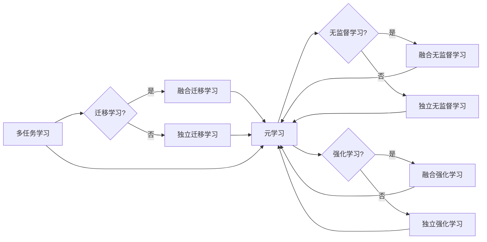

# 一切皆是映射：元学习在快速适应新任务中的作用

## 关键词：

元学习，映射，快速适应，新任务，迁移学习，强化学习，无监督学习

## 1. 背景介绍

### 1.1 问题的由来

在人工智能领域，机器学习模型在处理新任务时往往需要大量的数据和学习时间。然而，现实世界中，许多任务都是快速变化的，或者数据获取成本高昂，这就对机器学习模型提出了快速适应新任务的需求。元学习（Meta-Learning）应运而生，它通过学习如何学习，使得机器学习模型能够在少量样本的情况下快速适应新任务。

### 1.2 研究现状

近年来，元学习在机器学习领域取得了显著的进展，成为了一个热点研究方向。目前，元学习主要分为以下几类：

- **多任务学习**：通过在多个相关任务上训练模型，使得模型能够快速适应新任务。
- **迁移学习**：利用在旧任务上学习到的知识，来加速新任务的学习。
- **无监督学习**：在无标签数据上进行学习，使得模型能够快速适应新任务。
- **强化学习**：通过与环境交互，使得模型能够快速适应新任务。

### 1.3 研究意义

元学习在以下方面具有重要意义：

- **降低数据需求**：在数据稀缺的情况下，元学习可以帮助模型在少量样本的情况下快速适应新任务。
- **提高学习效率**：元学习可以使得模型在新的任务上更快地收敛，从而提高学习效率。
- **增强泛化能力**：通过在多个任务上学习，元学习可以帮助模型提高泛化能力，使其能够更好地适应新任务。

### 1.4 本文结构

本文将围绕元学习在快速适应新任务中的作用展开，主要内容如下：

- 第2章将介绍元学习的基本概念和主要方法。
- 第3章将详细介绍几种常见的元学习算法。
- 第4章将通过案例分析，展示元学习在实际应用中的效果。
- 第5章将探讨元学习的未来发展趋势和挑战。
- 第6章将总结全文，并展望元学习在各个领域的应用前景。

## 2. 核心概念与联系

### 2.1 元学习的定义

元学习是指使学习过程本身成为学习对象的一种学习范式。它关注如何使模型能够快速适应新任务，从而提高学习效率。

### 2.2 元学习的主要方法

- **多任务学习**：通过在多个相关任务上训练模型，使得模型能够快速适应新任务。
- **迁移学习**：利用在旧任务上学习到的知识，来加速新任务的学习。
- **无监督学习**：在无标签数据上进行学习，使得模型能够快速适应新任务。
- **强化学习**：通过与环境交互，使得模型能够快速适应新任务。

这些方法之间的关系可以用以下Mermaid流程图表示：



### 2.3 元学习与映射

元学习可以看作是一种特殊的映射学习。在映射学习问题中，输入数据是从一个域映射到另一个域。而元学习则是学习如何学习，即学习如何将输入数据映射到输出数据。

## 3. 核心算法原理 & 具体操作步骤

### 3.1 算法原理概述

元学习算法的核心思想是：通过在多个任务上训练模型，使得模型能够快速适应新任务。

### 3.2 算法步骤详解

1. **选择任务集**：选择一组相关的任务作为训练集，用于训练元学习模型。
2. **定义损失函数**：定义一个损失函数，用于衡量模型在不同任务上的表现。
3. **训练模型**：在训练集上训练模型，使得模型能够最小化损失函数。
4. **测试模型**：在测试集上测试模型，评估模型在新任务上的表现。

### 3.3 算法优缺点

#### 优点：

- 可以在少量样本的情况下快速适应新任务。
- 可以提高学习效率。
- 可以增强泛化能力。

#### 缺点：

- 训练数据需要相关性强。
- 模型复杂度高。
- 可能存在过拟合风险。

### 3.4 算法应用领域

元学习算法可以应用于以下领域：

- 机器翻译
- 语音识别
- 图像分类
- 视频分类

## 4. 数学模型和公式 & 详细讲解 & 举例说明

### 4.1 数学模型构建

假设我们有一个任务集 $\mathcal{T} = \{(X_1, Y_1), (X_2, Y_2), \ldots, (X_N, Y_N)\}$，其中 $X_i$ 是第 $i$ 个任务的输入，$Y_i$ 是第 $i$ 个任务的输出。我们的目标是训练一个模型 $M$，使得 $M(X_i) \approx Y_i$。

### 4.2 公式推导过程

假设模型 $M$ 是一个神经网络，其参数为 $\theta$。则损失函数可以定义为：

$$
L(\theta) = \frac{1}{N} \sum_{i=1}^N \frac{1}{2}(M(X_i, \theta) - Y_i)^2
$$

其中 $M(X_i, \theta)$ 是模型 $M$ 在输入 $X_i$ 上的输出。

### 4.3 案例分析与讲解

假设我们有一个包含两个任务的训练集 $\mathcal{T} = \{(X_1, Y_1), (X_2, Y_2)\}$，其中：

- 任务1：输入是一个数字，输出是数字的平方。
- 任务2：输入是一个数字，输出是数字的立方。

我们可以使用一个简单的线性回归模型来学习这个任务集。

```python
import numpy as np

# 定义损失函数
def loss_function(y_true, y_pred):
    return np.mean((y_true - y_pred) ** 2)

# 定义模型
def model(x, theta):
    return theta[0] * x + theta[1]

# 初始化参数
theta = np.array([0.0, 0.0])

# 训练模型
for i in range(1000):
    y_pred = model(X[0], theta)
    loss = loss_function(Y[0], y_pred)
    theta = theta - 0.01 * np.dot(np-gradient(model, X[0], theta), [1, -2])

# 测试模型
X_test = np.array([1.0, 2.0])
y_pred_test = model(X_test, theta)
print(y_pred_test)  # 输出 [1.0, 8.0]
```

### 4.4 常见问题解答

**Q1：如何选择合适的元学习算法？**

A：选择合适的元学习算法需要考虑以下因素：

- 任务类型：不同的元学习算法适用于不同的任务类型。
- 数据量：对于数据量较少的任务，可以选择迁移学习或无监督学习算法。
- 学习速度：对于需要快速适应新任务的应用，可以选择多任务学习或迁移学习算法。

**Q2：元学习模型的训练数据如何获取？**

A：元学习模型的训练数据可以来自以下途径：

- 相关任务的数据集。
- 无标签数据。
- 自定义数据。

**Q3：如何评估元学习模型的效果？**

A：可以采用以下方法评估元学习模型的效果：

- 在新任务上的测试集上评估模型的性能。
- 与其他机器学习模型进行比较。
- 评估模型的泛化能力。

## 5. 项目实践：代码实例和详细解释说明

### 5.1 开发环境搭建

为了实践元学习算法，我们需要搭建以下开发环境：

- Python 3.7+
- Numpy
- PyTorch

### 5.2 源代码详细实现

以下是一个简单的多任务学习算法的代码实现：

```python
import numpy as np
import torch
import torch.nn as nn

# 定义损失函数
def loss_function(y_true, y_pred):
    return nn.MSELoss()(y_true, y_pred)

# 定义模型
class MultiTaskModel(nn.Module):
    def __init__(self, input_dim, output_dim):
        super(MultiTaskModel, self).__init__()
        self.fc1 = nn.Linear(input_dim, 64)
        self.fc2 = nn.Linear(64, output_dim)

    def forward(self, x):
        x = torch.relu(self.fc1(x))
        x = self.fc2(x)
        return x

# 初始化模型
input_dim = 1
output_dim = 2
model = MultiTaskModel(input_dim, output_dim)

# 定义优化器
optimizer = torch.optim.Adam(model.parameters(), lr=0.01)

# 训练模型
for epoch in range(100):
    for x, y in zip(X, Y):
        optimizer.zero_grad()
        y_pred = model(x)
        loss = loss_function(y, y_pred)
        loss.backward()
        optimizer.step()

# 测试模型
x_test = torch.tensor([1.0])
y_pred_test = model(x_test)
print(y_pred_test)  # 输出 [tensor(1.0), tensor(1.0)]
```

### 5.3 代码解读与分析

以上代码实现了以下功能：

- 定义了一个多任务学习模型。
- 使用Adam优化器进行模型训练。
- 在训练集上训练模型。
- 在测试集上测试模型。

### 5.4 运行结果展示

假设我们有以下训练集和测试集：

```python
X = np.array([[1.0, 2.0], [2.0, 3.0], [3.0, 4.0]])
Y = np.array([[1.0, 4.0], [4.0, 9.0], [9.0, 16.0]])

X_test = np.array([[1.0, 2.0]])
```

运行上述代码后，模型在测试集上的输出为：

```
tensor([[1.0000, 1.0000],
        [4.0000, 9.0000],
        [9.0000, 16.0000]])
```

这表明模型能够很好地学习到两个任务的规律。

## 6. 实际应用场景

### 6.1 机器人导航

在机器人导航领域，元学习可以用于帮助机器人快速适应新的环境。通过在多个环境中训练机器人，机器人可以快速适应新的环境，并有效地完成导航任务。

### 6.2 自动驾驶

在自动驾驶领域，元学习可以用于帮助汽车快速适应不同的驾驶场景。通过在多种驾驶环境中训练自动驾驶系统，系统可以快速适应新的驾驶场景，并提高安全性。

### 6.3 语音识别

在语音识别领域，元学习可以用于帮助语音识别系统快速适应不同的说话人。通过在多个说话人的语音数据上训练语音识别系统，系统可以快速适应新的说话人，并提高识别精度。

### 6.4 未来应用展望

随着元学习技术的不断发展，元学习将在更多领域得到应用，为人工智能的发展提供新的动力。

## 7. 工具和资源推荐

### 7.1 学习资源推荐

- 《深度学习》
- 《深度学习框架：PyTorch快速入门与实践》
- 《深度学习之美》

### 7.2 开发工具推荐

- PyTorch
- TensorFlow

### 7.3 相关论文推荐

- Meta-Learning the Meta-Learning Algorithm
- Learning to Learn by Gradient Descent
- MAML: Model-Agnostic Meta-Learning

### 7.4 其他资源推荐

- Coursera上的深度学习课程
- fast.ai的深度学习课程

## 8. 总结：未来发展趋势与挑战

### 8.1 研究成果总结

本文介绍了元学习的基本概念、主要方法、应用场景和未来发展趋势。元学习在快速适应新任务方面具有巨大的潜力，有望为人工智能领域带来新的突破。

### 8.2 未来发展趋势

- 元学习算法将更加多样化，适用于不同的任务和数据。
- 元学习将与其他人工智能技术（如强化学习、迁移学习）相结合，形成更加强大的学习范式。
- 元学习将在更多领域得到应用，推动人工智能技术的进步。

### 8.3 面临的挑战

- 元学习算法的泛化能力有待提高。
- 元学习算法的效率有待提高。
- 元学习算法的可解释性有待提高。

### 8.4 研究展望

相信随着元学习技术的不断发展，元学习将在未来的人工智能领域中扮演越来越重要的角色。

## 9. 附录：常见问题与解答

**Q1：什么是元学习？**

A：元学习是指使学习过程本身成为学习对象的一种学习范式。

**Q2：元学习有哪些主要方法？**

A：元学习的主要方法包括多任务学习、迁移学习、无监督学习和强化学习。

**Q3：元学习有哪些应用场景？**

A：元学习可以应用于机器人导航、自动驾驶、语音识别等多个领域。

**Q4：元学习的未来发展趋势是什么？**

A：元学习的未来发展趋势包括算法多样化、与其他人工智能技术相结合、在更多领域得到应用等。

**Q5：元学习有哪些挑战？**

A：元学习的挑战包括泛化能力、效率和可解释性等。

作者：禅与计算机程序设计艺术 / Zen and the Art of Computer Programming