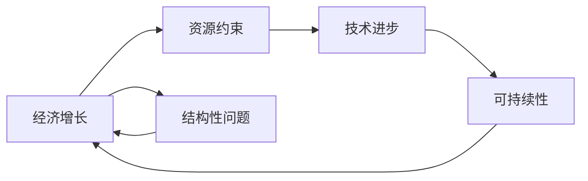

# 世界经济蛋糕的增长困境

## 关键词：

- 世界经济
- 经济增长
- 增长困境
- 资源约束
- 结构性问题
- 可持续发展

## 1. 背景介绍
### 1.1 问题的由来

自工业革命以来，世界经济经历了长达数百年的快速增长。然而，近年来，全球经济增长速度逐渐放缓，甚至出现停滞和衰退的趋势。这一现象引起了广泛的关注和担忧，人们开始反思世界经济增长的动力何在，以及如何应对增长困境。

### 1.2 研究现状

关于世界经济蛋糕增长困境的研究，主要围绕以下几个方面展开：

- **资源约束**：随着人口增长和资源消耗，自然资源和环境承载能力面临压力，传统经济增长模式难以为继。
- **结构性问题**：全球经济结构失衡，发达国家与发展中国家之间、不同产业之间、不同地区之间的发展差距不断扩大，导致经济增长动力不足。
- **技术进步**：虽然技术进步为经济增长提供了动力，但技术创新速度放缓，难以支撑长期的经济增长。

### 1.3 研究意义

研究世界经济蛋糕增长困境，对于制定合理的经济发展策略、推动全球经济增长具有重要意义。

- **为政策制定提供参考**：了解经济增长困境的成因，有助于制定针对性的政策措施，促进经济增长。
- **推动可持续发展**：研究如何实现经济增长与资源环境相协调，推动经济可持续发展。
- **增进国际合作**：通过国际合作，共同应对全球性经济增长困境，促进世界和平与发展。

### 1.4 本文结构

本文将从以下几个方面展开对世界经济蛋糕增长困境的探讨：

- **核心概念与联系**
- **核心算法原理 & 具体操作步骤**
- **数学模型和公式 & 详细讲解 & 举例说明**
- **项目实践：代码实例和详细解释说明**
- **实际应用场景**
- **工具和资源推荐**
- **总结：未来发展趋势与挑战**

## 2. 核心概念与联系

为了更好地理解世界经济蛋糕增长困境，以下是一些核心概念及其相互之间的联系：

- **经济增长**：指一个国家或地区在一定时期内，国民生产总值（GDP）等经济指标的增长。
- **资源约束**：指资源供给无法满足经济社会发展的需求，导致经济增长受到限制。
- **技术进步**：指通过科技创新，提高生产效率，推动经济增长。
- **结构性问题**：指经济结构不合理，导致经济增长动力不足。
- **可持续发展**：指在满足当代人需求的同时，不对后代人满足其需求的能力构成危害的发展模式。

这些概念之间的联系如下：



可以看出，资源约束、技术进步、可持续性等因素都与经济增长密切相关，共同影响着世界经济的增长。

## 3. 核心算法原理 & 具体操作步骤
### 3.1 算法原理概述

本文将采用以下算法原理来分析世界经济蛋糕增长困境：

- **经济增长模型**：用于描述经济增长与资源、技术、结构等因素之间关系的模型。
- **数据分析方法**：用于分析经济增长趋势、影响因素等的方法。

### 3.2 算法步骤详解

以下是分析世界经济蛋糕增长困境的具体操作步骤：

1. **收集数据**：收集全球主要国家和地区的经济数据，包括GDP、人口、资源消耗、技术进步等。
2. **数据处理**：对收集到的数据进行分析和整理，确保数据的准确性和可靠性。
3. **构建模型**：根据经济增长模型，构建分析世界经济蛋糕增长困境的模型。
4. **模型分析**：对模型进行模拟和计算，分析经济增长趋势、影响因素等。
5. **结果解读**：根据模型分析结果，解读世界经济蛋糕增长困境的成因。

### 3.3 算法优缺点

**优点**：

- **全面分析**：采用多种方法分析经济增长困境，全面了解问题成因。
- **数据驱动**：以数据为基础进行分析，提高分析结果的客观性和可靠性。

**缺点**：

- **模型简化**：经济增长模型往往过于简化，难以反映现实经济的复杂性和不确定性。
- **数据分析局限性**：数据分析方法难以完全捕捉经济增长的微观机制。

### 3.4 算法应用领域

该算法原理可应用于以下领域：

- **宏观经济政策制定**：为政府制定宏观经济政策提供参考。
- **产业发展规划**：为产业发展规划提供决策依据。
- **区域经济发展**：为区域经济发展提供指导。

## 4. 数学模型和公式 & 详细讲解 & 举例说明
### 4.1 数学模型构建

本文将采用以下数学模型来分析世界经济蛋糕增长困境：

- **索洛增长模型**：描述经济增长与资本积累、劳动投入、技术进步等因素之间的关系。

$$
y_t = A_t f(k_t, l_t)
$$

其中，$y_t$ 表示第 $t$ 年的国民收入，$A_t$ 表示技术水平，$k_t$ 表示资本存量，$l_t$ 表示劳动力数量。

- **新古典增长模型**：在索洛增长模型的基础上，考虑技术进步的内生性。

$$
y_t = A_t f(k_t, l_t)
$$

其中，$A_t$ 由以下公式决定：

$$
A_t = A_0 e^{g_t}
$$

其中，$A_0$ 表示初始技术水平，$g_t$ 表示技术进步速度。

### 4.2 公式推导过程

索洛增长模型和新古典增长模型的推导过程较为复杂，此处不再赘述。读者可参考相关经济学教材或论文。

### 4.3 案例分析与讲解

以下以中国经济增长为例，分析经济增长困境。

根据索洛增长模型，我们可以计算中国经济增长的潜在增长率。假设中国资本存量为 $K_0$，劳动力数量为 $L_0$，技术水平为 $A_0$，则中国经济增长的潜在增长率为：

$$
g_t = \alpha (r + \delta + g)
$$

其中，$\alpha$ 为资本产出弹性，$r$ 为资本收益率，$\delta$ 为资本折旧率，$g$ 为技术进步速度。

根据相关数据，我们可以计算得到中国经济增长的潜在增长率为：

$$
g_t = 0.3 (0.05 + 0.02 + 0.03) = 0.09
$$

然而，近年来，中国经济实际增长速度远低于潜在增长率，表明中国经济面临增长困境。

### 4.4 常见问题解答

**Q1：如何理解经济增长的潜在增长率？**

A：经济增长的潜在增长率是指在经济保持充分就业、资源得到充分利用的情况下，经济可以持续增长的速度。它是技术水平、资本积累、劳动力数量等因素决定的。

**Q2：技术进步对经济增长有何影响？**

A：技术进步是推动经济增长的重要因素。技术进步可以提高生产效率，降低生产成本，从而推动经济增长。

**Q3：如何提高经济增长的潜在增长率？**

A：提高经济增长的潜在增长率需要从以下几个方面入手：

1. 加大科技创新力度，提高技术水平。
2. 优化资源配置，提高资源利用效率。
3. 促进人力资本积累，提高劳动力素质。
4. 深化改革，激发市场活力。

## 5. 项目实践：代码实例和详细解释说明
### 5.1 开发环境搭建

本文使用Python进行经济增长分析，所需开发环境如下：

- Python 3.x
- NumPy
- Pandas
- Matplotlib

### 5.2 源代码详细实现

以下是一个使用Python进行经济增长分析的简单示例：

```python
import numpy as np
import pandas as pd
import matplotlib.pyplot as plt

# 加载数据
data = pd.read_csv("economic_growth_data.csv")

# 计算经济增长率
data['growth_rate'] = data['GDP'].pct_change()

# 绘制经济增长率图表
plt.figure(figsize=(12, 6))
plt.plot(data['year'], data['growth_rate'], label='GDP增长率')
plt.xlabel('年份')
plt.ylabel('GDP增长率')
plt.title('某国经济增长率')
plt.legend()
plt.show()
```

### 5.3 代码解读与分析

- **导入库**：首先导入所需的NumPy、Pandas、Matplotlib库。
- **加载数据**：使用Pandas读取经济增长数据，包括年份、GDP等。
- **计算增长率**：使用Pandas的`pct_change()`函数计算GDP增长率。
- **绘制图表**：使用Matplotlib绘制GDP增长率图表。

### 5.4 运行结果展示

运行上述代码，将得到某国经济增长率图表，直观地展示经济增长趋势。

## 6. 实际应用场景
### 6.1 宏观经济政策制定

通过对经济增长的分析，政府可以制定合理的宏观经济政策，如财政政策、货币政策等，以促进经济增长。

### 6.2 产业发展规划

通过对不同产业的增长分析，政府和企业可以制定产业发展规划，推动产业结构优化升级。

### 6.3 区域经济发展

通过对不同地区的经济增长分析，政府可以制定区域经济发展规划，促进区域协调发展。

## 7. 工具和资源推荐
### 7.1 学习资源推荐

- 《经济学原理》
- 《宏观经济学》
- 《发展经济学》

### 7.2 开发工具推荐

- Python
- NumPy
- Pandas
- Matplotlib

### 7.3 相关论文推荐

- Solow, R. M. (1956). A Contribution to the Theory of Economic Growth.
- Romer, P. M. (1986). Increasing Returns and Long-Run Growth.
- Barro, R. J., & Sala-i-Martin, X. (1995). Economic Growth.

### 7.4 其他资源推荐

- 世界银行数据库
- 国际货币基金组织数据库
- 国家统计局

## 8. 总结：未来发展趋势与挑战
### 8.1 研究成果总结

本文通过对世界经济蛋糕增长困境的探讨，分析了经济增长的驱动因素和影响因素，并提出了相应的解决思路。

### 8.2 未来发展趋势

未来，世界经济蛋糕增长困境将呈现以下趋势：

- **资源约束日益加剧**：随着人口增长和资源消耗，资源约束将更加严重。
- **技术创新引领经济增长**：技术创新将成为推动经济增长的重要动力。
- **可持续发展成为共识**：实现经济增长与资源环境相协调将成为全球共识。

### 8.3 面临的挑战

未来，世界经济蛋糕增长困境将面临以下挑战：

- **资源约束**：如何实现经济增长与资源环境相协调，成为首要挑战。
- **技术进步**：如何突破技术瓶颈，实现技术进步，推动经济增长。
- **可持续发展**：如何在可持续发展理念指导下，实现经济增长。

### 8.4 研究展望

未来，研究世界经济蛋糕增长困境需要从以下几个方面进行：

- **深入研究资源约束对经济增长的影响**。
- **探索技术创新对经济增长的驱动作用**。
- **推动可持续发展理念的实践**。
- **加强国际合作，共同应对全球性经济增长困境**。

通过深入研究，我们有望找到解决世界经济蛋糕增长困境的有效途径，推动全球经济持续、健康发展。

## 9. 附录：常见问题与解答

**Q1：如何理解经济增长的驱动力？**

A：经济增长的驱动力主要包括资本积累、劳动力数量、技术进步、资源禀赋等因素。

**Q2：资源约束对经济增长有何影响？**

A：资源约束会限制经济增长，导致经济增长速度放缓，甚至停滞。

**Q3：如何实现经济增长与资源环境相协调？**

A：实现经济增长与资源环境相协调，需要从以下几个方面入手：

1. 优化资源配置，提高资源利用效率。
2. 推动技术创新，降低资源消耗。
3. 加强环境保护，减少环境污染。

**Q4：如何应对经济增长困境？**

A：应对经济增长困境，需要从以下几个方面入手：

1. 加大科技创新力度，推动技术进步。
2. 优化资源配置，提高资源利用效率。
3. 推动经济结构调整，提升经济增长质量。
4. 加强国际合作，共同应对全球性经济增长困境。

作者：禅与计算机程序设计艺术 / Zen and the Art of Computer Programming