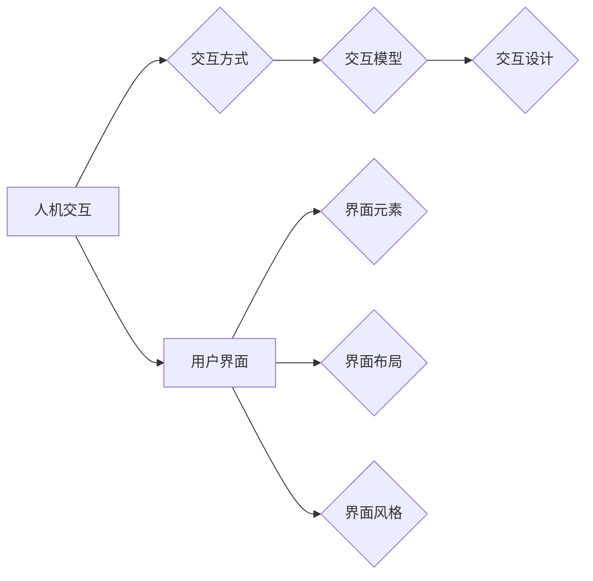

# 人机交互与用户界面设计原理与代码实战案例讲解

## 1. 背景介绍

### 1.1 问题的由来

随着信息技术的飞速发展，人机交互（Human-Computer Interaction，HCI）和用户界面（User Interface，UI）设计逐渐成为计算机科学和设计领域的热点。人机交互指的是人与计算机之间的交互方式，而用户界面则是人与计算机交互的界面，它直接影响到用户的使用体验。

### 1.2 研究现状

近年来，随着智能手机、平板电脑等移动设备的普及，以及互联网的快速发展，人机交互和用户界面设计领域的研究不断深入。从传统的图形用户界面（Graphical User Interface，GUI）到现在的语音识别、手势识别、虚拟现实等新型交互方式，人机交互和用户界面设计正朝着更加智能化、个性化、人性化的方向发展。

### 1.3 研究意义

人机交互和用户界面设计的研究对于提高用户的使用体验、提高系统性能、促进信息传播具有重要意义。通过优化人机交互和用户界面设计，可以使系统更加易于使用，提高用户的生产效率，同时也能提升用户的满意度。

### 1.4 本文结构

本文将从人机交互和用户界面设计的原理出发，结合实际案例，详细介绍相关技术，并给出代码实战示例。文章结构如下：

- 第2章：核心概念与联系，介绍人机交互和用户界面设计的相关概念。
- 第3章：核心算法原理与具体操作步骤，阐述人机交互和用户界面设计的算法原理和实现方法。
- 第4章：数学模型和公式，讲解人机交互和用户界面设计中涉及到的数学模型和公式。
- 第5章：项目实践，通过代码实战案例展示人机交互和用户界面设计的实现。
- 第6章：实际应用场景，探讨人机交互和用户界面设计的应用领域。
- 第7章：工具和资源推荐，推荐相关学习资源、开发工具和论文。
- 第8章：总结，展望人机交互和用户界面设计的未来发展趋势与挑战。
- 第9章：附录，常见问题与解答。

## 2. 核心概念与联系

### 2.1 人机交互

人机交互是指人与计算机之间的交互方式。它涉及到以下核心概念：

- **交互方式**：包括键盘、鼠标、触摸屏、语音、手势等。
- **交互模型**：描述人机交互过程中的信息传递方式，如认知模型、行为模型等。
- **交互设计**：关注如何设计出易于使用、高效、愉悦的交互界面。

### 2.2 用户界面

用户界面是指人与计算机交互的界面，它涉及到以下核心概念：

- **界面元素**：如按钮、文本框、菜单等。
- **界面布局**：界面元素在界面上的排列方式。
- **界面风格**：界面的视觉风格，如简洁、美观、一致等。

人机交互和用户界面设计之间的关系可以表示为：



## 3. 核心算法原理 & 具体操作步骤

### 3.1 算法原理概述

人机交互和用户界面设计中的核心算法包括：

- **交互算法**：用于实现各种交互方式，如鼠标点击、键盘输入、触摸操作等。
- **布局算法**：用于确定界面元素的排列方式，如网格布局、流式布局等。
- **样式算法**：用于设置界面元素的视觉风格，如颜色、字体、间距等。

### 3.2 算法步骤详解

以下以鼠标点击交互为例，介绍人机交互算法的实现步骤：

1. 检测鼠标点击事件。
2. 根据点击位置获取对应界面元素。
3. 判断界面元素是否具有交互性。
4. 如果具有交互性，执行对应的事件处理函数。

### 3.3 算法优缺点

交互算法的优缺点如下：

- **优点**：实现简单，易于扩展。
- **缺点**：交互方式单一，用户体验可能不够丰富。

布局算法的优缺点如下：

- **优点**：界面元素排列合理，视觉效果良好。
- **缺点**：布局算法复杂，难以适应动态变化的需求。

样式算法的优缺点如下：

- **优点**：界面风格一致，美观。
- **缺点**：样式算法调整困难，需要重新设计界面。

### 3.4 算法应用领域

人机交互和用户界面设计的算法广泛应用于以下领域：

- **桌面操作系统**：如Windows、macOS、Linux等。
- **移动操作系统**：如Android、iOS等。
- **Web应用**：如浏览器、在线办公软件等。
- **游戏**：如电脑游戏、手机游戏等。

## 4. 数学模型和公式 & 详细讲解 & 举例说明

### 4.1 数学模型构建

人机交互和用户界面设计中常用的数学模型包括：

- **贝叶斯网络**：用于表示事件之间的概率关系。
- **隐马尔可夫模型**：用于处理时序序列数据。
- **决策树**：用于分类和回归任务。

### 4.2 公式推导过程

以下以贝叶斯网络为例，介绍数学模型的推导过程。

设事件 $A$ 和 $B$ 的先验概率分别为 $P(A)$ 和 $P(B)$，条件概率分别为 $P(B|A)$ 和 $P(A|B)$。则根据贝叶斯公式，事件 $A$ 和 $B$ 同时发生的概率为：

$$
P(A \cap B) = P(B|A)P(A)
$$

### 4.3 案例分析与讲解

以下以一个简单的购物车界面为例，讲解用户界面设计的实现。

假设购物车界面包含以下元素：

- 商品列表：展示所有商品信息。
- 添加按钮：用于将商品添加到购物车。
- 购物车：展示已添加的商品信息。

实现步骤如下：

1. 创建商品列表，包含商品名称、价格、库存等信息。
2. 创建添加按钮，绑定点击事件，实现添加商品到购物车的功能。
3. 创建购物车，展示已添加的商品信息，并实现移除商品、更新库存等功能。

### 4.4 常见问题解答

**Q1：如何设计一个易于使用的用户界面？**

A：设计易于使用的用户界面需要考虑以下因素：

- 界面布局合理，符合用户的使用习惯。
- 界面元素清晰明了，易于识别。
- 界面交互流畅，响应速度快。
- 提供必要的帮助信息和反馈。

**Q2：如何设计一个美观的用户界面？**

A：设计美观的用户界面需要考虑以下因素：

- 使用合适的颜色搭配，提升界面视觉效果。
- 使用合适的字体和字号，提升界面可读性。
- 使用合适的图标和图片，提升界面美观度。
- 保持界面风格一致，提升用户体验。

## 5. 项目实践：代码实例和详细解释说明

### 5.1 开发环境搭建

本案例使用HTML、CSS和JavaScript实现一个简单的购物车界面。以下为开发环境搭建步骤：

1. 安装Node.js和npm：从官网下载并安装Node.js，然后通过npm安装相关库。
2. 创建项目文件夹，并初始化npm项目：
```
mkdir shopping-cart
cd shopping-cart
npm init -y
```
3. 安装必要的库：
```
npm install express ejs
```

### 5.2 源代码详细实现

以下为购物车界面的源代码实现：

**index.ejs**：

```html
<!DOCTYPE html>
<html lang="en">
<head>
    <meta charset="UTF-8">
    <title>Shopping Cart</title>
    <link rel="stylesheet" href="styles.css">
</head>
<body>
    <h1>Shopping Cart</h1>
    <ul id="product-list">
        <li>Product 1 <button onclick="addToCart('product1')">Add to Cart</button></li>
        <li>Product 2 <button onclick="addToCart('product2')">Add to Cart</button></li>
        <li>Product 3 <button onclick="addToCart('product3')">Add to Cart</button></li>
    </ul>
    <h2>Cart</h2>
    <ul id="cart">
    </ul>
    <script src="app.js"></script>
</body>
</html>
```

**styles.css**：

```css
body {
    font-family: Arial, sans-serif;
}

h1, h2 {
    color: #333;
}

button {
    background-color: #4CAF50;
    color: white;
    border: none;
    padding: 10px 20px;
    text-align: center;
    text-decoration: none;
    display: inline-block;
    font-size: 16px;
    margin: 4px 2px;
    cursor: pointer;
}

button:hover {
    background-color: #45a049;
}
```

**app.js**：

```javascript
const cart = [];

function addToCart(productId) {
    cart.push(productId);
    renderCart();
}

function renderCart() {
    const cartElement = document.getElementById('cart');
    cartElement.innerHTML = '';
    cart.forEach(productId => {
        const productElement = document.createElement('li');
        productElement.innerText = `Product ${productId}`;
        cartElement.appendChild(productElement);
    });
}
```

### 5.3 代码解读与分析

**index.ejs**：这是购物车界面的HTML文件，定义了页面结构和样式。

**styles.css**：这是购物车界面的CSS文件，定义了页面样式。

**app.js**：这是购物车界面的JavaScript文件，负责实现购物车的功能。

### 5.4 运行结果展示

运行项目后，可以看到一个简单的购物车界面，用户可以通过点击按钮将商品添加到购物车中。

## 6. 实际应用场景

人机交互和用户界面设计在以下场景中有着广泛的应用：

- **移动应用**：如社交媒体、音乐、视频、游戏等。
- **Web应用**：如电子商务、在线教育、在线办公等。
- **桌面应用**：如操作系统、办公软件、设计软件等。
- **嵌入式系统**：如智能家居、车载系统、工业控制等。

## 7. 工具和资源推荐

### 7.1 学习资源推荐

- **书籍**：
  - 《人机交互：设计与评价方法》（第4版）- 《人机交互与认知》
  - 《用户体验要素》（第5版）- 诺曼
  - 《交互设计精髓》（第4版）- 哈斯凯尔、斯皮尔
- **在线课程**：
  - Coursera上的《人机交互》课程
  - edX上的《用户界面设计》课程
  - Udemy上的《交互设计：从入门到精通》课程

### 7.2 开发工具推荐

- **设计工具**：
  - Sketch
  - Adobe XD
  - Figma
- **开发工具**：
  - Sublime Text
  - Visual Studio Code
  - Atom

### 7.3 相关论文推荐

- 《交互设计手册》（第4版）- 约翰逊
- 《用户体验设计：方法与工具》- 麦凯
- 《设计思维》（第2版）- 戴森

### 7.4 其他资源推荐

- **设计社区**：
  - Dribbble
  - Behance
  - Awwwards
- **技术社区**：
  - Stack Overflow
  - GitHub
  - CSDN

## 8. 总结：未来发展趋势与挑战

### 8.1 研究成果总结

本文从人机交互和用户界面设计的原理出发，介绍了相关技术，并通过代码实战案例展示了实现方法。通过本文的学习，读者可以了解人机交互和用户界面设计的基本概念、算法原理和实际应用场景。

### 8.2 未来发展趋势

未来，人机交互和用户界面设计将朝着以下方向发展：

- **更加智能化**：结合人工智能技术，实现更加智能化的交互体验。
- **更加个性化**：根据用户习惯和偏好，提供个性化的交互体验。
- **更加自然化**：使用自然语言、手势、表情等方式实现更加自然的交互。
- **更加融合化**：将人机交互和用户界面设计与其他领域（如物联网、虚拟现实等）进行融合。

### 8.3 面临的挑战

人机交互和用户界面设计在发展过程中也面临着以下挑战：

- **技术挑战**：如何实现更加智能、高效、安全的交互方式。
- **设计挑战**：如何满足不同用户的需求，提供个性化的交互体验。
- **伦理挑战**：如何避免人机交互和用户界面设计中的偏见和歧视。

### 8.4 研究展望

未来，人机交互和用户界面设计领域将会有更多的创新和突破。相信通过不断努力，人机交互和用户界面设计将为人们创造更加美好的生活。

## 9. 附录：常见问题与解答

**Q1：如何学习人机交互和用户界面设计？**

A：学习人机交互和用户界面设计需要具备以下基础：

- 计算机科学基础知识，如编程语言、数据结构、算法等。
- 设计知识，如色彩理论、排版、视觉设计等。
- 用户研究方法，如问卷调查、访谈、用户测试等。

可以通过以下途径学习：

- 阅读相关书籍和论文。
- 参加在线课程和培训。
- 参与实际项目实践。

**Q2：如何成为一名优秀的人机交互和用户界面设计师？**

A：成为一名优秀的人机交互和用户界面设计师需要具备以下能力：

- 良好的设计思维和审美能力。
- 对用户需求的敏感度。
- 团队合作精神和沟通能力。
- 持续学习和创新能力。

**Q3：如何评估人机交互和用户界面的质量？**

A：评估人机交互和用户界面的质量可以从以下几个方面进行：

- 可用性测试：测试用户能否完成任务，任务完成的速度和准确性。
- 美学评价：评价界面的视觉效果、布局、风格等。
- 用户体验：评价用户在使用过程中的感受和满意度。
- 性能评估：评价界面的响应速度、内存占用等。

作者：禅与计算机程序设计艺术 / Zen and the Art of Computer Programming