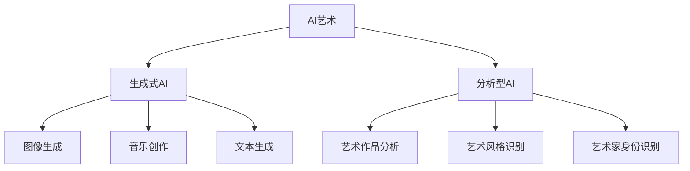
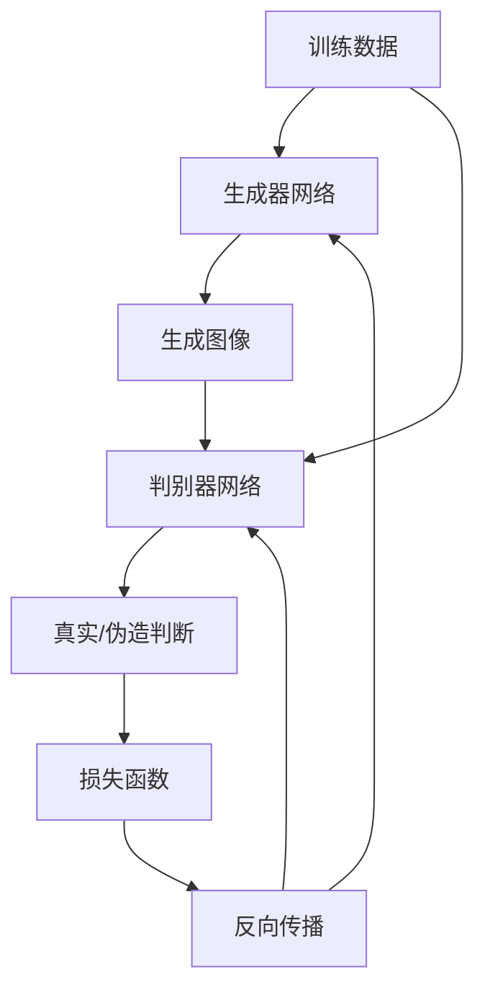

# 伦理AI:AI在艺术领域的应用

## 1. 背景介绍

### 1.1 问题的由来

人工智能(AI)技术在近年来取得了长足的进步,其应用领域也不断扩展。艺术创作一直被视为人类独有的高级智力活动,需要情感、创造力和审美能力。然而,随着AI技术的不断发展,AI在艺术领域的应用也日益受到关注。AI艺术不仅可以创作出令人惊艳的视觉作品,还能在音乐、文学等艺术形式中大显身手。

但与此同时,AI艺术也引发了一些伦理问题和争议。一些艺术家和评论家担心,AI艺术可能会取代人类艺术家,或者侵犯了艺术家的知识产权。另一方面,AI艺术也被认为是一种全新的艺术形式,可以拓展人类的创造力边界。

### 1.2 研究现状

目前,已有多个AI系统展现出了在艺术创作方面的潜力。例如,谷歌的AI系统DeepDream可以生成具有浓郁视觉效果的图像;OpenAI的DALL-E可以根据文本描述生成逼真的图像;而NVIDIA的GauGAN则可以将草图转化为逼真的风景画。

在音乐领域,AI也展现出了创作能力。例如,AI系统可以模仿不同风格的音乐,或者根据人类提供的旋律继续创作。而在文学方面,AI则可以生成诗歌、小说等作品。

然而,AI艺术目前仍存在一些局限性。例如,AI系统往往缺乏独立的情感和审美判断能力,其创作过程也缺乏人类艺术家的主观投入。此外,AI艺术作品的原创性和知识产权问题也有待进一步探讨。

### 1.3 研究意义

探索AI在艺术领域的应用,不仅可以拓展人类的创造力边界,还可以推动AI技术在艺术领域的发展。同时,研究AI艺术也有助于我们反思艺术的本质,以及人机关系在艺术创作中的角色。

此外,AI艺术也引发了一些伦理问题,如知识产权、AI系统的公平性和透明度等,这些问题都需要我们深入探讨和解决。只有建立起合理的伦理框架,AI艺术才能真正为人类所接受和认可。

### 1.4 本文结构

本文将从以下几个方面全面探讨AI在艺术领域的应用:

1. 核心概念与联系
2. 核心算法原理及具体操作步骤
3. 数学模型和公式详细讲解及案例分析  
4. 项目实践:代码实例和详细解释
5. 实际应用场景
6. 工具和资源推荐
7. 总结:未来发展趋势与挑战
8. 附录:常见问题与解答

## 2. 核心概念与联系

AI在艺术领域的应用主要可以分为两大类:生成式AI和分析型AI。

**生成式AI**旨在利用机器学习算法生成新的艺术作品,包括图像、音乐和文本等。常见的生成式AI技术包括:

1. **图像生成**:利用生成对抗网络(GAN)等技术生成逼真的图像作品。
2. **音乐创作**:通过机器学习模型模仿和组合不同的音乐元素,创作出新的音乐作品。
3. **文本生成**:基于大量文学作品训练语言模型,生成诗歌、小说等文字作品。

**分析型AI**则旨在对现有艺术作品进行分析和理解,包括:

1. **艺术作品分析**:识别和解释艺术作品中的视觉元素、主题和风格等。
2. **艺术风格识别**:将艺术作品归类到不同的艺术流派和风格中。
3. **艺术家身份识别**:根据艺术作品的特征,推断出可能的创作者身份。

生成式AI和分析型AI在艺术领域中相辅相成。分析型AI可以帮助我们更好地理解艺术,而生成式AI则可以拓展艺术的创作边界。两者的结合将推动AI艺术的发展,开辟全新的艺术形式。

## 3. 核心算法原理及具体操作步骤

### 3.1 算法原理概述  

AI在艺术领域的应用主要基于以下几种核心算法:

1. **生成对抗网络(GAN)**: GAN是一种无监督机器学习算法,由一个生成器网络和一个判别器网络组成。生成器网络旨在生成逼真的数据(如图像、音频等),而判别器网络则判断生成的数据是真实的还是伪造的。两个网络相互对抗,最终使生成器能够生成高度逼真的数据。GAN广泛应用于图像生成和音乐创作等领域。

2. **变分自编码器(VAE)**: VAE是一种生成式模型,可以从训练数据中学习数据的潜在分布,并生成新的数据。VAE常用于图像生成、文本生成等任务。

3. **transformer**: transformer是一种基于注意力机制的序列到序列模型,在自然语言处理任务中表现出色。它也可以应用于音乐生成、文本生成等艺术创作领域。

4. **卷积神经网络(CNN)**: CNN擅长从图像或音频等数据中提取特征,可用于艺术风格识别、艺术家身份识别等分析型AI任务。

5. **强化学习**: 强化学习算法可以根据环境的反馈不断优化策略,在音乐创作等领域有一定应用。

### 3.2 算法步骤详解

以GAN为例,我们详细介绍其在图像生成任务中的工作原理和具体步骤:

1. **准备训练数据**:首先准备一个包含大量真实图像的训练数据集。

2. **初始化生成器和判别器网络**:初始化生成器网络(如深层卷积网络)和判别器网络(如卷积分类网络)的权重参数。

3. **生成器生成图像**:生成器网络从随机噪声输入开始,生成一个伪造的图像。

4. **判别器判断真伪**:将生成器生成的伪造图像和真实图像输入到判别器网络,判别器输出一个概率值,表示该图像是真实的还是伪造的。

5. **计算损失函数**:根据判别器的输出和期望值(真实图像为1,伪造图像为0),计算生成器和判别器的损失函数。

6. **反向传播更新参数**:使用反向传播算法,根据损失函数的梯度更新生成器和判别器网络的权重参数。

7. **重复训练**:重复上述步骤,使生成器和判别器网络在对抗训练中不断提高性能,最终使生成器能够生成高度逼真的图像。

在实际应用中,还需要注意GAN的训练稳定性、模式崩溃等问题,并采取相应的优化策略,如改进网络结构、损失函数等。

### 3.3 算法优缺点

**优点**:

1. **生成质量高**:GAN等生成式模型能够生成高度逼真的图像、音频和文本数据,在艺术创作中具有广阔的应用前景。
2. **无需人工标注**:作为无监督学习算法,GAN等模型无需人工标注大量数据,可以从原始数据中自动学习特征。
3. **拓展创造力边界**:AI算法可以超越人类的创造力,生成出独特而新颖的艺术作品。

**缺点**:

1. **缺乏情感和审美**:目前的AI算法还难以真正理解和模拟人类的情感和审美体验,艺术作品可能缺乏深度和内涵。
2. **训练不稳定性**:GAN等模型在训练过程中容易出现模式崩溃、梯度消失等问题,需要精心设计和优化。
3. **知识产权问题**:AI生成的艺术作品的知识产权归属存在争议,需要建立相应的法律法规。

### 3.4 算法应用领域

AI算法在艺术领域的应用主要包括以下几个方面:

1. **图像生成**:利用GAN、VAE等生成式模型,创作出逼真的图像作品,如风景画、肖像画、抽象画等。
2. **音乐创作**:通过机器学习模型组合和生成音乐元素,创作出新颖的音乐作品。
3. **文本生成**:基于语言模型生成诗歌、小说等文学作品。
4. **艺术风格迁移**:将一种艺术风格迁移到另一种作品上,创造出独特的视觉效果。
5. **艺术作品分析**:识别和解释艺术作品中的视觉元素、主题和风格等,帮助人们更好地欣赏和理解艺术。
6. **艺术家身份识别**:根据艺术作品的特征,推断出可能的创作者身份,有助于艺术品鉴定和版权保护。

## 4. 数学模型和公式及详细讲解与举例说明

### 4.1 数学模型构建

在AI艺术领域,数学模型主要用于描述和优化算法的工作过程。以GAN为例,我们可以构建如下数学模型:

设训练数据集为 $\mathcal{X}$,其中 $x \sim p_{\text{data}}(x)$ 为真实数据的分布。GAN由生成器 $G$ 和判别器 $D$ 组成。

生成器 $G$ 的目标是从一个先验噪声分布 $p_z(z)$ 生成逼真的数据 $G(z)$,使其分布 $p_g$ 尽可能接近真实数据分布 $p_{\text{data}}$。

判别器 $D$ 的目标是将真实数据 $x$ 和生成数据 $G(z)$ 区分开来,即最大化如下值函数:

$$V(D,G) = \mathbb{E}_{x\sim p_{\text{data}}(x)}[\log D(x)] + \mathbb{E}_{z\sim p_z(z)}[\log(1-D(G(z)))]$$

生成器 $G$ 的目标是使判别器 $D$ 无法区分真伪,即最小化上述值函数:

$$\min\limits_G V(D,G) = \min\limits_G \mathbb{E}_{z\sim p_z(z)}[\log(1-D(G(z)))]$$

可以证明,当 $G$ 和 $D$ 达到纳什均衡时,生成数据的分布 $p_g$ 将收敛到真实数据分布 $p_{\text{data}}$。

在实际训练中,生成器 $G$ 和判别器 $D$ 通过交替优化的方式不断提高性能,使生成数据的质量不断提高。

### 4.2 公式推导过程

我们以最小化判别器的损失函数为例,推导GAN的训练目标:

对于判别器 $D$,其目标是最大化真实数据的对数似然 $\log D(x)$ 和生成数据的对数似然 $\log(1-D(G(z)))$ 之和,即:

$$\max\limits_D V(D,G) = \mathbb{E}_{x\sim p_{\text{data}}(x)}[\log D(x)] + \mathbb{E}_{z\sim p_z(z)}[\log(1-D(G(z)))]$$

由于对数函数是凸函数,根据Jensen不等式,我们有:

\begin{align*}
\mathbb{E}_{x\sim p_{\text{data}}(x)}[\log D(x)] &\leq \log\left(\mathbb{E}_{x\sim p_{\text{data}}(x)}[D(x)]\right) \\
\mathbb{E}_{z\sim p_z(z)}[\log(1-D(G(z)))] &\leq \log\left(1-\mathbb{E}_{z\sim p_