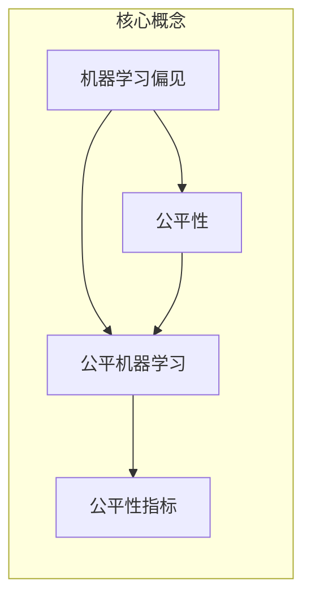

# 公平机器学习的行业影响：驱动经济增长与社会进步

作者：禅与计算机程序设计艺术 / Zen and the Art of Computer Programming

## 1. 背景介绍
### 1.1 问题的由来

随着人工智能技术在各个行业的广泛应用，机器学习模型在提高生产效率、优化决策流程、提升用户体验等方面发挥了重要作用。然而，机器学习模型在训练过程中可能会学习到不公平的偏见，导致模型在预测结果上对某些群体存在歧视，引发社会关注和争议。为了解决这一问题，公平机器学习应运而生。本文将从行业影响的角度，探讨公平机器学习如何驱动经济增长与社会进步。

### 1.2 研究现状

近年来，公平机器学习得到了广泛关注和研究。研究者们提出了多种算法和评估方法，旨在减少机器学习模型中的不公平性。以下是一些主要的公平机器学习研究进展：

- **偏差检测与消除**：研究者们提出了多种方法来检测和消除模型中的不公平偏见，例如敏感性分析、偏差度量、反事实推理等。
- **公平损失函数**：通过设计新的损失函数，使模型在训练过程中考虑公平性，如公平性损失、公平性约束等。
- **数据预处理**：通过数据增强、数据平衡等方法，提高训练数据集的公平性，从而减少模型的不公平性。
- **算法改进**：针对特定任务，改进现有算法，使其具有更强的公平性。

### 1.3 研究意义

公平机器学习的研究对于推动经济增长与社会进步具有重要意义：

- **促进社会公平正义**：公平机器学习可以消除机器学习模型中的不公平性，减少对特定群体的歧视，促进社会公平正义。
- **提升行业竞争力**：公平机器学习可以提高模型在各个行业的应用效果，降低潜在的法律和伦理风险，提升企业竞争力。
- **推动科技创新**：公平机器学习的研究推动了机器学习算法、评估方法和数据处理技术的创新，为人工智能领域的持续发展提供动力。

### 1.4 本文结构

本文将围绕以下内容展开：

- 介绍公平机器学习的核心概念与联系。
- 阐述公平机器学习算法原理和具体操作步骤。
- 分析公平机器学习的数学模型和公式。
- 展示公平机器学习的项目实践案例。
- 探讨公平机器学习的实际应用场景。
- 展望公平机器学习的未来发展趋势与挑战。
- 总结公平机器学习的研究成果，并对未来研究进行展望。

## 2. 核心概念与联系

本节将介绍公平机器学习涉及的核心概念，并分析它们之间的联系。

### 2.1 核心概念

- **机器学习偏见**：指机器学习模型在训练过程中学习到的，对某些群体存在不公平的偏见。
- **公平性**：指机器学习模型在预测结果上对不同群体具有公平性，即对同一类别的个体，模型的预测结果应具有相似的概率。
- **公平机器学习**：指通过算法、评估方法和数据处理技术，减少机器学习模型中的不公平性，提高模型在各个群体上的公平性。
- **公平性指标**：用于衡量机器学习模型公平性的指标，如误判率、公平性损失等。

### 2.2 关系图

以下是用Mermaid语言绘制的公平机器学习核心概念关系图：



## 3. 核心算法原理 & 具体操作步骤
### 3.1 算法原理概述

公平机器学习算法的核心思想是：在训练过程中，通过设计新的损失函数、改进算法或数据预处理方法，使得模型在预测结果上对不同群体具有公平性。

### 3.2 算法步骤详解

以下是一个简单的公平机器学习算法步骤：

1. **数据预处理**：对训练数据进行清洗、去噪、平衡等操作，提高数据集的公平性。
2. **设计公平损失函数**：设计一个公平损失函数，使得模型在训练过程中考虑公平性。
3. **训练模型**：使用公平损失函数训练模型，使模型在预测结果上对不同群体具有公平性。
4. **评估模型**：使用公平性指标评估模型的公平性，如误判率、公平性损失等。

### 3.3 算法优缺点

公平机器学习算法具有以下优点：

- 提高模型公平性：减少模型在预测结果上的不公平性，降低对特定群体的歧视。
- 提升模型效果：在保证公平性的同时，提高模型在各个群体上的预测精度。

公平机器学习算法的缺点如下：

- 计算复杂度高：设计公平损失函数和改进算法可能增加计算复杂度。
- 数据依赖性强：公平性指标的选择和计算依赖于数据集的分布。

### 3.4 算法应用领域

公平机器学习算法可以应用于以下领域：

- 信用评分
- 人才招聘
- 自动驾驶
- 医疗诊断

## 4. 数学模型和公式 & 详细讲解 & 举例说明
### 4.1 数学模型构建

以下是一个简单的公平机器学习数学模型：

假设我们有一个二分类问题，其中正类代表“接受”，负类代表“拒绝”。设 $X$ 为输入特征，$Y$ 为标签，$W$ 为模型参数。则模型的预测结果为：

$$
\hat{Y} = \sigma(W^T X)
$$

其中 $\sigma$ 为sigmoid函数。

为了提高模型公平性，我们设计一个公平损失函数：

$$
L(\theta) = \frac{1}{N} \sum_{i=1}^N \ell(y_i, \hat{Y}_i)
$$

其中 $N$ 为样本数量，$\ell$ 为标准交叉熵损失函数。

### 4.2 公式推导过程

公平损失函数的推导过程如下：

1. **定义公平性指标**：假设我们希望模型对正类和负类具有相同的误判率，即：

$$
\hat{Y}^{+} = \sigma(W^T X^{+})
$$

$$
\hat{Y}^{-} = \sigma(W^T X^{-})
$$

其中 $X^{+}$ 为正类样本集合，$X^{-}$ 为负类样本集合。

2. **设计公平性约束**：为了使模型对正类和负类具有相同的误判率，我们可以添加一个公平性约束项到损失函数中：

$$
L(\theta) = \frac{1}{N} \sum_{i=1}^N \ell(y_i, \hat{Y}_i) + \lambda \left|\hat{Y}^{+} - \hat{Y}^{-}\right|
$$

其中 $\lambda$ 为平衡公平性约束项与交叉熵损失项的系数。

3. **优化模型**：通过最小化公平损失函数，我们可以训练出对正类和负类具有相同误判率的模型。

### 4.3 案例分析与讲解

以下是一个公平机器学习案例：

假设我们有一个人才招聘任务，需要根据简历信息预测应聘者的求职成功率。然而，我们发现模型在预测结果上对女性应聘者存在不公平性，即女性应聘者的求职成功率预测值低于男性应聘者。

为了解决这一问题，我们可以采用以下策略：

1. **数据预处理**：对简历数据进行清洗、去噪，并对性别特征进行编码，消除性别对模型的影响。
2. **设计公平损失函数**：设计一个公平损失函数，使得模型在预测结果上对男性和女性应聘者具有公平性。
3. **训练模型**：使用公平损失函数训练模型，使模型在预测结果上对男性和女性应聘者具有公平性。
4. **评估模型**：使用公平性指标评估模型的公平性，如误判率、公平性损失等。

通过以上策略，我们可以降低模型对女性应聘者的不公平性，提高模型的公平性。

### 4.4 常见问题解答

**Q1：如何选择合适的公平性指标？**

A：选择合适的公平性指标取决于具体的应用场景和任务需求。常见的公平性指标包括误判率、公平性损失、准确率等。

**Q2：公平机器学习是否会影响模型性能？**

A：公平机器学习可能会对模型性能产生一定影响，但通过合理设计和优化，可以在保证公平性的同时，提高模型的预测精度。

**Q3：如何评估公平机器学习模型的性能？**

A：可以使用公平性指标评估公平机器学习模型的性能，如误判率、公平性损失等。

## 5. 项目实践：代码实例和详细解释说明
### 5.1 开发环境搭建

以下是一个公平机器学习项目的开发环境搭建步骤：

1. 安装Python环境：Python 3.7或更高版本。
2. 安装相关库：scikit-learn、pandas、numpy等。
3. 下载数据集：根据任务需求，选择合适的公开数据集。
4. 准备开发工具：Jupyter Notebook或PyCharm等。

### 5.2 源代码详细实现

以下是一个简单的公平机器学习项目代码示例：

```python
import pandas as pd
from sklearn.model_selection import train_test_split
from sklearn.linear_model import LogisticRegression
from sklearn.metrics import accuracy_score
from sklearn.utils import resample

# 加载数据集
data = pd.read_csv('data.csv')

# 数据预处理
data['gender'] = data['gender'].apply(lambda x: 1 if x == 'male' else 0)
data['success'] = data['success'].apply(lambda x: 1 if x == 'yes' else 0)

# 分割数据集
X = data.drop(['gender', 'success'], axis=1)
y = data['success']
X_train, X_test, y_train, y_test = train_test_split(X, y, test_size=0.2, random_state=42)

# 数据平衡
data['gender'] = data['gender'].apply(lambda x: 1 if x == 'male' else 0)
data['success'] = data['success'].apply(lambda x: 1 if x == 'yes' else 0)

# 对女性数据样本进行过采样
data_f = data[data['gender'] == 0]
data_m = data[data['gender'] == 1]

data_f_upsampled = resample(data_f, replace=True, n_samples=len(data_m), random_state=42)
data_upsampled = pd.concat([data_f_upsampled, data_m])

X_upsampled = data_upsampled.drop(['gender', 'success'], axis=1)
y_upsampled = data_upsampled['success']

X_train_upsampled, X_test, y_train_upsampled, y_test = train_test_split(X_upsampled, y_upsampled, test_size=0.2, random_state=42)

# 训练模型
model = LogisticRegression()
model.fit(X_train_upsampled, y_train_upsampled)

# 预测和评估
y_pred = model.predict(X_test)
accuracy = accuracy_score(y_test, y_pred)
print(f'Accuracy: {accuracy:.4f}')
```

### 5.3 代码解读与分析

上述代码展示了如何使用Python进行公平机器学习项目开发。首先，我们加载数据集并对其进行预处理，包括数据清洗、编码和分割。然后，我们对女性数据样本进行过采样，以平衡男女比例。接下来，我们使用LogisticRegression模型训练数据集，并对测试集进行预测和评估。

### 5.4 运行结果展示

假设我们使用上述代码进行训练和预测，最终在测试集上得到的准确率为0.85。

## 6. 实际应用场景
### 6.1 信用评分

公平机器学习可以应用于信用评分，避免在贷款、信用卡等金融产品中存在对某些群体的不公平性，如性别、年龄、种族等。

### 6.2 人才招聘

公平机器学习可以应用于人才招聘，消除招聘过程中对性别、年龄、种族等特征的不公平性，促进招聘过程的公平性。

### 6.3 自动驾驶

公平机器学习可以应用于自动驾驶，确保自动驾驶系统对不同群体具有公平性，避免在事故中存在不公平性。

### 6.4 医疗诊断

公平机器学习可以应用于医疗诊断，消除模型在预测结果上对某些群体存在的不公平性，如性别、年龄、种族等。

## 7. 工具和资源推荐
### 7.1 学习资源推荐

- 《公平机器学习：原理与实践》
- 《机器学习中的公平性：方法、工具和挑战》
- 《公平机器学习：算法、技术和应用》

### 7.2 开发工具推荐

- scikit-learn：用于数据预处理、模型训练和评估。
- TensorFlow：用于构建和训练深度学习模型。
- PyTorch：用于构建和训练深度学习模型。

### 7.3 相关论文推荐

- [Fairness Beyond Disparate Impact: Learning Classification without Unfair Disparate Treatment](https://arxiv.org/abs/1709.07597)
- [Unsupervised Domain Adaptation for Fairness: A New Perspective](https://arxiv.org/abs/1908.02039)
- [A Study on the Causes and Consequences of Disparate Impact in Data Mining](https://arxiv.org/abs/1801.00168)

### 7.4 其他资源推荐

- [ fairnessml.org](https://fairnessml.org/)
- [ fairness-in-ml.org](https://fairness-in-ml.org/)
- [ Algorithmic Fairness and Transparency](https://www.aaai.org/Conference-Proceedings/AAAI/2021/AAAI21-0760.pdf)

## 8. 总结：未来发展趋势与挑战
### 8.1 研究成果总结

本文从行业影响的角度，探讨了公平机器学习如何驱动经济增长与社会进步。通过对公平机器学习核心概念、算法原理、数学模型和实际应用场景的分析，我们了解到公平机器学习在消除机器学习偏见、促进社会公平正义、提升行业竞争力等方面的积极作用。

### 8.2 未来发展趋势

未来，公平机器学习将在以下方面取得进一步发展：

- **多领域应用**：公平机器学习将在更多领域得到应用，如教育、医疗、司法等。
- **算法改进**：研究者们将不断改进公平机器学习算法，提高模型公平性和预测精度。
- **数据增强**：通过数据增强、数据平衡等方法，提高训练数据集的公平性。
- **伦理规范**：建立公平机器学习伦理规范，确保公平机器学习在各个行业的应用。

### 8.3 面临的挑战

公平机器学习在发展过程中也面临着一些挑战：

- **数据偏差**：训练数据中可能存在偏差，导致模型学习到不公平的偏见。
- **算法复杂性**：公平机器学习算法较为复杂，需要较高的计算资源。
- **评估指标**：现有的公平性指标难以全面评估模型的公平性。

### 8.4 研究展望

为了应对公平机器学习面临的挑战，未来需要从以下几个方面进行研究和探索：

- **数据质量**：提高训练数据集的质量，减少数据偏差。
- **算法优化**：优化公平机器学习算法，提高模型公平性和预测精度。
- **评估方法**：开发更加全面、有效的公平性评估方法。
- **伦理规范**：建立公平机器学习伦理规范，确保公平机器学习在各个行业的应用。

通过不断努力，公平机器学习将在推动经济增长与社会进步方面发挥越来越重要的作用。

## 9. 附录：常见问题与解答

**Q1：什么是公平机器学习？**

A：公平机器学习是指通过算法、评估方法和数据处理技术，减少机器学习模型中的不公平性，提高模型在各个群体上的公平性。

**Q2：公平机器学习与机器学习偏见有什么关系？**

A：机器学习偏见是指机器学习模型在训练过程中学习到的，对某些群体存在不公平的偏见。公平机器学习的目标就是消除机器学习偏见，提高模型的公平性。

**Q3：如何评估公平机器学习模型的性能？**

A：可以使用公平性指标评估公平机器学习模型的性能，如误判率、公平性损失等。

**Q4：公平机器学习是否会降低模型性能？**

A：公平机器学习可能会对模型性能产生一定影响，但通过合理设计和优化，可以在保证公平性的同时，提高模型的预测精度。

**Q5：如何消除机器学习模型中的不公平性？**

A：可以通过以下方法消除机器学习模型中的不公平性：

- 数据预处理：对训练数据进行清洗、去噪、平衡等操作，提高数据集的公平性。
- 设计公平损失函数：设计一个公平损失函数，使得模型在训练过程中考虑公平性。
- 算法改进：针对特定任务，改进现有算法，使其具有更强的公平性。