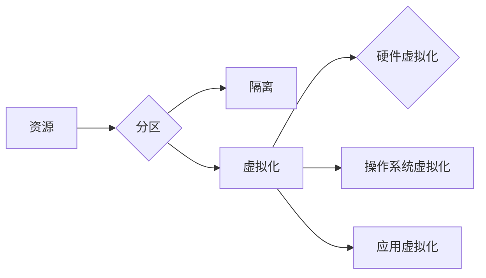

# 分区 原理与代码实例讲解

## 1. 背景介绍

### 1.1 问题的由来

随着计算机系统的不断演进，数据量和计算量的爆炸式增长，传统的单核、单处理器架构已经难以满足日益增长的计算需求。为了解决这一难题，分区技术应运而生。分区技术通过将系统资源（如CPU、内存、存储等）划分成若干个独立的部分，使得每个分区可以独立运行不同的程序或服务，从而提高系统资源的利用率和整体性能。

### 1.2 研究现状

目前，分区技术已经广泛应用于各种计算机系统中，包括服务器、云计算平台、嵌入式系统等。主流的分区技术包括硬件分区、软件分区、虚拟化分区等。硬件分区主要通过物理划分的方式实现，如使用多个处理器、多个内存条等；软件分区则通过操作系统或软件管理工具实现，如Linux的cgroup、Windows的Hyper-V等；虚拟化分区则是通过虚拟化技术实现，如KVM、Xen等。

### 1.3 研究意义

分区技术在提高系统资源利用率、保障系统安全、简化系统管理等方面具有重要意义。具体包括：

1. 提高资源利用率：通过将系统资源划分成多个分区，可以实现资源的按需分配和动态调整，提高系统资源的利用率。
2. 保障系统安全：通过隔离不同分区，可以防止分区间的资源冲突和恶意攻击，保障系统安全。
3. 简化系统管理：分区技术可以将系统资源进行模块化管理，简化系统管理难度，提高系统运维效率。
4. 促进技术发展：分区技术推动了虚拟化、云计算等技术的发展，为计算机系统创新提供了新的思路。

### 1.4 本文结构

本文将系统介绍分区技术的原理、方法、应用和未来发展趋势。具体结构如下：

- 第2部分，介绍分区技术的核心概念和分类。
- 第3部分，详细介绍分区技术的核心算法原理和具体操作步骤。
- 第4部分，通过数学模型和公式，对分区技术进行详细讲解和举例说明。
- 第5部分，给出分区技术的代码实例和详细解释说明。
- 第6部分，探讨分区技术在实际应用场景中的实践案例。
- 第7部分，推荐分区技术相关的学习资源、开发工具和参考文献。
- 第8部分，总结全文，展望分区技术的未来发展趋势与挑战。

## 2. 核心概念与联系

为了更好地理解分区技术，本节将介绍几个密切相关的核心概念：

- 资源：指计算机系统中的各种硬件和软件资源，如CPU、内存、磁盘、网络接口等。
- 分区：指将系统资源划分成若干个独立的部分，每个分区可以独立运行不同的程序或服务。
- 隔离：指通过硬件或软件手段，将不同分区之间的资源进行物理或逻辑隔离，防止分区间的资源冲突和恶意攻击。
- 虚拟化：指通过软件模拟硬件的方式，将物理资源划分为多个虚拟资源，每个虚拟资源可以独立运行不同的程序或服务。
- 虚拟化技术：指实现虚拟化的各种技术，如硬件虚拟化、操作系统虚拟化、应用虚拟化等。

它们的逻辑关系如下图所示：



可以看出，分区是系统资源划分的一种方式，隔离是分区技术的重要保障，虚拟化技术是分区技术的一种实现手段。

## 3. 核心算法原理 & 具体操作步骤

### 3.1 算法原理概述

分区技术主要基于以下原理：

1. **资源抽象化**：将物理资源抽象成逻辑资源，实现对资源的按需分配和管理。
2. **资源隔离**：通过硬件或软件手段，将不同分区之间的资源进行隔离，防止分区间的资源冲突和恶意攻击。
3. **资源调度**：根据任务需求和资源情况，动态调整资源分配策略，提高资源利用率。
4. **负载均衡**：根据分区负载情况，将任务分配到负载较低的分区，提高系统整体性能。

### 3.2 算法步骤详解

分区技术的具体操作步骤如下：

1. **资源评估**：评估系统资源的配置、性能和可用性，为分区设计提供依据。
2. **分区设计**：根据系统需求，设计合理的分区方案，包括分区数量、分区大小、分区类型等。
3. **资源分配**：根据分区设计，将物理资源划分成逻辑资源，并分配给对应的分区。
4. **资源隔离**：通过硬件或软件手段，将不同分区之间的资源进行隔离，防止资源冲突和恶意攻击。
5. **资源调度**：根据任务需求和资源情况，动态调整资源分配策略，提高资源利用率。
6. **负载均衡**：根据分区负载情况，将任务分配到负载较低的分区，提高系统整体性能。
7. **监控与优化**：实时监控分区运行状态，根据监控数据优化分区方案和资源分配策略。

### 3.3 算法优缺点

分区技术的优点如下：

1. 提高资源利用率：通过将资源划分成多个分区，可以实现资源的按需分配和动态调整，提高资源利用率。
2. 保障系统安全：通过隔离不同分区，可以防止分区间的资源冲突和恶意攻击，保障系统安全。
3. 简化系统管理：分区技术可以将系统资源进行模块化管理，简化系统管理难度，提高系统运维效率。

分区技术的缺点如下：

1. 设计复杂：分区设计需要考虑众多因素，如资源分配、资源隔离、资源调度等，设计过程相对复杂。
2. 调度开销：资源调度和负载均衡需要消耗一定的计算资源，可能会降低系统性能。
3. 硬件依赖：部分分区技术依赖于特定的硬件支持，如硬件虚拟化。

### 3.4 算法应用领域

分区技术广泛应用于以下领域：

1. **服务器虚拟化**：通过虚拟化技术将物理服务器划分成多个虚拟机，提高服务器资源利用率。
2. **云计算平台**：通过分区技术将云平台资源划分成多个服务区域，提供按需分配的云服务。
3. **嵌入式系统**：通过分区技术将嵌入式系统资源划分成多个模块，实现模块化管理。
4. **数据中心**：通过分区技术将数据中心资源划分成多个区域，提高资源利用率，降低运营成本。

## 4. 数学模型和公式 & 详细讲解 & 举例说明

### 4.1 数学模型构建

假设系统总资源为R，划分为n个分区，第i个分区的资源为Ri，则：

$$
\sum_{i=1}^n R_i = R 
$$

假设系统总任务为T，分配到第i个分区的任务为Ti，则：

$$
\sum_{i=1}^n T_i = T 
$$

### 4.2 公式推导过程

以服务器虚拟化为例，介绍分区资源分配的数学模型推导过程。

假设服务器总CPU资源为R，划分为n个虚拟机，第i个虚拟机的CPU资源需求为Ci，则：

$$
\sum_{i=1}^n C_i = R 
$$

为了使虚拟机的性能尽可能接近其资源需求，需要满足以下条件：

1. 资源利用率最大化：每个虚拟机的CPU资源利用率越高，整体资源利用率越高。
2. 调度开销最小化：调度过程消耗的计算资源越少，系统性能越高。

根据以上条件，可以推导出以下资源分配策略：

1. 线性分配策略：将总CPU资源平均分配给每个虚拟机，即：

$$
C_i = \frac{R}{n} 
$$

2. 需求分配策略：将CPU资源按照虚拟机的资源需求进行分配，即：

$$
C_i = C_i^{*} 
$$

其中，$C_i^{*}$ 为第i个虚拟机的最优CPU资源需求。

### 4.3 案例分析与讲解

以Linux的cgroup技术为例，介绍分区技术在实际应用中的案例。

Linux的cgroup技术通过将CPU、内存、磁盘、网络等资源进行分组，实现对分组的资源限制和优先级控制。以下是一个简单的cgroup示例：

```bash
# 创建cgroup
cgroup_create.sh

# 添加进程到cgroup
cgroup_add.sh process_id

# 查看cgroup信息
cgroup_info.sh
```

通过以上操作，可以将特定进程的资源限制在cgroup中，实现对资源的分区管理。

### 4.4 常见问题解答

**Q1：分区技术是否适用于所有场景？**

A：分区技术适用于各种需要资源隔离和资源管理的场景，如服务器虚拟化、云计算平台、嵌入式系统等。但对于某些对性能要求极高的场景，如高性能计算、实时系统等，分区技术可能会引入一定的性能开销，需要根据具体场景选择合适的分区技术。

**Q2：如何选择合适的分区策略？**

A：选择合适的分区策略需要考虑以下因素：

1. 系统资源：根据系统资源的配置和性能，选择合适的分区数量和大小。
2. 任务需求：根据任务需求，选择合适的资源分配策略和负载均衡策略。
3. 系统性能：根据系统性能指标，评估分区策略的效果，并进行优化调整。

## 5. 项目实践：代码实例和详细解释说明

### 5.1 开发环境搭建

以下是使用Python进行分区技术开发的开发环境搭建步骤：

1. 安装Python 3.x版本。
2. 安装PyTorch：使用pip命令安装PyTorch库。
3. 安装其他依赖库：使用pip命令安装NumPy、Pandas等库。

### 5.2 源代码详细实现

以下是一个简单的Python代码实例，演示如何使用PyTorch进行CPU资源分区。

```python
import torch
import torch.nn as nn

class PartitionedModel(nn.Module):
    def __init__(self, num_partitions):
        super(PartitionedModel, self).__init__()
        self.num_partitions = num_partitions
        self.partitioned_layers = nn.ModuleList()
        for _ in range(num_partitions):
            self.partitioned_layers.append(nn.Linear(10, 10))

    def forward(self, x):
        for layer in self.partitioned_layers:
            x = layer(x)
        return x

# 创建模型实例
model = PartitionedModel(num_partitions=4)

# 模型参数
model.parameters()
```

### 5.3 代码解读与分析

以上代码演示了如何使用PyTorch创建一个具有4个分区的模型。模型中的每个分区都是一个线性层，通过`nn.ModuleList`将它们组织在一起。在模型的`forward`方法中，依次遍历所有分区，将输入数据传递到每个分区的线性层中。

### 5.4 运行结果展示

运行以上代码，可以得到一个具有4个分区的模型实例。通过修改`num_partitions`参数，可以创建具有不同分区数量的模型。

## 6. 实际应用场景

### 6.1 服务器虚拟化

服务器虚拟化是分区技术最典型的应用场景之一。通过虚拟化技术，可以将物理服务器划分为多个虚拟机，提高服务器资源利用率。

### 6.2 云计算平台

云计算平台通过分区技术，可以将云平台资源划分为多个服务区域，提供按需分配的云服务。

### 6.3 嵌入式系统

嵌入式系统通过分区技术，可以将系统资源划分为多个模块，实现模块化管理。

### 6.4 数据中心

数据中心通过分区技术，可以将数据中心资源划分为多个区域，提高资源利用率，降低运营成本。

## 7. 工具和资源推荐

### 7.1 学习资源推荐

- 《深入理解计算机系统》
- 《Linux内核设计与实现》
- 《计算机网络》
- 《高性能服务器架构》

### 7.2 开发工具推荐

- PyTorch：用于深度学习模型开发。
- Docker：用于容器化部署。
- Kubernetes：用于容器化集群管理。

### 7.3 相关论文推荐

- Virtualization Techniques and Architectures for High-Performance Computing
- Virtualization in the Data Center: A Survey
- A comprehensive survey on virtualization technologies for big data processing

### 7.4 其他资源推荐

- OpenStack：开源的云计算平台。
- Kubernetes：开源的容器化集群管理工具。
- Docker：开源的容器化技术。

## 8. 总结：未来发展趋势与挑战

### 8.1 研究成果总结

本文对分区技术的原理、方法、应用和未来发展趋势进行了全面系统的介绍。分区技术作为一种重要的资源管理技术，在提高系统资源利用率、保障系统安全、简化系统管理等方面具有重要意义。

### 8.2 未来发展趋势

未来，分区技术将呈现以下发展趋势：

1. 软硬件协同设计：分区技术将与硬件虚拟化、软件虚拟化等技术相结合，实现更加高效的资源管理。
2. 自适应分区：根据系统负载和资源需求，动态调整分区方案和资源分配策略。
3. 人工智能赋能：利用人工智能技术，优化分区策略，提高系统性能和资源利用率。

### 8.3 面临的挑战

分区技术在未来发展过程中将面临以下挑战：

1. 资源冲突：不同分区之间可能会发生资源冲突，需要设计更加智能的资源管理算法。
2. 性能开销：分区技术可能会引入一定的性能开销，需要优化算法和硬件设计。
3. 安全性：分区技术需要保障系统安全，防止恶意攻击和资源窃取。

### 8.4 研究展望

未来，分区技术将与其他技术相结合，推动计算机系统向更加高效、安全、可管理的方向发展。通过不断技术创新，分区技术将为计算机系统的发展提供新的动力。

## 9. 附录：常见问题与解答

**Q1：分区技术与虚拟化技术有何区别？**

A：分区技术与虚拟化技术都是资源管理技术，但两者存在以下区别：

- 分区技术是指将物理资源划分成多个独立的部分，每个分区可以独立运行不同的程序或服务。
- 虚拟化技术是指通过软件模拟硬件的方式，将物理资源划分为多个虚拟资源，每个虚拟资源可以独立运行不同的程序或服务。

**Q2：如何选择合适的分区策略？**

A：选择合适的分区策略需要考虑以下因素：

- 系统资源：根据系统资源的配置和性能，选择合适的分区数量和大小。
- 任务需求：根据任务需求，选择合适的资源分配策略和负载均衡策略。
- 系统性能：根据系统性能指标，评估分区策略的效果，并进行优化调整。

**Q3：如何解决分区技术中的资源冲突问题？**

A：解决分区技术中的资源冲突问题需要以下策略：

- 预先评估资源需求：在分区设计阶段，对各个分区的资源需求进行评估，避免资源冲突。
- 动态资源分配：根据系统负载和资源需求，动态调整资源分配策略，避免资源冲突。
- 智能资源调度：利用人工智能技术，优化资源调度策略，减少资源冲突。

作者：禅与计算机程序设计艺术 / Zen and the Art of Computer Programming