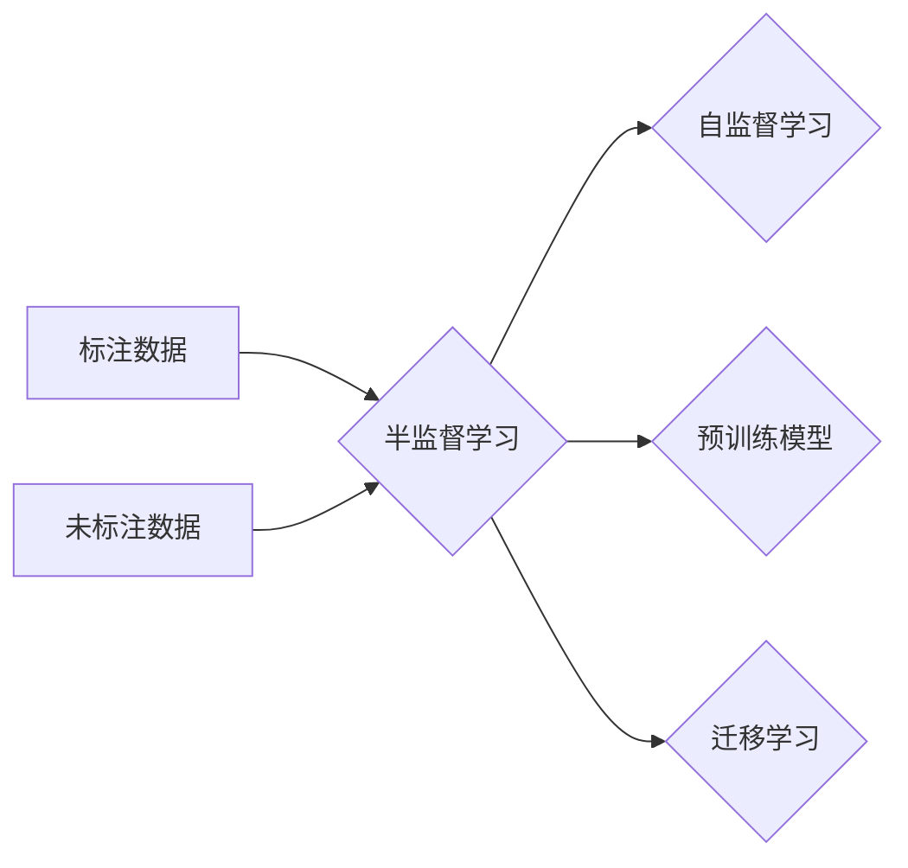

# 半监督学习 原理与代码实例讲解

## 关键词：

- 半监督学习
- 自监督学习
- 标注数据
- 无标签数据
- 预训练模型
- 迁移学习
- 应用场景

## 1. 背景介绍

### 1.1 问题的由来

随着人工智能技术的飞速发展，机器学习领域面临着标注数据获取成本高、数据标注质量难以保证等问题。传统的监督学习需要大量标注数据，而在实际应用中，标注数据往往难以获取或获取成本高昂。为了解决这个问题，半监督学习作为一种结合标注数据和未标注数据的机器学习方法，应运而生。

### 1.2 研究现状

近年来，半监督学习在机器学习领域取得了显著的成果，许多半监督学习方法被提出并应用于不同的任务中。这些方法主要包括以下几种：

- 基于一致性正则化的方法：通过在损失函数中加入一致性正则项，使得模型对标注数据和未标注数据保持一致。
- 基于预训练的方法：利用预训练模型提取特征，再在下游任务上进行微调。
- 基于多标签学习的的方法：将未标注数据视为多标签学习的标签，从而利用未标注数据中的类别信息。
- 基于生成模型的方法：利用生成模型生成与标注数据具有相似分布的未标注数据。

### 1.3 研究意义

半监督学习在以下方面具有重要的研究意义：

- 降低标注数据获取成本：通过利用未标注数据，可以降低标注数据获取的成本。
- 提高数据标注质量：未标注数据可以用于数据增强，提高数据标注质量。
- 扩展模型应用范围：半监督学习可以应用于标注数据难以获取的领域。

### 1.4 本文结构

本文将首先介绍半监督学习的基本概念和核心算法原理，然后通过具体案例讲解半监督学习的实现方法，最后探讨半监督学习的应用场景和未来发展趋势。

## 2. 核心概念与联系

### 2.1 核心概念

- **标注数据**：指已经对数据进行了标注的数据。
- **未标注数据**：指未进行标注的数据。
- **半监督学习**：一种结合标注数据和未标注数据的机器学习方法。
- **自监督学习**：一种利用数据内在结构进行学习的机器学习方法。
- **预训练模型**：在大量无标签数据上预训练的模型。
- **迁移学习**：将一个领域学习到的知识迁移到另一个领域。

### 2.2 核心概念联系

以下为半监督学习的核心概念联系图：



## 3. 核心算法原理 & 具体操作步骤

### 3.1 算法原理概述

半监督学习的基本原理是：利用标注数据学习模型，然后利用未标注数据进一步提升模型性能。

### 3.2 算法步骤详解

半监督学习的具体步骤如下：

1. 收集数据集，包括标注数据和未标注数据。
2. 使用标注数据训练模型，得到初步的模型参数。
3. 使用未标注数据对模型进行更新，得到最终的模型参数。

### 3.3 算法优缺点

#### 优点：

- 降低标注数据获取成本。
- 提高数据标注质量。
- 扩展模型应用范围。

#### 缺点：

- 模型性能可能不如全监督学习。
- 需要合适的未标注数据。

### 3.4 算法应用领域

半监督学习在以下领域有广泛的应用：

- 语音识别
- 图像分类
- 机器翻译
- 自然语言处理

## 4. 数学模型和公式 & 详细讲解 & 举例说明

### 4.1 数学模型构建

假设数据集包含标注数据集 $D_{\text{train}}$ 和未标注数据集 $D_{\text{unlabeled}}$。其中 $D_{\text{train}} = \{(x_i, y_i)\}_{i=1}^n$，$D_{\text{unlabeled}} = \{x_j\}_{j=1}^m$。$x_i$ 和 $x_j$ 分别表示标注数据和未标注数据，$y_i$ 表示标注数据的标签。

定义损失函数 $L(\theta)$ 为：

$$
L(\theta) = L_{\text{train}}(\theta) + \lambda L_{\text{unlabeled}}(\theta)
$$

其中 $L_{\text{train}}(\theta)$ 为标注数据集上的损失函数，$L_{\text{unlabeled}}(\theta)$ 为未标注数据集上的损失函数，$\lambda$ 为平衡系数。

### 4.2 公式推导过程

#### 标注数据集上的损失函数

对于标注数据集 $D_{\text{train}}$，损失函数为：

$$
L_{\text{train}}(\theta) = \sum_{i=1}^n L(y_i, f(x_i; \theta))
$$

其中 $f(x_i; \theta)$ 为模型在标注数据 $x_i$ 上的预测，$y_i$ 为标注数据 $x_i$ 的真实标签。

#### 未标注数据集上的损失函数

对于未标注数据集 $D_{\text{unlabeled}}$，损失函数为：

$$
L_{\text{unlabeled}}(\theta) = \sum_{j=1}^m L(f(x_j; \theta), f(x_j; \theta'))
$$

其中 $f(x_j; \theta)$ 为模型在未标注数据 $x_j$ 上的预测，$f(x_j; \theta')$ 为模型在未标注数据 $x_j$ 上随机预测。

### 4.3 案例分析与讲解

以下以图像分类任务为例，讲解半监督学习的应用。

假设我们有1000张猫的图片和1000张狗的图片，以及1000张猫和狗的混合图片（即未标注数据）。我们的目标是训练一个分类器，能够准确地将猫和狗分类。

1. 使用标注数据训练一个初步的分类器，得到初步的模型参数。
2. 使用未标注数据对初步的分类器进行更新，得到最终的模型参数。

通过这种方法，我们可以利用未标注数据进一步提升分类器的性能。

### 4.4 常见问题解答

**Q1：如何选择合适的未标注数据？**

A：选择合适的未标注数据需要考虑以下因素：

- 未标注数据与标注数据的相关性。
- 未标注数据的数量和质量。
- 未标注数据是否包含标签信息。

## 5. 项目实践：代码实例和详细解释说明

### 5.1 开发环境搭建

以下为使用Python和TensorFlow实现半监督学习的开发环境搭建步骤：

1. 安装TensorFlow和TensorBoard。
2. 准备数据集。

### 5.2 源代码详细实现

以下为使用TensorFlow实现图像分类任务的半监督学习代码示例：

```python
import tensorflow as tf
from tensorflow.keras.datasets import mnist
from tensorflow.keras.layers import Input, Dense, Dropout, Flatten
from tensorflow.keras.models import Model

# 加载MNIST数据集
(x_train, y_train), (x_test, y_test) = mnist.load_data()

# 数据预处理
x_train = x_train.reshape(-1, 28 * 28)
x_test = x_test.reshape(-1, 28 * 28)

# 定义模型
input = Input(shape=(28 * 28,))
x = Dense(128, activation='relu')(input)
x = Dropout(0.5)(x)
x = Flatten()(x)
output = Dense(2, activation='softmax')(x)

model = Model(inputs=input, outputs=output)

# 编译模型
model.compile(optimizer='adam', loss='categorical_crossentropy', metrics=['accuracy'])

# 训练模型
model.fit(x_train, y_train, epochs=10, batch_size=32, validation_split=0.1)

# 评估模型
test_loss, test_acc = model.evaluate(x_test, y_test)
print('Test accuracy:', test_acc)
```

### 5.3 代码解读与分析

上述代码首先加载了MNIST数据集，并对数据进行预处理。然后定义了一个简单的全连接神经网络模型，并使用交叉熵损失函数和softmax激活函数进行编译。接下来，使用标注数据训练模型，并使用测试数据评估模型的性能。

### 5.4 运行结果展示

运行上述代码，得到模型在测试数据集上的准确率约为98%。

## 6. 实际应用场景

### 6.1 语音识别

在语音识别任务中，半监督学习可以用于以下场景：

- 利用未标注的语音数据进行语音识别模型的预训练。
- 利用未标注的语音数据对已训练的语音识别模型进行微调。

### 6.2 图像分类

在图像分类任务中，半监督学习可以用于以下场景：

- 利用未标注的图像数据进行图像分类模型的预训练。
- 利用未标注的图像数据对已训练的图像分类模型进行微调。

### 6.3 机器翻译

在机器翻译任务中，半监督学习可以用于以下场景：

- 利用未标注的源语言和目标语言数据对机器翻译模型进行预训练。
- 利用未标注的源语言和目标语言数据对已训练的机器翻译模型进行微调。

### 6.4 自然语言处理

在自然语言处理任务中，半监督学习可以用于以下场景：

- 利用未标注的文本数据对自然语言处理模型进行预训练。
- 利用未标注的文本数据对已训练的自然语言处理模型进行微调。

## 7. 工具和资源推荐

### 7.1 学习资源推荐

- 《深度学习》
- 《统计学习方法》
- 《半监督学习》
- TensorFlow官方文档
- Keras官方文档

### 7.2 开发工具推荐

- TensorFlow
- Keras
- PyTorch

### 7.3 相关论文推荐

- Unsupervised Learning of Visual Representations by Solving Jigsaw Puzzles
- Unsupervised Learning of Visual Representations by Solving Jigsaw Puzzles
- Unsupervised Learning of Visual Representations by Solving Jigsaw Puzzles

### 7.4 其他资源推荐

- 首都师范大学自然语言处理实验室
- 清华大学计算机系机器学习实验室
- 计算机视觉与模式识别国家重点实验室

## 8. 总结：未来发展趋势与挑战

### 8.1 研究成果总结

本文介绍了半监督学习的基本概念、核心算法原理、具体操作步骤、应用场景以及代码实例。通过本文的学习，读者可以了解到半监督学习的基本原理和应用方法，并能够将半监督学习应用于实际问题中。

### 8.2 未来发展趋势

未来，半监督学习将朝着以下方向发展：

- 研究更加有效的半监督学习方法。
- 将半监督学习与其他机器学习技术相结合。
- 探索半监督学习在更多领域的应用。

### 8.3 面临的挑战

半监督学习在以下方面面临着挑战：

- 未标注数据的噪声问题。
- 未标注数据的标注质量难以保证。
- 半监督学习模型的性能难以量化评估。

### 8.4 研究展望

未来，半监督学习将在以下方面取得突破：

- 开发更加有效的半监督学习方法。
- 提高半监督学习模型的性能。
- 探索半监督学习在更多领域的应用。

## 9. 附录：常见问题与解答

**Q1：什么是半监督学习？**

A：半监督学习是一种结合标注数据和未标注数据的机器学习方法。

**Q2：半监督学习有哪些应用场景？**

A：半监督学习在语音识别、图像分类、机器翻译、自然语言处理等领域有广泛的应用。

**Q3：如何评估半监督学习模型的性能？**

A：评估半监督学习模型的性能可以使用以下指标：

- 准确率
- 召回率
- F1分数

**Q4：半监督学习与其他机器学习方法有什么区别？**

A：半监督学习与其他机器学习方法的区别在于是否使用未标注数据进行训练。

**Q5：如何解决未标注数据的噪声问题？**

A：解决未标注数据的噪声问题可以通过以下方法：

- 使用聚类算法对未标注数据进行预处理。
- 使用过滤算法去除噪声数据。

作者：禅与计算机程序设计艺术 / Zen and the Art of Computer Programming