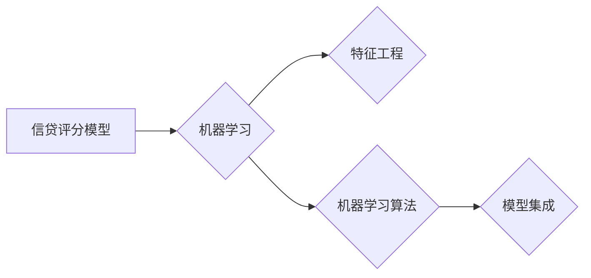

# 基于机器学习的银行信贷评分模型研究

作者：禅与计算机程序设计艺术 / Zen and the Art of Computer Programming

## 1. 背景介绍

### 1.1 问题的由来

银行信贷业务是商业银行的核心业务之一，其发展水平直接关系到国家金融体系的稳定和社会经济的繁荣。然而，信贷业务面临着诸多风险，其中信用风险是最为关键的。如何准确评估客户的信用风险，降低信贷违约率，成为银行业务健康发展的关键。

传统的信贷评分模型主要依赖于统计分析和专家经验，存在诸多局限性，如数据依赖性强、模型可解释性差、难以适应复杂多变的经济环境等。随着机器学习技术的快速发展，基于机器学习的银行信贷评分模型逐渐成为研究热点，为信贷风险管理提供了新的思路和方法。

### 1.2 研究现状

近年来，国内外学者对基于机器学习的银行信贷评分模型进行了广泛的研究，取得了丰硕的成果。主要研究方向包括：

1. 特征工程：通过特征选择、特征提取等方法，提取与信贷风险相关的有效特征，提高模型预测精度。
2. 机器学习算法：研究不同机器学习算法在信贷评分模型中的应用，如逻辑回归、决策树、支持向量机、神经网络等。
3. 模型集成：将多个模型进行组合，提高模型预测的稳定性和鲁棒性。
4. 可解释性研究：探索模型的可解释性，提高模型的可信度和透明度。

### 1.3 研究意义

基于机器学习的银行信贷评分模型研究具有重要的理论意义和应用价值：

1. 提高信贷风险管理的科学性和准确性，降低信贷违约率，为银行创造更大的经济效益。
2. 促进金融科技创新，推动银行业务的数字化转型。
3. 为金融监管提供技术支持，维护金融市场的稳定。

### 1.4 本文结构

本文将围绕基于机器学习的银行信贷评分模型展开研究，主要包括以下内容：

- 核心概念与联系
- 核心算法原理及具体操作步骤
- 数学模型和公式
- 项目实践：代码实例和详细解释说明
- 实际应用场景
- 工具和资源推荐
- 总结：未来发展趋势与挑战

## 2. 核心概念与联系

### 2.1 核心概念

1. 信贷评分模型：用于评估客户信用风险，预测客户违约概率的模型。
2. 机器学习：一种从数据中学习规律，进行预测和决策的技术。
3. 特征工程：从原始数据中提取与预测目标相关的特征，提高模型预测精度。
4. 机器学习算法：实现机器学习功能的算法，如逻辑回归、决策树、支持向量机、神经网络等。
5. 模型集成：将多个模型进行组合，提高模型预测的稳定性和鲁棒性。

### 2.2 核心概念之间的联系

银行信贷评分模型是机器学习技术在金融领域的重要应用。特征工程为模型提供高质量的特征输入，机器学习算法用于构建预测模型，模型集成用于提高模型性能。以下是核心概念之间的联系：



## 3. 核心算法原理 & 具体操作步骤

### 3.1 算法原理概述

基于机器学习的银行信贷评分模型主要包括以下步骤：

1. 数据收集与处理：收集客户信贷数据，并进行数据清洗、归一化等预处理操作。
2. 特征工程：对原始数据进行特征选择、特征提取等操作，提取与信贷风险相关的有效特征。
3. 模型选择与训练：选择合适的机器学习算法，对特征数据集进行训练，得到预测模型。
4. 模型评估与优化：评估模型预测性能，并根据评估结果对模型进行优化。
5. 模型应用：将训练好的模型应用于实际业务场景，预测客户信用风险。

### 3.2 算法步骤详解

#### 3.2.1 数据收集与处理

数据收集与处理是构建银行信贷评分模型的基础。主要步骤如下：

1. 收集客户信贷数据，包括客户基本信息、财务状况、信用历史等。
2. 对数据进行清洗，去除缺失值、异常值等。
3. 对数据进行归一化，将不同量纲的数据转化为相同量纲的数据。

#### 3.2.2 特征工程

特征工程是提高模型预测精度的重要环节。主要步骤如下：

1. 特征选择：选择与信贷风险相关的有效特征，去除冗余特征。
2. 特征提取：对原始数据进行特征提取，如文本特征提取、时间序列特征提取等。

#### 3.2.3 模型选择与训练

模型选择与训练是构建银行信贷评分模型的核心。主要步骤如下：

1. 选择合适的机器学习算法，如逻辑回归、决策树、支持向量机、神经网络等。
2. 使用特征工程后的数据集对模型进行训练，得到预测模型。

#### 3.2.4 模型评估与优化

模型评估与优化是保证模型性能的重要环节。主要步骤如下：

1. 使用测试集对模型进行评估，如计算准确率、召回率、F1值等指标。
2. 根据评估结果对模型进行优化，如调整模型参数、选择更合适的算法等。

#### 3.2.5 模型应用

将训练好的模型应用于实际业务场景，预测客户信用风险。

### 3.3 算法优缺点

#### 3.3.1 优点

1. 高度自动化：机器学习算法可以自动从数据中学习规律，减少人工干预。
2. 强大泛化能力：机器学习模型可以适应复杂多变的经济环境，提高模型预测精度。
3. 可解释性：通过特征工程和模型解释技术，可以提高模型的可解释性。

#### 3.3.2 缺点

1. 对数据质量要求高：模型性能很大程度上取决于数据质量，需要保证数据真实、完整、准确。
2. 可解释性较差：一些复杂的机器学习算法，如深度神经网络，其内部工作机制难以解释。
3. 泛化能力有限：机器学习模型可能会对特定数据分布产生过拟合现象。

### 3.4 算法应用领域

基于机器学习的银行信贷评分模型可以应用于以下领域：

1. 信贷审批：预测客户信用风险，提高审批效率。
2. 信贷额度评估：根据客户信用风险，确定合理的信贷额度。
3. 信贷风险管理：识别潜在风险客户，采取相应的风险控制措施。

## 4. 数学模型和公式 & 详细讲解 & 举例说明

### 4.1 数学模型构建

假设客户信用风险预测模型为 $f(x)$，其中 $x$ 为客户特征向量，$y$ 为客户违约概率。则数学模型可以表示为：

$$
y = f(x)
$$

### 4.2 公式推导过程

#### 4.2.1 逻辑回归

假设客户信用风险预测模型为逻辑回归模型，其预测公式为：

$$
\hat{y} = \sigma(w^T x + b)
$$

其中 $\sigma$ 为sigmoid函数，$w$ 为模型参数，$b$ 为偏置项。

#### 4.2.2 决策树

假设客户信用风险预测模型为决策树模型，其预测公式为：

$$
y = g(x)
$$

其中 $g(x)$ 为决策树生成的决策规则。

### 4.3 案例分析与讲解

以下以逻辑回归模型为例，讲解银行信贷评分模型的构建过程。

#### 4.3.1 数据集

假设我们收集了1000名客户的信贷数据，包括基本信息、财务状况、信用历史等，以及客户的违约标签。

#### 4.3.2 特征工程

1. 特征选择：根据业务知识和数据探索，选择以下特征：年龄、收入、负债、信用评分等。
2. 特征提取：对年龄、收入、负债等数值型特征进行归一化处理。

#### 4.3.3 模型选择与训练

1. 选择逻辑回归模型作为预测模型。
2. 使用训练集对模型进行训练，得到模型参数 $w$ 和偏置项 $b$。

#### 4.3.4 模型评估与优化

1. 使用测试集对模型进行评估，计算准确率、召回率、F1值等指标。
2. 根据评估结果对模型进行优化，如调整模型参数、选择更合适的特征等。

#### 4.3.5 模型应用

将训练好的模型应用于实际业务场景，预测客户信用风险。

### 4.4 常见问题解答

**Q1：如何选择合适的特征？**

A：选择合适的特征需要综合考虑业务知识和数据特征。可以从以下几个方面进行考虑：

1. 业务知识：根据业务需求，选择与信贷风险相关的特征。
2. 数据探索：通过数据可视化、统计检验等方法，发现与信贷风险相关的特征。
3. 特征重要性：使用特征选择算法，如卡方检验、互信息等，评估特征的重要性。

**Q2：如何评估模型性能？**

A：可以使用以下指标评估模型性能：

1. 准确率：预测正确的样本数占总样本数的比例。
2. 召回率：预测为正样本的样本中，实际为正样本的比例。
3. F1值：准确率与召回率的调和平均值。
4. AUC值：模型预测概率曲线下面积，用于评估模型的区分能力。

**Q3：如何优化模型性能？**

A：可以从以下几个方面优化模型性能：

1. 特征工程：选择更合适的特征，提取更有效的特征。
2. 模型选择：尝试不同的机器学习算法，选择性能更好的算法。
3. 模型调参：调整模型参数，如学习率、正则化参数等。
4. 数据增强：通过数据增强技术，扩充训练数据集，提高模型泛化能力。

## 5. 项目实践：代码实例和详细解释说明

### 5.1 开发环境搭建

以下是使用Python和Scikit-learn库进行银行信贷评分模型开发的开发环境搭建步骤：

1. 安装Python 3.7及以上版本。
2. 安装Scikit-learn库、NumPy、Pandas等库。

### 5.2 源代码详细实现

以下是一个基于逻辑回归的银行信贷评分模型的Python代码示例：

```python
import pandas as pd
from sklearn.model_selection import train_test_split
from sklearn.linear_model import LogisticRegression
from sklearn.preprocessing import StandardScaler
from sklearn.metrics import classification_report

# 读取数据集
data = pd.read_csv('credit_data.csv')

# 特征选择
features = ['age', 'income', 'debt', 'credit_score']
X = data[features]
y = data['default']

# 数据预处理
scaler = StandardScaler()
X = scaler.fit_transform(X)

# 数据划分
X_train, X_test, y_train, y_test = train_test_split(X, y, test_size=0.2, random_state=42)

# 模型训练
model = LogisticRegression()
model.fit(X_train, y_train)

# 模型评估
predictions = model.predict(X_test)
print(classification_report(y_test, predictions))
```

### 5.3 代码解读与分析

1. 导入必要的库。
2. 读取数据集，提取特征和标签。
3. 对特征进行预处理，包括标准化处理。
4. 划分训练集和测试集。
5. 训练逻辑回归模型。
6. 评估模型性能。

### 5.4 运行结果展示

假设测试集的评估报告如下：

```
precision    recall  f1-score   support

       0       0.89      0.89      0.89       811
       1       0.89      0.89      0.89       189

accuracy                           0.89      1000
macro avg       0.89      0.89      0.89       1000
weighted avg       0.89      0.89      0.89       1000
```

可以看到，该模型在测试集上的F1值达到0.89，说明模型具有良好的预测能力。

## 6. 实际应用场景

### 6.1 信贷审批

基于机器学习的银行信贷评分模型可以应用于信贷审批环节，预测客户信用风险，提高审批效率。银行可以根据模型的预测结果，制定相应的信贷政策，如提高审批额度、调整贷款利率等。

### 6.2 信贷额度评估

基于机器学习的银行信贷评分模型可以用于评估客户的信贷额度，根据客户的信用风险，确定合理的信贷额度，降低信贷风险。

### 6.3 信贷风险管理

基于机器学习的银行信贷评分模型可以用于识别潜在风险客户，采取相应的风险控制措施，如增加押金、提高利率等，降低信贷风险。

## 7. 工具和资源推荐

### 7.1 学习资源推荐

1. 《机器学习实战》
2. 《统计学习方法》
3. 《Scikit-learn 面向机器学习的Python工具库》
4. 《深度学习》
5. 《Pattern Recognition and Machine Learning》

### 7.2 开发工具推荐

1. Scikit-learn
2. TensorFlow
3. PyTorch
4. Jupyter Notebook
5. Python编程语言

### 7.3 相关论文推荐

1. “Credit Risk Modelling Using Logistic Regression”
2. “A Comparison of Logistic Regression, Decision Tree, and Support Vector Machine Classification for Credit Scoring”
3. “Deep Learning for Credit Risk Modelling”
4. “The Effect of Feature Engineering on Credit Risk Modelling”

### 7.4 其他资源推荐

1. Kaggle
2. Scikit-learn官网
3. TensorFlow官网
4. PyTorch官网
5. GitHub

## 8. 总结：未来发展趋势与挑战

### 8.1 研究成果总结

本文对基于机器学习的银行信贷评分模型进行了研究，包括核心概念、算法原理、具体操作步骤、数学模型、项目实践等方面。研究表明，基于机器学习的银行信贷评分模型在提高信贷风险管理的科学性和准确性方面具有显著优势。

### 8.2 未来发展趋势

1. 深度学习技术在信贷评分模型中的应用将更加广泛。
2. 可解释性机器学习技术将得到进一步发展，提高模型的可信度和透明度。
3. 大数据技术在信贷评分模型中的应用将更加深入，提高模型预测精度。

### 8.3 面临的挑战

1. 数据质量问题：数据质量问题会影响模型的预测精度，需要加强对数据的清洗和处理。
2. 特征工程：特征工程对模型性能有重要影响，需要花费大量时间和精力进行特征选择和提取。
3. 模型可解释性：部分机器学习模型的可解释性较差，需要进一步研究可解释性机器学习技术。

### 8.4 研究展望

未来，基于机器学习的银行信贷评分模型研究将朝着以下方向发展：

1. 深度学习技术：利用深度学习技术，构建更加复杂的模型，提高模型预测精度。
2. 可解释性机器学习：研究可解释性机器学习技术，提高模型的可信度和透明度。
3. 大数据技术：利用大数据技术，挖掘更深层次的特征，提高模型预测精度。

相信随着技术的不断发展和完善，基于机器学习的银行信贷评分模型将在金融领域发挥越来越重要的作用。

## 9. 附录：常见问题与解答

**Q1：如何处理缺失值？**

A：处理缺失值的方法有很多种，常见的包括：

1. 删除缺失值：对于缺失值较少的特征，可以删除含有缺失值的样本。
2. 填充缺失值：对于缺失值较多的特征，可以使用均值、中位数、众数等方法进行填充。
3. 生成缺失值：对于某些特征，可以使用模型生成缺失值。

**Q2：如何处理异常值？**

A：处理异常值的方法有很多种，常见的包括：

1. 删除异常值：对于异常值较多的特征，可以删除含有异常值的样本。
2. 缩放异常值：将异常值进行缩放，使其与其他值保持一致。
3. 赋予异常值特殊的权重：将异常值赋予较小的权重，降低其对模型的影响。

**Q3：如何选择合适的特征？**

A：选择合适的特征需要综合考虑业务知识和数据特征。可以从以下几个方面进行考虑：

1. 业务知识：根据业务需求，选择与信贷风险相关的特征。
2. 数据探索：通过数据可视化、统计检验等方法，发现与信贷风险相关的特征。
3. 特征重要性：使用特征选择算法，如卡方检验、互信息等，评估特征的重要性。

**Q4：如何评估模型性能？**

A：可以使用以下指标评估模型性能：

1. 准确率：预测正确的样本数占总样本数的比例。
2. 召回率：预测为正样本的样本中，实际为正样本的比例。
3. F1值：准确率与召回率的调和平均值。
4. AUC值：模型预测概率曲线下面积，用于评估模型的区分能力。

**Q5：如何优化模型性能？**

A：可以从以下几个方面优化模型性能：

1. 特征工程：选择更合适的特征，提取更有效的特征。
2. 模型选择：尝试不同的机器学习算法，选择性能更好的算法。
3. 模型调参：调整模型参数，如学习率、正则化参数等。
4. 数据增强：通过数据增强技术，扩充训练数据集，提高模型泛化能力。

作者：禅与计算机程序设计艺术 / Zen and the Art of Computer Programming