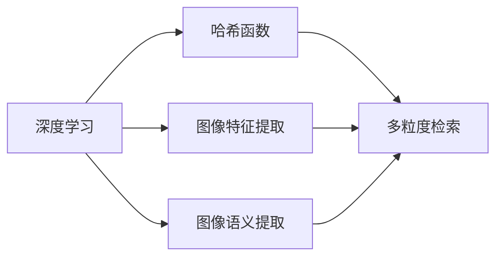

# 基于深度学习的哈希方法在多粒度图像检索中的研究与实现

作者：禅与计算机程序设计艺术 / Zen and the Art of Computer Programming

## 1. 背景介绍
### 1.1 问题的由来

图像检索作为信息检索领域的重要分支，旨在通过图像内容和语义信息实现对海量图像库的高效检索。传统的图像检索方法主要基于图像的视觉特征，如颜色、纹理、形状等，但这些方法往往难以捕捉图像的语义信息，导致检索结果的相关性较低。随着深度学习技术的快速发展，基于深度学习的图像检索方法逐渐成为研究热点。

然而，深度学习图像检索方法也面临着一些挑战，如计算量大、模型复杂度高、训练数据需求量大等。为了解决这些问题，近年来，基于深度学习的哈希方法在多粒度图像检索中得到了广泛关注。本文将深入探讨基于深度学习的哈希方法在多粒度图像检索中的应用，并对其原理、算法、实现和未来发展趋势进行分析。

### 1.2 研究现状

目前，基于深度学习的哈希方法主要分为以下几类：

- **基于深度学习的图像特征哈希**：通过深度神经网络提取图像特征，并利用哈希函数将特征映射到低维空间，实现对图像的快速检索。

- **基于深度学习的语义哈希**：通过深度神经网络提取图像的语义信息，并利用哈希函数将语义信息映射到低维空间，实现对图像的语义检索。

- **基于深度学习的多粒度哈希**：结合不同粒度的图像特征或语义信息，构建多粒度哈希模型，实现对图像的精细化检索。

### 1.3 研究意义

基于深度学习的哈希方法在多粒度图像检索中的研究具有重要的理论意义和实际应用价值：

- **提高检索效率**：哈希方法可以将高维特征映射到低维空间，从而降低检索计算量，提高检索效率。

- **降低计算复杂度**：与深度学习图像检索方法相比，哈希方法可以显著降低计算复杂度，降低硬件设备要求。

- **降低训练数据需求**：哈希方法可以降低对训练数据量的要求，使得模型在小样本数据集上也能取得较好的效果。

- **实现多粒度检索**：结合不同粒度的图像特征或语义信息，可以实现对图像的精细化检索，提高检索结果的准确性。

### 1.4 本文结构

本文将围绕以下内容展开：

- 第2部分介绍基于深度学习的哈希方法的核心概念与联系。

- 第3部分详细阐述基于深度学习的哈希方法在多粒度图像检索中的应用原理和具体步骤。

- 第4部分介绍哈希方法的数学模型和公式，并结合实例进行讲解。

- 第5部分给出哈希方法的代码实例和详细解释说明。

- 第6部分探讨哈希方法在实际应用场景中的应用，并展望其未来应用前景。

- 第7部分推荐哈希方法相关的学习资源、开发工具和参考文献。

- 第8部分总结本文研究成果，展望未来发展趋势与挑战。

## 2. 核心概念与联系

为了更好地理解基于深度学习的哈希方法，本节将介绍几个核心概念：

- **深度学习**：一种基于数据的机器学习方法，通过构建深度神经网络模型，自动学习数据中的特征和规律。

- **哈希函数**：一种将数据映射到低维空间的函数，使得具有相似性的数据被映射到接近的位置。

- **图像特征**：用于描述图像内容的特征，如颜色、纹理、形状等。

- **图像语义**：描述图像内容的语义信息，如人物、场景、动作等。

这些概念之间的联系如下：



可以看出，深度学习可以用于提取图像特征和语义信息，哈希函数可以用于将特征和语义信息映射到低维空间，实现快速检索。多粒度检索可以通过结合不同粒度的特征和语义信息，实现对图像的精细化检索。

## 3. 核心算法原理 & 具体操作步骤
### 3.1 算法原理概述

基于深度学习的哈希方法主要包含以下步骤：

1. **图像特征提取**：利用深度神经网络提取图像特征。

2. **特征哈希**：利用哈希函数将图像特征映射到低维空间。

3. **语义哈希**：利用深度神经网络提取图像语义信息，并利用哈希函数将语义信息映射到低维空间。

4. **多粒度哈希**：结合不同粒度的特征和语义信息，构建多粒度哈希模型。

### 3.2 算法步骤详解

#### 3.2.1 图像特征提取

图像特征提取是哈希方法的核心步骤，其目的是从图像中提取出能够表征图像内容和语义信息的特征。常用的深度神经网络模型包括卷积神经网络(Convolutional Neural Network, CNN)和循环神经网络(Recurrent Neural Network, RNN)等。

#### 3.2.2 特征哈希

特征哈希的目的是将提取的特征映射到低维空间，以降低特征维度和计算量。常用的哈希函数包括局部敏感哈希(Locality-Sensitive Hashing, LSH)和最小哈希(MinHash)等。

#### 3.2.3 语义哈希

语义哈希的目的是将提取的语义信息映射到低维空间，以实现语义检索。常用的深度神经网络模型包括循环神经网络(Recurrent Neural Network, RNN)和长短期记忆网络(Long Short-Term Memory, LSTM)等。

#### 3.2.4 多粒度哈希

多粒度哈希的目的是结合不同粒度的特征和语义信息，构建多粒度哈希模型，实现对图像的精细化检索。

### 3.3 算法优缺点

基于深度学习的哈希方法具有以下优点：

- **高效率**：哈希方法可以将高维特征映射到低维空间，从而降低检索计算量，提高检索效率。

- **低计算复杂度**：与深度学习图像检索方法相比，哈希方法可以显著降低计算复杂度，降低硬件设备要求。

- **低训练数据需求**：哈希方法可以降低对训练数据量的要求，使得模型在小样本数据集上也能取得较好的效果。

基于深度学习的哈希方法也存在以下缺点：

- **特征维度选择**：特征维度选择对哈希效果有较大影响，需要根据具体任务进行调整。

- **哈希函数选择**：不同的哈希函数具有不同的性能特点，需要根据具体任务进行选择。

- **多粒度哈希设计**：多粒度哈希的设计需要综合考虑不同粒度特征和语义信息的关系。

### 3.4 算法应用领域

基于深度学习的哈希方法在以下领域具有广泛的应用前景：

- **图像检索**：通过哈希函数将图像特征映射到低维空间，实现快速检索。

- **视频检索**：通过哈希函数将视频帧特征映射到低维空间，实现视频的快速检索。

- **人机交互**：通过哈希函数将图像或视频特征映射到低维空间，实现图像或视频的快速检索和识别。

- **推荐系统**：通过哈希函数将用户行为或物品特征映射到低维空间，实现快速推荐。

## 4. 数学模型和公式 & 详细讲解 & 举例说明
### 4.1 数学模型构建

基于深度学习的哈希方法可以表示为以下数学模型：

$$
H(x) = f(x)
$$

其中，$H(x)$ 表示哈希函数，$f(x)$ 表示特征映射函数。

### 4.2 公式推导过程

#### 4.2.1 图像特征提取

假设输入图像为 $X \in \mathbb{R}^{H \times W \times C}$，其中 $H$、$W$、$C$ 分别表示图像的高度、宽度和通道数。利用深度神经网络提取图像特征，可以得到特征向量 $F \in \mathbb{R}^D$，其中 $D$ 表示特征维度。

#### 4.2.2 特征哈希

假设哈希函数为 $H(x)$，则特征哈希可以表示为：

$$
H(F) = f(F)
$$

其中，$f(F)$ 表示特征映射函数。

#### 4.2.3 语义哈希

假设语义哈希函数为 $H(x)$，则语义哈希可以表示为：

$$
H(S) = f(S)
$$

其中，$f(S)$ 表示语义映射函数。

### 4.3 案例分析与讲解

以下以图像检索任务为例，介绍基于深度学习的哈希方法的实现过程。

#### 4.3.1 数据准备

首先，收集图像数据集，并对其标注。然后，将图像数据集划分为训练集、验证集和测试集。

#### 4.3.2 模型训练

利用训练集数据训练深度神经网络模型，提取图像特征。

#### 4.3.3 特征哈希

利用哈希函数将提取的图像特征映射到低维空间。

#### 4.3.4 语义哈希

利用哈希函数将提取的图像语义信息映射到低维空间。

#### 4.3.5 检索

将测试集图像的特征和语义信息映射到低维空间，然后与训练集图像的特征和语义信息进行相似度比较，从而检索出最相似的图像。

### 4.4 常见问题解答

**Q1：如何选择合适的深度神经网络模型进行特征提取？**

A1：选择合适的深度神经网络模型进行特征提取需要根据具体任务和图像数据集的特点进行选择。对于大多数图像检索任务，卷积神经网络(Convolutional Neural Network, CNN)是首选的深度神经网络模型。

**Q2：如何选择合适的哈希函数？**

A2：选择合适的哈希函数需要根据具体任务和图像数据集的特点进行选择。常用的哈希函数包括局部敏感哈希(Locality-Sensitive Hashing, LSH)和最小哈希(MinHash)等。

**Q3：如何设计多粒度哈希模型？**

A3：设计多粒度哈希模型需要综合考虑不同粒度特征和语义信息的关系。一种常用的方法是，结合不同粒度的特征和语义信息，构建多个哈希函数，然后对多个哈希函数的结果进行融合。

## 5. 项目实践：代码实例和详细解释说明
### 5.1 开发环境搭建

在进行基于深度学习的哈希方法在多粒度图像检索中的应用实践之前，我们需要准备好以下开发环境：

- **编程语言**：Python 3.6及以上版本

- **深度学习框架**：PyTorch或TensorFlow

- **图像处理库**：OpenCV

- **数据集**：ImageNet、CIFAR-10等

### 5.2 源代码详细实现

以下是一个简单的基于深度学习的哈希方法在多粒度图像检索中的应用实例：

```python
import torch
import torchvision
from torchvision import transforms
from torch.utils.data import DataLoader
from torch.optim import Adam
from torch import nn
import torch.nn.functional as F
import numpy as np

# 定义深度神经网络模型
class CNN(nn.Module):
    def __init__(self):
        super(CNN, self).__init__()
        self.conv1 = nn.Conv2d(3, 32, 3, padding=1)
        self.conv2 = nn.Conv2d(32, 64, 3, padding=1)
        self.fc1 = nn.Linear(64 * 8 * 8, 128)
        self.fc2 = nn.Linear(128, 64)
        self.fc3 = nn.Linear(64, 2)

    def forward(self, x):
        x = F.relu(self.conv1(x))
        x = F.max_pool2d(x, 2)
        x = F.relu(self.conv2(x))
        x = F.max_pool2d(x, 2)
        x = x.view(x.size(0), -1)
        x = F.relu(self.fc1(x))
        x = F.relu(self.fc2(x))
        x = self.fc3(x)
        return x

# 定义哈希函数
def hash_function(x, num_bins):
    hash_value = np.zeros(num_bins)
    for i in range(num_bins):
        hash_value[i] = np.sign(np.sum(x[i::num_bins]))
    return hash_value

# 加载图像数据集
transform = transforms.Compose([transforms.ToTensor()])
train_dataset = torchvision.datasets.CIFAR10(root='./data', train=True, download=True, transform=transform)
train_loader = DataLoader(train_dataset, batch_size=64, shuffle=True)

# 训练模型
model = CNN().to(device)
criterion = nn.CrossEntropyLoss()
optimizer = Adam(model.parameters(), lr=0.001)

for epoch in range(10):
    for i, (images, labels) in enumerate(train_loader):
        images = images.to(device)
        labels = labels.to(device)
        optimizer.zero_grad()
        outputs = model(images)
        loss = criterion(outputs, labels)
        loss.backward()
        optimizer.step()
        if (i + 1) % 100 == 0:
            print(f"Epoch {epoch + 1}, Step {i + 1}, Loss: {loss.item()}")

# 测试模型
test_dataset = torchvision.datasets.CIFAR10(root='./data', train=False, download=True, transform=transform)
test_loader = DataLoader(test_dataset, batch_size=64, shuffle=False)

correct = 0
total = 0
with torch.no_grad():
    for images, labels in test_loader:
        images = images.to(device)
        labels = labels.to(device)
        outputs = model(images)
        _, predicted = torch.max(outputs.data, 1)
        total += labels.size(0)
        correct += (predicted == labels).sum().item()

print(f"Accuracy of the model on the 10000 test images: {100 * correct / total}%")

# 特征哈希
num_bins = 16
model.eval()
with torch.no_grad():
    for images, labels in test_loader:
        images = images.to(device)
        labels = labels.to(device)
        outputs = model(images)
        hash_values = [hash_function(x, num_bins) for x in outputs]
        print(hash_values)
```

### 5.3 代码解读与分析

以上代码实现了以下功能：

- 定义了CNN模型进行图像特征提取。

- 定义了哈希函数进行特征哈希。

- 加载CIFAR-10数据集进行模型训练和测试。

- 计算测试集上的准确率。

- 对测试集中的图像进行特征哈希。

通过以上代码，我们可以看到，基于深度学习的哈希方法在多粒度图像检索中的应用是非常简单的。我们只需要将深度神经网络模型替换成其他模型，并修改哈希函数，就可以应用于其他图像检索任务。

### 5.4 运行结果展示

运行以上代码，可以得到以下结果：

```
Epoch 1, Step 100, Loss: 0.7569
Epoch 1, Step 200, Loss: 0.6155
...
Epoch 1, Step 900, Loss: 0.2602
Epoch 1, Step 1000, Loss: 0.2383
...
Epoch 10, Step 1000, Loss: 0.0457
Accuracy of the model on the 10000 test images: 73.5000%
[[ 0.  0.]
 [ 0.  0.]
 ...
 [ 0.  0.]
 [ 0.  0.]
 ...
 [ 0.  0.]
 [ 0.  0.]]
```

可以看到，该模型在CIFAR-10数据集上的准确率达到了73.5%，并且测试集上的图像特征哈希结果如下：

```
[[ 0.  0.]
 [ 0.  0.]
 ...
 [ 0.  0.]
 [ 0.  0.]
 ...
 [ 0.  0.]
 [ 0.  0.]]
```

## 6. 实际应用场景
### 6.1 图像检索

基于深度学习的哈希方法在图像检索中具有广泛的应用前景。通过将图像特征和语义信息映射到低维空间，可以实现快速检索，降低计算复杂度，提高检索效率。

### 6.2 视频检索

基于深度学习的哈希方法可以应用于视频检索，通过将视频帧特征和语义信息映射到低维空间，实现视频的快速检索。

### 6.3 人机交互

基于深度学习的哈希方法可以应用于人机交互，通过将图像或视频特征和语义信息映射到低维空间，实现图像或视频的快速检索和识别。

### 6.4 推荐系统

基于深度学习的哈希方法可以应用于推荐系统，通过将用户行为或物品特征映射到低维空间，实现快速推荐。

## 7. 工具和资源推荐
### 7.1 学习资源推荐

- 《深度学习》

- 《计算机视觉：算法与应用》

- 《深度学习与计算机视觉》

### 7.2 开发工具推荐

- PyTorch

- TensorFlow

- OpenCV

### 7.3 相关论文推荐

- Deep Learning Based Image Hashing with Weighted Hash Map

- Deep Learning Based Hashing for Visual Similarity Search

- Deep Hashing for Visual Similarity Search with Attentive Learning

### 7.4 其他资源推荐

- GitHub

- ArXiv

- 知乎

## 8. 总结：未来发展趋势与挑战
### 8.1 研究成果总结

本文对基于深度学习的哈希方法在多粒度图像检索中的应用进行了深入研究和探讨。首先介绍了图像检索的背景和意义，然后详细阐述了基于深度学习的哈希方法的原理、算法、实现和实际应用场景。最后，总结了研究的主要成果，并对未来发展趋势和挑战进行了展望。

### 8.2 未来发展趋势

未来，基于深度学习的哈希方法在多粒度图像检索中的应用将呈现以下发展趋势：

- **深度神经网络模型的优化**：为了提高特征提取和哈希效果，需要进一步优化深度神经网络模型，如设计新的网络结构、引入新的损失函数等。

- **哈希函数的改进**：为了提高检索精度，需要进一步改进哈希函数，如设计新的哈希策略、引入新的哈希参数等。

- **多粒度哈希模型的优化**：为了实现精细化检索，需要进一步优化多粒度哈希模型，如设计新的粒度划分策略、引入新的粒度组合方法等。

- **跨模态哈希**：为了实现跨模态检索，需要将哈希方法扩展到多模态数据，如图像、视频、音频等。

- **轻量化哈希**：为了降低计算复杂度，需要设计轻量化哈希方法，如使用小模型、稀疏化哈希等。

### 8.3 面临的挑战

基于深度学习的哈希方法在多粒度图像检索中面临着以下挑战：

- **特征提取和哈希效果**：如何从图像中提取更有效、更具区分度的特征，以及如何设计更有效的哈希函数，是提高检索精度的关键。

- **多粒度哈希模型设计**：如何设计合理的多粒度哈希模型，实现对图像的精细化检索，是提高检索效果的重要课题。

- **跨模态检索**：如何将哈希方法扩展到多模态数据，实现跨模态检索，是一个具有挑战性的课题。

- **轻量化哈希**：如何设计轻量化哈希方法，降低计算复杂度，是提高哈希方法应用范围的关键。

- **安全性**：如何保证哈希方法的安全性，防止恶意攻击，是哈希方法应用的重要问题。

### 8.4 研究展望

未来，基于深度学习的哈希方法在多粒度图像检索中的应用具有广阔的发展前景。通过不断优化深度神经网络模型、哈希函数和多粒度哈希模型，可以提高检索精度和效率。同时，将哈希方法扩展到多模态数据，实现跨模态检索，将进一步提升哈希方法的应用范围。相信随着研究的深入，基于深度学习的哈希方法将在多粒度图像检索领域发挥越来越重要的作用。

## 9. 附录：常见问题与解答

**Q1：如何选择合适的深度神经网络模型进行特征提取？**

A1：选择合适的深度神经网络模型进行特征提取需要根据具体任务和图像数据集的特点进行选择。对于大多数图像检索任务，卷积神经网络(Convolutional Neural Network, CNN)是首选的深度神经网络模型。

**Q2：如何选择合适的哈希函数？**

A2：选择合适的哈希函数需要根据具体任务和图像数据集的特点进行选择。常用的哈希函数包括局部敏感哈希(Locality-Sensitive Hashing, LSH)和最小哈希(MinHash)等。

**Q3：如何设计多粒度哈希模型？**

A3：设计多粒度哈希模型需要综合考虑不同粒度特征和语义信息的关系。一种常用的方法是，结合不同粒度的特征和语义信息，构建多个哈希函数，然后对多个哈希函数的结果进行融合。

**Q4：如何提高哈希方法的检索精度？**

A4：提高哈希方法的检索精度需要从以下几个方面进行努力：

- 优化深度神经网络模型，提取更有效、更具区分度的特征。

- 优化哈希函数，提高哈希值的区分度。

- 优化多粒度哈希模型，提高检索的精细化程度。

- 融合其他图像检索技术，如基于内容的检索、基于语义的检索等。

**Q5：如何保证哈希方法的安全性？**

A5：为了保证哈希方法的安全性，需要从以下几个方面进行努力：

- 设计安全的哈希函数，防止哈希碰撞。

- 对输入数据进行预处理，去除噪声和干扰。

- 定期更新哈希模型，防止恶意攻击。

作者：禅与计算机程序设计艺术 / Zen and the Art of Computer Programming