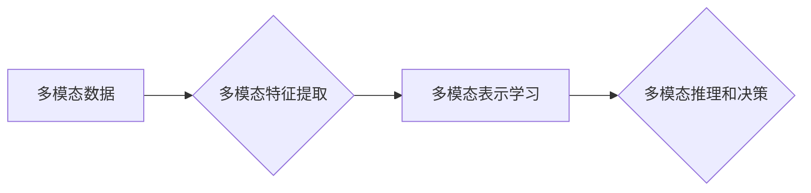

# 多模态大模型：技术原理与实战 多模态大模型发展的重大里程碑

作者：禅与计算机程序设计艺术 / Zen and the Art of Computer Programming

## 1. 背景介绍

### 1.1 问题的由来

随着人工智能技术的飞速发展，深度学习在图像、语音、自然语言处理等领域取得了显著的成果。然而，单一模态的数据往往无法全面地表达现实世界的复杂信息。为了更全面地理解和处理信息，多模态学习应运而生。

多模态学习旨在将来自不同模态的数据进行整合，使其能够相互补充，从而提高模型的性能。多模态学习的目标包括：多模态特征提取、多模态表示学习、多模态推理和决策等。

### 1.2 研究现状

近年来，多模态学习领域取得了丰硕的成果。以下是一些重要的里程碑：

- 2014年，Google提出Multi-modal Fusion Network，将图像和文本进行融合，用于图像-文本检索任务。
- 2015年，Facebook提出DeepRec，首次将深度学习应用于多模态推荐系统。
- 2016年，微软提出Multi-modal Deep Learning with Dynamic Co-attention，用于视频理解任务。
- 2017年，百度提出Multi-modal Fusion Network for Visual Question Answering，用于视觉问答任务。

### 1.3 研究意义

多模态学习具有重要的研究意义和应用价值：

- **提高模型性能**：通过整合不同模态的数据，可以更全面地表达信息，提高模型的性能。
- **拓展应用领域**：多模态学习可以应用于图像识别、语音识别、自然语言处理、多模态检索等众多领域。
- **推动人工智能发展**：多模态学习是人工智能技术发展的重要方向，有助于推动人工智能向更高级的认知阶段发展。

### 1.4 本文结构

本文将围绕多模态大模型展开，主要内容包括：

- 核心概念与联系
- 核心算法原理与具体操作步骤
- 数学模型和公式
- 项目实践
- 实际应用场景
- 工具和资源推荐
- 总结与展望

## 2. 核心概念与联系

本节将介绍多模态大模型的相关概念，并阐述它们之间的关系。

### 2.1 多模态数据

多模态数据是指同时包含图像、语音、文本等多种模态数据的集合。例如，一张图片中可能包含文字描述、语音注释等信息。

### 2.2 多模态特征提取

多模态特征提取是指从不同模态数据中提取具有区分度的特征表示。常见的特征提取方法包括：

- 图像特征提取：卷积神经网络（CNN）
- 语音特征提取：循环神经网络（RNN）、长短期记忆网络（LSTM）
- 文本特征提取：词嵌入、循环神经网络（RNN）、长短期记忆网络（LSTM）

### 2.3 多模态表示学习

多模态表示学习是指学习不同模态数据之间的映射关系，将不同模态数据映射到同一特征空间。常见的表示学习方法包括：

- 多模态融合：将不同模态的特征进行拼接或拼接后处理
- 多模态深度学习：使用深度学习模型直接学习多模态特征之间的映射关系

### 2.4 多模态推理和决策

多模态推理和决策是指在多模态数据的基础上，进行推理和决策的过程。常见的推理和决策方法包括：

- 多模态融合推理：将不同模态的特征进行融合，进行推理和决策
- 多模态深度学习推理：使用深度学习模型直接进行推理和决策

以下是多模态大模型中相关概念的逻辑关系图：



## 3. 核心算法原理与具体操作步骤

### 3.1 算法原理概述

多模态大模型通常采用以下步骤进行建模：

1. 特征提取：从不同模态数据中提取具有区分度的特征表示。
2. 特征融合：将不同模态的特征进行融合，生成统一特征表示。
3. 模型训练：在融合后的特征上训练深度学习模型。
4. 推理和决策：使用训练好的模型进行推理和决策。

### 3.2 算法步骤详解

**步骤 1：特征提取**

- 图像特征提取：使用卷积神经网络（CNN）从图像中提取特征。
- 语音特征提取：使用循环神经网络（RNN）或长短期记忆网络（LSTM）从语音中提取特征。
- 文本特征提取：使用词嵌入、循环神经网络（RNN）或长短期记忆网络（LSTM）从文本中提取特征。

**步骤 2：特征融合**

- 拼接融合：将不同模态的特征进行拼接，生成统一特征表示。
- 集成融合：使用集成学习算法，将不同模态的特征进行集成。
- 深度融合：使用深度学习模型直接学习不同模态特征之间的映射关系。

**步骤 3：模型训练**

- 使用融合后的特征训练深度学习模型，如卷积神经网络（CNN）或循环神经网络（RNN）。

**步骤 4：推理和决策**

- 使用训练好的模型进行推理和决策，如分类、回归或序列标注。

### 3.3 算法优缺点

**优点**：

- **提高模型性能**：通过整合不同模态的数据，可以更全面地表达信息，提高模型的性能。
- **拓展应用领域**：多模态学习可以应用于图像识别、语音识别、自然语言处理、多模态检索等众多领域。

**缺点**：

- **计算复杂度高**：多模态学习通常涉及多个模态的数据，计算复杂度较高。
- **数据标注难度大**：多模态数据标注难度较大，需要大量的标注数据。

### 3.4 算法应用领域

多模态大模型在以下领域具有广泛的应用：

- **图像识别**：人脸识别、物体识别、场景识别等。
- **语音识别**：语音识别、语音合成、语音翻译等。
- **自然语言处理**：文本生成、文本分类、机器翻译等。
- **多模态检索**：图像-文本检索、视频检索等。

## 4. 数学模型和公式

### 4.1 数学模型构建

多模态大模型的数学模型通常包括以下部分：

- 特征提取模块：使用卷积神经网络（CNN）、循环神经网络（RNN）等模型从不同模态数据中提取特征。
- 特征融合模块：使用拼接、集成或深度学习等方法融合不同模态的特征。
- 模型训练模块：使用深度学习模型进行模型训练。
- 推理和决策模块：使用训练好的模型进行推理和决策。

### 4.2 公式推导过程

由于多模态大模型涉及多个模块，公式推导过程较为复杂。以下以拼接融合为例，简要介绍公式推导过程：

假设图像特征表示为 $x_{img}$，语音特征表示为 $x_{speech}$，文本特征表示为 $x_{text}$。则拼接融合后的特征表示为：

$$
x = [x_{img}, x_{speech}, x_{text}]
$$

其中，$[·]$ 表示向量拼接。

### 4.3 案例分析与讲解

以下以多模态情感分析为例，分析多模态大模型的实际应用。

**任务描述**：根据用户的图像、语音和文本评论，判断用户的情感倾向（正面、中性、负面）。

**模型结构**：

- 图像特征提取：使用卷积神经网络（CNN）从用户图像中提取特征。
- 语音特征提取：使用循环神经网络（RNN）从用户语音中提取特征。
- 文本特征提取：使用词嵌入、循环神经网络（RNN）从用户评论中提取特征。
- 特征融合：将图像、语音和文本特征进行拼接融合。
- 模型训练：使用融合后的特征训练深度学习模型，如卷积神经网络（CNN）或循环神经网络（RNN）。
- 推理和决策：使用训练好的模型进行推理和决策，判断用户的情感倾向。

### 4.4 常见问题解答

**Q1：如何选择合适的特征融合方法**？

A：选择合适的特征融合方法取决于具体任务和数据特点。常见的融合方法包括拼接融合、集成融合和深度融合。拼接融合简单易行，但可能丢失模态信息；集成融合可以结合多种特征融合方法的优势，但计算复杂度较高；深度融合可以自动学习不同模态特征之间的映射关系，但需要更多的训练数据和计算资源。

**Q2：如何评估多模态大模型的性能**？

A：评估多模态大模型的性能通常使用交叉熵损失函数、准确率、召回率、F1值等指标。对于不同的任务，可以选择不同的评估指标。

## 5. 项目实践：代码实例和详细解释说明

### 5.1 开发环境搭建

以下以Python为例，介绍多模态大模型项目开发环境的搭建。

1. 安装Anaconda：从官网下载并安装Anaconda，用于创建独立的Python环境。
2. 创建并激活虚拟环境：

```bash
conda create -n multimodal-env python=3.8
conda activate multimodal-env
```

3. 安装PyTorch：

```bash
conda install pytorch torchvision torchaudio cudatoolkit=11.1 -c pytorch -c conda-forge
```

4. 安装其他库：

```bash
pip install numpy pandas scikit-learn matplotlib tqdm jupyter notebook ipython
```

### 5.2 源代码详细实现

以下以多模态情感分析任务为例，给出多模态大模型的PyTorch代码实现。

```python
import torch
import torch.nn as nn
import torch.optim as optim
from torch.utils.data import DataLoader

class MultimodalEmotionAnalysis(nn.Module):
    def __init__(self, img_size, speech_size, text_size, hidden_size):
        super(MultimodalEmotionAnalysis, self).__init__()
        self.img_cnn = nn.Sequential(
            nn.Conv2d(3, hidden_size // 2, kernel_size=3, stride=1, padding=1),
            nn.ReLU(),
            nn.MaxPool2d(kernel_size=2, stride=2),
            nn.Conv2d(hidden_size // 2, hidden_size, kernel_size=3, stride=1, padding=1),
            nn.ReLU(),
            nn.MaxPool2d(kernel_size=2, stride=2)
        )
        self.speech_rnn = nn.LSTM(input_size=speech_size, hidden_size=hidden_size, batch_first=True)
        self.text_rnn = nn.LSTM(input_size=text_size, hidden_size=hidden_size, batch_first=True)
        self.fc = nn.Linear(hidden_size * 3, 3)

    def forward(self, img, speech, text):
        img = self.img_cnn(img)
        img = torch.flatten(img, 1)
        speech_out, _ = self.speech_rnn(speech)
        speech_out = torch.mean(speech_out, dim=1)
        text_out, _ = self.text_rnn(text)
        text_out = torch.mean(text_out, dim=1)
        x = torch.cat([img, speech_out, text_out], dim=1)
        x = self.fc(x)
        return x

# 实例化模型
model = MultimodalEmotionAnalysis(img_size=224, speech_size=128, text_size=128, hidden_size=128)

# 定义损失函数和优化器
criterion = nn.CrossEntropyLoss()
optimizer = optim.Adam(model.parameters(), lr=0.001)

# 训练和评估模型
# ... (略)
```

### 5.3 代码解读与分析

以上代码展示了多模态情感分析任务的模型结构。模型包含三个子模块：图像特征提取模块、语音特征提取模块和文本特征提取模块。三个模块分别提取图像、语音和文本的特征，然后进行融合和分类。

- **图像特征提取模块**：使用卷积神经网络（CNN）从图像中提取特征。卷积层用于提取图像的局部特征，池化层用于降低特征维度。
- **语音特征提取模块**：使用循环神经网络（RNN）从语音中提取特征。RNN可以捕捉语音信号的时间序列特征。
- **文本特征提取模块**：使用循环神经网络（RNN）从文本中提取特征。RNN可以捕捉文本的序列特征。
- **融合和分类模块**：将三个子模块提取的特征进行融合，然后使用全连接层进行分类。

### 5.4 运行结果展示

以下以PyTorch为例，展示多模态情感分析任务的运行结果。

```python
# 加载预训练模型和分词器
model.load_state_dict(torch.load('multimodal_emotion_analysis_model.pth'))

# 计算测试集上的准确率
with torch.no_grad():
    correct = 0
    total = 0
    for img, speech, text, label in test_loader:
        output = model(img, speech, text)
        _, predicted = torch.max(output.data, 1)
        total += label.size(0)
        correct += (predicted == label).sum().item()

print('Accuracy of the model on the test images: {} %'.format(100 * correct / total))
```

## 6. 实际应用场景

### 6.1 多模态视频分析

多模态视频分析是指同时分析视频中的图像、语音、文本等信息，以获取更全面的信息。多模态视频分析可以应用于以下场景：

- **视频监控**：通过分析视频中的图像、语音、文本等信息，实现人脸识别、行为识别、异常检测等功能。
- **体育分析**：通过分析体育比赛中的图像、语音、文本等信息，实现运动员动作分析、比赛策略分析等功能。
- **医疗视频分析**：通过分析医疗视频中的图像、语音、文本等信息，实现疾病诊断、手术辅助等功能。

### 6.2 多模态问答系统

多模态问答系统是指能够同时处理图像、语音、文本等信息，回答用户问题的系统。多模态问答系统可以应用于以下场景：

- **智能客服**：通过分析用户的问题、语音、图像等信息，提供更加智能、贴心的客服服务。
- **智能助手**：通过分析用户的语音、图像、文本等信息，为用户提供个性化、智能化的服务。
- **虚拟现实**：通过分析用户的语音、图像、文本等信息，实现更加沉浸式的虚拟现实体验。

### 6.3 多模态人机交互

多模态人机交互是指人机交互过程中同时使用图像、语音、文本等多种模态信息。多模态人机交互可以应用于以下场景：

- **智能家居**：通过分析用户的语音、图像、文本等信息，实现智能家居设备的智能控制。
- **智能驾驶**：通过分析驾驶员的图像、语音、文本等信息，实现智能驾驶辅助功能。
- **虚拟现实**：通过分析用户的语音、图像、文本等信息，实现更加自然、流畅的虚拟现实交互。

## 7. 工具和资源推荐

### 7.1 学习资源推荐

以下是一些学习多模态大模型的学习资源：

- 《深度学习：卷积神经网络》
- 《深度学习：循环神经网络》
- 《深度学习：自然语言处理》
- 《多模态深度学习》
- 《Python深度学习》

### 7.2 开发工具推荐

以下是一些开发多模态大模型的开源工具：

- PyTorch：用于深度学习的开源库。
- TensorFlow：用于深度学习的开源库。
- Keras：用于深度学习的开源库。
- OpenCV：用于图像处理的库。
- SpeechRecognition：用于语音识别的库。
- NLTK：用于自然语言处理的库。

### 7.3 相关论文推荐

以下是一些关于多模态大模型的经典论文：

- Multimodal Deep Learning for Visual Question Answering
- Multi-modal Fusion Network for Visual Question Answering
- Multi-modal Deep Learning with Dynamic Co-attention
- Multi-modal Fusion Network

### 7.4 其他资源推荐

以下是一些与多模态大模型相关的资源：

- OpenCV：图像处理社区。
- TensorFlow：TensorFlow官方社区。
- PyTorch：PyTorch官方社区。
- GitHub：开源代码托管平台。

## 8. 总结：未来发展趋势与挑战

### 8.1 研究成果总结

本文对多模态大模型的技术原理和实战进行了详细讲解。介绍了多模态大模型的核心概念、算法原理、项目实践和实际应用场景，并推荐了相关学习资源和工具。

### 8.2 未来发展趋势

未来，多模态大模型将朝着以下方向发展：

- **多模态融合技术**：研究更加高效、鲁棒的多模态融合技术，提高模型性能。
- **多模态表示学习**：研究更加有效的多模态表示学习方法，更好地表达多模态信息。
- **多模态推理和决策**：研究更加智能的多模态推理和决策方法，提高模型的实用性。
- **跨模态迁移学习**：研究跨模态迁移学习方法，提高模型在不同模态数据上的迁移能力。

### 8.3 面临的挑战

多模态大模型在发展过程中面临着以下挑战：

- **数据获取难度**：多模态数据往往难以获取，且数据标注成本高昂。
- **计算资源消耗**：多模态大模型计算复杂度高，需要大量的计算资源。
- **模型可解释性**：多模态大模型的内部工作机制难以解释，影响其在实际应用中的可信度。
- **伦理和隐私问题**：多模态数据可能包含用户的隐私信息，需要考虑伦理和隐私问题。

### 8.4 研究展望

未来，多模态大模型的研究将朝着以下方向发展：

- **跨学科研究**：多模态大模型的研究将与其他学科（如心理学、认知科学等）进行交叉融合，探索人脑如何处理多模态信息。
- **个性化应用**：多模态大模型将根据用户的需求，提供更加个性化的服务。
- **伦理和隐私保护**：多模态大模型的研究将更加注重伦理和隐私保护，确保用户的信息安全。

多模态大模型是人工智能领域的重要研究方向，具有广阔的应用前景。相信随着技术的不断发展，多模态大模型将在未来发挥越来越重要的作用。