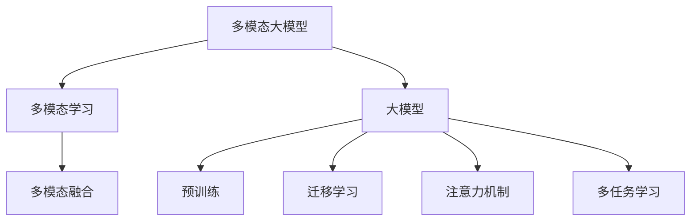

正文内容如下:

# 多模态大模型：技术原理与实战 多模态大模型在金融领域中的应用

## 1. 背景介绍

### 1.1 问题的由来

在当今数字时代,数据呈现多种形式,包括文本、图像、语音和视频等。传统的单一模态人工智能模型通常专注于处理单一类型的数据输入,如自然语言处理(NLP)模型专门处理文本数据。然而,真实世界中的数据通常具有多模态特征,需要同时处理和理解多种模态的信息。因此,如何有效地融合和利用多模态数据,成为了人工智能领域的一个重要挑战。

### 1.2 研究现状  

近年来,随着深度学习技术的不断发展,多模态学习(Multimodal Learning)成为了一个热门的研究方向。多模态学习旨在通过构建统一的模型框架,同时处理和融合来自不同模态的信息,从而提高模型的泛化能力和鲁棒性。目前,多模态学习已经在计算机视觉、自然语言处理、多媒体分析等多个领域得到了广泛应用。

与此同时,大模型(Large Model)作为深度学习的一个重要发展方向,也受到了广泛关注。大模型通过增加模型参数的数量和规模,能够学习更加丰富和复杂的数据表示,从而提高模型的性能和泛化能力。典型的大模型包括GPT(Generative Pre-trained Transformer)、BERT(Bidirectional Encoder Representations from Transformers)等,它们在自然语言处理任务中取得了卓越的成绩。

### 1.3 研究意义

将多模态学习与大模型相结合,构建多模态大模型(Multimodal Large Model),可以充分利用多模态数据的优势,同时借助大模型的强大表示能力,从而在各种复杂的任务中获得更好的性能。多模态大模型在各个领域都有着广阔的应用前景,如计算机视觉、自然语言处理、多媒体分析、医疗影像分析等。

本文将重点探讨多模态大模型在金融领域的应用。金融数据通常包含文本、图像、表格等多种模态信息,传统的单一模态模型难以充分利用这些信息。多模态大模型能够有效地融合和利用这些多源异构数据,从而为金融领域带来革命性的变革,如风险管理、投资决策、欺诈检测等。

### 1.4 本文结构

本文将从以下几个方面全面介绍多模态大模型在金融领域中的应用:

1. 核心概念与联系
2. 核心算法原理与具体操作步骤
3. 数学模型和公式详细讲解与举例说明
4. 项目实践:代码实例和详细解释说明
5. 实际应用场景
6. 工具和资源推荐
7. 总结:未来发展趋势与挑战
8. 附录:常见问题与解答

## 2. 核心概念与联系

多模态大模型是一种融合了多模态学习和大模型思想的新型人工智能模型。它包含以下几个核心概念:

1. **多模态学习(Multimodal Learning)**:多模态学习旨在通过构建统一的模型框架,同时处理和融合来自不同模态(如文本、图像、语音等)的信息,从而提高模型的泛化能力和鲁棒性。

2. **大模型(Large Model)**:大模型通过增加模型参数的数量和规模,能够学习更加丰富和复杂的数据表示,从而提高模型的性能和泛化能力。典型的大模型包括GPT、BERT等。

3. **多模态融合(Multimodal Fusion)**:多模态融合是多模态学习的核心,它指的是如何有效地将来自不同模态的信息融合到统一的表示空间中,以便模型能够同时处理和利用这些信息。

4. **预训练(Pre-training)**:预训练是大模型的关键技术之一。通过在大规模无标注数据上进行预训练,模型可以学习到丰富的先验知识,从而提高在下游任务上的性能。

5. **迁移学习(Transfer Learning)**:迁移学习允许将在源领域学习到的知识迁移到目标领域,从而减少目标领域的数据需求,提高模型的泛化能力。

6. **注意力机制(Attention Mechanism)**:注意力机制是transformer等模型的核心,它允许模型动态地关注输入数据的不同部分,从而更好地捕捉长距离依赖关系。

7. **多任务学习(Multi-task Learning)**:多任务学习旨在同时优化多个相关任务的性能,从而提高模型的泛化能力和鲁棒性。

这些核心概念相互关联,共同构成了多模态大模型的理论基础和技术支撑。通过有机地结合这些概念,多模态大模型能够充分利用多模态数据的优势,同时借助大模型的强大表示能力,从而在各种复杂的任务中获得更好的性能。

## 3. 核心算法原理与具体操作步骤

### 3.1 算法原理概述

多模态大模型的核心算法原理可以概括为以下几个关键步骤:

1. **数据预处理**:对不同模态的输入数据进行适当的预处理,如文本分词、图像归一化等,以便后续的模型输入。

2. **模态编码**:将不同模态的输入数据编码为相应的特征表示,通常使用不同的编码器模块,如文本编码器、图像编码器等。

3. **多模态融合**:将来自不同模态的特征表示融合到统一的表示空间中,常见的融合方法包括简单拼接、注意力融合、门控融合等。

4. **预训练**:在大规模无标注的多模态数据上进行预训练,使模型学习到丰富的先验知识,提高在下游任务上的性能。

5. **微调**:在特定的下游任务上,对预训练模型进行微调,使其适应目标任务的特征分布和目标函数。

6. **迁移学习**:将在源领域学习到的知识迁移到目标领域,从而减少目标领域的数据需求,提高模型的泛化能力。

7. **多任务学习**:同时优化多个相关任务的性能,从而提高模型的泛化能力和鲁棒性。

8. **模型评估**:在测试集上评估模型的性能,并根据需要进行模型调整和改进。

### 3.2 算法步骤详解

1. **数据预处理**

   - 文本数据:进行分词、去除停用词、词干提取等预处理操作。
   - 图像数据:进行归一化、数据增强等预处理操作。
   - 其他模态数据:根据具体情况进行适当的预处理。

2. **模态编码**

   - 文本编码器:通常使用transformer编码器或RNN编码器对文本数据进行编码,得到文本特征表示。
   - 图像编码器:通常使用CNN或ViT(Vision Transformer)对图像数据进行编码,得到图像特征表示。
   - 其他模态编码器:根据具体情况设计相应的编码器模块。

3. **多模态融合**

   - 简单拼接融合:将不同模态的特征表示直接拼接在一起,作为融合后的表示。
   - 注意力融合:使用注意力机制动态地融合不同模态的特征表示。
   - 门控融合:使用门控机制控制不同模态特征的融合权重。

4. **预训练**

   - 自监督预训练:在大规模无标注的多模态数据上进行自监督预训练,如遮挡语言模型(Masked Language Modeling)、图像重建(Image Reconstruction)等。
   - 有监督预训练:在标注的多模态数据上进行有监督预训练,如图像-文本对匹配(Image-Text Matching)等。

5. **微调**

   - 在特定的下游任务上,对预训练模型进行微调,使其适应目标任务的特征分布和目标函数。
   - 可以采用不同的微调策略,如全模型微调、部分微调等。

6. **迁移学习**

   - 将在源领域(如通用领域)学习到的知识迁移到目标领域(如金融领域)。
   - 可以采用不同的迁移学习方法,如特征提取、微调、混合等。

7. **多任务学习**

   - 同时优化多个相关任务的性能,如文本分类、图像分类、关系抽取等。
   - 可以采用硬参数共享或软参数共享的方式实现多任务学习。

8. **模型评估**

   - 在测试集上评估模型的性能,常用的评估指标包括准确率、F1分数、均方根误差等。
   - 根据评估结果,对模型进行调整和改进,如超参数调整、网络结构优化等。

### 3.3 算法优缺点

**优点**:

1. 能够充分利用多模态数据的优势,提高模型的泛化能力和鲁棒性。
2. 借助大模型的强大表示能力,能够学习到更加丰富和复杂的数据表示。
3. 通过预训练和迁移学习,能够减少目标领域的数据需求,提高模型的性能。
4. 多任务学习能够进一步提高模型的泛化能力和鲁棒性。

**缺点**:

1. 模型结构复杂,训练和推理过程计算量大,需要强大的硬件支持。
2. 预训练和微调过程需要大量的计算资源和时间成本。
3. 多模态数据的获取和标注成本较高,特别是在一些特定领域。
4. 不同模态之间的融合方式仍然是一个挑战,需要进一步探索更加有效的融合策略。

### 3.4 算法应用领域

多模态大模型由于其能够有效地融合和利用多模态数据的优势,在多个领域都有着广阔的应用前景,包括但不限于:

1. **计算机视觉**:图像-文本检索、视觉问答、图像描述生成等。
2. **自然语言处理**:多模态机器翻译、多模态对话系统、多模态信息抽取等。
3. **多媒体分析**:视频描述、视频问答、多媒体事件检测等。
4. **医疗影像分析**:医疗图像分割、病理诊断、医疗报告生成等。
5. **金融领域**:金融风险管理、投资决策、欺诈检测等(本文重点探讨)。
6. **教育领域**:智能教育系统、在线课程推荐等。
7. **零售领域**:产品推荐、客户画像分析等。
8. **安全领域**:视频监控、人脸识别、异常行为检测等。

## 4. 数学模型和公式详细讲解与举例说明

### 4.1 数学模型构建

在多模态大模型中,我们需要构建一个统一的数学模型来表示不同模态的输入数据及其融合过程。假设我们有 $M$ 种模态,分别表示为 $\{X_1, X_2, \cdots, X_M\}$,其中 $X_i$ 表示第 $i$ 种模态的输入数据。我们的目标是将这些不同模态的输入数据融合到一个统一的表示空间中,得到融合后的表示 $Z$。

首先,我们需要为每种模态定义一个编码器函数 $f_i$,用于将该模态的输入数据 $X_i$ 编码为相应的特征表示 $H_i$:

$$H_i = f_i(X_i; \theta_i)$$

其中 $\theta_i$ 表示第 $i$ 种模态编码器的参数。

接下来,我们需要定义一个融合函数 $g$,用于将不同模态的特征表示 $\{H_1, H_2, \cdots, H_M\}$ 融合到统一的表示空间中,得到融合后的表示 $Z$:

$$Z = g(H_1, H_2, \cdots, H_M; \phi)$$

其中 $\phi$ 表示融合函数的参数。

融合函数 $g$ 可以采用不