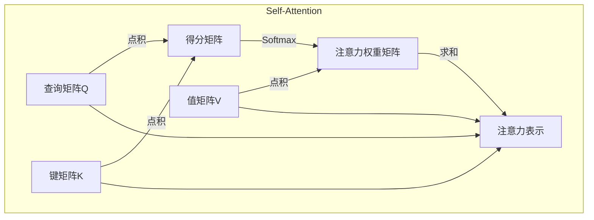

# 大语言模型 原理与代码实例讲解

## 1. 背景介绍

### 1.1 问题的由来

在过去的几年里,自然语言处理(NLP)领域取得了长足的进步,这在很大程度上归功于大型神经网络模型的出现和发展。传统的NLP系统通常依赖于手工设计的特征和规则,难以捕捉语言的复杂性和多样性。而大型神经网络模型则能够从大量的文本数据中自动学习语言的模式和规律,从而在许多NLP任务上取得了卓越的表现。

大语言模型(Large Language Model,LLM)是这种大型神经网络模型的一种,它被训练于海量的自然语言数据,旨在捕捉语言的内在规律和语义信息。LLM通过自监督学习的方式,学习语言的联系和上下文,从而能够生成自然、流畅的文本。

### 1.2 研究现状

近年来,LLM的研究和应用受到了广泛的关注。一些备受瞩目的LLM包括:

- **GPT(Generative Pre-trained Transformer)**: 由OpenAI开发,是最早的大型语言模型之一。GPT-3拥有1750亿个参数,在多项NLP任务上表现出色。

- **BERT(Bidirectional Encoder Representations from Transformers)**: 由Google开发,是一种双向编码器模型,在多项NLP任务上取得了state-of-the-art的表现。

- **T5(Text-to-Text Transfer Transformer)**: 由Google开发,是一种将所有NLP任务统一为"text-to-text"的框架,在多项任务上表现优异。

- **GPT-Neo/Jurassic-1**: 由EleutherAI开发的开源GPT-3模型,具有较小的模型尺寸但性能较好。

- **Megatron-Turing NLG**: 由Microsoft和Nvidia合作开发,是目前规模最大的语言模型,拥有5300亿个参数。

这些LLM在自然语言生成、理解、翻译、问答等多个领域展现出了强大的能力。

### 1.3 研究意义

LLM的出现为NLP领域带来了革命性的变革,它们能够在没有太多人工特征工程和规则的情况下,直接从数据中学习语言知识。LLM的研究不仅有助于推动NLP技术的发展,也为人工智能的其他领域提供了新的思路和方法。

此外,LLM还具有广阔的应用前景,如自动文本生成、智能对话系统、信息检索、内容审核等,为诸多行业带来了新的机遇。随着模型规模和计算能力的不断提高,LLM有望在未来发挥更大的作用。

### 1.4 本文结构

本文将全面介绍LLM的原理、算法和实践。具体来说,将包括以下几个方面:

1. **核心概念与联系**: 阐述LLM的核心概念,如自注意力机制、Transformer架构等,并探讨它们与其他NLP模型的联系。

2. **核心算法原理和具体操作步骤**: 详细解释LLM中使用的核心算法,如Transformer解码器、掩码语言模型等,并给出具体的操作步骤。

3. **数学模型和公式详细讲解**: 介绍LLM中使用的数学模型,如注意力分数计算、损失函数等,并推导相关公式。

4. **项目实践:代码实例和详细解释**: 提供LLM的代码实现示例,并对关键部分进行解释和分析。

5. **实际应用场景**: 探讨LLM在自然语言生成、理解、翻译等领域的应用,并展望未来的发展方向。

6. **工具和资源推荐**: 推荐一些有用的学习资源、开发工具和相关论文,以帮助读者进一步学习和实践。

7. **总结:未来发展趋势与挑战**: 总结LLM的研究成果,并分析其未来的发展趋势和面临的挑战。

8. **附录:常见问题与解答**: 列出一些常见的问题并给出解答,帮助读者更好地理解LLM。

通过本文的学习,读者将能够全面掌握LLM的原理和实践,为将来在NLP和AI领域的研究和应用打下坚实的基础。

## 2. 核心概念与联系

在深入探讨LLM的算法细节之前,我们先来了解一些核心概念,这将有助于理解LLM的本质和与其他模型的关联。

### 2.1 自注意力机制(Self-Attention)

自注意力机制是LLM中的核心组成部分,它能够捕捉输入序列中任意两个位置之间的依赖关系。不同于RNN和CNN等传统模型,自注意力机制不再受限于局部窗口或序列顺序,而是直接对整个序列进行建模。

在自注意力机制中,每个位置的表示是通过其与所有其他位置的表示的加权和计算得到的。这种全局依赖关系的建模,使得自注意力机制能够更好地捕捉长距离依赖,并且具有更强的并行计算能力。

自注意力机制可以形式化地表示为:

$$\mathrm{Attention}(Q, K, V) = \mathrm{softmax}(\frac{QK^T}{\sqrt{d_k}})V$$

其中 $Q$ 表示查询(Query)向量, $K$ 表示键(Key)向量, $V$ 表示值(Value)向量。通过计算查询和键之间的相似性得分,然后对其进行软最大值归一化,最终得到注意力权重,将其与值向量相乘即可得到加权和表示。

### 2.2 Transformer 架构

Transformer是第一个将自注意力机制成功应用于序列建模任务的架构,它由编码器(Encoder)和解码器(Decoder)两个部分组成。

编码器的作用是将输入序列编码为一系列连续的表示,这些表示捕捉了输入序列中元素之间的依赖关系。解码器则根据编码器的输出和之前生成的输出,自回归地生成目标序列。

Transformer架构中的自注意力层能够直接对输入序列中任意两个位置建模依赖关系,避免了RNN的路径遗忘问题。同时,由于自注意力机制具有并行计算的特性,Transformer的计算效率也大大提高。

Transformer架构在机器翻译、文本生成等任务上取得了卓越的成绩,为后来的LLM奠定了基础。

### 2.3 掩码语言模型(Masked Language Model)

掩码语言模型(Masked Language Model, MLM)是LLM的一种常用的自监督学习方式。在MLM中,模型的输入是一段被随机掩码(用特殊标记[MASK]替换)的文本序列,模型的目标是预测被掩码的词。

通过这种方式,LLM能够从大量的文本数据中学习语言的上下文信息和语义知识。与传统的语言模型(基于n-gram统计)不同,MLM考虑了双向上下文,能够更好地捕捉语言的深层次规律。

MLM的训练目标是最大化被掩码词的条件概率:

$$\mathcal{L}_\text{MLM} = -\mathbb{E}_{x,m}\left[\log P(x_m|x_{\backslash m})\right]$$

其中 $x$ 表示输入序列, $m$ 表示被掩码的位置索引, $x_{\backslash m}$ 表示除去被掩码位置的其余部分。

MLM为LLM提供了一种有效的自监督学习方式,使其能够从大量的文本数据中自主学习语言知识,而不需要人工标注的数据。

### 2.4 与其他NLP模型的联系

LLM与其他NLP模型存在一些联系和区别:

- 与Word2Vec等静态词向量模型相比,LLM能够生成动态的上下文相关的表示,捕捉更丰富的语义信息。

- 与RNN和CNN等序列模型相比,LLM基于Transformer架构,避免了路径遗忘问题,具有更强的长距离建模能力。

- 与BERT等双向编码器模型相比,LLM不仅能够对输入进行编码,还能够生成自然语言输出。

- 与GPT-2等早期语言模型相比,现代LLM通常规模更大,使用更复杂的训练目标(如MLM),性能也更加出色。

总的来说,LLM融合了自注意力、Transformer等先进技术,是一种新兴的大规模自监督语言模型范式,为NLP领域带来了新的发展机遇。

## 3. 核心算法原理和具体操作步骤

### 3.1 算法原理概述

LLM的核心算法主要包括两个部分:Transformer解码器和掩码语言模型(MLM)。

**Transformer解码器**用于根据输入序列生成目标序列。它由多个解码器层组成,每一层包含了多头自注意力子层、编码器-解码器注意力子层和前馈神经网络子层。

解码器的自注意力子层捕捉目标序列内元素之间的依赖关系,而编码器-解码器注意力子层则建模目标序列与输入序列之间的依赖关系。前馈子层则对序列表示进行非线性变换。通过层与层之间的残差连接和层归一化,模型具有更好的优化性能。

**MLM**则是LLM的自监督学习目标之一。在MLM中,模型的输入是一段被随机掩码的文本序列,目标是预测被掩码的词。通过最大化被掩码词的条件概率,LLM能够从大量文本数据中学习语言的上下文和语义知识。

MLM的训练过程可以形式化为:

1. 从语料库中采样一段文本序列 $x$。
2. 随机选择若干个位置,用特殊标记[MASK]替换对应的词,得到掩码序列 $\hat{x}$。
3. 将 $\hat{x}$ 输入到LLM中,得到每个位置的词的概率分布 $P(x_i|\hat{x}_{\backslash i})$。
4. 对于被掩码的位置 $m$,计算其真实词 $x_m$ 的概率 $P(x_m|\hat{x}_{\backslash m})$。
5. 最大化被掩码词的条件概率 $\mathcal{L}_\text{MLM} = -\log P(x_m|\hat{x}_{\backslash m})$。

通过上述算法,LLM能够同时学习生成和理解自然语言的能力。

### 3.2 算法步骤详解

现在让我们进一步详细地解释LLM算法的具体步骤。

#### 3.2.1 Transformer解码器

Transformer解码器的核心在于多头自注意力机制和编码器-解码器注意力机制。我们先来看自注意力机制的计算过程:

1. 将输入序列线性映射到查询 $Q$、键 $K$ 和值 $V$ 矩阵。
2. 计算查询 $Q$ 与所有键 $K$ 的点积,得到未缩放的得分矩阵 $D$。
3. 对得分矩阵 $D$ 进行缩放(除以 $\sqrt{d_k}$),然后对每一行做 Softmax 操作,得到注意力权重矩阵 $E$。
4. 将注意力权重矩阵 $E$ 与值矩阵 $V$ 相乘,并对结果求和,得到注意力表示 $F$。

多头注意力机制则是将多个注意力头的结果拼接在一起。编码器-解码器注意力则是将解码器的查询与编码器的键和值相结合。

接下来是解码器层的前馈神经网络子层:

1. 将输入通过一个线性层进行投影。
2. 对线性层的输出应用激活函数(如ReLU)进行非线性变换。
3. 再通过另一个线性层进行投影,得到最终的输出。

前馈子层的作用是对