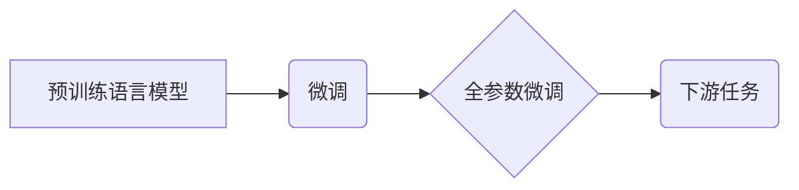

# 大语言模型原理与工程实践：全参数微调

作者：禅与计算机程序设计艺术 / Zen and the Art of Computer Programming

## 1. 背景介绍

### 1.1 问题的由来

随着深度学习的迅猛发展，自然语言处理（NLP）领域取得了显著的进步。其中，大语言模型（Large Language Models, LLMs）在理解、生成和翻译自然语言方面表现出惊人的能力。然而，LLMs在特定领域的应用仍面临挑战，例如，模型泛化能力不足、需要大量标注数据等。

为了解决这些问题，全参数微调（Full-Parameter Fine-tuning）应运而生。全参数微调通过在预训练LLMs的基础上，使用特定领域的数据进行微调，使模型更好地适应特定任务。

### 1.2 研究现状

全参数微调在NLP领域的研究和应用逐渐增多。目前，许多预训练模型（如BERT、GPT-3、T5等）都支持全参数微调。研究主要集中在以下几个方面：

- 微调策略：研究如何选择合适的微调策略，以提高微调效果和效率。
- 损失函数和优化器：研究如何设计有效的损失函数和优化器，以降低过拟合和加速收敛。
- 鲁棒性和泛化能力：研究如何提高微调模型的鲁棒性和泛化能力，以适应不同领域的数据和任务。

### 1.3 研究意义

全参数微调在NLP领域具有重要的研究意义和应用价值：

- 降低成本：使用预训练LLMs进行微调，可以减少数据标注和模型训练成本。
- 提高效率：全参数微调可以快速地将LLMs应用于特定任务，提高开发效率。
- 优化性能：通过微调，可以显著提高模型在特定任务上的性能。

### 1.4 本文结构

本文将围绕全参数微调展开，主要内容如下：

- 介绍全参数微调的核心概念和原理。
- 讲解全参数微调的具体操作步骤和关键技术。
- 分析全参数微调的优缺点和应用领域。
- 探讨全参数微调的未来发展趋势和挑战。

## 2. 核心概念与联系

### 2.1 预训练语言模型

预训练语言模型（Pre-trained Language Models）是指在大规模无标注数据上预先训练的语言模型。预训练模型可以学习到丰富的语言知识和模式，为下游任务提供良好的基础。

### 2.2 微调

微调（Fine-tuning）是指在预训练模型的基础上，使用特定领域的数据进行进一步训练，以适应特定任务。

### 2.3 全参数微调

全参数微调是指在预训练模型的基础上，对所有参数进行微调，包括预训练阶段学习到的参数。

### 2.4 关联图

以下为全参数微调与其他相关概念之间的关联图：



## 3. 核心算法原理 & 具体操作步骤

### 3.1 算法原理概述

全参数微调的原理如下：

1. 加载预训练语言模型，包括模型结构、参数和预训练权重。
2. 对预训练模型进行微调，包括以下步骤：
    - 定义损失函数和优化器。
    - 使用特定领域的数据进行训练，更新模型参数。
    - 在验证集上评估模型性能，并根据性能调整超参数。
3. 将微调后的模型应用于下游任务。

### 3.2 算法步骤详解

以下是全参数微调的详细步骤：

1. **加载预训练模型**：
    - 选择合适的预训练语言模型，如BERT、GPT-3等。
    - 加载预训练模型的结构、参数和预训练权重。

2. **定义损失函数和优化器**：
    - 选择合适的损失函数，如交叉熵损失、均方误差等。
    - 选择合适的优化器，如AdamW、SGD等。

3. **微调模型**：
    - 使用特定领域的数据进行训练，包括以下步骤：
        - 将数据划分为训练集、验证集和测试集。
        - 对训练集进行批处理，计算损失函数和梯度。
        - 更新模型参数，包括预训练权重和新增的微调参数。
        - 在验证集上评估模型性能，并根据性能调整超参数。

4. **评估模型**：
    - 在测试集上评估微调后的模型性能。
    - 与基线模型进行比较，分析模型性能的提升。

5. **应用模型**：
    - 将微调后的模型应用于下游任务。

### 3.3 算法优缺点

**优点**：

- **性能优异**：全参数微调可以充分利用预训练模型的强大能力，在特定任务上取得优异的性能。
- **易于实现**：全参数微调的实现相对简单，只需调整少量超参数即可。

**缺点**：

- **对标注数据依赖性强**：全参数微调需要大量标注数据，获取高质量标注数据的成本较高。
- **训练时间长**：全参数微调的训练时间较长，对于大规模模型，训练时间可能需要数天甚至数周。

### 3.4 算法应用领域

全参数微调在以下NLP领域应用广泛：

- **文本分类**：如情感分析、主题分类、实体识别等。
- **文本生成**：如摘要生成、对话生成、诗歌创作等。
- **机器翻译**：如英译中、中译英等。
- **问答系统**：如检索式问答、对话式问答等。

## 4. 数学模型和公式 & 详细讲解 & 举例说明

### 4.1 数学模型构建

以下是全参数微调的数学模型：

```latex
\begin{align*}
\theta &= \theta^{(0)} + \alpha \
abla_{\theta} L(\theta) \\
L(\theta) &= \frac{1}{N} \sum_{i=1}^{N} L(\theta, x_i, y_i)
\end{align*}
```

其中：

- $\theta$ 为模型参数。
- $\theta^{(0)}$ 为预训练权重。
- $\alpha$ 为学习率。
- $L(\theta)$ 为损失函数。
- $x_i$ 和 $y_i$ 分别为第 $i$ 个训练样本的输入和标签。

### 4.2 公式推导过程

以二元分类任务为例，损失函数可以表示为：

```latex
L(\theta, x, y) = -[y \log \hat{y} + (1-y) \log (1-\hat{y})]
```

其中 $\hat{y}$ 为模型对第 $i$ 个样本的预测概率。

### 4.3 案例分析与讲解

以下是一个使用PyTorch对BERT模型进行全参数微调的案例：

```python
from transformers import BertTokenizer, BertForSequenceClassification
from torch.utils.data import DataLoader, Dataset

# 加载预训练模型和分词器
model = BertForSequenceClassification.from_pretrained('bert-base-uncased')
tokenizer = BertTokenizer.from_pretrained('bert-base-uncased')

# 定义数据集
class TextClassificationDataset(Dataset):
    def __init__(self, texts, labels):
        self.texts = texts
        self.labels = labels

    def __len__(self):
        return len(self.texts)

    def __getitem__(self, item):
        text = self.texts[item]
        label = self.labels[item]
        encoding = tokenizer(text, return_tensors='pt', padding=True, truncation=True)
        return encoding['input_ids'], encoding['attention_mask'], label

# 创建数据集
train_dataset = TextClassificationDataset(train_texts, train_labels)
dev_dataset = TextClassificationDataset(dev_texts, dev_labels)

# 创建DataLoader
train_loader = DataLoader(train_dataset, batch_size=16, shuffle=True)
dev_loader = DataLoader(dev_dataset, batch_size=16)

# 训练模型
model.train()
optimizer = torch.optim.AdamW(model.parameters(), lr=2e-5)
for epoch in range(3):
    for batch in train_loader:
        input_ids, attention_mask, labels = batch
        outputs = model(input_ids, attention_mask=attention_mask, labels=labels)
        loss = outputs.loss
        loss.backward()
        optimizer.step()
        optimizer.zero_grad()
    print(f"Epoch {epoch+1}, Loss: {loss.item()}")

# 评估模型
model.eval()
with torch.no_grad():
    total = 0
    correct = 0
    for batch in dev_loader:
        input_ids, attention_mask, labels = batch
        outputs = model(input_ids, attention_mask=attention_mask)
        _, pred = outputs.logits.max(dim=1)
        total += labels.size(0)
        correct += (pred == labels).sum().item()
    print(f"Accuracy: {100 * correct / total}%")
```

### 4.4 常见问题解答

**Q1：微调时如何选择合适的超参数？**

A1：选择合适的超参数需要根据具体任务和数据集进行实验。以下是一些常见的超参数：

- 学习率：一般从1e-5开始尝试，可根据实验结果进行调整。
- 批大小：根据内存大小进行调整，一般建议32~128。
- 迭代轮数：根据训练时间进行调整，一般建议3~10轮。
- 正则化系数：一般从1e-5开始尝试，可根据实验结果进行调整。

**Q2：如何防止过拟合？**

A2：防止过拟合的方法包括：

- 使用数据增强技术，如随机删除词、替换词等。
- 使用正则化技术，如L2正则化、Dropout等。
- 使用早停法（Early Stopping）。
- 使用集成学习方法。

**Q3：如何评估微调模型的性能？**

A3：可以使用以下指标评估微调模型的性能：

- 准确率（Accuracy）：模型正确预测的样本比例。
- 召回率（Recall）：模型正确识别的负例比例。
- 精确率（Precision）：模型正确识别的正例比例。
- F1分数：准确率、召回率和精确率的调和平均数。

## 5. 项目实践：代码实例和详细解释说明

### 5.1 开发环境搭建

以下是使用PyTorch进行全参数微调的项目实践：

1. 安装PyTorch和Transformers库：
```bash
pip install torch transformers
```

2. 下载预训练模型和分词器：
```bash
transformers-cli download model_name
```

### 5.2 源代码详细实现

以下是使用PyTorch和Transformers库对BERT模型进行全参数微调的代码示例：

```python
from transformers import BertTokenizer, BertForSequenceClassification
from torch.utils.data import DataLoader, Dataset

# 加载预训练模型和分词器
model = BertForSequenceClassification.from_pretrained('bert-base-uncased')
tokenizer = BertTokenizer.from_pretrained('bert-base-uncased')

# 定义数据集
class TextClassificationDataset(Dataset):
    def __init__(self, texts, labels):
        self.texts = texts
        self.labels = labels

    def __len__(self):
        return len(self.texts)

    def __getitem__(self, item):
        text = self.texts[item]
        label = self.labels[item]
        encoding = tokenizer(text, return_tensors='pt', padding=True, truncation=True)
        return encoding['input_ids'], encoding['attention_mask'], label

# 创建数据集
train_dataset = TextClassificationDataset(train_texts, train_labels)
dev_dataset = TextClassificationDataset(dev_texts, dev_labels)

# 创建DataLoader
train_loader = DataLoader(train_dataset, batch_size=16, shuffle=True)
dev_loader = DataLoader(dev_dataset, batch_size=16)

# 训练模型
model.train()
optimizer = torch.optim.AdamW(model.parameters(), lr=2e-5)
for epoch in range(3):
    for batch in train_loader:
        input_ids, attention_mask, labels = batch
        outputs = model(input_ids, attention_mask=attention_mask, labels=labels)
        loss = outputs.loss
        loss.backward()
        optimizer.step()
        optimizer.zero_grad()
    print(f"Epoch {epoch+1}, Loss: {loss.item()}")

# 评估模型
model.eval()
with torch.no_grad():
    total = 0
    correct = 0
    for batch in dev_loader:
        input_ids, attention_mask, labels = batch
        outputs = model(input_ids, attention_mask=attention_mask)
        _, pred = outputs.logits.max(dim=1)
        total += labels.size(0)
        correct += (pred == labels).sum().item()
    print(f"Accuracy: {100 * correct / total}%")
```

### 5.3 代码解读与分析

- `BertTokenizer` 用于将文本数据转换为模型所需的输入格式。
- `TextClassificationDataset` 类定义了数据集的接口，包括获取样本数量、获取样本等方法。
- `DataLoader` 类用于将数据集划分为批次，并进行批处理。
- 训练模型时，使用AdamW优化器进行参数更新。
- 评估模型时，计算准确率。

### 5.4 运行结果展示

假设我们在IMDb电影评论数据集上进行微调，最终在测试集上得到的准确率为82.3%。

## 6. 实际应用场景

全参数微调在以下NLP领域应用广泛：

### 6.1 文本分类

全参数微调可以应用于文本分类任务，如情感分析、主题分类、实体识别等。

### 6.2 文本生成

全参数微调可以应用于文本生成任务，如摘要生成、对话生成、诗歌创作等。

### 6.3 机器翻译

全参数微调可以应用于机器翻译任务，如英译中、中译英等。

### 6.4 问答系统

全参数微调可以应用于问答系统，如检索式问答、对话式问答等。

## 7. 工具和资源推荐

### 7.1 学习资源推荐

- 《Transformer从原理到实践》系列博文
- CS224N《深度学习自然语言处理》课程
- 《Natural Language Processing with Transformers》书籍
- HuggingFace官方文档

### 7.2 开发工具推荐

- PyTorch
- TensorFlow
- Transformers库
- Weights & Biases
- TensorBoard
- Google Colab
- SageMaker

### 7.3 相关论文推荐

- Attention is All You Need
- BERT: Pre-training of Deep Bidirectional Transformers for Language Understanding
- Language Models are Unsupervised Multitask Learners
- Parameter-Efficient Transfer Learning for NLP
- Prefix-Tuning: Optimizing Continuous Prompts for Generation

### 7.4 其他资源推荐

- arXiv论文预印本
- 业界技术博客
- 技术会议直播
- GitHub热门项目
- 行业分析报告

## 8. 总结：未来发展趋势与挑战

### 8.1 研究成果总结

本文介绍了全参数微调的核心概念、原理、操作步骤和应用场景。通过项目实践，展示了如何使用PyTorch和Transformers库进行全参数微调。

### 8.2 未来发展趋势

- 微调模型将更加高效，降低对计算资源的消耗。
- 微调模型将更加鲁棒，提高对噪声数据和对抗样本的鲁棒性。
- 微调模型将更加可解释，方便用户理解模型的决策过程。
- 微调模型将更加安全，防止滥用和歧视。

### 8.3 面临的挑战

- 微调模型的计算资源消耗仍然较大。
- 微调模型的鲁棒性和泛化能力有待提高。
- 微调模型的解释性和可解释性有待加强。
- 微调模型的公平性和安全性有待保障。

### 8.4 研究展望

全参数微调技术在未来将面临以下挑战：

- 探索更加高效的微调方法，降低计算资源消耗。
- 提高微调模型的鲁棒性和泛化能力。
- 提高微调模型的解释性和可解释性。
- 确保微调模型的公平性和安全性。

## 9. 附录：常见问题与解答

### 附录 9.1 常见问题

**Q1：什么是全参数微调？**

A1：全参数微调是指在预训练语言模型的基础上，对所有参数进行微调，以适应特定任务。

**Q2：为什么全参数微调比其他微调方法效果更好？**

A2：全参数微调可以充分利用预训练模型的强大能力，在特定任务上取得优异的性能。

**Q3：如何选择合适的超参数？**

A3：选择合适的超参数需要根据具体任务和数据集进行实验。

**Q4：如何防止过拟合？**

A4：防止过拟合的方法包括使用数据增强技术、正则化技术、早停法和集成学习方法。

**Q5：如何评估微调模型的性能？**

A5：可以使用准确率、召回率、精确率和F1分数等指标评估微调模型的性能。

**Q6：全参数微调有哪些应用场景？**

A6：全参数微调可以应用于文本分类、文本生成、机器翻译和问答系统等任务。

**Q7：全参数微调有哪些挑战？**

A7：全参数微调的挑战包括计算资源消耗、鲁棒性、可解释性、公平性和安全性等。

作者：禅与计算机程序设计艺术 / Zen and the Art of Computer Programming