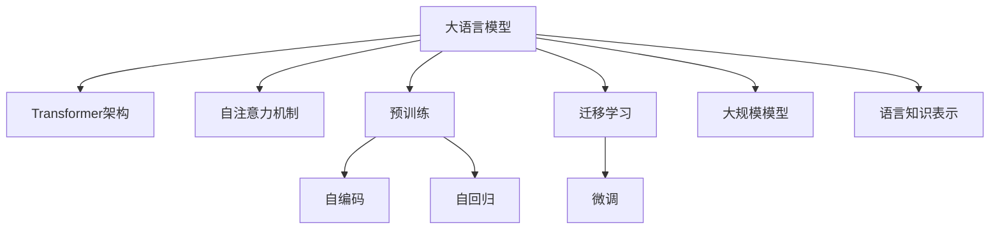

# 大语言模型原理与工程实践：大语言模型的关键技术

## 1. 背景介绍

### 1.1 问题的由来

随着人工智能技术的快速发展,大型语言模型(Large Language Models, LLMs)已成为自然语言处理领域的关键突破。LLMs通过在海量文本数据上进行预训练,学习语言的内在规律和知识,从而具备出色的自然语言理解和生成能力。近年来,GPT、BERT、XLNet、T5等大语言模型相继问世,在机器翻译、文本摘要、问答系统等众多任务中展现出卓越的性能。

然而,训练高质量的大语言模型面临着诸多挑战。首先,海量文本数据的获取和预处理是一个巨大的工程挑战。其次,大语言模型的训练计算量极其庞大,需要强大的硬件资源支持。再者,模型的优化和调试过程复杂,需要大量的经验和技巧。最后,大语言模型存在一定的安全隐患,如生成有害内容、隐私泄露等,需要采取相应的缓解措施。

### 1.2 研究现状

目前,主流的大语言模型主要采用Transformer架构,通过自注意力机制来建模长距离依赖关系。这些模型在下游任务上表现出色,但也存在一些不足,如缺乏对因果关系的建模能力、生成内容的一致性不足等。为了解决这些问题,研究人员提出了各种改进方法,如引入外部知识、增强因果推理能力、优化生成策略等。

此外,大语言模型的训练和部署也是一个热门研究方向。研究人员探索了分布式训练、模型压缩、硬件加速等技术,以提高训练效率和降低计算资源需求。同时,也在研究如何保护大语言模型的隐私和安全性,防止生成有害内容。

### 1.3 研究意义

大语言模型是当前自然语言处理领域的核心技术,对于推动人工智能的发展具有重要意义。研究大语言模型的原理和工程实践,可以帮助我们更好地理解和利用这一强大的技术,推动自然语言处理技术的进步。同时,解决大语言模型面临的挑战,也将促进人工智能技术在更多领域的应用。

### 1.4 本文结构

本文将全面介绍大语言模型的关键技术,包括模型架构、预训练方法、优化技巧、应用场景等。文章将首先阐述大语言模型的核心概念和原理,然后详细讲解核心算法的原理和实现步骤,包括数学模型和公式的推导。接下来,文章将介绍一个具体的项目实践案例,包括代码实现和运行结果分析。最后,文章将探讨大语言模型的实际应用场景、未来发展趋势和面临的挑战。

## 2. 核心概念与联系

大语言模型(LLMs)是一种基于深度学习的自然语言处理模型,旨在从大量文本数据中学习语言的内在规律和知识表示。LLMs通常采用Transformer架构,利用自注意力机制来建模长距离依赖关系,从而实现出色的语言理解和生成能力。

LLMs的核心思想是通过在海量文本数据上进行无监督预训练,学习一个通用的语言表示,然后将这个预训练模型迁移到下游任务上进行微调,从而获得良好的性能。预训练过程通常采用自编码或自回归的方式,例如BERT采用掩码语言模型(Masked Language Modeling)和下一句预测(Next Sentence Prediction)任务,而GPT则采用标准的语言模型(Language Modeling)任务。

预训练过程中,LLMs会学习到丰富的语言知识,包括词汇、语法、语义、世界知识等,这些知识被编码到模型的参数中。在下游任务中,只需要对预训练模型进行少量的微调,就可以将这些知识迁移到特定任务上,从而获得良好的性能。

LLMs的另一个关键特征是模型的大规模。通常情况下,模型的参数量越大,所能学习到的知识就越丰富,性能也会越好。因此,LLMs往往拥有数十亿甚至上百亿个参数,需要大量的计算资源来进行训练。

总的来说,大语言模型通过在海量文本数据上进行无监督预训练,学习到丰富的语言知识,并将这些知识迁移到下游任务上,从而实现出色的自然语言处理能力。模型的大规模和Transformer架构是实现这一目标的关键技术。

## 3. 核心算法原理 & 具体操作步骤

### 3.1 算法原理概述

大语言模型的核心算法是基于Transformer架构的自注意力机制。Transformer是一种全新的序列到序列(Sequence-to-Sequence)模型架构,它完全依赖于注意力机制来捕获输入和输出序列之间的长距离依赖关系,从而避免了传统序列模型中的递归计算和卷积操作。

自注意力机制是Transformer架构的核心部分,它允许模型在计算目标位置的表示时,直接关注整个输入序列中的所有位置,并根据它们与目标位置的相关性动态地分配注意力权重。这种机制使模型能够有效地捕获长距离依赖关系,从而更好地理解和生成自然语言。

在预训练过程中,大语言模型通常采用自编码或自回归的方式来学习语言的内在规律。自编码方式(如BERT)通过掩码语言模型和下一句预测任务,学习理解和预测被掩码的词以及句子之间的关系。自回归方式(如GPT)则直接在给定的上文基础上预测下一个词或句子,从而学习生成自然语言的能力。

无论采用何种预训练方式,大语言模型都需要在海量文本数据上进行训练,以学习到丰富的语言知识。这个过程通常需要大量的计算资源,并且需要采用一些优化技巧,如梯度裁剪、层次化软更新等,来提高训练效率和模型性能。

### 3.2 算法步骤详解

1. **输入表示**

   首先,将输入文本序列转换为模型可以理解的向量表示。通常采用词嵌入(Word Embedding)或子词嵌入(Subword Embedding)的方式,将每个词或子词映射到一个固定长度的向量空间中。

2. **位置编码**

   由于自注意力机制没有捕获序列顺序的能力,因此需要为每个位置添加一个位置编码(Position Encoding),以显式地编码位置信息。位置编码可以通过正弦和余弦函数计算得到。

3. **多头自注意力**

   多头自注意力机制是Transformer架构的核心部分。它将输入序列分成多个头(Head),每个头都独立地计算注意力权重,然后将所有头的结果拼接起来,形成最终的注意力表示。

   对于每个头,自注意力机制的计算过程如下:

   a) 计算查询(Query)、键(Key)和值(Value)向量:
      $$Q = XW_Q, K = XW_K, V = XW_V$$
      其中$X$是输入序列的表示,而$W_Q$、$W_K$和$W_V$是可学习的权重矩阵。

   b) 计算注意力权重:
      $$\text{Attention}(Q, K, V) = \text{softmax}(\frac{QK^T}{\sqrt{d_k}})V$$
      其中$d_k$是缩放因子,用于防止内积过大导致梯度消失。

   c) 多头注意力机制通过将多个注意力头的结果拼接在一起,从而捕获不同的注意力模式:
      $$\text{MultiHead}(Q, K, V) = \text{Concat}(head_1, \dots, head_h)W^O$$
      其中$head_i = \text{Attention}(QW_i^Q, KW_i^K, VW_i^V)$,而$W_i^Q$、$W_i^K$、$W_i^V$和$W^O$都是可学习的权重矩阵。

4. **前馈网络**

   在每个编码器或解码器层之后,会有一个前馈全连接网络,它对每个位置的表示进行独立的非线性变换,以引入更多的非线性特征。前馈网络的计算过程如下:
   $$\text{FFN}(x) = \max(0, xW_1 + b_1)W_2 + b_2$$
   其中$W_1$、$W_2$、$b_1$和$b_2$都是可学习的参数。

5. **层归一化和残差连接**

   为了提高训练的稳定性和收敛速度,Transformer架构采用了层归一化(Layer Normalization)和残差连接(Residual Connection)。层归一化对每个位置的表示进行归一化,而残差连接则将输入和输出相加,以保留原始信息。

6. **掩码机制**

   在自编码预训练(如BERT)中,需要采用掩码机制来预测被掩码的词。具体来说,会随机选择一些词,并将它们替换为特殊的[MASK]标记,然后让模型预测这些被掩码词的原始值。

   在自回归预训练(如GPT)中,则需要采用因果掩码(Causal Mask),即在预测某个位置的词时,只能关注该位置之前的上文,而不能看到未来的信息。

7. **预训练目标**

   预训练过程的目标是最小化掩码语言模型和下一句预测(自编码)或语言模型(自回归)的损失函数。通过梯度下降等优化算法,不断调整模型参数,使得模型能够更好地理解和生成自然语言。

8. **微调和生成**

   在完成预训练后,可以将大语言模型迁移到下游任务上进行微调。微调过程通常只需要对模型的部分层进行训练,并在特定任务的数据上进行监督学习。

   对于生成任务,如机器翻译、文本摘要等,可以将输入序列输入到编码器中获得上下文表示,然后将其输入到解码器中,通过自回归的方式生成目标序列。

   对于理解任务,如文本分类、阅读理解等,可以将输入序列输入到编码器中获得上下文表示,然后将其输入到特定的输出层(如分类器或span预测器)中,得到任务的最终输出。

### 3.3 算法优缺点

**优点:**

1. **强大的语言理解和生成能力**

   通过在海量文本数据上进行预训练,大语言模型能够学习到丰富的语言知识,从而具备出色的自然语言理解和生成能力,在众多下游任务中表现出色。

2. **长距离依赖建模**

   基于自注意力机制的Transformer架构,能够有效地捕获输入序列中的长距离依赖关系,从而更好地理解和生成自然语言。

3. **可迁移性强**

   预训练模型可以通过微调的方式迁移到各种下游任务上,从而避免了从头开始训练的巨大计算开销。

4. **并行计算友好**

   Transformer架构中没有递归计算,因此更加适合在GPU等并行硬件上进行加速计算。

**缺点:**

1. **计算资源需求巨大**

   训练大规模的语言模型需要海量的文本数据和巨大的计算资源,对硬件设备和能源消耗都提出了很高的要求。

2. **缺乏对因果关系的建模**

   虽然自注意力机制能够捕获长距离依赖关系,但它无法很好地建模因果关系,这可能会导致生成内容的不一致性。

3. **生成内容的可控性差**

   大语言模型生成的内容通常难以精确控制,可能会产生不合理或有害的内容。

4. **存在隐私和安全隐患**

   大语言模型在训练和应用过程中,可能会泄露隐私信息或被用于生成有害内容,需要采取相应的