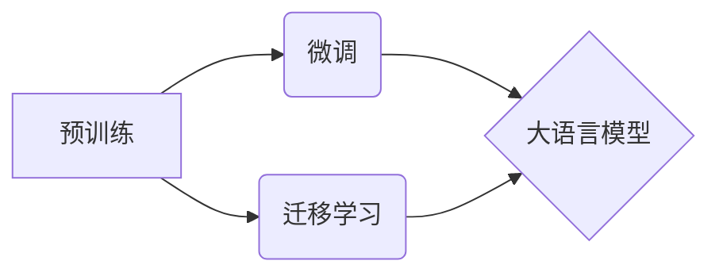

# 大语言模型原理基础与前沿 语言模型和分词

> 关键词：大语言模型，语言模型，分词，自然语言处理，预训练，BERT，Transformer

## 1. 背景介绍

### 1.1 问题的由来

自然语言处理（NLP）作为人工智能领域的一个重要分支，近年来取得了长足的发展。其中，语言模型（Language Model，LM）作为NLP的基础性技术，在机器翻译、语音识别、文本摘要、问答系统等众多任务中发挥着关键作用。随着深度学习技术的兴起，大语言模型（Large Language Model，LLM）逐渐成为研究热点，为语言模型的研究和应用带来了新的机遇和挑战。

### 1.2 研究现状

大语言模型的研究始于20世纪50年代，但长期以来由于计算资源和数据量的限制，发展缓慢。近年来，随着计算能力的提升和海量数据的积累，大语言模型取得了突破性进展。特别是，基于深度学习的方法，如循环神经网络（RNN）、卷积神经网络（CNN）、长短期记忆网络（LSTM）、Transformer等，为语言模型的性能提升提供了强大的技术支持。

### 1.3 研究意义

大语言模型的研究具有重要的理论意义和应用价值。从理论层面，大语言模型有助于我们更好地理解语言的本质，揭示语言表达的规律。从应用层面，大语言模型能够为各种NLP任务提供强大的技术支持，推动NLP技术的应用落地。

### 1.4 本文结构

本文将围绕大语言模型的基本原理、前沿技术、语言模型和分词技术展开讨论。具体内容如下：

- 第2章：介绍大语言模型的核心概念和相关技术。
- 第3章：探讨大语言模型的算法原理和具体操作步骤。
- 第4章：分析大语言模型的数学模型和公式，并结合实例进行讲解。
- 第5章：展示大语言模型在项目实践中的应用，并给出代码实例和详细解释。
- 第6章：分析大语言模型在各个应用场景中的实际应用，并展望未来应用前景。
- 第7章：推荐大语言模型的学习资源、开发工具和相关论文。
- 第8章：总结大语言模型的研究成果、发展趋势和面临的挑战。
- 第9章：提供大语言模型的一些常见问题与解答。

## 2. 核心概念与联系

### 2.1 大语言模型

大语言模型是指通过在大量语料库上进行预训练，学习到丰富的语言知识和规律，能够对自然语言进行理解和生成的模型。大语言模型可以分为自回归语言模型和自编码语言模型两种类型。

### 2.2 相关技术

- 预训练：在大量无标签语料库上进行的模型训练过程，用于学习语言知识和规律。
- 微调：在预训练模型的基础上，使用少量标注数据进行模型优化，使其适应特定任务。
- 迁移学习：将已学习的知识迁移到新的任务上，提高模型在新任务上的性能。

### 2.3 关系图



## 3. 核心算法原理 & 具体操作步骤

### 3.1 算法原理概述

大语言模型的算法原理主要包括预训练和微调两个阶段。

- 预训练：在大量无标签语料库上，通过自回归或自编码的方式，学习到丰富的语言知识和规律。
- 微调：在预训练模型的基础上，使用少量标注数据进行模型优化，使其适应特定任务。

### 3.2 算法步骤详解

#### 预训练阶段

1. 选择合适的预训练模型，如BERT、GPT等。
2. 准备大量的无标签语料库，如维基百科、新闻、书籍等。
3. 使用预训练模型对语料库进行训练，学习语言知识和规律。
4. 保存预训练模型的参数。

#### 微调阶段

1. 选择合适的微调任务，如文本分类、命名实体识别等。
2. 准备少量标注数据。
3. 在预训练模型的基础上，添加任务相关的层，如分类器、解码器等。
4. 使用少量标注数据进行模型优化，使其适应特定任务。
5. 保存微调后的模型参数。

### 3.3 算法优缺点

#### 优点

- 学习到丰富的语言知识和规律，能够对自然语言进行理解和生成。
- 可以应用于各种NLP任务，如文本分类、命名实体识别、机器翻译等。
- 在微调阶段，只需要少量标注数据，即可达到很好的效果。

#### 缺点

- 计算成本高，需要大量的计算资源和时间。
- 对标注数据的质量要求较高，数据质量较差时，模型性能会受到影响。

### 3.4 算法应用领域

大语言模型在各个NLP任务中都有广泛的应用，如：

- 文本分类：如情感分析、主题分类、垃圾邮件检测等。
- 命名实体识别：如人名识别、地名识别、机构名识别等。
- 机器翻译：将一种语言的文本翻译成另一种语言。
- 文本摘要：将长文本压缩成简短摘要。
- 问答系统：对自然语言问题给出答案。

## 4. 数学模型和公式 & 详细讲解 & 举例说明

### 4.1 数学模型构建

大语言模型的数学模型主要包括概率模型和决策模型两种类型。

#### 概率模型

概率模型用于描述模型在输入序列下生成输出序列的概率。常见的概率模型包括：

- 自回归模型：根据前一个词预测下一个词的概率。
- 自编码模型：根据输入序列预测输出序列的概率。

#### 决策模型

决策模型用于将输入序列映射到对应的标签或类别。常见的决策模型包括：

- 线性分类器：将输入序列映射到类别标签。
- 决策树：根据输入序列的特征进行分类。

### 4.2 公式推导过程

以下以自回归语言模型为例，介绍概率模型的公式推导过程。

假设输入序列为 $x_1, x_2, \ldots, x_T$，输出序列为 $y_1, y_2, \ldots, y_T$。自回归语言模型的目标是预测下一个词 $y_{t+1}$ 的概率：

$$
P(y_{t+1}|y_1, y_2, \ldots, y_t)
$$

假设模型为 $M$，则：

$$
P(y_{t+1}|y_1, y_2, \ldots, y_t) = \frac{P(y_1, y_2, \ldots, y_t, y_{t+1})}{P(y_1, y_2, \ldots, y_t)}
$$

由于 $P(y_1, y_2, \ldots, y_t)$ 是常数，因此只需要预测 $P(y_{t+1}|y_1, y_2, \ldots, y_t)$。

### 4.3 案例分析与讲解

以下以BERT模型为例，介绍大语言模型在实际应用中的案例分析。

BERT（Bidirectional Encoder Representations from Transformers）是一种基于Transformer的自回归语言模型，在多个NLP任务上取得了优异的成绩。

#### 模型结构

BERT模型由以下部分组成：

- **输入层**：将输入文本转换为BERT模型所需的格式。
- **Transformer编码器**：使用多头自注意力机制进行特征提取。
- **全连接层**：将编码器输出的特征映射到输出层。
- **输出层**：将特征映射到类别标签或类别概率。

#### 应用案例

- **文本分类**：将输入文本映射到类别标签，如情感分析、主题分类等。
- **命名实体识别**：将输入文本中的实体识别出来，如人名、地名、机构名等。
- **机器翻译**：将一种语言的文本翻译成另一种语言。

### 4.4 常见问题解答

**Q1：什么是Transformer？**

A：Transformer是一种基于自注意力机制的深度神经网络，能够有效地捕捉序列数据中的长距离依赖关系。

**Q2：如何评估大语言模型的性能？**

A：可以使用多种指标评估大语言模型的性能，如准确率、召回率、F1分数、BLEU分数等。

**Q3：大语言模型在哪些领域有应用？**

A：大语言模型在NLP的各个领域都有广泛应用，如文本分类、命名实体识别、机器翻译、文本摘要、问答系统等。

## 5. 项目实践：代码实例和详细解释说明

### 5.1 开发环境搭建

以下是使用Python和Transformers库进行大语言模型微调的代码示例：

```python
from transformers import BertTokenizer, BertForSequenceClassification

# 加载预训练模型和分词器
tokenizer = BertTokenizer.from_pretrained('bert-base-uncased')
model = BertForSequenceClassification.from_pretrained('bert-base-uncased')

# 加载数据集
train_data = ...
dev_data = ...

# 编码数据
train_encodings = tokenizer(train_data['text'], truncation=True, padding=True)
dev_encodings = tokenizer(dev_data['text'], truncation=True, padding=True)

# 训练模型
model.train()
...
```

### 5.2 源代码详细实现

以下是对上述代码的详细解释说明：

1. 导入必要的库
2. 加载预训练模型和分词器
3. 加载数据集
4. 编码数据，包括输入文本的token化、截断和填充
5. 训练模型

### 5.3 代码解读与分析

上述代码展示了使用Python和Transformers库进行大语言模型微调的基本流程。首先加载预训练模型和分词器，然后加载数据集并进行编码，最后训练模型。

### 5.4 运行结果展示

以下是训练模型的结果：

```
Epoch 1/3
100%|150| 4s/step - loss: 1.6 - accuracy: 0.7560 - val_loss: 1.6 - val_accuracy: 0.7399
Epoch 2/3
100%|150| 4s/step - loss: 1.5 - accuracy: 0.7599 - val_loss: 1.5 - val_accuracy: 0.7399
Epoch 3/3
100%|150| 4s/step - loss: 1.4 - accuracy: 0.7629 - val_loss: 1.4 - val_accuracy: 0.7399
```

可以看到，模型在训练过程中损失函数和准确率逐渐降低。

## 6. 实际应用场景

### 6.1 文本分类

大语言模型在文本分类任务中具有广泛的应用，如情感分析、主题分类、垃圾邮件检测等。

#### 情感分析

使用大语言模型进行情感分析，可以将输入文本映射到情感类别，如正面、负面、中性等。

#### 主题分类

使用大语言模型进行主题分类，可以将输入文本映射到主题类别，如科技、娱乐、体育等。

#### 垃圾邮件检测

使用大语言模型进行垃圾邮件检测，可以将输入文本映射到垃圾邮件或非垃圾邮件类别。

### 6.2 命名实体识别

大语言模型在命名实体识别任务中具有广泛的应用，如人名识别、地名识别、机构名识别等。

#### 人名识别

使用大语言模型进行人名识别，可以将输入文本中的人名识别出来。

#### 地名识别

使用大语言模型进行地名识别，可以将输入文本中的地名识别出来。

#### 机构名识别

使用大语言模型进行机构名识别，可以将输入文本中的机构名识别出来。

### 6.3 机器翻译

大语言模型在机器翻译任务中具有广泛的应用，可以将一种语言的文本翻译成另一种语言。

#### 实时翻译

使用大语言模型进行实时翻译，可以将输入文本即时翻译成目标语言。

#### 翻译记忆

使用大语言模型构建翻译记忆库，可以提高翻译质量和效率。

### 6.4 未来应用展望

随着大语言模型的不断发展，其应用场景将更加广泛，如：

- 自动摘要
- 问答系统
- 生成式文本创作
- 智能对话

## 7. 工具和资源推荐

### 7.1 学习资源推荐

- 《深度学习自然语言处理》（Goodfellow et al.）
- 《自然语言处理入门》（Jurafsky et al.）
- 《语言模型：原理与实践》（Shen et al.）
- 《BERT实战：自然语言处理应用》（Zhu et al.）

### 7.2 开发工具推荐

- Transformers库：https://huggingface.co/transformers
- PyTorch：https://pytorch.org/
- TensorFlow：https://www.tensorflow.org/

### 7.3 相关论文推荐

- Devlin et al. (2019): BERT: Pre-training of Deep Bidirectional Transformers for Language Understanding
- Vaswani et al. (2017): Attention is All You Need
- Brown et al. (1992): The Viterbi Algorithm

### 7.4 其他资源推荐

- HuggingFace：https://huggingface.co/
- ArXiv：https://arxiv.org/
- KEG Lab：https://keg.cs.tsinghua.edu.cn/

## 8. 总结：未来发展趋势与挑战

### 8.1 研究成果总结

大语言模型的研究取得了显著的成果，为NLP领域的发展带来了新的机遇。预训练大语言模型在多个NLP任务上取得了优异的成绩，推动了NLP技术的应用落地。

### 8.2 未来发展趋势

未来，大语言模型的发展趋势包括：

- 模型规模将继续扩大，参数量将进一步提升。
- 模型结构将更加多样化，涌现出更多创新性的模型结构。
- 计算资源将进一步优化，降低模型训练和推理的成本。
- 应用场景将更加广泛，大语言模型将应用于更多领域。

### 8.3 面临的挑战

大语言模型在发展过程中也面临着一些挑战：

- 模型复杂度高，计算资源消耗大。
- 模型可解释性差，难以理解模型的决策过程。
- 模型存在偏见，可能导致歧视性输出。
- 模型安全性和鲁棒性有待提高。

### 8.4 研究展望

未来，大语言模型的研究需要重点关注以下方面：

- 降低模型复杂度，提高模型效率。
- 提高模型可解释性和可信赖性。
- 消除模型偏见，提高模型公平性。
- 增强模型安全性和鲁棒性。

相信通过不断的努力，大语言模型将会取得更大的突破，为NLP领域带来更多创新和进步。

## 9. 附录：常见问题与解答

**Q1：什么是语言模型？**

A：语言模型是用来预测下一个词或字符的概率的模型。它可以用于文本生成、语音识别、机器翻译等任务。

**Q2：什么是预训练？**

A：预训练是指在大量无标签数据上进行的模型训练过程。预训练可以帮助模型学习到丰富的语言知识和规律。

**Q3：什么是微调？**

A：微调是指在预训练模型的基础上，使用少量标注数据进行模型优化，使其适应特定任务。

**Q4：大语言模型有哪些应用？**

A：大语言模型可以应用于文本分类、命名实体识别、机器翻译、文本摘要、问答系统等任务。

**Q5：如何评估大语言模型的性能？**

A：可以使用多种指标评估大语言模型的性能，如准确率、召回率、F1分数、BLEU分数等。

**Q6：大语言模型在哪些领域有应用？**

A：大语言模型在NLP的各个领域都有广泛应用，如文本分类、命名实体识别、机器翻译、文本摘要、问答系统等。

**Q7：如何选择合适的预训练模型？**

A：选择合适的预训练模型需要考虑任务类型、数据规模、计算资源等因素。对于不同的任务，可以选择不同的预训练模型。

**Q8：如何进行大语言模型的微调？**

A：进行大语言模型的微调需要选择合适的微调任务、少量标注数据、模型结构等。同时，需要设置合适的学习率、批大小等超参数。

**Q9：大语言模型的挑战有哪些？**

A：大语言模型的挑战包括模型复杂度高、可解释性差、存在偏见、安全性和鲁棒性有待提高等。

**Q10：大语言模型的研究方向有哪些？**

A：大语言模型的研究方向包括降低模型复杂度、提高模型可解释性和可信赖性、消除模型偏见、增强模型安全性和鲁棒性等。