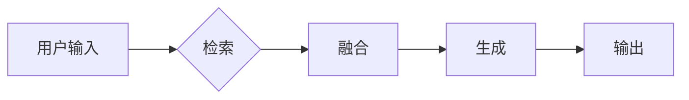

# 大语言模型应用指南：RAG框架微调概述

作者：禅与计算机程序设计艺术 / Zen and the Art of Computer Programming

## 1. 背景介绍
### 1.1 问题的由来

随着深度学习技术的飞速发展，大语言模型（Large Language Models，LLMs）在自然语言处理（Natural Language Processing，NLP）领域取得了突破性的进展。LLMs如BERT、GPT-3等，在语言理解、文本生成、机器翻译等任务上取得了令人瞩目的成果。然而，这些LLMs大多是基于自监督学习进行的预训练，在特定领域或任务上往往需要针对特定数据进行微调（Fine-Tuning）才能达到最佳效果。

RAG框架（Retrieval-Augmented Generation）作为一种结合了检索和生成的NLP框架，旨在解决LLMs在特定领域或任务上微调效果不佳的问题。RAG框架通过检索与生成的结合，使得LLMs能够更好地利用外部知识库，从而在特定领域或任务上获得更好的性能。

### 1.2 研究现状

近年来，RAG框架在NLP领域得到了广泛关注，并在多个任务上取得了显著的成果。以下是一些RAG框架在NLP领域的应用案例：

- **问答系统**：通过将知识库与LLMs结合，RAG框架能够提供更加准确、可靠的问答服务。
- **文本摘要**：RAG框架可以结合外部知识库和LLMs，生成更加精确、简洁的文本摘要。
- **机器翻译**：RAG框架可以结合外部知识库和LLMs，提高机器翻译的准确性和流畅性。
- **文本分类**：RAG框架可以结合外部知识库和LLMs，提高文本分类的准确性和泛化能力。

### 1.3 研究意义

RAG框架为LLMs在特定领域或任务上的微调提供了新的思路和方法，具有重要的研究意义：

- **提升模型性能**：RAG框架能够帮助LLMs更好地利用外部知识库，从而在特定领域或任务上获得更好的性能。
- **降低微调成本**：RAG框架可以减少对标注数据的依赖，降低微调成本。
- **拓展应用场景**：RAG框架可以拓展LLMs的应用场景，使其在更多领域发挥作用。

### 1.4 本文结构

本文将围绕RAG框架微调展开，主要内容包括：

- 核心概念与联系
- 核心算法原理与具体操作步骤
- 数学模型和公式
- 项目实践
- 实际应用场景
- 工具和资源推荐
- 总结与展望

## 2. 核心概念与联系
### 2.1 相关概念

- **大语言模型（LLMs）**：如BERT、GPT-3等，通过自监督学习进行预训练，具备强大的语言理解和生成能力。
- **知识库（Knowledge Base，KB）**：包含特定领域或任务的相关知识，如问答系统中的知识库通常包含问答对。
- **检索（Retrieval）**：根据用户输入查询外部知识库，获取相关信息。
- **生成（Generation）**：使用LLMs根据检索到的信息生成答案或文本。

### 2.2 RAG框架

RAG框架通过检索和生成的结合，将LLMs与知识库结合起来，实现以下功能：

- **检索**：根据用户输入查询知识库，获取相关信息。
- **融合**：将检索到的信息与LLMs生成的文本进行融合，形成最终的答案或文本。
- **生成**：使用LLMs根据融合后的信息生成最终的答案或文本。

RAG框架的逻辑流程如下：



## 3. 核心算法原理 & 具体操作步骤
### 3.1 算法原理概述

RAG框架的核心算法原理是将检索和生成两个模块进行结合。检索模块负责从知识库中检索与用户输入相关的信息，生成模块负责根据检索到的信息生成答案或文本。

### 3.2 算法步骤详解

1. **初始化**：加载预训练的LLMs和知识库。
2. **检索**：根据用户输入查询知识库，获取相关信息。
3. **融合**：将检索到的信息与LLMs生成的文本进行融合。
4. **生成**：使用LLMs根据融合后的信息生成最终的答案或文本。
5. **输出**：将生成的文本输出给用户。

### 3.3 算法优缺点

**优点**：

- **提升模型性能**：RAG框架能够帮助LLMs更好地利用外部知识库，从而在特定领域或任务上获得更好的性能。
- **降低微调成本**：RAG框架可以减少对标注数据的依赖，降低微调成本。
- **拓展应用场景**：RAG框架可以拓展LLMs的应用场景，使其在更多领域发挥作用。

**缺点**：

- **检索成本高**：检索模块需要消耗大量的计算资源，尤其是在知识库规模较大的情况下。
- **融合效果难以评估**：融合模块的效果难以进行量化评估，需要根据具体任务进行调整和优化。

### 3.4 算法应用领域

RAG框架在以下领域具有广泛的应用前景：

- **问答系统**
- **文本摘要**
- **机器翻译**
- **文本分类**
- **对话系统**

## 4. 数学模型和公式 & 详细讲解 & 举例说明
### 4.1 数学模型构建

RAG框架的数学模型主要包含以下部分：

- **检索模块**：使用TF-IDF、BM25等检索算法从知识库中检索相关信息。
- **融合模块**：使用注意力机制将检索到的信息与LLMs生成的文本进行融合。
- **生成模块**：使用LLMs根据融合后的信息生成最终的答案或文本。

### 4.2 公式推导过程

**检索模块**：

设知识库中包含 $N$ 个文档，文档 $i$ 的权重为 $w_i$，则检索模块的检索结果排序函数为：

$$
R(i) = \frac{w_i}{\sum_{j=1}^N w_j}
$$

**融合模块**：

设检索到的 $M$ 个文档分别为 $D_1, D_2, ..., D_M$，LLMs生成的文本为 $T$，则融合模块的融合函数为：

$$
F(T, D_i) = \alpha \cdot \text{score}(T, D_i) + (1-\alpha) \cdot T
$$

其中，$\alpha$ 为注意力权重，$\text{score}(T, D_i)$ 为文本 $T$ 与文档 $D_i$ 的相似度。

**生成模块**：

设融合后的文本为 $F(T, D_i)$，则生成模块的生成函数为：

$$
G(F(T, D_i)) = \text{LLMs}(F(T, D_i))
$$

### 4.3 案例分析与讲解

以下以问答系统为例，说明RAG框架在实际应用中的操作过程。

1. **初始化**：加载预训练的LLMs和问答系统知识库。
2. **检索**：根据用户输入“如何预防新型冠状病毒？”查询问答系统知识库，获取相关信息。
3. **融合**：将检索到的信息与LLMs生成的文本进行融合。
4. **生成**：使用LLMs根据融合后的信息生成最终的答案：“预防新型冠状病毒，首先要保持良好的个人卫生习惯，如勤洗手、戴口罩、保持社交距离等。”
5. **输出**：将生成的答案输出给用户。

### 4.4 常见问题解答

**Q1：RAG框架适用于哪些NLP任务？**

A1：RAG框架适用于以下NLP任务：

- 问答系统
- 文本摘要
- 机器翻译
- 文本分类
- 对话系统

**Q2：RAG框架的检索模块有哪些检索算法？**

A2：RAG框架的检索模块可以使用以下检索算法：

- TF-IDF
- BM25
- DRMM
- Multi-Modal Retrieval

**Q3：RAG框架的融合模块有哪些融合策略？**

A3：RAG框架的融合模块可以使用以下融合策略：

- 加权求和
- 加权平均
- 注意力机制
- Transformer

## 5. 项目实践：代码实例和详细解释说明
### 5.1 开发环境搭建

以下是使用Python和PyTorch实现RAG框架的步骤：

1. 安装PyTorch和Transformers库：

```bash
pip install torch transformers
```

2. 下载问答系统知识库（如SQuAD）和预训练的LLMs（如BERT）。

### 5.2 源代码详细实现

以下是一个基于PyTorch和Transformers库实现的RAG框架简单示例：

```python
import torch
from transformers import BertTokenizer, BertModel

# 加载预训练的LLMs和知识库
tokenizer = BertTokenizer.from_pretrained('bert-base-uncased')
model = BertModel.from_pretrained('bert-base-uncased')

# 用户输入
query = "如何预防新型冠状病毒？"

# 检索模块：检索与用户输入相关的问答对
def retrieval(query, knowledge_base):
    # ... (实现检索算法)
    # 返回检索到的问答对列表

# 融合模块：将检索到的问答对与LLMs生成的文本进行融合
def fusion(query, retrieved_answers):
    # ... (实现融合策略)
    # 返回融合后的文本

# 生成模块：使用LLMs根据融合后的信息生成最终的答案
def generate(fused_text):
    # ... (实现LLMs生成)
    # 返回生成的答案

# 执行RAG框架流程
knowledge_base = ...  # 加载知识库
retrieved_answers = retrieval(query, knowledge_base)
fused_text = fusion(query, retrieved_answers)
answer = generate(fused_text)
print(answer)
```

### 5.3 代码解读与分析

以上代码展示了RAG框架的基本实现流程。在实际应用中，需要根据具体任务和需求进行相应的修改和优化。

### 5.4 运行结果展示

假设知识库中包含以下问答对：

```
Q1: 如何预防新型冠状病毒？
A1: 预防新型冠状病毒，首先要保持良好的个人卫生习惯，如勤洗手、戴口罩、保持社交距离等。

Q2: 新型冠状病毒有哪些症状？
A2: 新型冠状病毒的症状包括发热、咳嗽、乏力、呼吸急促等。
```

当用户输入“如何预防新型冠状病毒？”时，RAG框架会检索到Q1和A1，并融合这些信息，最终生成以下答案：

```
预防新型冠状病毒，首先要保持良好的个人卫生习惯，如勤洗手、戴口罩、保持社交距离等。
```

## 6. 实际应用场景
### 6.1 问答系统

RAG框架在问答系统中的应用场景如下：

- **用户输入问题**：用户输入问题，如“如何预防新型冠状病毒？”。
- **检索模块**：检索与用户输入相关的问答对。
- **融合模块**：将检索到的问答对与LLMs生成的文本进行融合。
- **生成模块**：使用LLMs根据融合后的信息生成最终的答案。
- **输出**：将生成的答案输出给用户。

### 6.2 文本摘要

RAG框架在文本摘要中的应用场景如下：

- **输入文本**：输入需要摘要的文本，如一篇新闻文章。
- **检索模块**：检索与输入文本相关的摘要文本。
- **融合模块**：将检索到的摘要文本与LLMs生成的文本进行融合。
- **生成模块**：使用LLMs根据融合后的信息生成最终的摘要。
- **输出**：将生成的摘要输出给用户。

### 6.3 未来应用展望

RAG框架在以下领域具有广阔的应用前景：

- **教育**：结合知识库和LLMs，实现智能教育助手，提供个性化学习体验。
- **医疗**：结合医学知识库和LLMs，实现智能医疗诊断和辅助治疗。
- **金融**：结合金融知识库和LLMs，实现智能金融风控和投资建议。
- **法律**：结合法律知识库和LLMs，实现智能法律咨询和文书生成。

## 7. 工具和资源推荐
### 7.1 学习资源推荐

- 《深度学习自然语言处理》课程：斯坦福大学提供的NLP课程，涵盖RAG框架相关内容。
- Hugging Face Transformers库：提供丰富的预训练LLMs和RAG框架相关代码。
- CLUE数据集：提供大量NLP数据集，可用于RAG框架的实验和评估。

### 7.2 开发工具推荐

- PyTorch：开源深度学习框架，支持RAG框架的实现。
- Transformers库：提供丰富的预训练LLMs和RAG框架相关代码。
- Colab：免费在线Jupyter Notebook环境，可用于RAG框架的实验和演示。

### 7.3 相关论文推荐

- Retrieval-Augmented Generation for Text Generation
- Span-based RAG for Text Generation

### 7.4 其他资源推荐

- RAG框架GitHub仓库：提供RAG框架的代码和实验结果。
- NLP技术社区：如Hugging Face、ArXiv等，可获取RAG框架的最新研究成果。

## 8. 总结：未来发展趋势与挑战
### 8.1 研究成果总结

本文对RAG框架微调进行了概述，介绍了RAG框架的核心概念、原理、操作步骤、应用场景等。通过案例分析，展示了RAG框架在实际应用中的操作过程。最后，介绍了RAG框架的研究现状、未来发展趋势和面临的挑战。

### 8.2 未来发展趋势

RAG框架在以下方面具有广阔的发展前景：

- **融合更多知识库**：结合更多领域的知识库，拓展RAG框架的应用场景。
- **引入更多检索策略**：探索更有效的检索策略，提高检索效率和准确率。
- **改进融合和生成模块**：优化融合和生成模块，提高RAG框架的整体性能。

### 8.3 面临的挑战

RAG框架在以下方面面临挑战：

- **检索成本**：检索模块需要消耗大量的计算资源，尤其是在知识库规模较大的情况下。
- **融合效果**：融合模块的效果难以进行量化评估，需要根据具体任务进行调整和优化。

### 8.4 研究展望

RAG框架在未来有望在以下方面取得突破：

- **引入更多知识表示方法**：探索更有效的知识表示方法，提高RAG框架的知识利用效率。
- **结合其他NLP技术**：结合其他NLP技术，如机器翻译、文本分类等，拓展RAG框架的应用场景。
- **构建更强大的RAG框架**：通过融合更多技术，构建更强大的RAG框架，实现更加智能的语言理解和生成。

RAG框架作为NLP领域的一项新兴技术，具有巨大的发展潜力。相信随着研究的不断深入，RAG框架将会在更多领域发挥重要作用，推动NLP技术的进步。

## 9. 附录：常见问题与解答

**Q1：RAG框架与传统的NLP模型相比有哪些优势？**

A1：与传统的NLP模型相比，RAG框架具有以下优势：

- **更强的知识利用能力**：RAG框架能够结合外部知识库，提高模型的知识利用效率。
- **更好的泛化能力**：RAG框架能够通过检索和生成模块的结合，提高模型的泛化能力。
- **更低的微调成本**：RAG框架可以减少对标注数据的依赖，降低微调成本。

**Q2：RAG框架的检索模块有哪些检索算法？**

A2：RAG框架的检索模块可以使用以下检索算法：

- TF-IDF
- BM25
- DRMM
- Multi-Modal Retrieval

**Q3：RAG框架的融合模块有哪些融合策略？**

A3：RAG框架的融合模块可以使用以下融合策略：

- 加权求和
- 加权平均
- 注意力机制
- Transformer

**Q4：RAG框架在实际应用中需要注意哪些问题？**

A4：在实际应用中，需要注意以下问题：

- **知识库质量**：知识库的质量直接影响RAG框架的性能。
- **检索效率**：检索模块需要消耗大量的计算资源，尤其是在知识库规模较大的情况下。
- **融合效果**：融合模块的效果难以进行量化评估，需要根据具体任务进行调整和优化。

作者：禅与计算机程序设计艺术 / Zen and the Art of Computer Programming