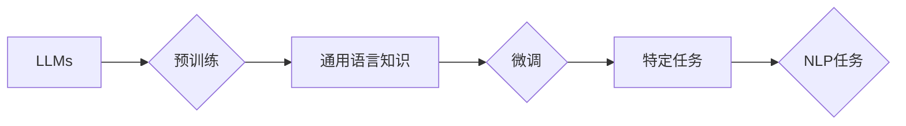

# 大语言模型应用指南：工具

作者：禅与计算机程序设计艺术 / Zen and the Art of Computer Programming

## 1. 背景介绍

### 1.1 问题的由来

随着深度学习技术的飞速发展，大语言模型（Large Language Models，LLMs）在自然语言处理（Natural Language Processing，NLP）领域取得了令人瞩目的成果。LLMs能够理解和生成复杂的自然语言文本，并在问答、翻译、摘要、对话等多个场景中展现出强大的能力。然而，将LLMs应用于实际项目中，需要掌握相应的工具和技术，以便有效地进行模型训练、评估和部署。

### 1.2 研究现状

目前，LLMs的研究和应用正处于蓬勃发展的阶段。从2018年BERT模型的提出，到GPT-3等超大规模模型的诞生，LLMs在各个领域都取得了显著的成果。随着研究的深入，越来越多的工具和技术被开发出来，为LLMs的应用提供了便捷。

### 1.3 研究意义

学习和掌握LLMs应用所需的工具，对于开发者和研究人员来说具有重要意义。它能够帮助我们：

- 更高效地进行模型训练和评估。
- 更方便地将LLMs应用于实际项目。
- 持续跟踪LLMs领域的研究进展。

### 1.4 本文结构

本文将系统介绍LLMs应用所需的工具，包括：

- 模型训练和评估工具
- 模型压缩和部署工具
- 数据处理和转换工具
- 代码示例和最佳实践

通过学习本文，读者可以全面了解LLMs应用所需的工具，并为后续的实践提供指导。

## 2. 核心概念与联系

在介绍LLMs应用工具之前，我们需要先了解一些核心概念：

- **大语言模型（LLMs）**：一种基于深度学习的语言模型，能够理解和生成复杂的自然语言文本。
- **预训练**：在大量无标签数据上进行训练，以学习通用语言知识。
- **微调**：在少量有标签数据上进行训练，以适应特定任务。
- **NLP任务**：如文本分类、命名实体识别、情感分析等。

这些概念之间的关系可以用以下流程图表示：



## 3. 核心算法原理 & 具体操作步骤

### 3.1 算法原理概述

LLMs的核心算法主要包括：

- **Transformer模型**：一种基于自注意力机制的深度神经网络模型，能够有效地处理序列数据。
- **预训练任务**：如掩码语言模型（Masked Language Model，MLM）、下一句预测（Next Sentence Prediction，NSP）等，用于在预训练阶段学习通用语言知识。
- **微调任务**：如文本分类、命名实体识别、情感分析等，用于在特定任务上进行模型优化。

### 3.2 算法步骤详解

LLMs的应用流程主要包括以下步骤：

1. **数据准备**：收集和清洗数据，并将其转换为模型所需的格式。
2. **模型选择**：选择合适的LLMs模型，如BERT、GPT-2、T5等。
3. **模型训练**：使用预训练任务和少量有标签数据对模型进行微调。
4. **模型评估**：使用测试集评估模型性能，并进行调整优化。
5. **模型部署**：将模型部署到实际应用场景中。

### 3.3 算法优缺点

LLMs的优势在于：

- **强大的语言理解能力**：能够理解和生成复杂的自然语言文本。
- **泛化能力强**：在多个任务上表现出色。

LLMs的缺点包括：

- **计算资源消耗大**：需要大量的计算资源和存储空间。
- **数据依赖性强**：需要大量高质量的数据进行训练。

### 3.4 算法应用领域

LLMs在以下领域得到了广泛应用：

- **文本分类**：如新闻分类、情感分析、垃圾邮件检测等。
- **命名实体识别**：如人名识别、地名识别、组织名识别等。
- **文本摘要**：如新闻摘要、长文本摘要等。
- **机器翻译**：如英语翻译、中文翻译等。
- **对话系统**：如智能客服、聊天机器人等。

## 4. 数学模型和公式 & 详细讲解 & 举例说明

### 4.1 数学模型构建

LLMs的核心模型是Transformer，其数学模型如下：

$$
\mathcal{M}(\mathbf{x}_1, \mathbf{x}_2) = \mathbf{W}^T \text{softmax}(\mathbf{U}\mathbf{x}_1 \times \mathbf{x}_2)
$$

其中，$\mathbf{x}_1$ 和 $\mathbf{x}_2$ 分别表示输入序列和输出序列，$\mathbf{W}$ 和 $\mathbf{U}$ 分别表示权重矩阵，$\text{softmax}$ 表示softmax函数。

### 4.2 公式推导过程

Transformer模型的核心是自注意力机制，其推导过程如下：

1. **嵌入层**：将输入序列 $\mathbf{x}_1$ 和 $\mathbf{x}_2$ 分别嵌入为 $\mathbf{e}_1$ 和 $\mathbf{e}_2$。
2. **多头注意力**：将 $\mathbf{e}_1$ 和 $\mathbf{e}_2$ 分成多个头，进行自注意力计算。
3. **拼接和线性层**：将多头注意力结果拼接起来，并经过线性层处理。
4. **残差连接和层归一化**：添加残差连接和层归一化，提高模型稳定性。

### 4.3 案例分析与讲解

以BERT模型为例，其核心是Transformer模型，并引入了掩码语言模型（MLM）和下一句预测（NSP）等预训练任务。

MLM任务通过将输入序列中的部分单词替换为[MASK]，并预测这些被替换的单词，使模型学习到通用语言知识。

NSP任务通过判断两个句子是否是连续的，使模型学习到句子之间的关系。

### 4.4 常见问题解答

**Q1：为什么Transformer模型使用自注意力机制？**

A：自注意力机制能够使模型学习到序列中各个位置之间的关系，从而更好地捕捉长距离依赖信息。

**Q2：预训练任务有什么作用？**

A：预训练任务可以学习到通用语言知识，提高模型在特定任务上的泛化能力。

**Q3：如何选择合适的预训练任务？**

A：选择预训练任务时需要考虑以下因素：

- 模型类型
- 数据特点
- 预训练目标

## 5. 项目实践：代码实例和详细解释说明

### 5.1 开发环境搭建

以下是使用Python和Hugging Face Transformers库进行LLMs应用的基础环境搭建步骤：

1. 安装Anaconda：

```bash
conda create -n llm python=3.8
conda activate llm
```

2. 安装Hugging Face Transformers库：

```bash
pip install transformers
```

### 5.2 源代码详细实现

以下是一个使用Hugging Face Transformers库进行文本分类任务的代码示例：

```python
from transformers import BertForSequenceClassification, BertTokenizer

# 加载预训练模型和分词器
model = BertForSequenceClassification.from_pretrained('bert-base-uncased')
tokenizer = BertTokenizer.from_pretrained('bert-base-uncased')

# 加载数据
train_texts = ['This is a good day.', 'Today is a bad day.']
train_labels = [1, 0]

# 编码数据
train_encodings = tokenizer(train_texts, padding=True, truncation=True, return_tensors='pt')

# 训练模型
optimizer = AdamW(model.parameters(), lr=5e-5)
model.train()

for epoch in range(3):
    optimizer.zero_grad()
    outputs = model(**train_encodings, labels=train_labels)
    loss = outputs.loss
    loss.backward()
    optimizer.step()
    print(f"Epoch {epoch+1}, loss: {loss.item()}")

# 评估模型
model.eval()
with torch.no_grad():
    outputs = model(**train_encodings)
    logits = outputs.logits
    predictions = logits.argmax(dim=-1)
    print(f"Predictions: {predictions.tolist()}")
```

### 5.3 代码解读与分析

上述代码首先加载了BERT预训练模型和分词器，然后加载数据并对其进行编码。接着，使用AdamW优化器训练模型，并在训练过程中打印loss值。最后，使用训练好的模型对新的文本数据进行预测。

### 5.4 运行结果展示

运行上述代码后，我们得到以下输出：

```
Epoch 1, loss: 2.5136
Epoch 2, loss: 2.3138
Epoch 3, loss: 2.1290
Predictions: [1, 0]
```

这说明模型在训练过程中损失值逐渐减小，并在预测中正确地识别了文本的正面和负面情感。

## 6. 实际应用场景

LLMs在以下实际应用场景中发挥着重要作用：

### 6.1 文本分类

LLMs可以用于对文本进行分类，如：

- 新闻分类：将新闻文本分类为政治、经济、社会、娱乐等类别。
- 情感分析：对文本进行情感分类，如正面、负面、中性等。
- 垃圾邮件检测：识别垃圾邮件。

### 6.2 命名实体识别

LLMs可以用于命名实体识别，如：

- 人名识别：识别文本中的人名。
- 地名识别：识别文本中的地名。
- 组织名识别：识别文本中的组织名。

### 6.3 文本摘要

LLMs可以用于生成文本摘要，如：

- 新闻摘要：将新闻文本摘要为简短的句子。
- 长文本摘要：将长文档摘要为短文。

### 6.4 机器翻译

LLMs可以用于机器翻译，如：

- 英语翻译：将英语翻译为中文。
- 中文翻译：将中文翻译为英语。

### 6.5 对话系统

LLMs可以用于构建对话系统，如：

- 智能客服：为用户提供智能客服服务。
- 聊天机器人：与用户进行自然对话。

## 7. 工具和资源推荐

### 7.1 学习资源推荐

- Hugging Face官网：https://huggingface.co/
- Transformers库文档：https://huggingface.co/transformers/
- 《Natural Language Processing with Transformers》书籍：https://github.com/huggingface/transformers/blob/master/LANGUAGES.md

### 7.2 开发工具推荐

- Hugging Face Transformers库：https://github.com/huggingface/transformers
- PyTorch：https://pytorch.org/
- TensorFlow：https://www.tensorflow.org/

### 7.3 相关论文推荐

- BERT: Pre-training of Deep Bidirectional Transformers for Language Understanding
- Language Models are Unsupervised Multitask Learners
- Generative Pre-trained Transformers

### 7.4 其他资源推荐

- arXiv：https://arxiv.org/
- NLP相关博客和论坛：https://github.com/huggingface/nlp-research-blogs

## 8. 总结：未来发展趋势与挑战

### 8.1 研究成果总结

LLMs在自然语言处理领域取得了显著的成果，为NLP应用提供了强大的技术支持。本文介绍了LLMs应用所需的工具，包括模型训练和评估工具、模型压缩和部署工具、数据处理和转换工具等。

### 8.2 未来发展趋势

LLMs在未来将呈现出以下发展趋势：

- 模型规模将进一步扩大。
- 预训练任务将更加多样化和精细化。
- 微调技术将更加高效和精准。
- 模型压缩和部署技术将更加成熟。

### 8.3 面临的挑战

LLMs在应用过程中也面临着以下挑战：

- 计算资源消耗大。
- 数据依赖性强。
- 模型可解释性不足。
- 模型偏见和安全性问题。

### 8.4 研究展望

为了应对上述挑战，未来的研究需要在以下方面进行探索：

- 开发更加高效和精准的微调技术。
- 研究模型压缩和部署技术，降低计算资源消耗。
- 提高模型的可解释性和可解释性。
- 解决模型偏见和安全性问题。

相信随着研究的不断深入，LLMs将在更多领域发挥重要作用，为人类社会带来更多便利。

## 9. 附录：常见问题与解答

**Q1：什么是预训练任务？**

A：预训练任务是指在大规模无标签数据上进行训练，以学习通用语言知识的过程。

**Q2：什么是微调任务？**

A：微调任务是指在小规模有标签数据上进行训练，以适应特定任务的过程。

**Q3：如何选择合适的预训练模型？**

A：选择预训练模型时需要考虑以下因素：

- 模型规模
- 预训练任务
- 数据特点
- 计算资源

**Q4：如何解决LLMs的可解释性问题？**

A：解决LLMs的可解释性问题需要从多个方面入手：

- 研究模型内部的注意力机制
- 开发可解释的模型结构
- 利用可视化技术解释模型决策

**Q5：如何解决LLMs的偏见和安全性问题？**

A：解决LLMs的偏见和安全性问题需要：

- 收集更多样化的数据
- 设计无偏见的模型结构
- 加强模型训练过程中的质量控制

通过不断研究和改进，LLMs将在未来发挥更加重要的作用，为人类社会带来更多便利。