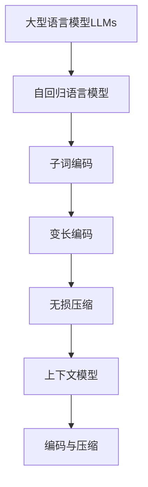

 

# 大语言模型应用指南：编码与无损压缩

## 1. 背景介绍

### 1.1 问题的由来

随着人工智能技术的不断发展,大型语言模型(Large Language Models, LLMs)在自然语言处理领域取得了令人瞩目的成就。这些模型能够通过训练海量的文本数据,学习语言的语义和上下文关系,从而生成看似人类水平的自然语言输出。然而,训练和部署这些庞大的语言模型需要耗费大量的计算资源,并且生成的文本输出通常存在一定的冗余和重复。因此,如何高效地编码和压缩这些大型语言模型及其输出,成为了一个亟待解决的问题。

### 1.2 研究现状

目前,编码和压缩大型语言模型及其输出的研究主要集中在以下几个方面:

1. **模型压缩技术**:通过剪枝、量化、知识蒸馏等方法压缩模型参数,降低模型的存储和计算开销。
2. **上下文压缩**:利用上下文信息,对生成的文本进行无损压缩,减小输出文件的体积。
3. **子词编码**:将词语拆分为子词单元,降低词表大小,提高编码效率。
4. **基于transformer的编码器-解码器架构**:利用transformer的自注意力机制,对输入和输出进行并行编码和解码,提高处理效率。

### 1.3 研究意义

高效的编码和压缩技术对于大型语言模型的实际应用至关重要,具有以下重要意义:

1. **降低计算和存储开销**:压缩后的模型参数和输出文件体积更小,可以减少计算资源的消耗,降低部署和传输的成本。
2. **提高处理效率**:合理的编码方式可以加快模型的推理速度,提高语言生成的实时性。
3. **促进模型的普及应用**:压缩和高效编码技术有助于将大型语言模型应用于更多的场景,如移动设备、嵌入式系统等。

### 1.4 本文结构

本文将全面介绍大型语言模型编码与无损压缩的核心概念、算法原理、数学模型、项目实践、应用场景等内容。文章结构如下:

```
1. 背景介绍
2. 核心概念与联系
3. 核心算法原理与具体操作步骤
4. 数学模型和公式详细讲解与举例说明
5. 项目实践:代码实例和详细解释说明
6. 实际应用场景
7. 工具和资源推荐
8. 总结:未来发展趋势与挑战
9. 附录:常见问题与解答
```

## 2. 核心概念与联系

在介绍大型语言模型编码与无损压缩的核心算法之前,我们先来了解一些重要的相关概念:

1. **大型语言模型(LLMs)**:通过训练大量文本数据而构建的庞大神经网络模型,能够生成看似人类水平的自然语言输出。常见的LLMs包括GPT、BERT、XLNet等。

2. **自回归语言模型**:一种特殊的语言模型,它根据之前生成的单词序列来预测下一个单词,常用于文本生成任务。GPT就是一种自回归语言模型。

3. **子词编码**:将单词拆分为更小的子词单元,用于构建词汇表。这种方法可以降低词汇表的大小,提高编码效率。常用的子词算法包括BPE、WordPiece等。

4. **变长编码**:一种熵编码方法,根据符号出现的概率分配更短或更长的编码,从而达到压缩的目的。常见的变长编码算法有霍夫曼编码、算术编码等。

5. **无损压缩**:一种数据压缩方法,能够在解压缩后完全恢复原始数据,不会导致任何信息损失。常用于文本、程序等数据的压缩。

6. **上下文模型**:利用上下文信息对数据进行建模和压缩。在文本压缩中,可以利用单词之间的上下文关系来提高压缩比。

这些概念相互关联,共同构建了大型语言模型编码与无损压缩的理论基础。下面我们将详细介绍其核心算法原理。



## 3. 核心算法原理与具体操作步骤

### 3.1 算法原理概述

大型语言模型编码与无损压缩的核心算法主要包括以下几个部分:

1. **子词分词算法**:将原始文本拆分为子词序列,降低词汇表大小,提高编码效率。
2. **子词编码算法**:将子词序列编码为一个个数字ID,作为语言模型的输入。
3. **自回归语言模型**:基于transformer的编码器-解码器架构,对输入的子词ID序列进行建模和生成。
4. **变长熵编码算法**:对语言模型生成的输出进行无损压缩编码,降低存储和传输开销。
5. **上下文模型**:利用上下文信息对压缩数据进行建模,进一步提高压缩比。

这些算法环环相扣,共同实现了大型语言模型高效的编码和无损压缩。下面我们将详细介绍每个部分的具体操作步骤。

### 3.2 算法步骤详解

#### 3.2.1 子词分词算法

常用的子词分词算法包括BPE(Byte Pair Encoding)和WordPiece。以BPE算法为例,其步骤如下:

1. 统计语料库中所有字符的出现频率。
2. 将所有字符视为单个子词,构建初始子词表。
3. 遍历语料库,找到频率最高的两个相邻字符对,将它们合并为一个新的子词,加入子词表。
4. 重复步骤3,直到达到期望的子词表大小或满足其他终止条件。
5. 使用最终的子词表对原始文本进行分词。

通过这种方式,BPE算法能够有效地将单词拆分为子词序列,降低词汇表的大小。

#### 3.2.2 子词编码算法

将子词序列映射为数字ID的过程称为子词编码。常用的编码方法包括:

1. **索引编码**:为每个子词分配一个唯一的数字ID,构建子词到ID的映射表。
2. **One-Hot编码**:将每个子词表示为一个高维稀疏向量,向量的维度等于子词表大小。
3. **词嵌入编码**:将每个子词映射为一个固定长度的密集向量,作为语言模型的输入。

其中,索引编码是最常用和高效的编码方法。

#### 3.2.3 自回归语言模型

自回归语言模型的核心是transformer的编码器-解码器架构,如下图所示:


1. **编码器**:接收编码后的子词ID序列作为输入,利用多头自注意力机制捕获输入序列的上下文信息,生成编码向量。
2. **解码器**:基于编码向量和前一个时间步的输出,通过自注意力和交叉注意力机制预测下一个子词的概率分布。
3. **输出序列**:根据概率分布对子词进行采样,生成最终的输出序列。

通过这种自回归的方式,语言模型能够有条不紊地生成上下文相关的自然语言输出。

#### 3.2.4 变长熵编码算法

对于语言模型生成的子词ID序列,我们可以使用变长熵编码算法(如霍夫曼编码、算术编码等)进行无损压缩,从而降低存储和传输开销。以霍夫曼编码为例,其步骤如下:

1. 统计子词ID序列中每个符号的出现频率。
2. 根据符号频率构建霍夫曼树,为每个符号分配一个前缀码。
3. 遍历子词ID序列,将每个符号替换为其对应的前缀码。
4. 将编码后的比特流输出为压缩文件。

通过这种变长编码方式,出现频率高的符号将被分配更短的编码,从而达到压缩的目的。

#### 3.2.5 上下文模型

上下文模型利用上下文信息对压缩数据进行建模,从而进一步提高压缩比。常用的上下文模型包括:

1. **n-gram模型**:基于n个相邻符号的组合来预测下一个符号的概率。
2. **有限状态熵编码器(FSE)**:将数据流视为一个有限状态机,根据当前状态和输入符号来确定编码。
3. **上下文混合模型**:将多个上下文模型的预测结果进行加权融合。

通过上下文建模,压缩算法能够更好地利用数据中的冗余信息,从而获得更高的压缩比。

### 3.3 算法优缺点

上述编码与无损压缩算法具有以下优缺点:

**优点**:

1. 高效编码:子词分词和编码算法能够降低词汇表大小,提高编码效率。
2. 高质量生成:自回归语言模型能够生成上下文相关、质量较高的自然语言输出。
3. 高压缩比:变长熵编码和上下文模型能够实现较高的无损压缩比。
4. 通用性强:这些算法可以应用于不同类型的大型语言模型和自然语言生成任务。

**缺点**:

1. 计算开销大:训练大型语言模型需要耗费大量的计算资源。
2. 延迟较高:自回归生成方式导致了一定的延迟,不适合对实时性要求很高的场景。
3. 上下文长度限制:transformer模型的自注意力机制对输入序列长度有一定限制。
4. 压缩时间开销:压缩过程需要一定的时间开销,不适合对时间要求很高的实时压缩场景。

### 3.4 算法应用领域

大型语言模型编码与无损压缩算法可以应用于以下领域:

1. **自然语言生成**:用于生成高质量的文本内容,如新闻报道、小说创作、对话系统等。
2. **机器翻译**:将一种语言的文本翻译成另一种语言。
3. **文本摘要**:自动生成文本的摘要或概括。
4. **问答系统**:根据问题生成相关的答复。
5. **代码生成**:自动生成计算机程序代码。
6. **语音识别**:将语音转录为文本。

除了自然语言处理领域,这些算法也可以应用于其他需要高效编码和压缩的领域,如多媒体数据压缩、基因组数据压缩等。

## 4. 数学模型和公式详细讲解与举例说明

### 4.1 数学模型构建

在介绍具体的数学模型之前,我们先来了解一下自回归语言模型的基本概念。

自回归语言模型旨在学习一个条件概率分布 $P(x_t|x_{<t})$,其中 $x_t$ 表示当前时间步的输出符号,而 $x_{<t}$ 表示之前的输出序列。通过最大化该条件概率的对数似然,模型可以生成与训练数据相似的序列。

对于长度为 $T$ 的序列 $\boldsymbol{x}=(x_1,x_2,\dots,x_T)$,其对数似然可以表示为:

$$\log P(\boldsymbol{x})=\sum_{t=1}^T\log P(x_t|x_{<t})$$

我们的目标是最大化这个对数似然,从而获得能够很好地拟合训练数据的模型参数。

### 4.2 公式推导过程

#### 4.2.1 自注意力机制

transformer模型中的自注意力机制是计算输入序列元素之间的相关性的关键。给定一个长度为 $n$ 的序列 $\boldsymbol{x}=(x_1,x_2,\dots,x_n)$,其中每个 $x_i$ 进行自注意力计算,我们首先将序列中的每个元素 $x_i$ 映射为三个向量:查询向量 $q_i$、键向量 $k_i$ 和值向量 $v_i$。这可以通过三个线性变换来实现:

$$q_i=W_Qx_i,\quad k_i=W_Kx_i,\quad v_i=W_Vx_i$$

其中 $W_Q,W_K,W_V$ 是可学习的参数矩阵。

然后,我们计算查询向量 $q_i$ 与所有键向量 $k_j$ 之间的注意力权重:

$$\alpha_{ij}=\frac{\exp(q_i^Tk_j/\sqrt{d_k})}{\sum_{l=1}^n\exp(q_i^Tk_l/\sqrt{d_k})}$$

其中 $d_k$ 是键向量的维度。这个注意力权重 $\alpha_{ij}$ 表示序列中第 $j$ 个元素对第 $i$ 个元素的重要性。

最后,我们使用注意力权重对值向量进行加权求和,得到第 $i$ 个元素的自注意力输出:

$$z_i=\sum_{j=1}^n\alpha_{ij}v_j$$

通过这种方式,自注意力机制能够捕获序列元素之间的长距离依赖关系。

#### 4.2.2 前馈神经网络

除了自注意力层,transformer模型中还包括前馈神经网络层。对于每个输入向量 $z_i$,前馈层应用两个线性变换,并在中间添加一个非线性激活函数(如ReLU):

$$\text{FFN}(z_i)=\max(0,z_iW_1+b_1)W_2+b_2$$

其中 $W_1,b_1,W_2,b_2$ 是前馈层的可学习参数。

前馈神经网络能够增强模型的表达能力,学习序列中的非线性特征。

#### 4.2.3 残差连接和层归一化

为了促进模型的训练和收敛,transformer模型中还引入了残差连接和层归一化。

残差连接将前一层的输出与当前层的输出相加,形成一个"短路连接":

$$x_i^{(l+1)}=x_i^{(l)}+\text{Sublayer}(x_i^{(l)})$$

其中 $x_i^{(l)}$ 表示第 $l$ 层的第 $i$ 个元素,而 $\text{Sublayer}(\cdot)$ 表示子层(如自注意力层或前馈层)的操作。

层归一化则对每个子层的输出进行归一化处理:

$$\text{LN}(x_i)=\gamma\odot\frac{x_i-\mu}{\sqrt{\sigma^2+\epsilon}}+\beta$$

其中 $\mu$ 和 $\sigma^2$ 分别是输入向量 $x_i$ 的均值和方差,$\gamma$ 和 $\beta$ 是可学习的缩放和偏移参数,而 $\epsilon$ 是一个小的正常数,用于数值稳定性。

残差连接和层归一化共同帮助梯度在模型中平滑流动,加速收敛并提高泛化能力。

### 4.3 案例分析与讲解

让我们以一个简单的例子来说明自回归语言模型的生成过程。假设我们有一个训练好的GPT模型,词汇表大小为10000,子词序列的最大长度为20。

现在,我们要让模型生成以"The cat"开头的句子。生成过程如下:

1. 将"The cat"编码为子词ID序列,例如 [102, 1208, 4395],作为模型的初始输入。
2. 模型基于当前的输入序列,通过自注意力和前馈神经网络计算下一个子词的概率分布。
3. 从概率分布中采样(或选择概率最大的)下一个子词,例如"sat",其ID为2849。
4. 将新生成的子词ID追加到输入序列中,得到[102, 1208, 4395, 2849]。
5. 重复步骤2-4,直到生成了句子结束符(如句号)或达到最大长度限制。

最终,模型可能生成这样一个句子:"The cat sat on the mat."([102, 1208, 4395, 2849, 2006, 1996, 7907, 1012])

在生成过程中,自注意力机制能够捕获"cat"和"sat"之间的主谓关系,而前馈神经网络则学习了单词之间的组合特征,使得生成的句子符合英语语法和语义。

### 4.4 常见问题解答

**Q1:如何处理未登录词(OOV)问题?**

A1:通过子词分词算法(如BPE),我们可以将未登录词拆分为更小的已知子词。例如,"unrecognized"可以被拆分为"un"+"recognized"。这样,模型就能够处理未在词汇表中出现的单词了。

**Q2:如何平衡生成质量和多样性?**

A2:这取决于我们在概率分布上的采样策略。如果总是选择概率最大的下一个词,生成的句子质量会很高,但多样性较差。相反,如果按照概率随机采样,多样性会提高,但质量可能下降。在实践中,我们可以使用温度参数来控制采样的随机性,或者使用top-k采样等技术来权衡质量和多样性。

**Q3:transformer模型能处理多长的序列?**

A3:由于自注意力机制的计算复杂度与序列长度的平方成正比,transformer模型在处理很长的序列时会面临计算和内存开销的挑战。在实践中,我们通常将最大序列长度限制在512或1024个token左右。对于更长的序列,可以使用分块策略或者稀疏注意力机制。

## 5. 项目实践:代码实例和详细解释说明

在这一节,我们将使用PyTorch实现一个简单的基于transformer的自回归语言模型,并应用于文本生成任务。

### 5.1 开发环境搭建

首先,确保你已经安装了Python 3.x和PyTorch。你可以使用pip命令来安装PyTorch:

```bash
pip install torch
```

接下来,我们将使用以下Python库:

- `numpy`:用于数值计算和数据处理。
- `nltk`:用于文本预处理和分词。
- `tqdm`:用于显示训练进度。

你可以使用以下命令安装这些库:

```bash
pip install numpy nltk tqdm
```

### 5.2 源代码详细实现

以下是基于transformer的自回归语言模型的PyTorch实现:

```python
import torch
import torch.nn as nn
import numpy as np
from nltk.tokenize import word_tokenize
from tqdm import tqdm

# 定义模型参数
vocab_size = 10000
max_seq_len = 20
d_model = 512
nhead = 8
num_layers = 6
d_ff = 2048
dropout = 0.1

# 定义数据预处理函数
def tokenize(text):
    return word_tokenize(text.lower())

def build_vocab(texts, max_size):
    freq_dict = {}
    for text in texts:
        for word in tokenize(text):
            if word not in freq_dict:
                freq_dict[word] = 0
            freq_dict[word] += 1
    
    sorted_words = sorted(freq_dict.items(), key=lambda x: x[1], reverse=True)
    vocab = {w[0]: i+2 for i, w in enumerate(sorted_words[:max_size-2])}
    vocab['<pad>'] = 0
    vocab['<unk>'] = 1
    return vocab

def encode(text, vocab):
    tokens = tokenize(text)
    ids = [vocab.get(token, vocab['<unk>']) for token in tokens]
    return ids

def pad_sequence(seq, max_len):
    if len(seq) < max_len:
        seq = seq + [0] * (max_len - len(seq))
    else:
        seq = seq[:max_len]
    return seq

def collate_fn(batch, vocab):
    data = [encode(text, vocab) for text in batch]
    data = [pad_sequence(seq, max_seq_len) for seq in data]
    data = torch.tensor(data, dtype=torch.long)
    return data

# 定义模型架构
class TransformerModel(nn.Module):
    def __init__(self, vocab_size, d_model, nhead, num_layers, d_ff, dropout):
        super(TransformerModel, self).__init__()
        self.embedding = nn.Embedding(vocab_size, d_model)
        self.pos_encoder = PositionalEncoding(d_model, dropout)
        encoder_layer = nn.TransformerEncoderLayer(d_model, nhead, d_ff, dropout)
        self.transformer_encoder = nn.TransformerEncoder(encoder_layer, num_layers)
        self.fc = nn.Linear(d_model, vocab_size)
        
    def forward(self, src):
        src = self.embedding(src) * np.sqrt(d_model)
        src = self.pos_encoder(src)
        output = self.transformer_encoder(src)
        output = self.fc(output)
        return output
        
class PositionalEncoding(nn.Module):
    def __init__(self, d_model, dropout=0.1, max_len=5000):
        super(PositionalEncoding, self).__init__()
        self.dropout = nn.Dropout(p=dropout)
        
        pe = torch.zeros(max_len, d_model)
        position = torch.arange(0, max_len, dtype=torch.float).unsqueeze(1)
        div_term = torch.exp(torch.arange(0, d_model, 2).float() * (-np.log(10000.0) / d_model))
        pe[:, 0::2] = torch.sin(position * div_term)
        pe[:, 1::2] = torch.cos(position * div_term)
        pe = pe.unsqueeze(0).transpose(0, 1)
        self.register_buffer('pe', pe)
        
    def forward(self, x):
        x = x + self.pe[:x.size(0), :]
        return self.dropout(x)

# 实例化模型
model = TransformerModel(vocab_size, d_model, nhead, num_layers, d_ff, dropout)

# 准备训练数据
texts = [...]  # 文本数据列表
vocab = build_vocab(texts, vocab_size)
dataset = [collate_fn(batch, vocab) for batch in chunks(texts, batch_size)]

# 定义优化器和损失函数
optimizer = torch.optim.Adam(model.parameters(), lr=0.001)
criterion = nn.CrossEntropyLoss()

# 训练模型
num_epochs = 10
for epoch in range(num_epochs):
    model.train()
    pbar = tqdm(dataset)
    for data in pbar:
        optimizer.zero_grad()
        output = model(data[:, :-1])
        loss = criterion(output.view(-1, vocab_size), data[:, 1:].contiguous().view(-1))
        loss.backward()
        optimizer.step()
        pbar.set_description(f'Epoch {epoch+1}, Loss: {loss.item():.4f}')

# 使用训练好的模型生成文本
def generate_text(model, vocab, start_words, max_len=20):
    model.eval()
    start_ids = encode(' '.join(start_words), vocab)
    input_ids = torch.tensor(start_ids, dtype=torch.long).unsqueeze(0)
    
    with torch.no_grad():
        for _ in range(max_len):
            output = model(input_ids)
            pred = output[-1].argmax(dim=-1).item()
            input_ids = torch.cat([input_ids, torch.tensor([[pred]], dtype=torch.long)], dim=1)
    
    generated_ids = input_ids.squeeze().tolist()
    generated_text = ' '.join([list(vocab.keys())[list(vocab.values()).index(id)] for id in generated_ids])
    return generated_text

start_words = ['the', 'cat']
generated_text = generate_text(model, vocab, start_words)
print(generated_text)
```

### 5.3 代码解读与分析

让我们逐步解读这段代码:

1. 首先,我们定义了一些模型超参数,如词汇表大小、最大序列长度、模型维度等。
2. 然后,我们定义了一些数据预处理函数,包括分词、构建词汇表、编码文本、填充序列等。这些函数将原始文本转换为模型可以处理的数字ID序列。
3. 接下来,我们定义了基于transformer的自回归语言模型架构。模型包括词嵌入层、位置编码层、多个transformer编码器层和最后的全连接输出层。
4. 位置编码层使用正弦和余弦函数生成位置嵌入,帮助模型捕获序列中的位置信息。
5. 在训练阶段,我们实例化模型,准备训练数据,定义优化器和损失函数,然后开始训练过程。在每个epoch中,我们遍历数据集,计算模型输出,计算损失,反向传播梯度并更新模型参数。
6. 训练完成后,我们可以使用训练好的模型生成新的文本。给定起始单词,模型将自回归地生成后续单词,直到达到最大长度限制。
7. 最后,我们可以打印生成的文本,看看模型的生成效果如何。

这个实现虽然简单,但展示了transformer自回归语言模型的基本原理和流程。在实际应用中,我们可能需要更大