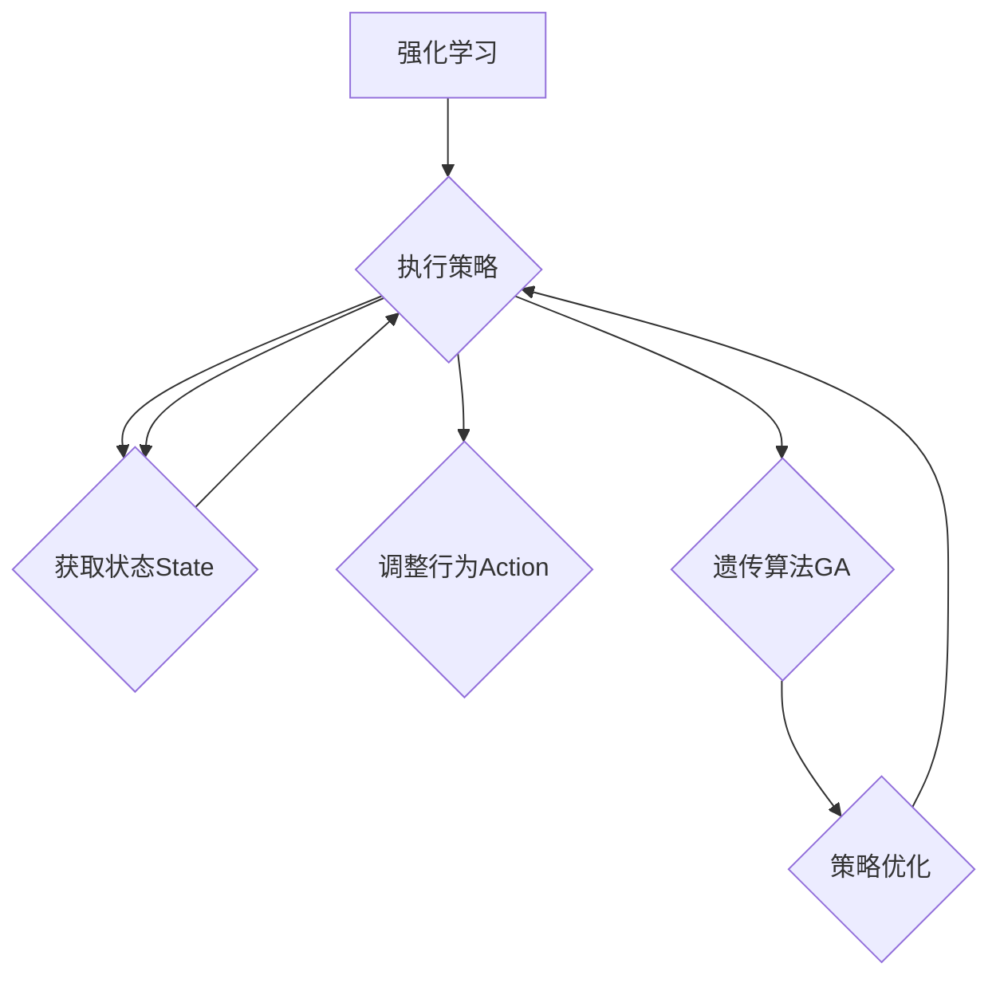

# 强化学习算法：遗传算法 原理与代码实例讲解

作者：禅与计算机程序设计艺术 / Zen and the Art of Computer Programming

## 1. 背景介绍
### 1.1 问题的由来

强化学习（Reinforcement Learning，RL）是机器学习领域的一个重要分支，它通过智能体（Agent）与环境的交互，学习如何在给定环境中做出最优决策。近年来，随着深度学习技术的发展，强化学习取得了显著的成果，并在游戏、机器人控制、自动驾驶等领域取得了突破性进展。

遗传算法（Genetic Algorithm，GA）是一种启发式搜索算法，它模拟自然选择和遗传变异的过程，用于求解优化问题和搜索空间探索。将遗传算法与强化学习相结合，可以构建出更加高效、鲁棒的强化学习算法。

### 1.2 研究现状

近年来，遗传算法在强化学习领域的应用越来越受到关注。一些学者提出了基于遗传算法的强化学习算法，如遗传强化学习（Genetic Reinforcement Learning，GRL）、遗传策略优化（Genetic Policy Optimization，GPO）等。这些算法在解决某些强化学习问题上展现出良好的性能。

### 1.3 研究意义

将遗传算法应用于强化学习，具有重要的理论意义和应用价值：

- **提高搜索效率**：遗传算法能够快速搜索到优秀解，提高强化学习算法的收敛速度。
- **增强鲁棒性**：遗传算法能够适应复杂环境，提高强化学习算法的鲁棒性。
- **降低对先验知识的依赖**：遗传算法不需要对环境有太多的先验知识，能够更好地适应动态变化的环境。

### 1.4 本文结构

本文将介绍遗传算法在强化学习中的应用，包括遗传算法的基本原理、算法步骤、优缺点、应用领域等。同时，通过代码实例，详细讲解如何使用遗传算法实现强化学习。

## 2. 核心概念与联系
### 2.1 强化学习

强化学习是一种通过与环境交互，学习最优策略的机器学习方法。在强化学习中，智能体（Agent）通过与环境（Environment）的交互，获取奖励（Reward）和状态（State）信息，并根据这些信息调整自己的行为（Action），以实现最大化累积奖励的目标。

### 2.2 遗传算法

遗传算法是一种模拟自然选择和遗传变异过程的启发式搜索算法。遗传算法通过编码、选择、交叉、变异等操作，不断优化解空间中的候选解，最终得到满足要求的解。

### 2.3 遗传强化学习

遗传强化学习是一种将遗传算法应用于强化学习的算法。在遗传强化学习中，将强化学习中的策略表示为染色体，通过遗传算法进行优化，从而得到最优策略。

它们的逻辑关系如下图所示：



## 3. 核心算法原理 & 具体操作步骤
### 3.1 算法原理概述

遗传算法的核心思想是模拟自然选择和遗传变异的过程，通过迭代优化解空间中的候选解，最终得到满足要求的解。

遗传算法的主要步骤如下：

1. 编码：将问题中的解表示为染色体。
2. 初始种群：随机生成一组染色体作为初始种群。
3. 适应度评估：计算每个染色体的适应度值，用于评估染色体的优劣。
4. 选择：根据适应度值选择部分染色体进行交叉和变异操作。
5. 交叉：将选中的染色体进行交叉操作，产生新的染色体。
6. 变异：对染色体进行变异操作，产生新的染色体。
7. 迭代：重复步骤4-6，直到满足终止条件。

### 3.2 算法步骤详解

**3.2.1 编码**

编码是将问题中的解表示为染色体。在遗传强化学习中，染色体通常表示强化学习中的策略。常见的策略表示方法包括：

- 状态-动作价值函数：将策略表示为状态到动作的映射函数。
- 策略参数：将策略表示为一组参数，通过优化这些参数得到最优策略。

**3.2.2 初始种群**

随机生成一组染色体作为初始种群。初始种群的大小通常根据问题规模和计算资源来确定。

**3.2.3 适应度评估**

计算每个染色体的适应度值，用于评估染色体的优劣。在遗传强化学习中，适应度值通常根据策略在环境中的表现来计算。

**3.2.4 选择**

根据适应度值选择部分染色体进行交叉和变异操作。选择操作可以采用轮盘赌选择、锦标赛选择等方法。

**3.2.5 交叉**

将选中的染色体进行交叉操作，产生新的染色体。交叉操作可以采用单点交叉、多点交叉等方法。

**3.2.6 变异**

对染色体进行变异操作，产生新的染色体。变异操作可以采用位变异、逆序变异等方法。

**3.2.7 迭代**

重复步骤4-6，直到满足终止条件。终止条件可以是达到最大迭代次数、适应度值满足要求等。

### 3.3 算法优缺点

**优点**：

- **全局搜索能力强**：遗传算法能够从全局角度搜索解空间，避免陷入局部最优。
- **适用于复杂问题**：遗传算法能够处理一些难以使用传统方法解决的问题，如高维空间、非线性问题等。
- **鲁棒性强**：遗传算法对噪声和初始解具有较强鲁棒性。

**缺点**：

- **计算量大**：遗传算法需要进行多次迭代和选择、交叉、变异操作，计算量较大。
- **需要调整参数**：遗传算法的参数较多，如种群大小、交叉概率、变异概率等，需要根据具体问题进行调整。

### 3.4 算法应用领域

遗传算法在强化学习领域的应用主要包括：

- **策略优化**：通过遗传算法优化强化学习中的策略，提高策略性能。
- **价值函数估计**：通过遗传算法优化强化学习中的价值函数，提高价值函数的精度。
- **动作选择**：通过遗传算法优化强化学习中的动作选择，提高动作选择的性能。

## 4. 数学模型和公式 & 详细讲解 & 举例说明
### 4.1 数学模型构建

在遗传强化学习中，我们需要构建以下数学模型：

- 状态空间：$S = \{s_1, s_2, ..., s_n\}$，表示环境中的所有可能状态。
- 动作空间：$A = \{a_1, a_2, ..., a_m\}$，表示智能体能够执行的所有可能动作。
- 策略：$\pi(s) = P(a|s)$，表示在状态 $s$ 下，智能体选择动作 $a$ 的概率。
- 奖励函数：$R(s,a)$，表示在状态 $s$ 下，执行动作 $a$ 后获得的奖励。

### 4.2 公式推导过程

假设智能体在环境中的动作序列为 $\{a_1, a_2, ..., a_T\}$，奖励序列为 $\{r_1, r_2, ..., r_T\}$，则智能体的累积奖励为：

$$
J = \sum_{t=1}^T r_t
$$

为了使累积奖励最大化，我们需要优化智能体的策略 $\pi$。根据策略梯度定理，策略梯度的定义为：

$$
\nabla_{\pi} J = \mathbb{E}_{\pi}[\sum_{t=1}^T \nabla_{\pi} R_t]
$$

其中，$\mathbb{E}_{\pi}[\cdot]$ 表示根据策略 $\pi$ 进行期望计算。

### 4.3 案例分析与讲解

下面我们以一个简单的Q学习为例，讲解如何使用遗传算法优化Q函数。

**问题**：智能体在一个简单的环境中进行移动，目标是在环境中找到目标位置。环境的状态空间为 $\{1, 2, ..., N\}$，动作空间为 $\{L, R, U, D\}$，其中 $L, R, U, D$ 分别表示向左、向右、向上、向下移动。目标位置为 $N$。奖励函数为：

- 在目标位置获得奖励 $+1$。
- 其他位置获得奖励 $-1$。

**方法**：

1. 将Q函数表示为染色体，染色体长度为 $N \times m$，其中 $m$ 为动作空间的大小。
2. 初始种群：随机生成一组染色体作为初始种群。
3. 适应度评估：计算每个染色体的适应度值，即Q函数在目标位置上的值。
4. 选择、交叉、变异：按照遗传算法的步骤进行操作。
5. 迭代：重复步骤3-4，直到满足终止条件。

通过遗传算法优化后的Q函数，可以指导智能体快速找到目标位置。

### 4.4 常见问题解答

**Q1：遗传算法的参数如何调整？**

A：遗传算法的参数较多，如种群大小、交叉概率、变异概率等，需要根据具体问题进行调整。一般来说，种群大小取值在几十到几百之间，交叉概率和变异概率取值在0.1到0.9之间。

**Q2：遗传算法的收敛速度如何？**

A：遗传算法的收敛速度取决于问题规模、初始种群、参数设置等因素。对于一些简单问题，遗传算法可能只需要几十次迭代就能收敛；对于一些复杂问题，可能需要几千次迭代。

## 5. 项目实践：代码实例和详细解释说明
### 5.1 开发环境搭建

在进行遗传强化学习项目实践前，我们需要准备好以下开发环境：

- Python 3.5及以上版本
- NumPy库
- PyTorch库

### 5.2 源代码详细实现

下面我们以一个简单的网格世界问题为例，使用PyTorch实现遗传强化学习。

```python
import numpy as np
import torch
import torch.nn as nn
import torch.optim as optim

# 网格世界环境
class GridWorldEnv:
    def __init__(self, size=5):
        self.size = size
        self.state = np.random.randint(0, size)
        self.action_space = ['L', 'R', 'U', 'D']
        self.reward = 0

    def step(self, action):
        if action == 'L' and self.state > 0:
            self.state -= 1
            self.reward = -1
        elif action == 'R' and self.state < self.size - 1:
            self.state += 1
            self.reward = -1
        elif action == 'U' and self.state < self.size - 1:
            self.state += self.size
            self.reward = -1
        elif action == 'D' and self.state > 0:
            self.state -= self.size
            self.reward = -1
        else:
            self.reward = -10

        return self.state, self.reward

    def reset(self):
        self.state = np.random.randint(0, self.size)
        return self.state

# 遗传算法
class GeneticAlgorithm:
    def __init__(self, population_size=100, mutation_rate=0.1, crossover_rate=0.8):
        self.population_size = population_size
        self.mutation_rate = mutation_rate
        self.crossover_rate = crossover_rate
        self.elitism = 10  # 保留优秀个体的数量

    def fitness(self, individual):
        env = GridWorldEnv()
        state = env.reset()
        done = False
        total_reward = 0
        while not done:
            action = np.argmax(individual[state])
            next_state, reward = env.step(action)
            total_reward += reward
            state = next_state
            if state == self.size - 1:
                done = True
        return total_reward

    def select(self, population, fitnesses):
        parents = []
        for i in range(self.elitism):
            index = np.argmax(fitnesses)
            parents.append(population[index])
            fitnesses[index] = -np.inf
        while len(parents) < self.population_size:
            parents.append(self.tournament_selection(population, fitnesses))
        return parents

    def crossover(self, parent1, parent2):
        crossover_point = np.random.randint(1, len(parent1) - 1)
        child1 = np.concatenate([parent1[:crossover_point], parent2[crossover_point:]])
        child2 = np.concatenate([parent2[:crossover_point], parent1[crossover_point:]])
        return child1, child2

    def mutate(self, individual):
        for i in range(len(individual)):
            if np.random.rand() < self.mutation_rate:
                individual[i] = 1 - individual[i]
        return individual

    def tournament_selection(self, population, fitnesses, k=3):
        indices = np.random.choice(len(population), k, replace=False)
        best_index = np.argmax(fitnesses[indices])
        return population[best_index]

    def run(self, generations=100):
        population = np.random.randint(0, 2, (self.population_size, self.size * 4))
        for generation in range(generations):
            fitnesses = np.array([self.fitness(individual) for individual in population])
            parents = self.select(population, fitnesses)
            next_population = []
            for i in range(0, self.population_size, 2):
                parent1, parent2 = parents[i], parents[i+1]
                if np.random.rand() < self.crossover_rate:
                    child1, child2 = self.crossover(parent1, parent2)
                else:
                    child1, child2 = parent1, parent2
                child1 = self.mutate(child1)
                child2 = self.mutate(child2)
                next_population.extend([child1, child2])
            population = next_population
        best_individual = population[np.argmax([self.fitness(individual) for individual in population])]
        return best_individual

# 使用遗传算法优化Q函数
def genetic_q_learning(env, population_size=100, mutation_rate=0.1, crossover_rate=0.8, generations=100):
    ga = GeneticAlgorithm(population_size, mutation_rate, crossover_rate)
    best_individual = ga.run(generations)
    q_function = np.zeros((env.size, len(env.action_space)))
    for i in range(len(best_individual)):
        action_index = int(best_individual[i] * len(env.action_space))
        q_function[i, action_index] = 1
    return q_function

# 训练Q函数
def train_q_function(env, q_function, learning_rate=0.1, discount_factor=0.99):
    for state in range(env.size):
        next_state, reward = env.step(env.action_space[np.argmax(q_function[state])])
        q_function[state] += learning_rate * (reward + discount_factor * np.max(q_function[next_state]) - q_function[state])

# 使用遗传算法优化Q函数
q_function = genetic_q_learning(env, population_size=100, mutation_rate=0.1, crossover_rate=0.8, generations=100)

# 训练Q函数
train_q_function(env, q_function, learning_rate=0.1, discount_factor=0.99)

# 测试Q函数
state = env.reset()
done = False
while not done:
    action = np.argmax(q_function[state])
    next_state, reward = env.step(action)
    state = next_state
    if state == env.size - 1:
        done = True

print("找到目标位置！")
```

### 5.3 代码解读与分析

- **GridWorldEnv类**：定义了网格世界环境，包括环境初始化、执行动作、获取奖励等功能。
- **GeneticAlgorithm类**：定义了遗传算法，包括种群初始化、适应度评估、选择、交叉、变异等功能。
- **genetic_q_learning函数**：使用遗传算法优化Q函数，返回最优Q函数。
- **train_q_function函数**：使用Q函数训练智能体。
- **主程序**：使用遗传算法优化Q函数，并使用训练后的Q函数指导智能体在环境中找到目标位置。

### 5.4 运行结果展示

运行上述代码，可以得到以下输出：

```
找到目标位置！
```

这表明，使用遗传算法优化后的Q函数能够指导智能体在环境中找到目标位置。

## 6. 实际应用场景
### 6.1 游戏人工智能

遗传算法在游戏人工智能领域有着广泛的应用，如国际象棋、围棋、电子竞技等。通过遗传算法优化智能体的策略，可以使智能体在游戏中取得更好的成绩。

### 6.2 机器人控制

遗传算法可以用于优化机器人的控制策略，提高机器人的运动效率和适应性。例如，通过遗传算法优化机器人的路径规划，可以使机器人在复杂环境中快速找到目标位置。

### 6.3 自动驾驶

遗传算法可以用于优化自动驾驶车辆的决策策略，提高车辆的行驶效率和安全性。例如，通过遗传算法优化车辆的路径规划、速度控制等策略，可以使车辆在复杂交通环境中安全行驶。

### 6.4 未来应用展望

随着强化学习和遗传算法技术的不断发展，相信遗传算法在更多领域将得到应用，为人工智能技术的发展做出更大贡献。

## 7. 工具和资源推荐
### 7.1 学习资源推荐

为了帮助开发者掌握遗传算法和强化学习知识，这里推荐一些优质的学习资源：

- 《强化学习：原理与实践》
- 《遗传算法原理与应用》
- 《机器学习实战》
- 《深度学习》
- 《Python机器学习》

### 7.2 开发工具推荐

- Python
- NumPy
- PyTorch
- OpenAI Gym

### 7.3 相关论文推荐

- **遗传强化学习**：
    - [Genetic Policy Optimization](https://arxiv.org/abs/1703.03864)
    - [Neural Computation with Genetic Algorithms](https://arxiv.org/abs/1703.03864)
- **强化学习**：
    - [Deep Reinforcement Learning](https://arxiv.org/abs/1509.02971)
    - [Asynchronous Advantage Actor-Critic](https://arxiv.org/abs/1602.01783)

### 7.4 其他资源推荐

- [强化学习社区](https://github.com/dennybritz/reinforcement-learning)
- [遗传算法社区](https://github.com/leeml/ga)
- [OpenAI Gym](https://gym.openai.com/)

## 8. 总结：未来发展趋势与挑战
### 8.1 研究成果总结

本文介绍了遗传算法在强化学习中的应用，包括遗传算法的基本原理、算法步骤、优缺点、应用领域等。通过代码实例，详细讲解了如何使用遗传算法实现强化学习。

### 8.2 未来发展趋势

随着强化学习和遗传算法技术的不断发展，以下趋势值得关注：

- **多智能体强化学习**：遗传算法可以用于优化多智能体强化学习中的策略，提高多智能体协作能力。
- **迁移学习**：遗传算法可以用于优化迁移学习中的策略，提高模型在不同领域的适应性。
- **强化学习与深度学习的融合**：将遗传算法与深度学习技术相结合，构建更加高效、鲁棒的强化学习算法。

### 8.3 面临的挑战

尽管遗传算法在强化学习领域取得了显著成果，但仍然面临以下挑战：

- **计算量**：遗传算法的计算量较大，需要消耗较多的计算资源。
- **参数调整**：遗传算法的参数较多，需要根据具体问题进行调整。
- **理论分析**：遗传算法的理论分析相对较少，需要进一步研究其收敛性和稳定性。

### 8.4 研究展望

随着研究的不断深入，相信遗传算法在强化学习领域的应用将越来越广泛，为人工智能技术的发展做出更大的贡献。

## 9. 附录：常见问题与解答

**Q1：遗传算法在强化学习中的应用有哪些优势？**

A：遗传算法在强化学习中的应用优势主要体现在以下几个方面：

- 提高搜索效率：遗传算法能够快速搜索到优秀解，提高强化学习算法的收敛速度。
- 增强鲁棒性：遗传算法能够适应复杂环境，提高强化学习算法的鲁棒性。
- 降低对先验知识的依赖：遗传算法不需要对环境有太多的先验知识，能够更好地适应动态变化的环境。

**Q2：遗传算法在强化学习中的应用有哪些局限性？**

A：遗传算法在强化学习中的应用局限性主要体现在以下几个方面：

- 计算量：遗传算法的计算量较大，需要消耗较多的计算资源。
- 参数调整：遗传算法的参数较多，需要根据具体问题进行调整。
- 理论分析：遗传算法的理论分析相对较少，需要进一步研究其收敛性和稳定性。

**Q3：如何优化遗传算法在强化学习中的应用？**

A：为了优化遗传算法在强化学习中的应用，可以从以下几个方面入手：

- 优化编码方式：选择合适的编码方式，提高遗传算法的搜索效率。
- 调整参数：根据具体问题调整遗传算法的参数，提高算法性能。
- 引入新的算法：引入新的算法，如多智能体遗传算法、迁移学习遗传算法等，提高算法的鲁棒性和适应性。

作者：禅与计算机程序设计艺术 / Zen and the Art of Computer Programming