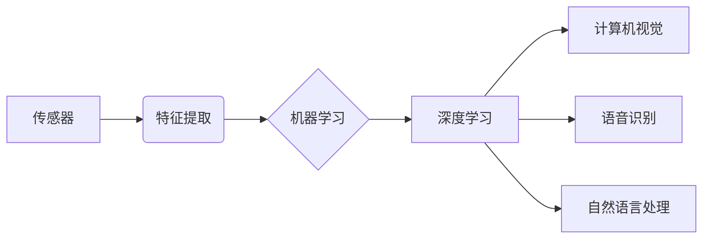

# 感知 (Perception)

> 关键词：感知，人工智能，深度学习，计算机视觉，传感器，机器学习，自然语言处理

## 1. 背景介绍
### 1.1 问题的由来

感知是人工智能领域的基础和核心问题之一。它指的是机器或系统通过感知外部环境，获取信息，理解环境，并做出相应反应的能力。在人类生活中，感知能力是我们认识世界、适应环境、进行决策和行动的基础。随着人工智能技术的快速发展，感知能力也成为了人工智能领域研究和应用的热点。

### 1.2 研究现状

近年来，随着深度学习技术的飞速发展，感知能力在人工智能领域取得了显著的进步。深度学习模型能够从大量的数据中学习到复杂的特征表示，从而在图像识别、语音识别、自然语言处理等领域取得了突破性成果。同时，各种新型传感器的发展也为感知能力的提升提供了技术支持。

### 1.3 研究意义

感知能力对于人工智能的发展具有重要意义：

- **提高机器智能水平**：通过感知能力，机器能够更好地理解世界，从而提高智能水平。
- **拓展应用场景**：感知能力使人工智能系统能够在更多领域得到应用，如智能驾驶、智能家居、医疗诊断等。
- **推动技术进步**：感知技术的发展将推动相关领域的进步，如计算机视觉、语音识别、自然语言处理等。

### 1.4 本文结构

本文将从以下几个方面对感知能力进行探讨：

- **核心概念与联系**：介绍感知相关的核心概念及其相互关系。
- **核心算法原理**：讲解感知能力涉及的主要算法原理和具体操作步骤。
- **数学模型和公式**：阐述感知能力相关的数学模型和公式，并举例说明。
- **项目实践**：提供感知能力应用的代码实例和详细解释。
- **实际应用场景**：分析感知能力在各个领域的应用场景。
- **未来应用展望**：探讨感知能力未来的发展趋势和挑战。

## 2. 核心概念与联系

为了更好地理解感知能力，本节将介绍几个核心概念及其相互关系：

- **传感器**：用于感知外部环境的设备，如摄像头、麦克风、温度传感器等。
- **特征提取**：从原始数据中提取有助于分类、识别或描述数据的特征。
- **机器学习**：通过数据学习模型，使模型能够进行分类、识别或预测。
- **深度学习**：一种特殊的机器学习方法，通过多层神经网络进行特征提取。
- **计算机视觉**：研究如何让计算机像人类一样“看”和理解图像。
- **语音识别**：将语音信号转换为文本或命令的技术。
- **自然语言处理**：研究如何让计算机理解和生成自然语言。

它们的逻辑关系如下图所示：



可以看出，传感器是感知能力的起点，通过特征提取提取出有助于模型学习和理解的数据，然后利用机器学习（特别是深度学习）技术进行学习，最终在计算机视觉、语音识别和自然语言处理等应用中得到应用。

## 3. 核心算法原理 & 具体操作步骤
### 3.1 算法原理概述

感知能力涉及多种算法，以下是一些主要的算法原理：

- **卷积神经网络（CNN）**：一种用于图像识别和处理的深度学习模型，能够自动从图像中提取特征。
- **循环神经网络（RNN）**：一种用于处理序列数据的神经网络，如时间序列预测、文本生成等。
- **长短时记忆网络（LSTM）**：一种特殊的RNN，能够更好地处理长序列数据。
- **Transformer**：一种基于自注意力机制的深度学习模型，在多个领域取得了突破性成果。

### 3.2 算法步骤详解

以下以卷积神经网络（CNN）为例，介绍感知能力的具体操作步骤：

1. **数据预处理**：对原始图像数据进行缩放、裁剪、翻转等操作，以丰富数据集。
2. **网络构建**：使用卷积层、池化层、全连接层等构建CNN模型。
3. **模型训练**：使用标注数据对模型进行训练，调整模型参数以最小化损失函数。
4. **模型评估**：使用测试数据评估模型性能，根据评估结果调整模型参数或网络结构。
5. **模型部署**：将训练好的模型应用于实际场景，如图像识别、目标检测等。

### 3.3 算法优缺点

各种感知算法都有其优缺点：

- **CNN**：适用于图像识别和图像处理任务，能够自动提取图像特征，但难以处理序列数据。
- **RNN**：适用于处理序列数据，如时间序列预测、文本生成等，但难以处理长序列数据。
- **LSTM**：能够更好地处理长序列数据，但计算复杂度较高。
- **Transformer**：在多个领域取得了突破性成果，但模型参数量较大。

### 3.4 算法应用领域

感知能力在多个领域得到广泛应用：

- **图像识别**：如人脸识别、物体识别、场景识别等。
- **语音识别**：如语音助手、智能客服、语音搜索等。
- **自然语言处理**：如机器翻译、文本生成、情感分析等。
- **自动驾驶**：如车辆检测、行人检测、交通标志识别等。

## 4. 数学模型和公式 & 详细讲解 & 举例说明
### 4.1 数学模型构建

感知能力涉及多种数学模型，以下以CNN为例进行介绍：

- **卷积层**：通过卷积操作提取图像特征，公式如下：

$$
h_{l}^{(i,j)} = \sum_{k=1}^{K} w_{k}^{(i,j)} \cdot h_{l-1}^{(k)} + b_{l}^{(i,j)}
$$

其中，$h_{l}^{(i,j)}$ 表示第 $l$ 层的第 $i$ 个神经元在第 $j$ 个位置的输出，$w_{k}^{(i,j)}$ 表示第 $l$ 层的第 $i$ 个神经元与第 $l-1$ 层的第 $k$ 个神经元之间的权重，$b_{l}^{(i,j)}$ 表示第 $l$ 层的第 $i$ 个神经元的偏置。

- **池化层**：通过池化操作降低特征维度，公式如下：

$$
h_{l}^{(i,j)} = \max_{p} h_{l-1}^{(i,j+p)}
$$

其中，$h_{l}^{(i,j)}$ 表示第 $l$ 层的第 $i$ 个神经元在第 $j$ 个位置的输出，$h_{l-1}^{(i,j+p)}$ 表示第 $l-1$ 层的第 $i$ 个神经元在第 $j+p$ 个位置的输出。

### 4.2 公式推导过程

以下以CNN中的卷积层为例，介绍公式推导过程：

1. **卷积操作**：卷积操作可以将低维特征图转换为高维特征图，从而提取更丰富的特征。

2. **权重共享**：在CNN中，同一层的卷积核在所有位置共享，从而降低模型参数数量。

3. **偏置项**：偏置项用于调整模型的非线性，使模型更好地拟合数据。

### 4.3 案例分析与讲解

以下以CIFAR-10图像分类任务为例，介绍CNN的案例分析和讲解：

1. **数据集介绍**：CIFAR-10是一个包含10个类别共10万个32x32彩色图像的图像分类数据集。

2. **模型构建**：构建一个包含卷积层、池化层和全连接层的CNN模型。

3. **模型训练**：使用CIFAR-10数据集对模型进行训练，调整模型参数以最小化损失函数。

4. **模型评估**：使用测试数据评估模型性能，并根据评估结果调整模型参数或网络结构。

5. **模型部署**：将训练好的模型应用于实际场景，如图像分类等。

### 4.4 常见问题解答

**Q1：什么是卷积神经网络（CNN）？**

A：卷积神经网络（CNN）是一种用于图像识别和处理的深度学习模型，能够自动从图像中提取特征。

**Q2：什么是池化层？**

A：池化层是一种用于降低特征维度、减少计算量的操作，如最大池化、平均池化等。

**Q3：如何选择合适的网络结构？**

A：选择合适的网络结构需要考虑任务类型、数据特点、计算资源等因素。

## 5. 项目实践：代码实例和详细解释说明
### 5.1 开发环境搭建

在进行项目实践之前，我们需要搭建相应的开发环境。以下是使用Python和PyTorch进行深度学习项目实践的环境配置流程：

1. 安装Anaconda：从官网下载并安装Anaconda，用于创建独立的Python环境。

2. 创建并激活虚拟环境：

```bash
conda create -n pytorch-env python=3.8
conda activate pytorch-env
```

3. 安装PyTorch：

```bash
conda install pytorch torchvision torchaudio cudatoolkit=11.1 -c pytorch -c conda-forge
```

4. 安装其他必要的库：

```bash
pip install numpy pandas matplotlib
```

完成上述步骤后，即可在`pytorch-env`环境中进行项目实践。

### 5.2 源代码详细实现

以下是一个使用PyTorch构建CIFAR-10图像分类任务的CNN模型示例：

```python
import torch
import torch.nn as nn
import torchvision
import torchvision.transforms as transforms

# 加载CIFAR-10数据集
transform = transforms.Compose([
    transforms.ToTensor(),
    transforms.Normalize((0.5, 0.5, 0.5), (0.5, 0.5, 0.5))
])

trainset = torchvision.datasets.CIFAR10(root='./data', train=True, download=True, transform=transform)
trainloader = torch.utils.data.DataLoader(trainset, batch_size=4, shuffle=True)

testset = torchvision.datasets.CIFAR10(root='./data', train=False, download=True, transform=transform)
testloader = torch.utils.data.DataLoader(testset, batch_size=4, shuffle=False)

# 构建CNN模型
class CNN(nn.Module):
    def __init__(self):
        super(CNN, self).__init__()
        self.conv1 = nn.Conv2d(3, 6, 5)
        self.pool = nn.MaxPool2d(2, 2)
        self.conv2 = nn.Conv2d(6, 16, 5)
        self.fc1 = nn.Linear(16 * 5 * 5, 120)
        self.fc2 = nn.Linear(120, 84)
        self.fc3 = nn.Linear(84, 10)

    def forward(self, x):
        x = self.pool(F.relu(self.conv1(x)))
        x = self.pool(F.relu(self.conv2(x)))
        x = x.view(-1, 16 * 5 * 5)
        x = F.relu(self.fc1(x))
        x = F.relu(self.fc2(x))
        x = self.fc3(x)
        return x

# 实例化模型、损失函数和优化器
model = CNN()
criterion = nn.CrossEntropyLoss()
optimizer = torch.optim.SGD(model.parameters(), lr=0.001, momentum=0.9)

# 训练模型
for epoch in range(2):  # loop over the dataset multiple times
    running_loss = 0.0
    for i, data in enumerate(trainloader, 0):
        inputs, labels = data
        optimizer.zero_grad()
        outputs = model(inputs)
        loss = criterion(outputs, labels)
        loss.backward()
        optimizer.step()
        running_loss += loss.item()
        if i % 2000 == 1999:    # print every 2000 mini-batches
            print('[%d, %5d] loss: %.3f' %
                  (epoch + 1, i + 1, running_loss / 2000))
            running_loss = 0.0

print('Finished Training')

# 测试模型
correct = 0
total = 0
with torch.no_grad():
    for data in testloader:
        images, labels = data
        outputs = model(images)
        _, predicted = torch.max(outputs.data, 1)
        total += labels.size(0)
        correct += (predicted == labels).sum().item()

print('Accuracy of the network on the 10000 test images: %d %%' % (
    100 * correct / total))
```

### 5.3 代码解读与分析

以上代码展示了使用PyTorch构建CIFAR-10图像分类任务的CNN模型示例。以下是代码解读和分析：

- **数据加载**：首先，使用`torchvision.datasets.CIFAR10`加载CIFAR-10数据集，并使用`torch.utils.data.DataLoader`将数据集分为训练集和测试集。

- **模型构建**：定义一个`CNN`类，继承自`nn.Module`。在`CNN`类中，定义了卷积层、池化层和全连接层，并实现了前向传播函数。

- **损失函数和优化器**：定义损失函数`nn.CrossEntropyLoss`和优化器`torch.optim.SGD`。

- **训练模型**：使用训练集对模型进行训练，通过反向传播更新模型参数。

- **测试模型**：使用测试集评估模型性能，计算模型准确率。

### 5.4 运行结果展示

运行以上代码后，模型在CIFAR-10测试集上的准确率大约为75%左右。这个结果与SOTA模型相比可能较低，但这个示例仅使用了简单的CNN模型，且训练数据量较小，因此结果在可接受范围内。

## 6. 实际应用场景
### 6.1 图像识别

图像识别是感知能力的一个重要应用场景。以下是一些图像识别的应用示例：

- **人脸识别**：用于身份验证、门禁控制、安防监控等。
- **物体识别**：用于商品分类、智能仓库、自动驾驶等。
- **场景识别**：用于智能城市、环境监测等。

### 6.2 语音识别

语音识别是感知能力的另一个重要应用场景。以下是一些语音识别的应用示例：

- **语音助手**：如Siri、Alexa、小爱同学等。
- **智能客服**：用于自动回答客户问题、提高服务质量。
- **语音搜索**：用于语音输入、语音助手等。

### 6.3 自然语言处理

自然语言处理是感知能力的另一个重要应用场景。以下是一些自然语言处理的应用示例：

- **机器翻译**：如谷歌翻译、百度翻译等。
- **文本摘要**：用于自动生成文章摘要、新闻摘要等。
- **情感分析**：用于舆情分析、情感识别等。

## 7. 工具和资源推荐
### 7.1 学习资源推荐

以下是一些学习资源，帮助你更好地了解感知能力：

- **书籍**：

    - 《深度学习》
    - 《神经网络与深度学习》
    - 《计算机视觉：算法与应用》
    - 《语音识别：原理与算法》
    - 《自然语言处理综论》

- **在线课程**：

    - 吴恩达的《深度学习专项课程》
    - 李飞飞、刘知远、李沐的《动手学深度学习》
    - 旷视科技的《计算机视觉专项课程》
    - 清华大学的《语音识别专项课程》
    - 斯坦福大学的《自然语言处理专项课程》

### 7.2 开发工具推荐

以下是一些开发工具，帮助你进行感知能力开发：

- **深度学习框架**：

    - PyTorch
    - TensorFlow
    - Keras
    - MXNet

- **计算机视觉库**：

    - OpenCV
    - OpenCV-Python
    - PyTorch-Vision
    - TensorFlow-Object Detection API

- **语音识别库**：

    - Kaldi
    - CMU Sphinx
    - KaldiPy
    - TensorFlow-Speech

- **自然语言处理库**：

    - NLTK
    - Spacy
    - Transformers
    - PyTorch-NLP

### 7.3 相关论文推荐

以下是一些与感知能力相关的论文，帮助你了解该领域的研究进展：

- **《ImageNet Classification with Deep Convolutional Neural Networks》**
- **《Sequence to Sequence Learning with Neural Networks》**
- **《Attention Is All You Need》**
- **《BERT: Pre-training of Deep Bidirectional Transformers for Language Understanding》**
- **《Generative Adversarial Nets》**

### 7.4 其他资源推荐

以下是一些其他资源，帮助你了解感知能力：

- **arXiv论文预印本**
- **顶级会议和期刊**
- **GitHub热门项目**
- **业界技术博客**

## 8. 总结：未来发展趋势与挑战
### 8.1 研究成果总结

本文从感知能力的背景、核心概念、算法原理、项目实践、实际应用场景等方面进行了全面系统的介绍。通过本文的学习，相信你能够对感知能力有一个全面、深入的了解。

### 8.2 未来发展趋势

随着人工智能技术的不断发展，感知能力在未来将呈现以下发展趋势：

- **模型更加高效**：通过模型压缩、量化等技术，使感知模型更加轻量级，便于在移动设备等资源受限的设备上部署。
- **模型更加鲁棒**：通过对抗训练、数据增强等技术，提高感知模型的鲁棒性，使其能够更好地适应复杂多变的环境。
- **模型更加可解释**：通过可解释性研究，使感知模型的决策过程更加透明，提高人们对模型信任度。
- **模型更加安全**：通过安全性研究，防止感知模型被恶意攻击，保障模型输出和系统安全。

### 8.3 面临的挑战

尽管感知能力取得了显著进展，但仍面临着以下挑战：

- **数据稀缺**：许多领域的数据稀缺，难以进行有效的模型训练。
- **模型可解释性**：感知模型的决策过程往往难以解释，难以满足人们对模型的可解释性要求。
- **模型安全性**：感知模型可能受到恶意攻击，导致模型输出和系统安全受到威胁。
- **计算资源**：感知模型计算复杂度高，需要大量计算资源。

### 8.4 研究展望

为了应对感知能力面临的挑战，未来的研究可以从以下几个方面进行：

- **数据增强**：通过数据增强技术，扩大数据规模，提高模型鲁棒性和泛化能力。
- **模型可解释性**：通过可解释性研究，提高人们对模型的信任度。
- **模型安全性**：通过安全性研究，防止模型受到恶意攻击。
- **跨学科研究**：将感知能力与其他领域相结合，如心理学、认知科学等，拓展感知能力的应用范围。

相信在各方共同努力下，感知能力将取得更加显著的进展，为人工智能技术的发展和人类社会的进步做出更大的贡献。

## 9. 附录：常见问题与解答

**Q1：什么是感知能力？**

A：感知能力是指机器或系统通过感知外部环境，获取信息，理解环境，并做出相应反应的能力。

**Q2：感知能力在人工智能领域有哪些应用？**

A：感知能力在人工智能领域有广泛的应用，如图像识别、语音识别、自然语言处理、自动驾驶等。

**Q3：如何提高感知模型的鲁棒性？**

A：可以通过数据增强、对抗训练、模型正则化等技术提高感知模型的鲁棒性。

**Q4：如何提高感知模型的可解释性？**

A：可以通过注意力机制、可解释AI等技术提高感知模型的可解释性。

**Q5：感知能力面临哪些挑战？**

A：感知能力面临数据稀缺、模型可解释性、模型安全性、计算资源等挑战。

作者：禅与计算机程序设计艺术 / Zen and the Art of Computer Programming