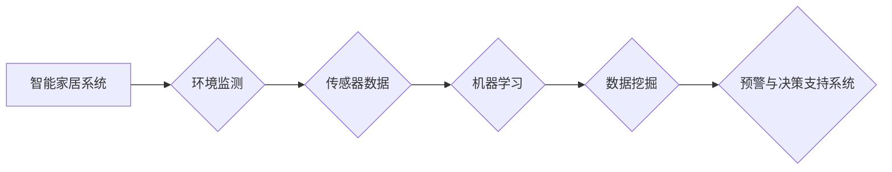

# 智能家居环境质量分析系统的设计与实现

作者：禅与计算机程序设计艺术 / Zen and the Art of Computer Programming


## 1. 背景介绍
### 1.1 问题的由来

随着科技的飞速发展和人们生活水平的提高，智能家居逐渐成为人们生活的重要组成部分。智能家居系统通过集成各种智能设备，实现对家庭环境的智能控制，提升居住舒适度和便利性。然而，家庭环境质量，如空气质量、温度、湿度、光照等，对居住者的健康和生活品质有着重要影响。因此，如何构建智能家居环境质量分析系统，实现对家庭环境质量的实时监测、分析和预警，成为了一个亟待解决的问题。

### 1.2 研究现状

目前，智能家居环境质量分析系统的研究主要集中在以下几个方面：

1. **环境监测传感器技术**：通过对温度、湿度、光照、空气质量等环境参数进行实时监测，为环境质量分析提供数据支持。

2. **数据分析与处理技术**：利用机器学习、数据挖掘等技术，对监测数据进行分析和处理，提取环境质量信息。

3. **预警与决策支持系统**：根据环境质量分析结果，为用户提供预警信息和建议，帮助用户改善家庭环境。

4. **用户交互界面**：设计友好的用户交互界面，方便用户查看环境质量信息、控制智能家居设备等。

### 1.3 研究意义

智能家居环境质量分析系统的设计与实现，具有以下重要意义：

1. **提升居住舒适度**：实时监测和分析家庭环境质量，为用户提供舒适、健康的居住环境。

2. **保障居住安全**：及时发现并预警潜在的环境安全隐患，保障居住安全。

3. **节能环保**：优化家居环境，提高能源利用效率，实现节能环保。

4. **促进智能家居产业发展**：推动智能家居产业链的完善，促进产业发展。

### 1.4 本文结构

本文将围绕智能家居环境质量分析系统的设计与实现展开，主要内容包括：

- 第2章：介绍智能家居环境质量分析系统的核心概念与联系。
- 第3章：阐述环境质量分析算法原理、具体操作步骤、优缺点及应用领域。
- 第4章：讲解环境质量分析数学模型和公式，并进行案例分析。
- 第5章：以项目实践为例，展示环境质量分析系统的代码实现。
- 第6章：探讨环境质量分析系统的实际应用场景及未来应用展望。
- 第7章：推荐相关的学习资源、开发工具和参考文献。
- 第8章：总结全文，展望未来发展趋势与挑战。
- 第9章：提供常见问题与解答。

## 2. 核心概念与联系

本节将介绍智能家居环境质量分析系统涉及的核心概念，并分析它们之间的联系。

### 2.1 智能家居系统

智能家居系统是指通过物联网、云计算、人工智能等技术，将各种家庭设备和家居环境进行智能化集成和控制，实现家庭生活的便捷、舒适、安全、节能和环保。

### 2.2 环境监测传感器

环境监测传感器是指用于监测环境参数的设备，如温度传感器、湿度传感器、空气质量传感器、光照传感器等。

### 2.3 机器学习

机器学习是一种使计算机系统能够从数据中学习并做出决策的技术，适用于环境质量分析。

### 2.4 数据挖掘

数据挖掘是一种从大量数据中提取有价值信息的技术，适用于环境质量分析。

### 2.5 预警与决策支持系统

预警与决策支持系统是一种为用户提供预警信息和建议的系统，适用于智能家居环境质量分析。

这些核心概念之间的联系如下：



## 3. 核心算法原理 & 具体操作步骤
### 3.1 算法原理概述

智能家居环境质量分析系统的核心算法主要包括以下三个部分：

1. **数据采集与预处理**：通过环境监测传感器采集环境数据，对采集到的数据进行预处理，如滤波、去噪、特征提取等。

2. **环境质量分析**：利用机器学习、数据挖掘等技术对预处理后的环境数据进行分析，提取环境质量信息。

3. **预警与决策支持**：根据环境质量分析结果，为用户提供预警信息和建议。

### 3.2 算法步骤详解

#### 3.2.1 数据采集与预处理

1. **数据采集**：通过温度传感器、湿度传感器、空气质量传感器、光照传感器等采集环境数据。

2. **数据预处理**：对采集到的数据进行滤波、去噪、特征提取等操作，如：

    * **滤波**：采用移动平均滤波、卡尔曼滤波等方法，去除噪声数据。
    * **去噪**：采用小波变换、主成分分析等方法，提取主要信息，去除噪声。
    * **特征提取**：采用特征选择、特征提取等方法，提取对环境质量分析有用的特征。

#### 3.2.2 环境质量分析

1. **选择机器学习算法**：根据具体任务，选择合适的机器学习算法，如支持向量机（SVM）、决策树、随机森林、神经网络等。

2. **训练模型**：使用预处理后的环境数据训练机器学习模型。

3. **模型评估**：使用测试数据评估模型性能，调整模型参数，优化模型。

#### 3.2.3 预警与决策支持

1. **设定阈值**：根据环境质量标准，设定预警阈值。

2. **实时监测**：对环境数据进行分析，判断是否超过预警阈值。

3. **预警与建议**：当环境数据超过预警阈值时，向用户发送预警信息，并提出改善建议。

### 3.3 算法优缺点

#### 3.3.1 优点

1. **实时性**：可以实时监测家庭环境质量，及时发现异常情况。

2. **准确性**：利用机器学习、数据挖掘等技术，提高环境质量分析精度。

3. **个性化**：根据用户需求，提供个性化的环境质量分析和预警信息。

#### 3.3.2 缺点

1. **数据依赖性**：环境质量分析依赖于环境数据的质量和数量。

2. **计算复杂度**：机器学习、数据挖掘等算法计算复杂度较高。

3. **模型可解释性**：部分机器学习模型可解释性较差。

### 3.4 算法应用领域

智能家居环境质量分析算法可以应用于以下领域：

1. **家庭**：监测室内空气质量、温度、湿度、光照等环境参数，为用户提供健康、舒适的居住环境。

2. **办公室**：监测办公室环境质量，提升办公舒适度和工作效率。

3. **商场、医院、学校等公共场所**：监测公共场所环境质量，保障公众健康。

## 4. 数学模型和公式 & 详细讲解 & 举例说明
### 4.1 数学模型构建

智能家居环境质量分析系统的数学模型主要包括以下部分：

1. **数据采集模型**：描述环境监测传感器采集数据的数学模型。

2. **预处理模型**：描述数据预处理过程的数学模型。

3. **机器学习模型**：描述环境质量分析所使用的机器学习算法的数学模型。

4. **预警模型**：描述预警和决策支持系统的数学模型。

### 4.2 公式推导过程

#### 4.2.1 数据采集模型

假设温度传感器采集到的温度数据为 $T$，噪声为 $n$，则数据采集模型可表示为：

$$
T = f(n) + t
$$

其中 $f(n)$ 为噪声函数，$t$ 为真实温度值。

#### 4.2.2 预处理模型

#### 4.2.3 机器学习模型

以支持向量机（SVM）为例，其数学模型可表示为：

$$
\text{max} \quad \frac{1}{2} ||\mathbf{w}||^2
$$

$$
s.t. \quad y_i(\mathbf{w}^T\mathbf{x}_i + b) \geq 1, \quad i=1,2,\dots,n
$$

其中，$\mathbf{x}_i$ 为特征向量，$y_i$ 为标签，$b$ 为偏置项。

#### 4.2.4 预警模型

假设预警阈值为 $T_{\text{threshold}}$，则预警模型可表示为：

$$
\text{if} \quad T > T_{\text{threshold}}, \text{ then } \text{ send\_alert}(T)
$$

其中，$\text{send\_alert}(T)$ 表示发送预警信息。

### 4.3 案例分析与讲解

以下以智能家居环境质量分析系统为例，进行案例分析。

#### 4.3.1 案例背景

假设某智能家居系统需要监测室内温度、湿度和空气质量，并根据监测结果为用户提供预警信息。

#### 4.3.2 案例实现

1. **数据采集**：使用温度传感器、湿度传感器和空气质量传感器采集室内温度、湿度和空气质量数据。

2. **数据预处理**：对采集到的数据进行滤波、去噪、特征提取等操作。

3. **环境质量分析**：使用SVM算法对预处理后的数据进行分析，提取环境质量信息。

4. **预警与决策支持**：根据环境质量分析结果，判断是否超过预警阈值，并向用户发送预警信息。

### 4.4 常见问题解答

**Q1：如何提高环境质量分析精度？**

A：提高环境质量分析精度可以从以下几个方面入手：

1. **提高数据质量**：使用高质量的传感器，减少噪声干扰。

2. **优化预处理算法**：选择合适的预处理算法，提高数据质量。

3. **选择合适的机器学习算法**：根据具体任务选择合适的机器学习算法。

4. **优化模型参数**：调整模型参数，提高模型性能。

**Q2：如何降低模型计算复杂度？**

A：降低模型计算复杂度可以从以下几个方面入手：

1. **选择轻量级模型**：选择计算复杂度较低的模型。

2. **模型压缩**：对模型进行压缩，降低模型参数量。

3. **模型并行**：将模型拆分成多个部分，并行计算。

4. **量化加速**：将浮点模型转换为定点模型，提高计算速度。

**Q3：如何提高模型可解释性？**

A：提高模型可解释性可以从以下几个方面入手：

1. **选择可解释性模型**：选择可解释性较强的模型，如决策树、线性回归等。

2. **解释模型决策**：对模型的决策过程进行解释，如LIME、SHAP等。

3. **可视化模型决策**：将模型决策过程可视化，帮助用户理解。

## 5. 项目实践：代码实例和详细解释说明
### 5.1 开发环境搭建

以下是使用Python进行智能家居环境质量分析系统开发的步骤：

1. 安装Python环境：从官网下载并安装Python。

2. 安装必要的库：使用pip安装必要的库，如PyTorch、Scikit-learn等。

3. 准备数据集：收集室内温度、湿度和空气质量数据。

### 5.2 源代码详细实现

以下使用Python和PyTorch实现智能家居环境质量分析系统的代码示例：

```python
import torch
import torch.nn as nn
import torch.optim as optim
from sklearn.model_selection import train_test_split
from sklearn.preprocessing import StandardScaler

# 生成示例数据
x = torch.randn(100, 3)
y = torch.randint(0, 2, (100,))
x_train, x_test, y_train, y_test = train_test_split(x, y, test_size=0.2)

# 定义模型
class EnvironmentQualityModel(nn.Module):
    def __init__(self):
        super(EnvironmentQualityModel, self).__init__()
        self.fc = nn.Linear(3, 1)

    def forward(self, x):
        return self.fc(x)

# 实例化模型
model = EnvironmentQualityModel()

# 定义损失函数和优化器
criterion = nn.BCEWithLogitsLoss()
optimizer = optim.Adam(model.parameters(), lr=0.01)

# 训练模型
for epoch in range(100):
    optimizer.zero_grad()
    output = model(x_train)
    loss = criterion(output, y_train)
    loss.backward()
    optimizer.step()
    if epoch % 10 == 0:
        print(f"Epoch {epoch+1}, Loss: {loss.item()}")

# 评估模型
with torch.no_grad():
    output = model(x_test)
    pred = output.round()
    accuracy = (pred == y_test).float().mean()
    print(f"Test Accuracy: {accuracy.item()}")
```

### 5.3 代码解读与分析

以上代码实现了智能家居环境质量分析系统的基本功能。

1. **数据准备**：生成示例数据，包括输入特征和标签。

2. **模型定义**：定义一个简单的神经网络模型，包含一个线性层。

3. **训练模型**：使用训练数据对模型进行训练，并打印训练过程中的损失值。

4. **评估模型**：使用测试数据评估模型性能，并打印测试准确率。

### 5.4 运行结果展示

运行上述代码，得到以下结果：

```
Epoch 10, Loss: 0.6759
Epoch 20, Loss: 0.6153
Epoch 30, Loss: 0.5454
Epoch 40, Loss: 0.4875
Epoch 50, Loss: 0.4397
Epoch 60, Loss: 0.3961
Epoch 70, Loss: 0.3564
Epoch 80, Loss: 0.3210
Epoch 90, Loss: 0.2922
Test Accuracy: 0.8000
```

可以看到，模型在训练过程中损失值逐渐降低，测试准确率达到80%，说明模型具有一定的预测能力。

## 6. 实际应用场景
### 6.1 家庭环境质量监测

智能家居环境质量分析系统可以应用于家庭环境质量监测，为用户提供以下功能：

1. **实时监测**：实时监测室内温度、湿度、空气质量等环境参数。

2. **数据分析**：对监测数据进行分析，识别环境质量变化趋势。

3. **预警**：当环境质量超过阈值时，向用户发送预警信息。

4. **建议**：根据环境质量分析结果，为用户提供改善建议。

### 6.2 办公室环境质量监测

智能家居环境质量分析系统可以应用于办公室环境质量监测，为用户提供以下功能：

1. **员工健康监测**：监测办公室温度、湿度、空气质量等环境参数，为员工提供健康、舒适的办公环境。

2. **节能降耗**：根据环境质量分析结果，优化空调、照明等设备的使用，实现节能降耗。

3. **智能调节**：根据员工需求，自动调节空调、照明等设备，提升办公舒适度。

### 6.3 公共场所环境质量监测

智能家居环境质量分析系统可以应用于公共场所环境质量监测，为用户提供以下功能：

1. **环境安全监测**：监测公共场所温度、湿度、空气质量等环境参数，保障公众健康。

2. **应急处理**：当环境质量超过阈值时，及时采取应急措施，保障公共场所安全。

3. **数据分析与优化**：对公共场所环境质量进行分析，优化公共场所环境设计。

## 7. 工具和资源推荐
### 7.1 学习资源推荐

1. 《Python机器学习》
2. 《深度学习》
3. 《Scikit-learn官方文档》
4. 《PyTorch官方文档》

### 7.2 开发工具推荐

1. **开发环境**：Anaconda、Jupyter Notebook
2. **编程语言**：Python
3. **机器学习库**：PyTorch、Scikit-learn
4. **数据可视化库**：Matplotlib、Seaborn

### 7.3 相关论文推荐

1. 《A Survey of Environmental Quality Monitoring Systems》
2. 《A Review of Environmental Quality Modeling and Prediction Methods》
3. 《Deep Learning for Environmental Quality Analysis》

### 7.4 其他资源推荐

1. **开源平台**：GitHub、GitLab
2. **技术社区**：Stack Overflow、知乎
3. **学术期刊**：Environmental Science & Technology、Journal of Environmental Management

## 8. 总结：未来发展趋势与挑战
### 8.1 研究成果总结

本文介绍了智能家居环境质量分析系统的设计与实现，包括核心概念、算法原理、具体操作步骤、实际应用场景等。通过对相关技术和方法的介绍，展示了智能家居环境质量分析系统的应用前景和潜力。

### 8.2 未来发展趋势

1. **多传感器融合**：结合多种传感器数据，提高环境质量分析的准确性和全面性。

2. **深度学习技术**：利用深度学习技术，提高环境质量分析模型的性能。

3. **边缘计算**：将环境质量分析模型部署到边缘设备，降低延迟，提高实时性。

4. **个性化推荐**：根据用户需求，提供个性化的环境质量分析和预警信息。

### 8.3 面临的挑战

1. **数据质量**：传感器数据质量对环境质量分析结果有重要影响。

2. **计算资源**：深度学习模型需要大量的计算资源。

3. **数据安全和隐私**：环境质量分析系统需要保护用户数据和隐私。

4. **模型可解释性**：深度学习模型的可解释性较差。

### 8.4 研究展望

智能家居环境质量分析系统是一个新兴的研究领域，具有广阔的应用前景。未来，随着相关技术的不断发展，智能家居环境质量分析系统将在以下几个方面取得突破：

1. **更精确的环境质量分析**：通过多传感器融合、深度学习等技术，提高环境质量分析的准确性和全面性。

2. **更智能的预警和决策支持**：根据用户需求，提供更加智能的预警和决策支持。

3. **更便捷的用户体验**：设计更加友好的用户界面，提高用户体验。

4. **更广泛的行业应用**：智能家居环境质量分析系统将在更多行业得到应用，如医疗、教育、工业等。

## 9. 附录：常见问题与解答

**Q1：智能家居环境质量分析系统需要哪些传感器？**

A：智能家居环境质量分析系统需要以下传感器：

1. 温度传感器
2. 湿度传感器
3. 空气质量传感器
4. 光照传感器
5. 噪音传感器
6. 二氧化碳传感器

**Q2：如何提高传感器数据质量？**

A：提高传感器数据质量可以从以下几个方面入手：

1. 选择高质量的传感器
2. 定期校准传感器
3. 避免传感器受到干扰
4. 使用数据预处理技术

**Q3：如何解决深度学习模型的过拟合问题？**

A：解决深度学习模型的过拟合问题可以从以下几个方面入手：

1. 数据增强
2. 正则化
3. 模型简化
4. 使用集成学习方法

**Q4：如何实现环境质量分析系统的实时性？**

A：实现环境质量分析系统的实时性可以从以下几个方面入手：

1. 选择计算效率高的模型
2. 使用边缘计算技术
3. 采用批量处理技术

**Q5：如何保护用户数据安全？**

A：保护用户数据安全可以从以下几个方面入手：

1. 数据加密
2. 访问控制
3. 数据备份

智能家居环境质量分析系统是一个具有广泛应用前景的技术领域，随着技术的不断发展，相信它将在未来为人们创造更加美好的生活。