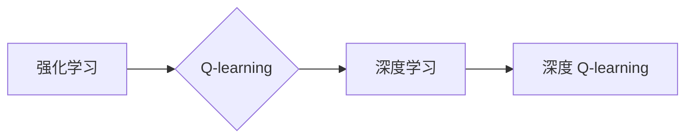

# 深度 Q-learning：价值函数的利用与更新

## 关键词：

深度学习，强化学习，Q-learning，值函数，策略梯度，策略迭代，Monte Carlo 方法，时序差分学习

---

## 1. 背景介绍

### 1.1 问题的由来

随着深度学习技术的飞速发展，它在图像识别、自然语言处理、语音识别等领域取得了令人瞩目的成果。然而，在强化学习（Reinforcement Learning，RL）领域，尽管已经取得了许多突破，但深度学习技术的应用仍然面临一些挑战。特别是对于复杂环境下的决策问题，传统的Q-learning算法在计算效率和收敛速度方面存在不足。

为了解决这些问题，深度 Q-learning（DQN）应运而生。DQN将深度学习与Q-learning相结合，通过神经网络来近似Q函数，从而在计算效率和收敛速度上取得了显著提升。本文将深入探讨深度 Q-learning 的原理、方法、应用和未来发展趋势。

### 1.2 研究现状

近年来，深度 Q-learning 在学术界和工业界都取得了显著的研究成果。一些经典的研究成果包括：

- **Deep Q-Network (DQN)**：由 DeepMind 团队于 2015 年提出，是深度 Q-learning 的一个重要里程碑。DQN 通过深度神经网络近似 Q 函数，并采用经验回放（Experience Replay）和目标网络（Target Network）等技术来提高学习效率。

- **Double DQN (DDQN)**：为了避免 Q-learning 中存在的偏差，DDQN 使用两个 Q 网络，一个用于预测当前状态下的动作值，另一个用于选择最佳动作。

- **Prioritized Experience Replay (PER)**：PER 通过对经验回放的经验进行优先级排序，优先处理那些对学习贡献更大的经验，从而提高学习效率。

- **Proximal Policy Optimization (PPO)**：PPO 是一种无模型强化学习方法，结合了策略梯度方法和蒙特卡洛方法，在许多任务上都取得了优异的性能。

### 1.3 研究意义

深度 Q-learning 的研究对于强化学习领域具有重要意义：

- **提高学习效率**：通过使用深度神经网络近似 Q 函数，深度 Q-learning 可以在复杂环境中快速学习到有效的策略。
- **扩展应用范围**：深度 Q-learning 可以应用于许多需要智能决策的场景，如游戏、机器人、自动驾驶、金融等。
- **推动技术发展**：深度 Q-learning 的研究推动了深度学习、强化学习等领域的技术发展。

### 1.4 本文结构

本文将按照以下结构展开：

- **第 2 节**：介绍深度 Q-learning 中的核心概念与联系。
- **第 3 节**：详细阐述深度 Q-learning 的算法原理和具体操作步骤。
- **第 4 节**：介绍深度 Q-learning 中的数学模型和公式，并进行详细讲解和举例说明。
- **第 5 节**：给出深度 Q-learning 的代码实例，并对关键代码进行解读和分析。
- **第 6 节**：探讨深度 Q-learning 在实际应用场景中的案例分析和讲解。
- **第 7 节**：推荐深度 Q-learning 相关的学习资源、开发工具和参考文献。
- **第 8 节**：总结深度 Q-learning 的研究成果、未来发展趋势和面临的挑战。
- **第 9 节**：提供深度 Q-learning 的常见问题与解答。

---

## 2. 核心概念与联系

本节将介绍深度 Q-learning 中的一些核心概念，并阐述它们之间的联系。

### 2.1 强化学习

强化学习是一种使智能体（Agent）在未知环境中学习最优策略的机器学习方法。在强化学习中，智能体通过与环境的交互来学习如何做出最优决策。

### 2.2 Q-learning

Q-learning 是一种基于值函数的强化学习方法。在 Q-learning 中，智能体通过学习 Q 函数来评估每个状态-动作对的预期回报。

### 2.3 深度学习

深度学习是一种模拟人脑神经网络结构的机器学习方法。在深度学习中，神经网络通过多层非线性变换来提取特征和表示。

### 2.4 深度 Q-learning

深度 Q-learning 是一种将深度学习与 Q-learning 相结合的强化学习方法。在深度 Q-learning 中，智能体使用深度神经网络来近似 Q 函数，从而在复杂环境中学习最优策略。

这些概念之间的关系可以用以下图表示：



---

## 3. 核心算法原理 & 具体操作步骤

### 3.1 算法原理概述

深度 Q-learning 的核心思想是使用深度神经网络来近似 Q 函数，并通过经验回放、目标网络等技术来提高学习效率。

### 3.2 算法步骤详解

深度 Q-learning 的基本步骤如下：

1. 初始化 Q 网络、目标网络和经验回放缓冲区。
2. 从初始状态开始，根据策略选择动作。
3. 执行动作，并获取奖励和下一个状态。
4. 将经验存储到经验回放缓冲区中。
5. 从经验回放缓冲区中采样一批经验。
6. 使用目标网络计算下一个状态的最大 Q 值。
7. 计算 Q 更新值，并使用反向传播算法更新 Q 网络的参数。
8. 定期将 Q 网络的参数复制到目标网络。
9. 重复步骤 2-8，直到收敛。

### 3.3 算法优缺点

深度 Q-learning 的优点：

- **适用于复杂环境**：深度 Q-learning 可以处理具有高维状态空间和动作空间的环境。
- **学习效率高**：通过使用经验回放、目标网络等技术，深度 Q-learning 的学习效率得到了显著提高。

深度 Q-learning 的缺点：

- **训练过程不稳定**：在某些情况下，深度 Q-learning 的训练过程可能会非常不稳定，导致收敛速度慢或无法收敛。
- **需要大量计算资源**：深度 Q-learning 需要大量的计算资源，包括计算能力和存储空间。

### 3.4 算法应用领域

深度 Q-learning 可以应用于以下领域：

- **游戏**：如视频游戏、电子竞技等。
- **机器人**：如无人机、自动驾驶汽车等。
- **金融**：如股票交易、风险管理等。

---

## 4. 数学模型和公式 & 详细讲解 & 举例说明

### 4.1 数学模型构建

深度 Q-learning 的数学模型主要包括以下部分：

- **状态空间**：$S$
- **动作空间**：$A$
- **动作值函数**：$Q(s, a)$
- **策略**：$\pi(a|s)$

### 4.2 公式推导过程

以下将介绍深度 Q-learning 中的主要公式及其推导过程。

#### 4.2.1 Q 函数更新公式

$$
Q(s, a) \leftarrow Q(s, a) + \alpha [R + \gamma \max_{a'} Q(s', a') - Q(s, a)]
$$

其中：

- $Q(s, a)$：表示在状态 $s$ 下执行动作 $a$ 的动作值。
- $R$：表示在状态 $s$ 下执行动作 $a$ 后获得的奖励。
- $\gamma$：表示折扣因子，用于控制未来奖励的重要性。
- $\alpha$：表示学习率，用于控制 Q 函数更新的幅度。

#### 4.2.2 策略更新公式

$$
\pi(a|s) \leftarrow \frac{\exp(Q(s, a)}{\sum_{a' \in A} \exp(Q(s, a'))}
$$

其中：

- $\pi(a|s)$：表示在状态 $s$ 下执行动作 $a$ 的概率。

### 4.3 案例分析与讲解

以下将以游戏棋盘游戏为例，讲解深度 Q-learning 的应用。

假设我们有一个 8x8 的棋盘游戏，玩家需要将棋子移动到棋盘的另一边。每个棋子可以向上、下、左、右移动一步。游戏的目标是将所有棋子移动到棋盘的另一边。

我们可以将棋盘状态表示为一个 64 维的向量，每个维度对应棋盘上的一格。动作空间包括 4 个动作，分别对应向上、下、左、右移动。

我们可以使用深度神经网络来近似 Q 函数，网络输入为状态向量，输出为 4 个动作值。

通过训练，我们可以学习到在每个状态下选择哪个动作可以最大化期望回报。

### 4.4 常见问题解答

**Q1：为什么需要使用经验回放？**

A1：经验回放可以解决样本分布不均匀的问题，并减少样本之间的关联性，从而提高学习效率。

**Q2：为什么需要使用目标网络？**

A2：目标网络可以避免 Q 网络的梯度消失问题，并提高学习稳定性。

**Q3：如何选择学习率和折扣因子？**

A3：学习率和折扣因子的选择取决于具体任务和数据。通常需要通过实验来确定最佳的学习率和折扣因子。

---

## 5. 项目实践：代码实例和详细解释说明

### 5.1 开发环境搭建

为了实现深度 Q-learning，我们需要以下开发环境：

- Python 3.x
- TensorFlow 或 PyTorch
- Numpy

### 5.2 源代码详细实现

以下是一个使用 PyTorch 实现深度 Q-learning 的简单示例：

```python
import torch
import torch.nn as nn
import torch.optim as optim

# 定义 Q 网络
class QNetwork(nn.Module):
    def __init__(self, state_dim, action_dim):
        super(QNetwork, self).__init__()
        self.fc1 = nn.Linear(state_dim, 128)
        self.fc2 = nn.Linear(128, action_dim)

    def forward(self, state):
        x = torch.relu(self.fc1(state))
        return self.fc2(x)

# 定义深度 Q-learning 算法
class DQN:
    def __init__(self, state_dim, action_dim, learning_rate, gamma):
        self.qnetwork_local = QNetwork(state_dim, action_dim).to(device)
        self.qnetwork_target = QNetwork(state_dim, action_dim).to(device)
        self.optimizer = optim.Adam(self.qnetwork_local.parameters(), lr=learning_rate)
        self.gamma = gamma

    def update(self, replay_buffer, batch_size):
        if len(replay_buffer) < batch_size:
            return
        samples = random.sample(replay_buffer, batch_size)
        states, actions, rewards, next_states, dones = zip(*samples)
        states = torch.stack(states)
        next_states = torch.stack(next_states)
        actions = torch.tensor(actions)
        rewards = torch.tensor(rewards)
        dones = torch.tensor(dones)

        q predictions = self.qnetwork_local(states).gather(1, actions.unsqueeze(1))
        next_state_q_values = self.qnetwork_target(next_states).max(1)[0]
        q targets = rewards + (self.gamma * next_state_q_values * (1 - dones))

        loss = F.mse_loss(q_predictions, q_targets)
        self.optimizer.zero_grad()
        loss.backward()
        self.optimizer.step()

# 定义训练过程
def train_dqn(env, dqn, num_episodes, max_timesteps):
    for episode in range(num_episodes):
        state = env.reset()
        for t in count():
            action = dqn.select_action(state)
            next_state, reward, done, _ = env.step(action)
            dqn.replay_buffer.add(state, action, reward, next_state, done)
            state = next_state
            if done:
                break
            if t >= max_timesteps:
                break
        dqn.update(replay_buffer, batch_size=32)

# 创建环境、实例化 DQN 和运行训练
env = gym.make('CartPole-v1')
dqn = DQN(state_dim=4, action_dim=2, learning_rate=0.001, gamma=0.99)
train_dqn(env, dqn, num_episodes=1000, max_timesteps=1000)
```

### 5.3 代码解读与分析

上述代码实现了一个简单的深度 Q-learning 算法，用于训练 CartPole 环境的智能体。

- `QNetwork` 类定义了 Q 网络，包含两个全连接层。
- `DQN` 类定义了深度 Q-learning 算法，包括初始化 Q 网络、目标网络、优化器、折扣因子等。
- `train_dqn` 函数定义了训练过程，包括选择动作、获取奖励和下一个状态、添加经验到经验回放缓冲区、更新 Q 网络等。

### 5.4 运行结果展示

运行上述代码，我们可以看到智能体在 CartPole 环境中逐渐学会平衡木，达到训练目标。

---

## 6. 实际应用场景

### 6.1 游戏领域

深度 Q-learning 在游戏领域得到了广泛的应用，例如：

- **电子游戏**：如 Atari 游戏和视频游戏。
- **棋盘游戏**：如国际象棋、围棋、五子棋等。

### 6.2 机器人领域

深度 Q-learning 在机器人领域也得到了应用，例如：

- **自动驾驶汽车**：用于控制汽车的转向、加速和制动。
- **无人机**：用于控制无人机的飞行轨迹和姿态。

### 6.3 金融领域

深度 Q-learning 在金融领域也得到了应用，例如：

- **股票交易**：用于预测股票价格和交易策略。
- **风险管理**：用于评估和规避金融风险。

---

## 7. 工具和资源推荐

### 7.1 学习资源推荐

- 《Reinforcement Learning: An Introduction》
- 《Deep Reinforcement Learning》
- 《Deep Learning with PyTorch》

### 7.2 开发工具推荐

- TensorFlow
- PyTorch
- OpenAI Gym

### 7.3 相关论文推荐

- Deep Q-Network (DQN)
- Double DQN (DDQN)
- Prioritized Experience Replay (PER)
- Proximal Policy Optimization (PPO)

### 7.4 其他资源推荐

- [Reinforcement Learning Wiki](https://en.wikipedia.org/wiki/Reinforcement_learning)
- [DeepMind OpenAI Gym](https://gym.openai.com/)

---

## 8. 总结：未来发展趋势与挑战

### 8.1 研究成果总结

深度 Q-learning 作为一种结合深度学习和强化学习的方法，在许多领域都取得了显著的成果。它为解决复杂环境下的决策问题提供了一种有效的方法。

### 8.2 未来发展趋势

未来，深度 Q-learning 可能会朝着以下方向发展：

- **多智能体强化学习**：研究多个智能体协同完成任务的方法。
- **基于模型的方法**：研究使用深度神经网络来近似环境模型的方法。
- **基于行为的方法**：研究使用深度神经网络来近似智能体行为的方法。

### 8.3 面临的挑战

深度 Q-learning 在应用过程中也面临着一些挑战：

- **样本效率低**：需要大量的样本来学习有效的策略。
- **收敛速度慢**：在某些情况下，训练过程可能非常缓慢，甚至无法收敛。
- **可解释性差**：深度 Q-learning 的决策过程通常难以解释。

### 8.4 研究展望

为了克服深度 Q-learning 面临的挑战，未来需要从以下几个方面进行研究：

- **提高样本效率**：研究如何利用有限的样本来学习有效的策略。
- **提高收敛速度**：研究如何提高训练过程的收敛速度。
- **提高可解释性**：研究如何提高深度 Q-learning 的可解释性。

---

## 9. 附录：常见问题与解答

**Q1：什么是 Q 函数？**

A1：Q 函数是强化学习中一个重要的概念，它表示在某个状态下执行某个动作的预期回报。

**Q2：什么是策略？**

A2：策略是智能体在某个状态下选择动作的概率分布。

**Q3：什么是经验回放？**

A3：经验回放是一种技术，用于存储和重放智能体与环境交互的经验。

**Q4：什么是目标网络？**

A4：目标网络是一种技术，用于提高深度 Q-learning 的稳定性。

**Q5：如何选择学习率和折扣因子？**

A5：学习率和折扣因子的选择取决于具体任务和数据。通常需要通过实验来确定最佳的学习率和折扣因子。

---

作者：禅与计算机程序设计艺术 / Zen and the Art of Computer Programming