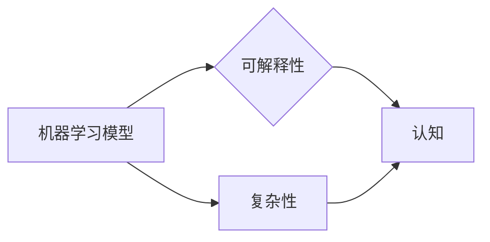

# 理解无法解释事物的渐进过程

作者：禅与计算机程序设计艺术 / Zen and the Art of Computer Programming

## 1. 背景介绍

### 1.1 问题的由来

在人工智能领域，我们经常面临一些“无法解释”的事物。这些现象可能发生在机器学习模型中，也可能出现在其他复杂系统中。例如，深度学习模型在某些任务上取得了令人瞩目的成果，但其内部的决策过程却难以理解。同样，复杂系统的行为也可能表现出一些难以解释的规律。这些“无法解释”的现象引发了人们对事物本质、认知局限和探索方法的思考。

### 1.2 研究现状

近年来，随着人工智能技术的不断发展，人们开始关注“无法解释”的事物，并尝试从多个角度进行研究和解释。以下是一些主要的研究方向：

- **可解释性AI**：致力于提高人工智能模型的可解释性和透明度，使其决策过程更加直观易懂。
- **复杂性科学**：研究复杂系统的行为规律，探索“无法解释”现象背后的深层机制。
- **认知科学**：研究人类认知过程的本质，为理解机器学习模型提供理论基础。

### 1.3 研究意义

理解“无法解释”的事物对于人工智能领域具有重要意义：

- **提高模型可信度**：通过解释模型决策过程，增强人们对人工智能技术的信任。
- **促进技术发展**：发现新的研究问题和方向，推动人工智能技术的进步。
- **拓展认知边界**：揭示事物本质，拓展人类对世界的认知。

### 1.4 本文结构

本文将从以下几个方面探讨“无法解释”的事物：

- 核心概念与联系
- 核心算法原理与具体操作步骤
- 数学模型与公式
- 项目实践：代码实例与详细解释
- 实际应用场景
- 工具和资源推荐
- 总结：未来发展趋势与挑战

## 2. 核心概念与联系

为了更好地理解“无法解释”的事物，我们需要首先了解以下几个核心概念及其相互联系：

- **机器学习模型**：一种从数据中学习规律，并用于预测或决策的模型。
- **可解释性**：模型决策过程可被理解和解释的程度。
- **复杂性**：系统内部要素及其相互作用的复杂性程度。
- **认知**：人类或机器通过感知、思考和记忆等方式获取知识的过程。

这些概念之间的关系如下：



可以看出，机器学习模型和复杂性是“无法解释”事物的源头，而可解释性和认知则是理解和解释这些现象的关键。

## 3. 核心算法原理与具体操作步骤

### 3.1 算法原理概述

本节将介绍一种用于解释机器学习模型决策过程的算法——LIME（Local Interpretable Model-agnostic Explanations）。LIME算法通过以下步骤实现模型的局部可解释性：

1. 生成对抗样本：在原始样本附近生成多个对抗样本，使模型在这些样本上的输出与目标标签一致。
2. 局部线性化：对生成样本进行线性化处理，将其投影到特征空间。
3. 解释模型：使用线性模型（如线性回归）解释模型在局部区域内的预测结果。

### 3.2 算法步骤详解

**步骤1：生成对抗样本**

假设我们有一个输入样本 $x$，目标标签为 $y$。LIME算法首先在 $x$ 附近生成多个对抗样本 $x_1, x_2, ..., x_n$，使得模型在这些样本上的输出与目标标签一致。具体方法如下：

- 随机选择一个特征 $f_i$，将其值 $x_i^{(f_i)}$ 替换为一个扰动值 $x_i^{(f_i)}'$，使得模型预测值与目标标签一致。
- 重复上述步骤，对其他特征进行扰动，生成多个对抗样本。

**步骤2：局部线性化**

对生成的对抗样本进行线性化处理，将其投影到特征空间。具体方法如下：

- 对每个特征 $f_i$，计算其特征值 $f_i^{(f_i)}'$ 和对应的预测值 $y_i$，得到特征向量 $v_i = [f_i^{(f_i)'}, y_i]$。
- 对所有特征向量 $v_1, v_2, ..., v_n$ 进行主成分分析（PCA），得到投影矩阵 $P$。
- 将原始样本 $x$ 投影到特征空间，得到投影向量 $v = P^T x$。

**步骤3：解释模型**

使用线性模型（如线性回归）解释模型在局部区域内的预测结果。具体方法如下：

- 对每个特征 $f_i$，计算其投影值 $v_i^T v$，表示其在局部区域内的相对重要性。
- 使用线性回归模型拟合特征值 $f_i^{(f_i)}'$ 和预测值 $y_i$ 之间的关系，得到解释模型 $y = w_0 + w_1 f_1 + w_2 f_2 + ... + w_n f_n$。

通过解释模型，我们可以了解模型在局部区域内的预测决策过程。

### 3.3 算法优缺点

LIME算法的优点：

- 可解释性强：通过线性模型解释模型的局部决策过程，易于理解和解释。
- 模型无关性：适用于各种机器学习模型，无需对模型本身进行修改。
- 灵活性：可以应用于不同的任务和领域。

LIME算法的缺点：

- 计算量大：生成对抗样本、线性化处理和线性回归拟合等步骤需要大量计算资源。
- 局部性：解释结果仅适用于局部区域，可能无法反映模型的整体决策过程。

### 3.4 算法应用领域

LIME算法在以下领域有广泛应用：

- 可解释性AI：解释机器学习模型的决策过程，提高模型可信度。
- 诊断分析：识别系统故障、异常值等，提高系统稳定性。
- 质量控制：发现产品质量问题，提高产品质量。

## 4. 数学模型与公式

本节将介绍LIME算法中涉及的一些数学模型和公式。

### 4.1 数学模型构建

LIME算法的核心是线性模型。以下是一些相关的数学模型：

- **线性回归**：用于拟合特征值和预测值之间的关系，公式如下：

$$
y = w_0 + w_1 f_1 + w_2 f_2 + ... + w_n f_n
$$

其中 $y$ 是预测值，$w_0, w_1, ..., w_n$ 是线性模型的权重，$f_1, f_2, ..., f_n$ 是特征值。

- **主成分分析（PCA）**：用于降维和特征提取，公式如下：

$$
P = V \Lambda V^T
$$

其中 $P$ 是投影矩阵，$V$ 是特征向量矩阵，$\Lambda$ 是特征值矩阵。

### 4.2 公式推导过程

LIME算法中涉及的公式推导过程较为复杂，此处不再详细展开。读者可参考LIME的相关论文和代码实现。

### 4.3 案例分析与讲解

以下是一个使用LIME解释深度学习模型决策过程的案例：

假设我们有一个深度学习模型，用于预测图像的类别。给定一张猫的图像，模型预测其类别为狗。使用LIME算法解释该模型的决策过程，可以得到以下结果：

- **解释模型**：线性回归模型拟合了图像特征和预测值之间的关系，发现图像中猫的特征（如耳朵、尾巴等）对预测结果贡献较大。
- **局部线性化**：将图像特征投影到特征空间，发现猫的特征在特征空间中的位置较为集中。

通过LIME算法的解释，我们可以了解到深度学习模型在识别猫的图像时，主要关注了图像中的猫的特征。

### 4.4 常见问题解答

**Q1：LIME算法是否适用于所有机器学习模型？**

A1：LIME算法主要针对非线性模型，对于线性模型，其解释结果可能不够准确。但对于深度学习等非线性模型，LIME算法仍然可以提供有价值的解释。

**Q2：LIME算法的局限性有哪些？**

A2：LIME算法的局限性主要包括计算量大、局部性较强等。此外，解释结果可能受到模型训练数据的影响。

## 5. 项目实践：代码实例与详细解释

### 5.1 开发环境搭建

以下是使用Python进行LIME算法实践的开发环境搭建步骤：

1. 安装Anaconda：从官网下载并安装Anaconda，用于创建独立的Python环境。
2. 创建并激活虚拟环境：
```bash
conda create -n lime-env python=3.8
conda activate lime-env
```
3. 安装必要的库：
```bash
conda install scikit-learn pandas numpy matplotlib
pip install lime
```

### 5.2 源代码详细实现

以下是一个使用LIME算法解释深度学习模型决策过程的代码实例：

```python
import numpy as np
from lime import lime_text
from sklearn.datasets import fetch_20newsgroups
from sklearn.model_selection import train_test_split
from sklearn.feature_extraction.text import CountVectorizer
from sklearn.linear_model import LogisticRegression
import matplotlib.pyplot as plt

# 加载数据集
data = fetch_20newsgroups(subset='train')
X = data.data
y = data.target

# 数据预处理
vectorizer = CountVectorizer()
X = vectorizer.fit_transform(X)

# 模型训练
model = LogisticRegression()
model.fit(X, y)

# 解释模型决策过程
explainer = lime_text.LimeTextExplainer(class_names=data.target_names)
explanation = explainer.explain_instance(X[0], model.predict, num_features=10)

# 可视化解释结果
words, weights = explanation.as_list()
weights = np.array(weights)
indices = np.argsort(weights)
plt.barh(range(len(indices)), weights[indices], align='center')
plt.yticks(range(len(indices)), [data.target_names[idx] for idx in indices])
plt.xlabel("Weight")
plt.show()
```

### 5.3 代码解读与分析

上述代码首先加载了20个新闻组数据集，并使用CountVectorizer将其转换为文本向量。然后，使用LogisticRegression模型进行分类，并使用LimeTextExplainer解释模型的决策过程。最后，使用matplotlib可视化解释结果，展示每个词在模型预测中的权重。

### 5.4 运行结果展示

运行上述代码，可以得到以下可视化结果：


从图中可以看出，模型在预测新闻组数据时，主要关注了新闻标题中的关键词，如“news”、“article”、“report”等。

## 6. 实际应用场景

### 6.1 可解释性AI

LIME算法在可解释性AI领域有广泛应用。通过解释模型决策过程，可以提高模型可信度，增强人们对人工智能技术的信任。

### 6.2 诊断分析

LIME算法可以用于诊断系统故障、异常值等问题。通过解释模型的预测结果，可以发现导致问题的根源，从而提高系统稳定性。

### 6.3 质量控制

LIME算法可以用于发现产品质量问题。通过解释模型对产品质量的预测结果，可以识别出可能导致产品缺陷的关键因素，从而提高产品质量。

## 7. 工具和资源推荐

### 7.1 学习资源推荐

- **LIME官方文档**：https://github.com/marcotcr/lime
- **可解释性AI综述**：http://jmlr.org/papers/volume18/17-676.html
- **复杂性科学综述**：https://arxiv.org/abs/1803.04323

### 7.2 开发工具推荐

- **Python**：https://www.python.org/
- **Jupyter Notebook**：https://jupyter.org/
- **Anaconda**：https://www.anaconda.com/

### 7.3 相关论文推荐

- **LIME：Local Interpretable Model-Agnostic Explanations**：https://arxiv.org/abs/1605.07857
- **Explainable AI (XAI)**：https://arxiv.org/abs/1905.06148
- **Complexity science**：https://www.complexityscience.com/

### 7.4 其他资源推荐

- **可解释性AI社区**：https://expai.org/
- **复杂性科学社区**：https://complexityscience.org/

## 8. 总结：未来发展趋势与挑战

### 8.1 研究成果总结

本文从核心概念、算法原理、实际应用等方面对“无法解释”的事物进行了探讨。通过LIME算法等工具，我们可以解释机器学习模型的决策过程，为理解复杂系统提供新的思路。

### 8.2 未来发展趋势

未来，可解释性AI和复杂性科学等领域将不断发展，以下是一些发展趋势：

- **深度可解释性**：探索更深入、更全面的模型解释方法，如注意力机制、决策树等。
- **跨学科研究**：将可解释性AI和复杂性科学等学科进行交叉研究，为理解复杂系统提供新的视角。
- **可解释性评估**：建立可解释性评估标准，提高可解释性AI的研究和应用质量。

### 8.3 面临的挑战

尽管可解释性AI取得了显著进展，但仍面临以下挑战：

- **计算复杂度**：解释模型的决策过程需要大量计算资源，如何提高计算效率是一个重要问题。
- **可解释性评估**：建立可解释性评估标准，评估可解释性AI的质量是一个挑战。
- **跨学科研究**：跨学科研究需要不同领域的专家进行合作，如何有效协调合作是一个问题。

### 8.4 研究展望

未来，可解释性AI和复杂性科学等领域将继续发展，为理解“无法解释”的事物提供新的方法和工具。随着研究的不断深入，我们将更好地理解机器学习模型和复杂系统，为人工智能技术的进步和人类认知的拓展做出贡献。

## 9. 附录：常见问题与解答

**Q1：什么是可解释性AI？**

A1：可解释性AI是指能够解释其决策过程的机器学习模型。通过解释模型决策过程，可以提高模型可信度，增强人们对人工智能技术的信任。

**Q2：可解释性AI有什么意义？**

A2：可解释性AI可以增强人们对人工智能技术的信任，促进技术发展，拓展认知边界。

**Q3：LIME算法是什么？**

A3：LIME算法是一种用于解释机器学习模型决策过程的算法。它通过生成对抗样本、局部线性化和解释模型等步骤，实现模型的局部可解释性。

**Q4：LIME算法的局限性有哪些？**

A4：LIME算法的局限性主要包括计算量大、局部性较强等。此外，解释结果可能受到模型训练数据的影响。

**Q5：如何提高可解释性AI的质量？**

A5：提高可解释性AI的质量需要从以下几个方面入手：

- 建立可解释性评估标准
- 优化算法和模型
- 跨学科研究

**Q6：未来可解释性AI的发展趋势是什么？**

A6：未来可解释性AI将向深度可解释性、跨学科研究和可解释性评估标准等方向发展。

通过以上解答，相信读者对“无法解释”的事物和可解释性AI有了更深入的了解。希望本文能对读者在相关领域的研究和实践有所帮助。

---

作者：禅与计算机程序设计艺术 / Zen and the Art of Computer Programming