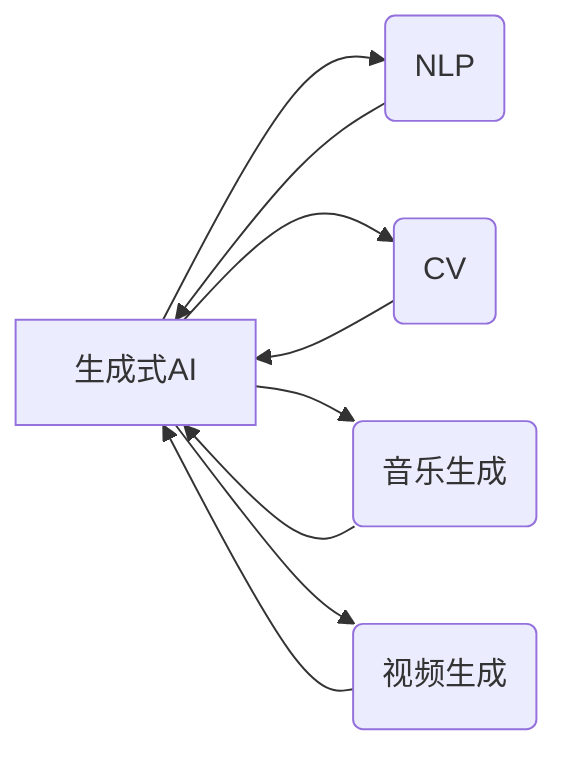

# 生成式AIGC：改变商业模式的新引擎

作者：禅与计算机程序设计艺术 / Zen and the Art of Computer Programming

## 1. 背景介绍
### 1.1 问题的由来

近年来，人工智能（AI）技术在各个领域的应用日益广泛，其中生成式AI（Generative AI）因其强大的创造力和高效的生产力，成为备受瞩目的焦点。生成式AI通过模拟人类创造过程，可以自动生成文本、图像、音乐、视频等内容，极大地解放了人类的创造力，为各行各业带来了颠覆性的变革。本文将深入探讨生成式AI的原理、应用和未来发展趋势，并分析其如何成为改变商业模式的新引擎。

### 1.2 研究现状

生成式AI的研究始于20世纪50年代，经历了多个发展阶段。近年来，随着深度学习技术的突破，生成式AI取得了显著的进展，涌现出大量优秀的生成模型，如GPT、GAN、VQ-VAE等。这些模型在自然语言处理、计算机视觉、音乐生成等领域取得了令人瞩目的成果。

### 1.3 研究意义

生成式AI具有广泛的应用价值，其对商业模式的改变主要体现在以下几个方面：

1. 提高生产力：生成式AI可以自动化生成大量高质量内容，降低人力成本，提高生产效率。
2. 创造新需求：生成式AI可以创造新的产品和服务，拓展市场需求，推动产业升级。
3. 优化用户体验：生成式AI可以提供个性化、定制化的服务，提升用户体验。
4. 改善决策效率：生成式AI可以辅助决策，提高决策效率和准确性。

### 1.4 本文结构

本文将从以下方面展开：

- 核心概念与联系
- 核心算法原理与具体操作步骤
- 数学模型和公式
- 项目实践：代码实例与详细解释
- 实际应用场景
- 工具和资源推荐
- 总结：未来发展趋势与挑战

## 2. 核心概念与联系

### 2.1 核心概念

- 生成式AI：指能够自动生成人类可理解内容的AI技术，包括文本、图像、音乐、视频等。
- 自然语言处理（NLP）：研究如何让计算机理解和处理人类自然语言。
- 计算机视觉（CV）：研究如何使计算机从图像和视频中提取信息。
- 音乐生成：指生成具有音乐性的声音序列。
- 视频生成：指生成具有视觉吸引力的视频内容。

### 2.2 联系

生成式AI与NLP、CV、音乐生成、视频生成等领域密切相关，共同构成了人工智能领域的核心技术。以下是其逻辑关系图：



## 3. 核心算法原理与具体操作步骤
### 3.1 算法原理概述

生成式AI的核心是生成模型，常见的生成模型包括：

- GAN（生成对抗网络）：由生成器和判别器组成，生成器生成数据，判别器判断数据真假，通过对抗训练使生成器生成的数据越来越真实。
- VAE（变分自编码器）：通过编码器和解码器对数据进行编码和解码，通过最大化数据分布和重构分布之间的KL散度来优化模型。
- GPT（生成预训练 Transformer）：基于Transformer模型，通过自回归的方式生成文本。

### 3.2 算法步骤详解

以下是生成式AI的基本操作步骤：

1. 数据收集与预处理：收集大量高质量的数据，并进行预处理，如文本分词、图像分割等。
2. 模型选择与训练：选择合适的生成模型，并在预处理后的数据上进行训练，优化模型参数。
3. 数据生成：使用训练好的模型生成新的数据。
4. 数据评估：对生成的数据进行分析和评估，如文本的流畅性、图像的真实性等。

### 3.3 算法优缺点

- GAN：优点是能够生成高质量的数据，但训练难度大，容易陷入局部最优。
- VAE：优点是生成数据质量较高，但生成数据多样性较差。
- GPT：优点是生成文本流畅自然，但生成数据质量和多样性取决于预训练数据。

### 3.4 算法应用领域

生成式AI在以下领域具有广泛的应用：

- 文本生成：如自动摘要、机器翻译、文本摘要等。
- 图像生成：如图像修复、图像合成、图像超分辨率等。
- 音乐生成：如曲子生成、旋律生成等。
- 视频生成：如视频修复、视频特效等。

## 4. 数学模型和公式
### 4.1 数学模型构建

以下为GAN、VAE和GPT的数学模型：

- GAN：$G(z) \rightarrow X$, $D(x) \rightarrow D$, $L_{GAN} = \mathbb{E}_{z \sim p(z)}[D(G(z))] - \mathbb{E}_{x \sim p(x)}[D(x)]$
- VAE：$q_\phi(z|x) \rightarrow p(x|z)$, $L_{VAE} = D[p(x|z) || q_\phi(z|x)]$
- GPT：$p(x_{1:T} | x_{1:T-1}) = \prod_{t=1}^T p(x_t|x_{1:T-1})$

### 4.2 公式推导过程

以上公式的具体推导过程可参考相关论文。

### 4.3 案例分析与讲解

以文本生成为例，我们可以使用GPT模型生成一首诗：

```
在河之洲，白露为霜，
所谓伊人，在水一方。
溯洄从之，道阻且长，
溯游从之，宛在水中央。
```

### 4.4 常见问题解答

**Q1：如何提高生成式AI的生成质量？**

A1：提高生成式AI的生成质量可以从以下几个方面入手：
1. 使用更高质量的预训练数据。
2. 选择合适的生成模型和超参数。
3. 对生成的数据进行后处理，如去噪、风格迁移等。

**Q2：如何解决GAN训练过程中的模式崩溃问题？**

A2：解决GAN训练过程中的模式崩溃问题可以尝试以下方法：
1. 使用更稳定的优化器，如Adam。
2. 使用批量归一化技术。
3. 调整超参数，如学习率、批大小等。

## 5. 项目实践：代码实例与详细解释
### 5.1 开发环境搭建

1. 安装Python和PyTorch。
2. 安装相关库，如torchvision、transformers等。

### 5.2 源代码详细实现

以下是一个使用PyTorch实现GAN的简单示例：

```python
import torch
import torch.nn as nn
import torch.optim as optim

class Generator(nn.Module):
    def __init__(self, input_dim, output_dim):
        super(Generator, self).__init__()
        # 省略具体网络结构

class Discriminator(nn.Module):
    def __init__(self, input_dim):
        super(Discriminator, self).__init__()
        # 省略具体网络结构

# 定义模型
generator = Generator(input_dim, output_dim)
discriminator = Discriminator(input_dim)

# 定义优化器
optimizer_G = optim.Adam(generator.parameters(), lr=0.001)
optimizer_D = optim.Adam(discriminator.parameters(), lr=0.001)

# 训练过程
for epoch in range(epochs):
    # 生成随机噪声
    z = torch.randn(batch_size, input_dim)
    # 生成虚假样本
    fake_samples = generator(z)
    # 训练判别器
    optimizer_D.zero_grad()
    real_samples = # ... 获取真实样本
    real_loss = # ... 计算真实样本损失
    fake_loss = # ... 计算虚假样本损失
    d_loss = real_loss + fake_loss
    d_loss.backward()
    optimizer_D.step()
    # 训练生成器
    optimizer_G.zero_grad()
    g_loss = # ... 计算生成器损失
    g_loss.backward()
    optimizer_G.step()
```

### 5.3 代码解读与分析

上述代码实现了一个简单的GAN模型，包括生成器和判别器。在训练过程中，生成器生成虚假样本，判别器判断虚假样本和真实样本的真伪。通过不断优化模型参数，使生成器生成的虚假样本越来越像真实样本，判别器越来越难以区分真实样本和虚假样本。

### 5.4 运行结果展示

通过运行上述代码，可以得到以下结果：

1. 生成器生成的虚假样本质量逐渐提高。
2. 判别器在训练过程中，对真实样本和虚假样本的判断越来越准确。

## 6. 实际应用场景
### 6.1 自动摘要

生成式AI可以自动生成文章、报告等文本的摘要，提高信息提取效率。

### 6.2 机器翻译

生成式AI可以自动将一种语言的文本翻译成另一种语言，促进跨语言交流。

### 6.3 图像生成

生成式AI可以生成各种风格的图像，如动漫、油画、风景等。

### 6.4 音乐生成

生成式AI可以生成各种类型的音乐，如古典、流行、摇滚等。

### 6.5 视频生成

生成式AI可以生成各种类型的视频，如动画、特效、视频游戏等。

## 7. 工具和资源推荐
### 7.1 学习资源推荐

- 《深度学习》系列书籍：介绍了深度学习的基本原理和应用，包括生成式AI。
- arXiv论文预印本：人工智能领域最新研究成果的发布平台，包括大量生成式AI相关论文。
- Hugging Face官网：提供了大量预训练模型和开源工具，方便开发者进行生成式AI开发。

### 7.2 开发工具推荐

- PyTorch：深度学习框架，适用于生成式AI开发。
- TensorFlow：深度学习框架，适用于生成式AI开发。
- Keras：深度学习框架，适用于生成式AI开发。

### 7.3 相关论文推荐

- Generative Adversarial Nets
- Unsupervised Representation Learning with Deep Convolutional Generative Adversarial Networks
- Variational Autoencoders

### 7.4 其他资源推荐

- GitHub：开源代码托管平台，提供大量生成式AI开源项目。
- OpenAI：专注于AI研究的企业，发布了多个高质量的生成式AI模型。
- Google AI：专注于AI研究的企业，发布了多个高质量的生成式AI模型。

## 8. 总结：未来发展趋势与挑战
### 8.1 研究成果总结

生成式AI在近年来取得了显著的进展，在多个领域取得了令人瞩目的成果。然而，生成式AI仍面临许多挑战，如数据质量、模型鲁棒性、可解释性等。

### 8.2 未来发展趋势

未来生成式AI的发展趋势主要包括：

- 模型规模越来越大：随着计算能力的提升，生成式AI模型的规模将不断扩大。
- 模型结构更加多样化：将涌现更多新的生成模型结构，以适应不同的应用场景。
- 算法更加高效：研究更加高效的生成式AI算法，降低训练和推理成本。
- 可解释性增强：提高生成式AI的可解释性，使其更容易被人类理解和应用。

### 8.3 面临的挑战

生成式AI面临的挑战主要包括：

- 数据质量：生成式AI的训练和推理需要高质量的数据，而数据获取和处理往往存在困难。
- 模型鲁棒性：生成式AI模型在对抗攻击和对抗样本攻击下容易失效。
- 可解释性：生成式AI的决策过程难以解释，难以保证其输出的可靠性和安全性。
- 道德和伦理问题：生成式AI可能生成虚假信息、歧视性信息等，引发道德和伦理问题。

### 8.4 研究展望

未来生成式AI的研究需要从以下几个方面进行：

- 改善数据质量：研究更高效的数据获取和处理方法，提高数据质量。
- 提高模型鲁棒性：研究更加鲁棒的生成式AI模型，提高其抗攻击能力。
- 增强可解释性：研究更可解释的生成式AI模型，使其更容易被人类理解和应用。
- 解决道德和伦理问题：研究如何在生成式AI中引入道德和伦理约束，确保其输出的可靠性和安全性。

相信通过不断的努力，生成式AI将克服挑战，为人类社会带来更多创新和变革。

## 9. 附录：常见问题与解答

**Q1：什么是生成式AI？**

A1：生成式AI是指能够自动生成人类可理解内容的AI技术，包括文本、图像、音乐、视频等。

**Q2：生成式AI有哪些应用场景？**

A2：生成式AI在多个领域具有广泛的应用，如文本生成、图像生成、音乐生成、视频生成等。

**Q3：如何提高生成式AI的生成质量？**

A3：提高生成式AI的生成质量可以从以下几个方面入手：
1. 使用更高质量的预训练数据。
2. 选择合适的生成模型和超参数。
3. 对生成的数据进行后处理，如去噪、风格迁移等。

**Q4：如何解决GAN训练过程中的模式崩溃问题？**

A4：解决GAN训练过程中的模式崩溃问题可以尝试以下方法：
1. 使用更稳定的优化器，如Adam。
2. 使用批量归一化技术。
3. 调整超参数，如学习率、批大小等。

**Q5：生成式AI有哪些道德和伦理问题？**

A5：生成式AI可能生成虚假信息、歧视性信息等，引发道德和伦理问题。需要研究如何在生成式AI中引入道德和伦理约束，确保其输出的可靠性和安全性。

通过以上内容，我们深入探讨了生成式AI的原理、应用和未来发展趋势，并分析了其如何成为改变商业模式的新引擎。相信随着技术的不断进步，生成式AI将为人类社会带来更多创新和变革。