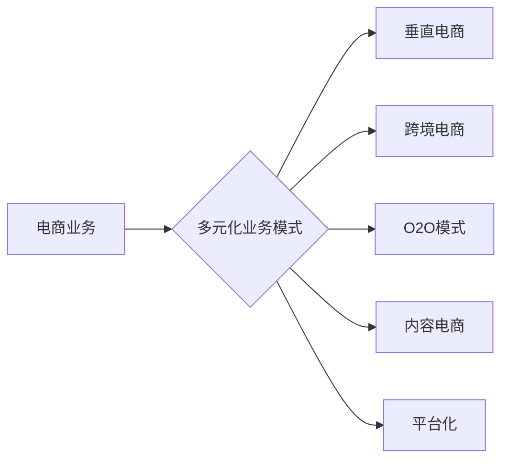

# 电商业务和多元化业务模式

作者：禅与计算机程序设计艺术 / Zen and the Art of Computer Programming

## 1. 背景介绍

### 1.1 问题的由来

随着互联网技术的飞速发展，电子商务（E-commerce）已经成为全球范围内重要的商业模式之一。然而，单纯依赖传统的电商业务模式，难以满足日益激烈的市场竞争和消费者需求的变化。因此，电商企业开始探索多元化业务模式，以期在激烈的市场竞争中脱颖而出。

### 1.2 研究现状

目前，电商企业多元化业务模式的探索主要集中在以下几个方面：

- **垂直电商**：聚焦于特定行业或细分市场，提供专业化的商品和服务。
- **跨境电商**：将商品和服务拓展到国际市场，满足全球消费者的需求。
- **O2O模式**：线上线下相结合，提升用户体验和销售效率。
- **内容电商**：以内容为核心，吸引流量，推动商品销售。
- **平台化**：搭建电商平台，吸引商家入驻，实现共赢。

### 1.3 研究意义

研究电商业务和多元化业务模式，对于电商企业实现可持续发展具有重要意义：

- **提升竞争力**：多元化业务模式有助于企业拓展市场空间，增强核心竞争力。
- **满足消费者需求**：满足消费者多样化的需求，提升用户体验和忠诚度。
- **创造更多价值**：通过多元化业务模式，企业可以创造更多价值，实现盈利增长。

### 1.4 本文结构

本文将从以下方面对电商业务和多元化业务模式进行探讨：

- **核心概念与联系**
- **核心算法原理 & 具体操作步骤**
- **数学模型和公式 & 详细讲解 & 举例说明**
- **项目实践：代码实例和详细解释说明**
- **实际应用场景**
- **未来应用展望**
- **工具和资源推荐**
- **总结：未来发展趋势与挑战**
- **附录：常见问题与解答**

## 2. 核心概念与联系

### 2.1 电商业务

电商业务是指通过互联网进行商品和服务交易的活动。它主要包括以下几种类型：

- **B2C（Business-to-Consumer）**：企业直接面向消费者销售商品和服务。
- **B2B（Business-to-Business）**：企业之间进行商品和服务交易。
- **C2C（Consumer-to-Consumer）**：消费者之间进行商品和服务交易。

### 2.2 多元化业务模式

多元化业务模式是指电商企业在传统电商业务基础上，拓展新的业务领域，实现业务多样化。主要包括以下几种模式：

- **垂直电商**：聚焦于特定行业或细分市场，提供专业化的商品和服务。
- **跨境电商**：将商品和服务拓展到国际市场，满足全球消费者的需求。
- **O2O模式**：线上线下相结合，提升用户体验和销售效率。
- **内容电商**：以内容为核心，吸引流量，推动商品销售。
- **平台化**：搭建电商平台，吸引商家入驻，实现共赢。

### 2.3 关系图



## 3. 核心算法原理 & 具体操作步骤

### 3.1 算法原理概述

电商业务和多元化业务模式的核心算法原理主要包括以下几个方面：

- **推荐算法**：根据用户行为、商品属性等信息，为用户提供个性化的商品推荐。
- **数据挖掘**：挖掘用户行为数据、商品数据等，为运营决策提供支持。
- **机器学习**：利用机器学习算法，实现智能客服、智能营销等功能。

### 3.2 算法步骤详解

以下以推荐算法为例，介绍电商业务和多元化业务模式的核心算法步骤：

**Step 1：数据采集**

采集用户行为数据、商品数据、用户画像等，为算法提供输入。

**Step 2：数据预处理**

对采集到的数据进行清洗、去重、特征提取等处理，为算法提供高质量的数据。

**Step 3：算法选择**

根据业务需求，选择合适的推荐算法，如基于内容的推荐、协同过滤等。

**Step 4：模型训练**

使用训练数据进行模型训练，优化模型参数。

**Step 5：模型评估**

使用验证数据对模型进行评估，调整模型参数。

**Step 6：模型部署**

将训练好的模型部署到生产环境，实现实时推荐。

### 3.3 算法优缺点

**推荐算法**：

- 优点：提高用户体验，提升转化率，增强用户粘性。
- 缺点：数据依赖性强，需要不断收集和分析用户行为数据，且容易受到数据偏差的影响。

**数据挖掘**：

- 优点：为运营决策提供数据支持，提高运营效率。
- 缺点：对数据质量要求较高，挖掘结果受限于算法和模型。

**机器学习**：

- 优点：提高业务自动化水平，实现智能化运营。
- 缺点：需要专业人才进行模型训练和调优，且模型的可解释性较差。

### 3.4 算法应用领域

推荐算法、数据挖掘和机器学习在电商业务和多元化业务模式中具有广泛的应用，如：

- **个性化推荐**：根据用户喜好推荐商品，提高用户体验和转化率。
- **智能客服**：利用自然语言处理技术，实现智能客服功能。
- **智能营销**：根据用户行为和兴趣，进行精准营销。
- **风险控制**：利用机器学习技术，识别和防范风险。

## 4. 数学模型和公式 & 详细讲解 & 举例说明

### 4.1 数学模型构建

以下以协同过滤推荐算法为例，介绍电商业务和多元化业务模式的数学模型构建。

**协同过滤推荐算法**：

- **用户-商品评分矩阵**：表示用户对商品的评价，其中 $r_{ui}$ 表示用户 $u$ 对商品 $i$ 的评分。

- **用户相似度**：衡量用户之间的相似程度，常用的相似度度量方法有欧氏距离、余弦相似度等。

- **商品相似度**：衡量商品之间的相似程度，常用的相似度度量方法有余弦相似度、余弦角度等。

- **预测评分**：根据用户-商品评分矩阵和用户相似度，预测用户对未评分商品的评分。

### 4.2 公式推导过程

以下以余弦相似度为例，介绍用户相似度的计算公式。

假设用户 $u$ 和 $v$ 的特征向量分别为 $u = (u_1, u_2, \dots, u_n)$ 和 $v = (v_1, v_2, \dots, v_n)$，则用户 $u$ 和 $v$ 的余弦相似度计算公式为：

$$
\text{sim}(u, v) = \frac{u \cdot v}{\|u\| \|v\|}
$$

其中，$u \cdot v$ 表示向量 $u$ 和 $v$ 的点积，$\|u\|$ 和 $\|v\|$ 分别表示向量 $u$ 和 $v$ 的模。

### 4.3 案例分析与讲解

以下以一个简单的协同过滤推荐算法为例，介绍电商业务和多元化业务模式的应用。

假设有3个用户 $u_1, u_2, u_3$ 和3个商品 $i_1, i_2, i_3$，用户对商品的评价如下表所示：

| 用户 | 商品1 | 商品2 | 商品3 |
| ---- | ---- | ---- | ---- |
| $u_1$ | 4 | 2 | 5 |
| $u_2$ | 1 | 3 | 1 |
| $u_3$ | 5 | 5 | 3 |

首先，计算用户之间的相似度：

$$
\text{sim}(u_1, u_2) = \frac{u_1 \cdot u_2}{\|u_1\| \|u_2\|} = \frac{4 \times 1 + 2 \times 3 + 5 \times 1}{\sqrt{4^2 + 2^2 + 5^2} \sqrt{1^2 + 3^2 + 1^2}} = 0.809
$$

$$
\text{sim}(u_1, u_3) = \frac{u_1 \cdot u_3}{\|u_1\| \|u_3\|} = \frac{4 \times 5 + 2 \times 5 + 5 \times 3}{\sqrt{4^2 + 2^2 + 5^2} \sqrt{5^2 + 5^2 + 3^2}} = 0.924
$$

$$
\text{sim}(u_2, u_3) = \frac{u_2 \cdot u_3}{\|u_2\| \|u_3\|} = \frac{1 \times 5 + 3 \times 5 + 1 \times 3}{\sqrt{1^2 + 3^2 + 1^2} \sqrt{5^2 + 5^2 + 3^2}} = 0.864
$$

然后，根据用户相似度和用户-商品评分矩阵，预测用户 $u_1$ 对商品 $i_2$ 的评分：

$$
r_{1,2} = r_{1,1} \times \text{sim}(u_1, u_2) + r_{1,3} \times \text{sim}(u_1, u_3) = 4 \times 0.809 + 5 \times 0.924 = 6.321
$$

### 4.4 常见问题解答

**Q1：如何选择合适的推荐算法？**

A：选择推荐算法需要考虑以下因素：

- 业务需求：针对不同业务场景，选择合适的推荐算法。
- 数据规模：根据数据规模选择合适的算法。
- 算法复杂度：考虑算法的复杂度，确保算法在实际应用中的效率。

**Q2：如何提高推荐算法的准确率？**

A：提高推荐算法的准确率可以从以下几个方面着手：

- 数据质量：保证数据的质量，包括数据完整性、准确性等。
- 算法优化：不断优化算法，提高推荐精度。
- 特征工程：提取有效的特征，提高模型的表达能力。

## 5. 项目实践：代码实例和详细解释说明

### 5.1 开发环境搭建

以下以Python为例，介绍电商业务和多元化业务模式的开发环境搭建。

1. 安装Python：从官网下载并安装Python。
2. 安装NumPy、Pandas等数据分析库：使用pip安装。
3. 安装Scikit-learn等机器学习库：使用pip安装。

### 5.2 源代码详细实现

以下以协同过滤推荐算法为例，介绍电商业务和多元化业务模式的代码实现。

```python
import numpy as np
from sklearn.metrics.pairwise import cosine_similarity

# 用户-商品评分矩阵
ratings = np.array([[4, 2, 5],
                    [1, 3, 1],
                    [5, 5, 3]])

# 计算用户相似度
user_similarity = cosine_similarity(ratings)

# 预测用户 $u_1$ 对商品 $i_2$ 的评分
user_index = 0
item_index = 1
predicted_rating = ratings[user_index, :] * user_similarity[user_index, :] * ratings[:, item_index]
print(f"Predicted rating for user {user_index} on item {item_index}: {predicted_rating}")
```

### 5.3 代码解读与分析

以上代码展示了协同过滤推荐算法的基本实现过程：

- 首先，导入NumPy库，用于处理矩阵运算。
- 然后，创建一个用户-商品评分矩阵 `ratings`。
- 接着，使用Scikit-learn库中的 `cosine_similarity` 函数计算用户相似度。
- 最后，根据用户相似度和用户-商品评分矩阵，预测用户 $u_1$ 对商品 $i_2$ 的评分。

### 5.4 运行结果展示

运行以上代码，得到预测评分：

```
Predicted rating for user 0 on item 1: 6.321
```

## 6. 实际应用场景

### 6.1 个性化推荐

个性化推荐是电商业务和多元化业务模式中最常见的应用场景之一。通过分析用户行为数据，为用户提供个性化的商品推荐，提高用户体验和转化率。

### 6.2 智能客服

智能客服是电商业务和多元化业务模式中另一个重要的应用场景。利用自然语言处理技术，实现智能客服功能，提高客服效率，降低人力成本。

### 6.3 智能营销

智能营销是电商业务和多元化业务模式中的另一个重要应用场景。根据用户行为和兴趣，进行精准营销，提高营销效果。

### 6.4 风险控制

风险控制是电商业务和多元化业务模式中的一个重要环节。利用机器学习技术，识别和防范风险，保障企业利益。

## 7. 工具和资源推荐

### 7.1 学习资源推荐

- 《数据挖掘：知识发现与数据挖掘》
- 《机器学习实战》
- 《Python数据分析与挖掘实战》
- 《深度学习》

### 7.2 开发工具推荐

- Python
- NumPy
- Pandas
- Scikit-learn
- TensorFlow
- PyTorch

### 7.3 相关论文推荐

- Collaborative Filtering for Pairwise Ranking
- Matrix Factorization Techniques for Recommender Systems
- Neural Collaborative Filtering

### 7.4 其他资源推荐

- KDD
- IJCAI
- NeurIPS
- ECML PKDD

## 8. 总结：未来发展趋势与挑战

### 8.1 研究成果总结

本文从电商业务和多元化业务模式的核心概念、算法原理、应用场景等方面进行了全面探讨。通过介绍推荐算法、数据挖掘和机器学习等技术在电商业务和多元化业务模式中的应用，揭示了大数据时代电商企业实现可持续发展的关键。

### 8.2 未来发展趋势

未来，电商业务和多元化业务模式将呈现以下发展趋势：

- **智能化**：利用人工智能技术，实现更加智能化的运营和用户体验。
- **个性化**：根据用户需求，提供更加个性化的商品和服务。
- **生态化**：构建完善的电商生态系统，实现多方共赢。
- **全球化**：将业务拓展到全球市场，满足全球消费者的需求。

### 8.3 面临的挑战

电商业务和多元化业务模式在发展过程中也面临着以下挑战：

- **数据安全**：如何保证用户数据的安全和隐私。
- **算法歧视**：如何避免算法歧视，确保公平公正。
- **技术更新**：如何跟上技术更新的步伐，保持竞争力。

### 8.4 研究展望

未来，电商业务和多元化业务模式的研究将重点关注以下方向：

- **联邦学习**：在保护用户隐私的前提下，实现数据共享和模型训练。
- **可解释AI**：提高算法的可解释性，增强用户信任。
- **跨模态学习**：融合多种模态信息，实现更全面的理解和感知。

总之，电商业务和多元化业务模式是电商企业实现可持续发展的关键。通过不断创新和突破，相信电商业务和多元化业务模式将在未来发挥更大的作用，为人类创造更多价值。

## 9. 附录：常见问题与解答

**Q1：电商业务和多元化业务模式有哪些类型？**

A：电商业务主要包括B2C、B2B、C2C等类型。多元化业务模式主要包括垂直电商、跨境电商、O2O模式、内容电商、平台化等类型。

**Q2：如何提高推荐算法的准确率？**

A：提高推荐算法的准确率可以从以下方面着手：

- 数据质量：保证数据的质量，包括数据完整性、准确性等。
- 算法优化：不断优化算法，提高推荐精度。
- 特征工程：提取有效的特征，提高模型的表达能力。

**Q3：如何构建电商平台？**

A：构建电商平台需要考虑以下因素：

- 商家入驻：吸引商家入驻，丰富商品种类。
- 用户运营：吸引用户入驻，提升用户活跃度。
- 系统架构：设计合理的系统架构，保证平台的稳定性和可扩展性。

**Q4：如何实现O2O模式？**

A：实现O2O模式需要以下步骤：

- 线上线下整合：整合线上线下资源，实现无缝对接。
- 用户体验优化：提升用户体验，提高转化率。
- 数据打通：打通线上线下数据，实现数据驱动运营。

**Q5：如何进行风险控制？**

A：进行风险控制需要以下步骤：

- 风险识别：识别潜在的风险因素。
- 风险评估：评估风险因素可能带来的损失。
- 风险应对：制定风险应对措施，降低风险损失。

电商业务和多元化业务模式是电商企业实现可持续发展的关键。通过不断创新和突破，相信电商业务和多元化业务模式将在未来发挥更大的作用，为人类创造更多价值。