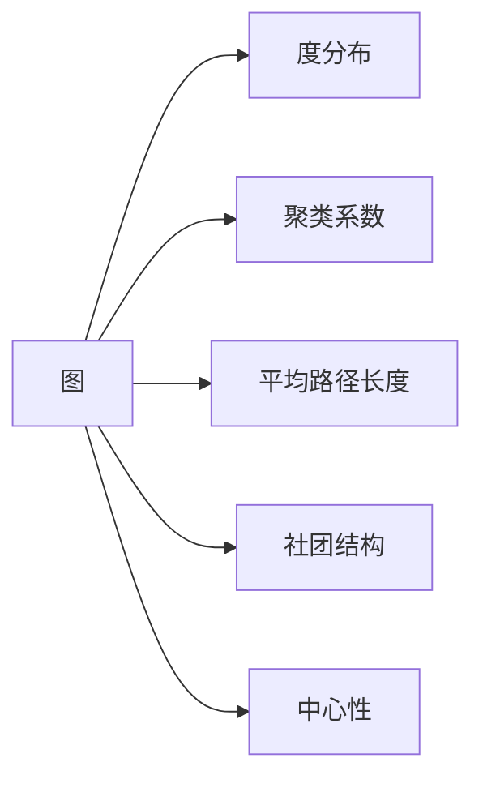
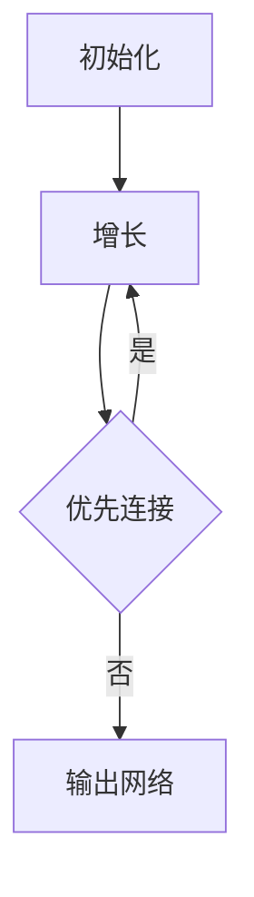

# 计算：第四部分 计算的极限 第 11 章 复杂性计算 网络科学

作者：禅与计算机程序设计艺术 / Zen and the Art of Computer Programming

## 1. 背景介绍
### 1.1  问题的由来
在当今高度互联的世界中,复杂网络无处不在。从社交网络、交通网络到生物网络,这些复杂系统展现出令人惊叹的结构和动力学特征。传统的还原论方法难以捕捉其内在机理,因此亟需发展新的研究范式。网络科学应运而生,它从复杂网络的拓扑结构和演化动力学角度来刻画其行为,为理解复杂系统提供了全新视角。

### 1.2 研究现状  
近年来,网络科学取得了长足进展。一方面,大规模网络数据的可获得性大大提高,为实证研究提供了坚实基础;另一方面,统计物理学、非线性动力学、图论等学科的交叉融合,极大地丰富和深化了网络科学的理论体系。一些里程碑式的工作,如小世界网络、无标度网络等,揭示了现实复杂网络的普适特征。同时,关联网络、时间网络、多层网络等新概念的提出,进一步拓展了研究视野。

### 1.3 研究意义
网络科学的重要意义体现在多个方面:

1. 理论突破:网络科学为复杂系统研究提供了崭新的理论框架和分析工具,有望实现从定性到定量、从现象到机理的飞跃。

2. 现实应用:对复杂网络的深入理解,可指导我们优化现有网络功能(如网络搜索、推荐系统等),增强系统的鲁棒性,控制流行病的蔓延等,具有广泛的应用前景。

3. 交叉融合:网络科学是一门高度交叉的学科,它不断吸收相关领域的新思想、新方法,同时也为其他学科研究复杂系统提供了新的视角和范式,促进了学科交叉与融合。

### 1.4 本文结构
本文将系统阐述网络科学的核心概念、理论模型和分析方法。第2部分介绍网络科学的核心概念;第3部分重点讨论复杂网络的建模与演化;第4部分系统总结复杂网络的统计特征;第5部分通过实例展示复杂网络分析的典型流程;第6部分探讨网络科学的应用场景;第7部分梳理相关工具与资源;第8部分对全文进行总结并展望未来发展方向。

## 2. 核心概念与联系
网络科学的理论基础可概括为以下几个核心概念:

- 图(Graph):复杂网络可抽象为由节点(Node)和连边(Edge)组成的图,是网络的基本表示。

- 度分布(Degree Distribution):度的统计分布,反映了网络节点的异质性。

- 聚类系数(Clustering Coefficient):刻画了网络的局部集聚特性,度量了节点倾向于形成紧密群组的程度。

- 平均路径长度(Average Path Length):网络中任意两节点间最短路径的平均长度,反映了网络的"小世界"特性。

- 社团结构(Community Structure):网络中存在的紧密连接的节点子群,揭示了网络的层次组织。

- 中心性(Centrality):度量节点在网络中的重要程度,常用指标有度中心性、介数中心性、接近中心性等。

这些概念相互联系、相互补充,共同构成了描述复杂网络的基本语言。下图展示了它们之间的逻辑关系:



## 3. 核心算法原理 & 具体操作步骤
### 3.1 算法原理概述
复杂网络的建模与演化是网络科学的核心问题之一。经典的网络模型有:

- ER随机图(Erdős–Rényi model):假设任意两节点以等概率连接,生成随机网络。

- WS小世界网络(Watts-Strogatz model):在规则网络的基础上随机重连部分边,生成兼具高聚类和短路径的网络。

- BA无标度网络(Barabási–Albert model):基于增长和优先连接机制,生成幂律度分布的网络。

这些模型从不同侧面揭示了现实网络的统计特征,为深入理解网络形成机制提供了重要线索。

### 3.2 算法步骤详解
以BA模型为例,其生成算法可描述为:

1. 初始化:从包含$m_0$个节点的完全图开始。

2. 增长:每次加入一个新节点,并与已有的$m$个节点相连($m\leq m_0$)。

3. 优先连接:新节点与节点$i$相连的概率$p_i$正比于$i$的度$k_i$,即
   
   $$p_i=\frac{k_i}{\sum_j k_j}$$

4. 重复步骤2-3,直到网络达到预设规模。

该算法可用下图表示:



### 3.3 算法优缺点
BA模型的优点在于:
- 简单直观,容易实现
- 生成的网络具有无标度特性,与现实网络吻合

但它也存在一些局限:
- 忽略了节点的非度属性,如节点的引入时间、适应度等
- 生成的网络平均路径长度偏大,聚类系数偏低

### 3.4 算法应用领域
BA模型及其扩展版本被广泛应用于社交网络、引文网络、代谢网络等领域,用于刻画网络的宏观统计特征和微观形成机制。

## 4. 数学模型和公式 & 详细讲解 & 举例说明
### 4.1 数学模型构建
网络的数学表示通常采用邻接矩阵(Adjacency Matrix)。对于一个有$N$个节点的网络,其邻接矩阵$A$是一个$N\times N$的方阵,当节点$i$和$j$之间有连边时,$a_{ij}=1$,否则$a_{ij}=0$。

无权网络的邻接矩阵是对称的,而有权网络的邻接矩阵则未必。利用邻接矩阵,可方便地计算网络的各项统计指标。

### 4.2 公式推导过程
以度分布为例,无标度网络的度分布服从幂律,即:

$$p(k)\sim k^{-\gamma}$$

其中$\gamma$为幂指数。在BA模型中,可推导出$\gamma=3$。具体过程如下:

设$k_i(t)$为$t$时刻节点$i$的度,由连续近似可得其动力学方程:

$$\frac{dk_i}{dt}=m\frac{k_i}{\sum_j k_j}=\frac{k_i}{2t}$$

考虑初始条件$k_i(t_i)=m$,解得:

$$k_i(t)=m\left(\frac{t}{t_i}\right)^{1/2}$$

进而可推出度分布为:

$$p(k)=\frac{\partial P(k_i(t)<k)}{\partial k}=\frac{2m^2}{k^3}$$

即$\gamma=3$。

### 4.3 案例分析与讲解
下图展示了一个BA无标度网络的度分布,可见其在双对数坐标下呈现出明显的线性关系,与幂律分布相吻合。


### 4.4 常见问题解答
Q: 现实网络的度分布是否都服从幂律?
A: 并非如此。尽管许多现实网络展现出无标度特性,但也有不少网络的度分布偏离幂律,如指数分布、高斯分布等。网络的度分布取决于其形成机制和所处的具体领域。

Q: 幂律分布意味着什么?
A: 幂律分布反映了网络节点的异质性,即少数节点拥有极高的度,而大多数节点的度较低。这种不均衡的结构赋予网络独特的动力学特性,如对随机攻击的鲁棒性和对目标攻击的脆弱性。

## 5. 项目实践：代码实例和详细解释说明
### 5.1 开发环境搭建
本节以Python为例,介绍复杂网络分析的典型流程。首先需要安装NetworkX包:

```
pip install networkx
```

NetworkX是一个功能强大的复杂网络分析库,提供了丰富的数据结构和算法。

### 5.2 源代码详细实现
以下代码生成一个BA无标度网络,并计算其统计指标:

```python
import networkx as nx
import matplotlib.pyplot as plt

# 生成BA网络
N = 1000  # 节点数
m = 2  # 每次加入m条边 
G = nx.barabasi_albert_graph(N, m) 

# 可视化
pos = nx.spring_layout(G)  # 节点布局
nx.draw(G, pos, with_labels=False, node_size=30, width=0.2)

# 度分布
degree_sequence = [d for n, d in G.degree()]  # 节点度列表
plt.hist(degree_sequence, bins=50)  # 直方图
plt.xscale('log')
plt.yscale('log') 
plt.xlabel('Degree')
plt.ylabel('Count')

# 聚类系数
print(f"Clustering coefficient: {nx.average_clustering(G):.4f}")

# 平均路径长度
print(f"Average path length: {nx.average_shortest_path_length(G):.4f}")
```

### 5.3 代码解读与分析
- `barabasi_albert_graph(N, m)`生成一个N个节点、每次加入m条边的BA无标度网络。

- `spring_layout(G)`用力导向算法计算节点的布局坐标。

- `draw(G, pos, with_labels=False, node_size=30, width=0.2)`可视化网络,`with_labels=False`表示不显示节点标签,`node_size`控制节点大小,`width`控制边的宽度。

- `degree()`计算节点的度,返回一个(节点,度)元组的列表。

- `hist(degree_sequence, bins=50)`绘制度分布的直方图,`bins`控制直方图的条数。

- `xscale('log')`和`yscale('log')`将坐标轴设为对数刻度。

- `average_clustering(G)`计算网络的平均聚类系数。

- `average_shortest_path_length(G)`计算网络的平均路径长度。

### 5.4 运行结果展示
运行上述代码,可得到BA网络的可视化结果和度分布图,如下所示:


同时,控制台输出网络的聚类系数和平均路径长度:

```
Clustering coefficient: 0.0220
Average path length: 4.5768
```

可见,BA网络具有较小的平均路径长度和较低的聚类系数,体现了小世界特性和层次化结构。

## 6. 实际应用场景
网络科学在许多领域都有重要应用,典型场景包括:

- 社交网络分析:刻画用户互动行为,发现社区结构,预测链接。

- 疾病传播控制:建模流行病在人群中的传播过程,预测疫情趋势,优化免疫策略。

- 脑网络研究:分析脑区之间的结构和功能连接,探索脑认知的网络基础。

- 交通网络优化:研究交通流的时空分布,改善交通组织,提高运输效率。 

- 推荐系统:利用用户-物品二部网络,基于链接预测和社团发现算法,实现个性化推荐。

### 6.4 未来应用展望
随着数据规模和计算能力的不断提升,网络科学有望在更广泛的领域得到应用,如揭示金融市场的风险传导机制,优化供应链和物流系统,探索生命起源的分子