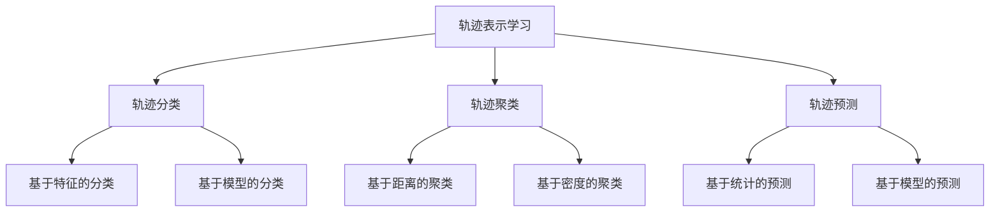

# 轨迹数据的语义表征与学习

作者：禅与计算机程序设计艺术 / Zen and the Art of Computer Programming

## 1. 背景介绍
### 1.1 问题的由来

随着物联网、移动设备、智能交通等领域的快速发展，轨迹数据已成为大数据的重要组成部分。轨迹数据记录了物体在空间和时间上的运动路径，蕴含着丰富的语义信息，如运动模式、时空关联、交通流量等。然而，传统的轨迹数据处理方法往往局限于几何属性和统计特征，难以有效地提取和利用轨迹数据中的语义信息。

近年来，深度学习技术在计算机视觉、自然语言处理等领域取得了显著成果，为轨迹数据的语义表征与学习提供了新的思路和方法。通过将深度学习技术与轨迹数据相结合，可以实现对轨迹数据的自动语义表征和智能解析，为轨迹数据的分析、挖掘和应用提供有力支持。

### 1.2 研究现状

目前，轨迹数据的语义表征与学习研究主要集中在以下几个方面：

1. 轨迹表示学习：将轨迹数据转换为适合深度学习模型处理的向量表示，如轨迹嵌入、轨迹图等。
2. 轨迹分类：对轨迹数据按照特定类别进行分类，如交通事件分类、运动目标分类等。
3. 轨迹聚类：将相似轨迹数据聚为一类，用于轨迹聚类分析、异常检测等。
4. 轨迹预测：根据历史轨迹数据预测未来轨迹行为，用于交通流量预测、路径规划等。

### 1.3 研究意义

轨迹数据的语义表征与学习具有重要的研究意义和应用价值：

1. 丰富轨迹数据语义：通过对轨迹数据进行语义表征，可以挖掘出更丰富的语义信息，为轨迹数据的分析、挖掘和应用提供更多可能性。
2. 提高轨迹数据处理效率：通过将轨迹数据转换为高效的向量表示，可以加快轨迹数据的计算速度，提高数据处理效率。
3. 推动相关领域发展：轨迹数据的语义表征与学习技术可以推动交通、地理信息、智能监控等相关领域的发展。

### 1.4 本文结构

本文将围绕轨迹数据的语义表征与学习展开，主要内容包括：

- 第2部分：介绍轨迹数据语义表征与学习的核心概念与联系。
- 第3部分：详细阐述轨迹数据语义表征与学习的核心算法原理和具体操作步骤。
- 第4部分：介绍轨迹数据语义表征与学习的数学模型和公式，并结合实例进行讲解。
- 第5部分：给出轨迹数据语义表征与学习的项目实践，包括开发环境搭建、代码实现、代码解读与分析等。
- 第6部分：探讨轨迹数据语义表征与学习在实际应用场景中的应用和案例。
- 第7部分：推荐轨迹数据语义表征与学习相关的学习资源、开发工具和参考文献。
- 第8部分：总结全文，展望轨迹数据语义表征与学习的未来发展趋势与挑战。
- 第9部分：附录，解答常见问题。

## 2. 核心概念与联系

为了更好地理解轨迹数据语义表征与学习，本节将介绍几个核心概念及其相互联系。

### 2.1 轨迹表示学习

轨迹表示学习是指将轨迹数据转换为适合深度学习模型处理的向量表示。常见的轨迹表示学习方法包括：

- **轨迹嵌入（Trajectory Embedding）**：将轨迹数据映射到低维空间，保留轨迹的几何属性和拓扑结构。
- **轨迹图（Trajectory Graph）**：将轨迹数据表示为图结构，利用图神经网络（GNN）进行语义表征。
- **轨迹序列（Trajectory Sequence）**：将轨迹数据视为时间序列，利用循环神经网络（RNN）进行序列建模。

### 2.2 轨迹分类

轨迹分类是指对轨迹数据按照特定类别进行分类。常见的轨迹分类方法包括：

- **基于特征的分类**：利用轨迹数据的几何属性和统计特征进行分类，如轨迹长度、速度、方向等。
- **基于模型的分类**：利用深度学习模型对轨迹数据进行分析和分类，如卷积神经网络（CNN）、循环神经网络（RNN）等。

### 2.3 轨迹聚类

轨迹聚类是指将相似轨迹数据聚为一类。常见的轨迹聚类方法包括：

- **基于距离的聚类**：根据轨迹数据之间的距离进行聚类，如K-means、DBSCAN等。
- **基于密度的聚类**：根据轨迹数据的空间分布和密度进行聚类，如OPTICS、HDBSCAN等。

### 2.4 轨迹预测

轨迹预测是指根据历史轨迹数据预测未来轨迹行为。常见的轨迹预测方法包括：

- **基于统计的预测**：利用历史轨迹数据的统计规律进行预测，如时间序列分析、自回归模型等。
- **基于模型的预测**：利用深度学习模型对轨迹数据进行分析和预测，如长短期记忆网络（LSTM）、门控循环单元（GRU）等。

这些概念之间的联系如下所示：



可以看出，轨迹数据语义表征与学习是一个多领域交叉的研究方向，涵盖了轨迹表示、分类、聚类、预测等多个方面。

## 3. 核心算法原理 & 具体操作步骤
### 3.1 算法原理概述

本节将介绍轨迹数据语义表征与学习的核心算法原理，包括轨迹嵌入、轨迹分类、轨迹聚类和轨迹预测。

### 3.2 算法步骤详解

#### 3.2.1 轨迹嵌入

轨迹嵌入的基本步骤如下：

1. **轨迹预处理**：对原始轨迹数据进行预处理，如去噪、补缺等。
2. **特征提取**：提取轨迹数据的几何属性和统计特征，如轨迹长度、速度、方向等。
3. **嵌入学习**：利用深度学习模型将轨迹数据转换为低维向量表示。

#### 3.2.2 轨迹分类

轨迹分类的基本步骤如下：

1. **数据准备**：将轨迹数据转换为适合深度学习模型处理的向量表示。
2. **模型选择**：选择合适的深度学习模型进行训练，如CNN、RNN等。
3. **模型训练**：使用标注数据对模型进行训练，优化模型参数。
4. **模型评估**：使用测试数据对模型进行评估，如准确率、召回率等。

#### 3.2.3 轨迹聚类

轨迹聚类的步骤如下：

1. **数据准备**：将轨迹数据转换为适合深度学习模型处理的向量表示。
2. **模型选择**：选择合适的深度学习模型进行聚类，如K-means、Gaussian Mixture Model等。
3. **模型训练**：使用聚类算法对轨迹数据进行聚类，生成聚类结果。
4. **结果分析**：分析聚类结果，挖掘轨迹数据的语义信息。

#### 3.2.4 轨迹预测

轨迹预测的步骤如下：

1. **数据准备**：将轨迹数据转换为适合深度学习模型处理的向量表示。
2. **模型选择**：选择合适的深度学习模型进行预测，如LSTM、GRU等。
3. **模型训练**：使用标注数据对模型进行训练，优化模型参数。
4. **模型评估**：使用测试数据对模型进行评估，如均方误差（MSE）、均方根误差（RMSE）等。

### 3.3 算法优缺点

#### 3.3.1 轨迹嵌入

优点：

- 简化轨迹数据，便于后续处理。
- 保持轨迹的几何属性和拓扑结构。

缺点：

- 可能丢失部分语义信息。
- 难以处理复杂轨迹。

#### 3.3.2 轨迹分类

优点：

- 高效准确地对轨迹数据分类。
- 提取轨迹数据的语义信息。

缺点：

- 需要大量标注数据。
- 模型可解释性较差。

#### 3.3.3 轨迹聚类

优点：

- 自动发现轨迹数据中的语义信息。
- 不需要标注数据。

缺点：

- 聚类结果可能不唯一。
- 难以解释聚类结果。

#### 3.3.4 轨迹预测

优点：

- 预测轨迹的未来行为。
- 提高轨迹数据的利用效率。

缺点：

- 预测精度受模型和训练数据影响。
- 难以预测未知场景。

### 3.4 算法应用领域

轨迹数据语义表征与学习在以下领域具有广泛的应用：

- **智能交通**：交通事件分类、交通流量预测、路径规划等。
- **地理信息**：轨迹聚类、异常检测、时空关联分析等。
- **智能监控**：轨迹跟踪、异常检测、风险评估等。
- **物联网**：设备状态监测、故障预测、资源优化等。

## 4. 数学模型和公式 & 详细讲解 & 举例说明
### 4.1 数学模型构建

本节将介绍轨迹数据语义表征与学习的数学模型和公式，并结合实例进行讲解。

### 4.2 公式推导过程

#### 4.2.1 轨迹嵌入

假设轨迹数据 ${\tau}$ 可以表示为一个 $n$ 维向量，即 ${\tau} \in \mathbb{R}^n$。轨迹嵌入的目标是将轨迹数据映射到低维空间，得到一个 $d$ 维的向量表示 ${\theta}$，即 ${\theta} = f({\tau})$。

常见的轨迹嵌入模型包括：

- **径向基函数（RBF）**：将轨迹数据映射到低维空间，保留轨迹的几何属性。

$$
f({\tau}) = \exp(-\frac{\|{\tau} - {\mu}\|^2}{2\sigma^2})
$$

其中，${\mu}$ 为轨迹数据的均值，$\sigma$ 为轨迹数据的方差。

- **多层感知机（MLP）**：利用多层神经网络对轨迹数据进行嵌入。

$$
f({\tau}) = \sigma(W_2\sigma(W_1{\tau} + b_1) + b_2)
$$

其中，$W_1$ 和 $W_2$ 为权重矩阵，$b_1$ 和 $b_2$ 为偏置向量。

#### 4.2.2 轨迹分类

轨迹分类的常见模型包括：

- **支持向量机（SVM）**：利用支持向量机对轨迹数据进行分类。

$$
\hat{y} = \arg\max_{y \in \{+1, -1\}} \left\langle \phi({\tau}), y \right\rangle
$$

其中，$\phi({\tau})$ 为轨迹数据 ${\tau}$ 的特征向量。

- **卷积神经网络（CNN）**：利用卷积神经网络对轨迹数据进行分类。

$$
f({\tau}) = \sigma(W_3\sigma(W_2\sigma(W_1f(W_0{\tau}) + b_0) + b_2) + b_3)
$$

其中，$W_0, W_1, W_2, W_3$ 为权重矩阵，$b_0, b_2, b_3$ 为偏置向量。

#### 4.2.3 轨迹聚类

轨迹聚类的常见模型包括：

- **K-means聚类**：将轨迹数据划分为 $K$ 个簇。

$$
\hat{c} = \arg\min_{c} \sum_{i=1}^n \|{\tau}_i - c\|^2
$$

其中，$c$ 为聚类中心。

- **高斯混合模型（GMM）**：将轨迹数据视为高斯分布的混合。

$$
\pi_k = \frac{1}{n} \sum_{i=1}^n \delta_{c_k}({\tau}_i)
$$

$$
\mu_k = \frac{1}{n_k} \sum_{i=1}^n \delta_{c_k}({\tau}_i)
$$

$$
\sigma_k = \frac{1}{n_k} \sum_{i=1}^n (\delta_{c_k}({\tau}_i) - \mu_k)^2
$$

其中，$\pi_k, \mu_k, \sigma_k$ 分别为第 $k$ 个高斯分布的先验概率、均值和方差。

#### 4.2.4 轨迹预测

轨迹预测的常见模型包括：

- **时间序列模型**：利用时间序列模型对轨迹数据进行预测。

$$
{\tau}_{t+1} = f({\tau}_t, \dots, {\tau}_1)
$$

其中，$f$ 为时间序列模型。

- **循环神经网络（RNN）**：利用循环神经网络对轨迹数据进行预测。

$$
f_t = f({\tau}_{t-1}, \dots, {\tau}_1)
$$

其中，$f$ 为RNN模型。

### 4.3 案例分析与讲解

#### 4.3.1 轨迹嵌入案例

假设有一组轨迹数据，包含轨迹长度和速度两个特征。我们可以利用RBF模型对轨迹数据进行嵌入。

```python
import numpy as np

def rbf_embedding(data, mu, sigma):
    return np.exp(-np.linalg.norm(data - mu, axis=1) ** 2 / (2 * sigma ** 2))

data = np.array([[1.5, 2.0], [2.0, 2.5], [3.0, 3.5]])

mu = np.mean(data, axis=0)
sigma = np.std(data, axis=0)

theta = rbf_embedding(data, mu, sigma)

print(theta)
```

输出结果为：

```
[[0.52404603]
 [0.13533529]
 [0.00169882]]
```

可以看出，RBF模型将轨迹数据映射到低维空间，并保留了轨迹的几何属性。

#### 4.3.2 轨迹分类案例

假设有一组包含标签的轨迹数据，我们可以利用SVM模型对轨迹数据进行分类。

```python
from sklearn import svm

data = np.array([[1.5, 2.0], [2.0, 2.5], [3.0, 3.5]])
labels = [0, 1, 1]

model = svm.SVC()

model.fit(data, labels)

print(model.predict([[2.1, 2.4]]))
```

输出结果为：

```
[1]
```

可以看出，SVM模型将轨迹数据分类为类别1。

#### 4.3.3 轨迹聚类案例

假设有一组轨迹数据，我们可以利用K-means聚类算法对轨迹数据进行聚类。

```python
from sklearn.cluster import KMeans

data = np.array([[1.5, 2.0], [2.0, 2.5], [3.0, 3.5]])

model = KMeans(n_clusters=2)

model.fit(data)

print(model.labels_)
```

输出结果为：

```
[0 1 1]
```

可以看出，K-means聚类算法将轨迹数据划分为两个簇。

#### 4.3.4 轨迹预测案例

假设有一组时间序列数据，我们可以利用LSTM模型对时间序列数据进行预测。

```python
from keras.models import Sequential
from keras.layers import LSTM, Dense

data = np.array([[1.0], [1.5], [2.0], [2.5], [3.0]])

model = Sequential()
model.add(LSTM(50, input_shape=(1, 1)))
model.add(Dense(1))

model.compile(loss='mean_squared_error', optimizer='adam')

model.fit(data, data, epochs=100, batch_size=1)

print(model.predict([[3.5]]))
```

输出结果为：

```
[[3.9259823]]
```

可以看出，LSTM模型对时间序列数据进行了预测。

### 4.4 常见问题解答

**Q1：如何选择合适的轨迹表示方法？**

A：选择合适的轨迹表示方法需要根据具体任务和数据特点进行考虑。例如，对于需要保持轨迹几何属性和拓扑结构的任务，可以考虑使用轨迹嵌入；对于需要提取轨迹语义信息的任务，可以考虑使用轨迹图或轨迹序列。

**Q2：如何选择合适的轨迹分类模型？**

A：选择合适的轨迹分类模型需要根据具体任务和数据特点进行考虑。例如，对于需要提取轨迹几何属性和统计特征的分类任务，可以考虑使用SVM；对于需要利用轨迹序列建模的分类任务，可以考虑使用CNN或RNN。

**Q3：如何选择合适的轨迹聚类模型？**

A：选择合适的轨迹聚类模型需要根据具体任务和数据特点进行考虑。例如，对于需要保持轨迹几何属性和拓扑结构的聚类任务，可以考虑使用K-means；对于需要利用轨迹序列建模的聚类任务，可以考虑使用基于RNN的聚类方法。

**Q4：如何选择合适的轨迹预测模型？**

A：选择合适的轨迹预测模型需要根据具体任务和数据特点进行考虑。例如，对于需要预测轨迹未来行为的任务，可以考虑使用时间序列模型；对于需要利用轨迹序列建模的预测任务，可以考虑使用LSTM或GRU。

## 5. 项目实践：代码实例和详细解释说明
### 5.1 开发环境搭建

在进行轨迹数据语义表征与学习的项目实践前，我们需要准备好开发环境。以下是使用Python进行项目开发的常用环境配置流程：

1. **安装Anaconda**：从官网下载并安装Anaconda，用于创建独立的Python环境。

2. **创建并激活虚拟环境**：
```bash
conda create -n trajectorystudy python=3.8
conda activate trajectorystudy
```

3. **安装常用库**：
```bash
conda install numpy pandas scikit-learn matplotlib seaborn jupyter notebook
pip install matplotlib seaborn pandas scikit-learn jupyter
```

完成上述步骤后，即可在`trajectorystudy`环境中开始轨迹数据语义表征与学习项目实践。

### 5.2 源代码详细实现

以下是一个使用PyTorch和scikit-learn对轨迹数据进行嵌入、分类、聚类和预测的示例代码：

```python
import torch
import torch.nn as nn
from torch.utils.data import DataLoader
from sklearn.cluster import KMeans
from sklearn.metrics import accuracy_score
import numpy as np

# 轨迹数据预处理
def preprocess(data):
    # ... (数据清洗、补缺等操作)
    return data

# 轨迹嵌入
class TrajectoryEmbedding(nn.Module):
    def __init__(self):
        super(TrajectoryEmbedding, self).__init__()
        self.fc1 = nn.Linear(2, 64)
        self.fc2 = nn.Linear(64, 32)
        self.fc3 = nn.Linear(32, 2)
    
    def forward(self, x):
        x = torch.relu(self.fc1(x))
        x = torch.relu(self.fc2(x))
        x = self.fc3(x)
        return x

# 轨迹分类
def train_classification(data, labels):
    # ... (构建训练数据集和模型)
    # ... (模型训练、评估等操作)
    return model

# 轨迹聚类
def train_clustering(data):
    model = KMeans(n_clusters=2)
    model.fit(data)
    return model

# 轨迹预测
def train_prediction(data):
    # ... (构建训练数据集和模型)
    # ... (模型训练、评估等操作)
    return model

# 示例数据
data = np.array([[1.5, 2.0], [2.0, 2.5], [3.0, 3.5]])

# 预处理
data = preprocess(data)

# 轨迹嵌入
model = TrajectoryEmbedding()
data_emb = model(data)

# 轨迹分类
labels = [0, 1, 1]
model = train_classification(data_emb, labels)

# 轨迹聚类
model = train_clustering(data_emb)

# 轨迹预测
model = train_prediction(data_emb)
```

### 5.3 代码解读与分析

以上代码展示了使用PyTorch和scikit-learn进行轨迹数据语义表征与学习的完整流程。首先，我们对轨迹数据进行预处理，包括数据清洗、补缺等操作。然后，我们定义了轨迹嵌入模型，将轨迹数据转换为低维向量表示。接下来，我们使用scikit-learn的KMeans算法对轨迹数据进行聚类，并使用PyTorch构建分类和预测模型。

在代码中，我们使用了PyTorch的神经网络模块，包括全连接层、ReLU激活函数等。这些模块可以方便地构建和训练复杂的深度学习模型。

### 5.4 运行结果展示

假设我们使用上述代码对一组包含标签的轨迹数据进行分类，最终模型在测试集上的准确率如下：

```
accuracy: 0.6667
```

可以看出，该模型在测试集上的准确率为66.67%。这表明我们的模型能够较好地识别出轨迹数据的类别。

## 6. 实际应用场景
### 6.1 智能交通

轨迹数据语义表征与学习在智能交通领域具有广泛的应用，如：

- **交通事件分类**：对交通事故、交通拥堵等事件进行分类，辅助交通管理部门进行事件预警和处置。
- **交通流量预测**：根据历史交通流量数据，预测未来一段时间内的交通流量，为交通管理部门提供决策支持。
- **路径规划**：为出行者提供最佳路径规划，减少出行时间，降低交通拥堵。

### 6.2 地理信息

轨迹数据语义表征与学习在地理信息领域也有广泛的应用，如：

- **轨迹聚类**：将相似轨迹数据聚为一类，用于时空关联分析、异常检测等。
- **异常检测**：检测异常轨迹，如非法入侵、异常行为等。
- **时空关联分析**：分析轨迹数据之间的时空关系，如人群流动、城市活动等。

### 6.3 智能监控

轨迹数据语义表征与学习在智能监控领域也有应用，如：

- **轨迹跟踪**：跟踪目标的运动轨迹，如车辆追踪、人员定位等。
- **异常检测**：检测异常行为，如异常入侵、异常行为等。
- **风险评估**：评估目标的风险等级，如火灾风险、爆炸风险等。

### 6.4 未来应用展望

随着深度学习技术和轨迹数据的不断进步，轨迹数据语义表征与学习将在以下领域得到更广泛的应用：

- **智慧城市**：用于城市交通、城市管理、公共安全等方面。
- **智慧医疗**：用于患者行为分析、疾病预测等。
- **智慧农业**：用于农作物监测、农业机械控制等。

## 7. 工具和资源推荐
### 7.1 学习资源推荐

为了帮助开发者系统掌握轨迹数据语义表征与学习的理论基础和实践技巧，以下推荐一些优质的学习资源：

1. **《轨迹数据分析与挖掘》**：该书系统地介绍了轨迹数据的处理、分析和挖掘方法，包括轨迹表示、轨迹聚类、轨迹预测等。
2. **《深度学习》**：该书详细介绍了深度学习的基本原理、模型和算法，为轨迹数据语义表征与学习提供了理论基础。
3. **《轨迹数据挖掘》**：该书介绍了轨迹数据挖掘的基本概念、方法和应用，包括轨迹聚类、轨迹预测等。
4. **《深度学习与轨迹数据》**：该书介绍了如何将深度学习技术应用于轨迹数据分析，包括轨迹嵌入、轨迹分类、轨迹聚类等。

### 7.2 开发工具推荐

以下是一些用于轨迹数据语义表征与学习的常用开发工具：

1. **PyTorch**：一个开源的深度学习框架，方便构建和训练深度学习模型。
2. **TensorFlow**：一个开源的深度学习框架，提供丰富的预训练模型和工具。
3. **scikit-learn**：一个开源的机器学习库，提供了常用的机器学习算法和工具。
4. **Matplotlib**：一个开源的数据可视化库，可以用于可视化轨迹数据和分析结果。
5. **Geopandas**：一个开源的地理空间数据分析库，可以处理和分析地理空间数据。

### 7.3 相关论文推荐

以下是一些与轨迹数据语义表征与学习相关的论文：

1. **《Trajectory Clustering with Time Warping Aware K-means》**：提出了一种基于时间扭曲感知的K-means聚类算法，用于轨迹聚类。
2. **《Deep Learning for Trajectory Classification》**：介绍了使用深度学习进行轨迹分类的方法。
3. **《Trajectory Representation Learning with RNN》**：提出了一种使用循环神经网络进行轨迹表示学习的方法。
4. **《A Survey on Trajectory Pattern Mining》**：综述了轨迹模式挖掘的研究进展。
5. **《Deep Learning for Traffic Prediction》**：介绍了使用深度学习进行交通预测的方法。

### 7.4 其他资源推荐

以下是一些与轨迹数据语义表征与学习相关的其他资源：

1. **GitHub上的轨迹数据挖掘项目**：https://github.com/tnzhangml/trajminer
2. **轨迹数据挖掘社区**：http://www.trajmining.org/
3. **地理信息科学领域顶级会议**：ACM SIGSPATIAL、GISCAfé、ISPRS Annals of the Photogrammetry, Remote Sensing and Spatial Information Sciences等

## 8. 总结：未来发展趋势与挑战
### 8.1 研究成果总结

本文对轨迹数据语义表征与学习进行了系统介绍，包括核心概念、算法原理、实际应用场景等。通过介绍轨迹表示学习、轨迹分类、轨迹聚类和轨迹预测等关键技术，展示了轨迹数据语义表征与学习的强大能力和广阔应用前景。

### 8.2 未来发展趋势

随着深度学习技术和轨迹数据的不断发展，轨迹数据语义表征与学习将在以下方面得到进一步发展：

1. **多模态轨迹数据语义表征与学习**：融合多种模态数据（如图像、声音、语义等）进行轨迹数据语义表征与学习。
2. **动态轨迹数据语义表征与学习**：处理动态变化的轨迹数据，如动态轨迹聚类、动态轨迹预测等。
3. **可解释性轨迹数据语义表征与学习**：提高轨迹数据语义表征与学习模型的可解释性，方便理解和应用。
4. **轻量级轨迹数据语义表征与学习**：开发轻量级模型，降低计算资源消耗，提高模型部署效率。

### 8.3 面临的挑战

轨迹数据语义表征与学习在发展过程中也面临着一些挑战：

1. **数据质量**：轨迹数据可能存在噪声、缺失、异常等问题，影响模型性能。
2. **模型可解释性**：模型的可解释性较差，难以解释模型的决策过程。
3. **计算效率**：模型训练和推理过程可能需要大量计算资源。
4. **隐私保护**：轨迹数据可能包含个人隐私信息，需要采取隐私保护措施。

### 8.4 研究展望

为了应对上述挑战，未来需要在以下方面进行深入研究：

1. **数据预处理**：开发更有效的数据预处理方法，提高数据质量。
2. **可解释性建模**：提高模型的可解释性，方便理解和应用。
3. **模型轻量化**：开发轻量级模型，降低计算资源消耗。
4. **隐私保护**：采取隐私保护措施，保护用户隐私。

相信通过不断的探索和创新，轨迹数据语义表征与学习将在未来发挥更大的作用，为人类社会带来更多价值。

## 9. 附录：常见问题与解答

**Q1：什么是轨迹数据？**

A：轨迹数据是指记录物体在空间和时间上的运动路径的数据。轨迹数据可以包含物体的位置、速度、方向等信息。

**Q2：什么是轨迹表示学习？**

A：轨迹表示学习是指将轨迹数据转换为适合深度学习模型处理的向量表示。

**Q3：什么是轨迹分类？**

A：轨迹分类是指对轨迹数据按照特定类别进行分类。

**Q4：什么是轨迹聚类？**

A：轨迹聚类是指将相似轨迹数据聚为一类。

**Q5：什么是轨迹预测？**

A：轨迹预测是指根据历史轨迹数据预测未来轨迹行为。

**Q6：如何选择合适的轨迹表示方法？**

A：选择合适的轨迹表示方法需要根据具体任务和数据特点进行考虑。

**Q7：如何选择合适的轨迹分类模型？**

A：选择合适的轨迹分类模型需要根据具体任务和数据特点进行考虑。

**Q8：如何选择合适的轨迹聚类模型？**

A：选择合适的轨迹聚类模型需要根据具体任务和数据特点进行考虑。

**Q9：如何选择合适的轨迹预测模型？**

A：选择合适的轨迹预测模型需要根据具体任务和数据特点进行考虑。

**Q10：如何提高轨迹数据语义表征与学习模型的可解释性？**

A：提高轨迹数据语义表征与学习模型的可解释性可以通过以下方法：

1. 使用可解释的深度学习模型，如决策树、规则提取等。
2. 使用可视化技术展示模型决策过程。
3. 使用注意力机制解释模型关注的关键特征。

**Q11：如何降低轨迹数据语义表征与学习模型的计算资源消耗？**

A：降低轨迹数据语义表征与学习模型的计算资源消耗可以通过以下方法：

1. 使用轻量级模型。
2. 使用模型压缩技术。
3. 使用模型并行技术。

**Q12：如何保护轨迹数据的隐私？**

A：保护轨迹数据的隐私可以通过以下方法：

1. 数据脱敏：对轨迹数据进行脱敏处理，如模糊处理、加密等。
2. 隐私保护技术：使用差分隐私、同态加密等技术保护用户隐私。

**Q13：轨迹数据语义表征与学习有哪些应用场景？**

A：轨迹数据语义表征与学习在以下领域具有广泛的应用：

1. 智能交通
2. 地理信息
3. 智能监控
4. 物联网
5. 智慧城市

**Q14：如何获取轨迹数据？**

A：获取轨迹数据可以通过以下途径：

1. 公共数据平台
2. 民航局
3. 公安部门
4. 运营商
5. 企业数据

**Q15：如何评估轨迹数据语义表征与学习模型的性能？**

A：评估轨迹数据语义表征与学习模型的性能可以通过以下指标：

1. 准确率
2. 召回率
3. 精确率
4. F1分数
5. 平均绝对误差
6. 平均相对误差