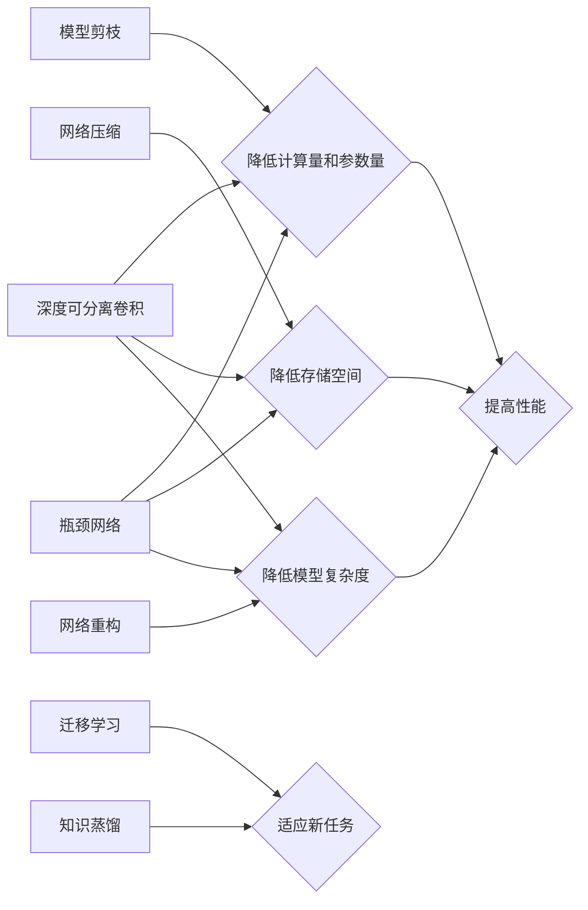

# 轻量级网络设计原理与代码实战案例讲解

作者：禅与计算机程序设计艺术 / Zen and the Art of Computer Programming

## 1. 背景介绍
### 1.1 问题的由来

随着深度学习在计算机视觉、自然语言处理等领域的广泛应用，模型的复杂度和计算量也日益增加。然而，在实际应用中，特别是移动端和嵌入式设备上，对模型的计算效率和存储空间提出了更高的要求。为了满足这些需求，轻量级网络设计应运而生。

轻量级网络设计旨在设计计算量和参数量较小的网络模型，同时保证模型在特定任务上的性能。轻量级网络不仅可以降低计算复杂度，还可以减小模型的存储空间，从而降低设备的功耗和成本，使得深度学习技术能够在更多场景下得到应用。

### 1.2 研究现状

近年来，轻量级网络设计取得了显著的进展，涌现出许多优秀的轻量级网络模型。以下是一些常见的轻量级网络设计方法：

- **模型剪枝**：通过去除网络中不重要的连接或神经元，降低模型的计算量和参数量。
- **网络压缩**：通过压缩技术，如量化、稀疏化等，降低模型的存储空间。
- **网络重构**：通过网络重构技术，如网络剪枝、网络分解、网络蒸馏等，设计新的网络结构，以降低模型的复杂度。
- **迁移学习**：利用预训练模型，通过微调或压缩等方式，使其适应新的任务。

### 1.3 研究意义

轻量级网络设计具有重要的研究意义：

- **提高计算效率**：降低模型的计算量和参数量，减少计算资源消耗，使得深度学习技术在移动端、嵌入式设备等资源受限场景下得到应用。
- **降低存储空间**：减小模型的存储空间，降低设备的存储成本。
- **提高能效比**：降低模型的功耗，提高设备的能效比。
- **拓展应用场景**：使得深度学习技术在更多场景下得到应用。

### 1.4 本文结构

本文将围绕轻量级网络设计展开，首先介绍核心概念与联系，然后讲解核心算法原理与具体操作步骤，接着介绍数学模型和公式，并通过代码实例和实际应用场景进行讲解。最后，总结未来发展趋势与挑战。

## 2. 核心概念与联系

以下是一些与轻量级网络设计相关的核心概念：

- **模型剪枝**：去除网络中不重要的连接或神经元，降低模型的计算量和参数量。
- **网络压缩**：通过量化、稀疏化等技术，降低模型的存储空间。
- **网络重构**：通过网络剪枝、网络分解、网络蒸馏等，设计新的网络结构，降低模型的复杂度。
- **迁移学习**：利用预训练模型，通过微调或压缩等方式，使其适应新的任务。
- **深度可分离卷积**：通过将卷积操作分解为深度卷积和逐点卷积，降低模型的计算量和参数量。
- **瓶颈网络**：在降低模型复杂度的同时，保持较高的性能。
- **知识蒸馏**：将大型模型的知识迁移到小型模型，提高小型模型的表现。

这些概念之间的关系可以表示为以下Mermaid流程图：



## 3. 核心算法原理 & 具体操作步骤
### 3.1 算法原理概述

轻量级网络设计主要通过以下方法降低模型的计算量和参数量：

- **模型剪枝**：通过分析网络的连接权重，去除不重要的连接或神经元。
- **网络压缩**：通过量化、稀疏化等技术，降低模型的存储空间。
- **网络重构**：通过网络剪枝、网络分解、网络蒸馏等，设计新的网络结构，降低模型的复杂度。
- **迁移学习**：利用预训练模型，通过微调或压缩等方式，使其适应新的任务。

### 3.2 算法步骤详解

以下以模型剪枝为例，介绍轻量级网络设计的具体操作步骤：

1. **选择网络结构**：选择一个适合进行剪枝的网络结构。
2. **计算连接权重**：计算网络中每个连接的权重。
3. **分析连接重要性**：分析每个连接的重要性，例如，可以使用连接权重的绝对值、连接权重的变化量等作为评价指标。
4. **去除不重要的连接**：根据连接重要性的评价指标，去除不重要的连接或神经元。
5. **评估剪枝效果**：评估剪枝后模型的性能，如准确率、计算量等。

### 3.3 算法优缺点

**模型剪枝**的优点：

- 简单易行，可操作性强。
- 可以显著降低模型的计算量和参数量。

**模型剪枝**的缺点：

- 可能会降低模型的性能。
- 需要选择合适的剪枝策略，否则可能导致过剪枝。

### 3.4 算法应用领域

轻量级网络设计适用于以下领域：

- 移动端和嵌入式设备
- 图像识别、语音识别、自然语言处理等计算机视觉和自然语言处理任务
- 实时性要求高的场景

## 4. 数学模型和公式 & 详细讲解 & 举例说明
### 4.1 数学模型构建

以下以深度可分离卷积为例，介绍轻量级网络设计的数学模型。

深度可分离卷积将卷积操作分解为深度卷积和逐点卷积。深度卷积只对输入特征进行卷积操作，逐点卷积只对卷积结果进行逐点操作。

假设输入特征为 $X \in \mathbb{R}^{C \times H \times W}$，卷积核为 $K \in \mathbb{R}^{K \times K \times C \times O}$，其中 $K$ 为卷积核大小，$C$ 为输入特征通道数，$O$ 为输出特征通道数。

深度可分离卷积的计算公式如下：

$$
Y = \text{DepthwiseConv} (X) \odot \text{PointwiseConv} (X)
$$

其中，$\odot$ 表示逐元素相乘，$\text{DepthwiseConv}$ 和 $\text{PointwiseConv}$ 分别表示深度卷积和逐点卷积操作。

### 4.2 公式推导过程

深度可分离卷积的推导过程如下：

1. **深度卷积**：对输入特征进行逐通道卷积操作，得到深度卷积输出 $Y_1 \in \mathbb{R}^{C \times H \times W}$。
2. **逐点卷积**：对深度卷积输出进行逐点卷积操作，得到逐点卷积输出 $Y_2 \in \mathbb{R}^{O \times H \times W}$。
3. **逐元素相乘**：将深度卷积输出和逐点卷积输出进行逐元素相乘，得到最终输出 $Y \in \mathbb{R}^{O \times H \times W}$。

### 4.3 案例分析与讲解

以下以 MobileNet 模型为例，介绍深度可分离卷积的应用。

MobileNet 模型是一种轻量级卷积神经网络，广泛用于图像分类、目标检测等计算机视觉任务。MobileNet 模型的核心思想是使用深度可分离卷积来降低模型的计算量和参数量。

MobileNet 模型的网络结构如下：

1. **输入层**：输入图像。
2. **深度可分离卷积层**：使用深度可分离卷积进行特征提取。
3. **激活函数层**：使用 ReLU 激活函数。
4. **全局平均池化层**：对特征图进行全局平均池化。
5. **全连接层**：使用全连接层进行分类。

通过使用深度可分离卷积，MobileNet 模型在保证性能的同时，显著降低了模型的计算量和参数量。

### 4.4 常见问题解答

**Q1：深度可分离卷积与标准卷积的区别是什么？**

A：深度可分离卷积将卷积操作分解为深度卷积和逐点卷积，而标准卷积则将卷积操作直接应用于输入特征。深度可分离卷积可以显著降低模型的计算量和参数量。

**Q2：深度可分离卷积适用于哪些场景？**

A：深度可分离卷积适用于需要降低模型计算量和参数量的场景，例如移动端和嵌入式设备、实时性要求高的场景等。

**Q3：如何选择合适的深度可分离卷积核大小？**

A：选择合适的深度可分离卷积核大小取决于具体的任务和输入特征。一般来说，较大的卷积核可以获得更好的特征提取效果，但会增加计算量和参数量。

## 5. 项目实践：代码实例和详细解释说明
### 5.1 开发环境搭建

以下是使用 PyTorch 搭建轻量级网络设计项目开发环境的基本步骤：

1. 安装 PyTorch：从官网下载并安装 PyTorch，根据CUDA版本选择合适的版本。
2. 安装相关库：安装 NumPy、Pandas 等常用库。
3. 创建项目文件夹：在项目文件夹中创建代码文件和配置文件。

### 5.2 源代码详细实现

以下是一个使用 PyTorch 实现深度可分离卷积的简单示例：

```python
import torch
import torch.nn as nn

class DepthwiseConv(nn.Module):
    def __init__(self, in_channels, out_channels, kernel_size):
        super(DepthwiseConv, self).__init__()
        self.depthwise = nn.Conv2d(in_channels, in_channels, kernel_size, padding=1, groups=in_channels)
        self.pointwise = nn.Conv2d(in_channels, out_channels, kernel_size=1)

    def forward(self, x):
        x = self.depthwise(x)
        x = self.pointwise(x)
        return x
```

### 5.3 代码解读与分析

以上代码定义了一个 DepthwiseConv 类，用于实现深度可分离卷积。DepthwiseConv 类继承自 nn.Module 类，并定义了两个卷积层：depthwise 和 pointwise。

depthwise 卷积层使用 `nn.Conv2d` 函数实现，输入通道数与输出通道数相同，卷积核大小为 kernel_size，padding 为 1。depthwise 卷积层的作用是对输入特征进行逐通道卷积操作。

pointwise 卷积层使用 `nn.Conv2d` 函数实现，输入通道数与输出通道数相同，卷积核大小为 1。pointwise 卷积层的作用是对 depthwise 卷积层的输出进行逐点卷积操作。

DepthwiseConv 类的 forward 方法实现了深度可分离卷积的计算过程，首先将输入特征 x 输入 depthwise 卷积层，然后输入 pointwise 卷积层，最终得到输出结果。

### 5.4 运行结果展示

以下是一个使用上述 DepthwiseConv 类进行深度可分离卷积的示例：

```python
input_tensor = torch.randn(1, 3, 224, 224)
depthwise_conv = DepthwiseConv(3, 16, 3)
output_tensor = depthwise_conv(input_tensor)
print(output_tensor.shape)  # 输出: torch.Size([1, 16, 224, 224])
```

以上代码创建了一个随机输入张量 input_tensor，定义了一个 DepthwiseConv 类的实例 depthwise_conv，并将 input_tensor 输入 depthwise_conv，最终得到输出张量 output_tensor。

输出张量的形状为 torch.Size([1, 16, 224, 224])，表示输出特征图的 batch size 为 1，通道数为 16，宽度和高度分别为 224。

## 6. 实际应用场景
### 6.1 移动端图像识别

轻量级网络设计在移动端图像识别领域具有广泛的应用。例如，MobileNet 模型被广泛应用于手机、平板电脑等移动设备的图像识别应用中。

### 6.2 实时视频分析

轻量级网络设计在实时视频分析领域也有广泛的应用。例如，SSD 模型（Single Shot MultiBox Detector）是一种轻量级目标检测模型，被广泛应用于视频监控系统、智能驾驶等场景。

### 6.3 嵌入式设备识别

轻量级网络设计在嵌入式设备识别领域也有广泛的应用。例如，Faster R-CNN 模型被应用于智能家居设备、工业机器人等场景。

### 6.4 未来应用展望

随着深度学习技术的不断发展，轻量级网络设计将在更多领域得到应用。以下是一些未来可能的应用场景：

- **自动驾驶**：轻量级网络设计可以应用于自动驾驶车辆的感知系统，降低计算量和功耗，提高车辆的运行效率。
- **医疗图像分析**：轻量级网络设计可以应用于医疗图像分析系统，提高诊断效率和准确性。
- **语音识别**：轻量级网络设计可以应用于语音识别系统，降低设备的功耗，提高语音识别的实时性。
- **自然语言处理**：轻量级网络设计可以应用于自然语言处理应用，降低设备的存储空间，提高应用的用户体验。

## 7. 工具和资源推荐
### 7.1 学习资源推荐

以下是一些学习轻量级网络设计的资源推荐：

- 《深度学习：入门、进阶与实战》：介绍了深度学习的基本概念、常用模型和算法，包括轻量级网络设计。
- 《PyTorch深度学习实战》：介绍了 PyTorch 框架的使用方法，包括轻量级网络设计。
- 《深度学习与计算机视觉》系列课程：介绍了深度学习在计算机视觉领域的应用，包括轻量级网络设计。

### 7.2 开发工具推荐

以下是一些用于轻量级网络设计的开发工具推荐：

- PyTorch：用于深度学习的开源框架，支持轻量级网络设计。
- TensorFlow：用于深度学习的开源框架，支持轻量级网络设计。
- Keras：基于 TensorFlow 的 Python 框架，支持轻量级网络设计。

### 7.3 相关论文推荐

以下是一些与轻量级网络设计相关的论文推荐：

- MobileNets: Efficient Convolutional Neural Networks for Mobile Vision Applications
- Squeeze-and-Excitation Networks
- EfficientNet: Rethinking Model Scaling for Convolutional Neural Networks

### 7.4 其他资源推荐

以下是一些其他资源推荐：

- PyTorch Lightning：用于深度学习项目开发的框架，提供轻量级网络设计相关的模块。
- TensorFlow Lite：用于移动设备和嵌入式设备的深度学习推理框架。
- ONNX：用于深度学习模型跨平台部署的格式。

## 8. 总结：未来发展趋势与挑战
### 8.1 研究成果总结

轻量级网络设计是近年来深度学习领域的一个重要研究方向，旨在设计计算量和参数量较小的网络模型，同时保证模型在特定任务上的性能。通过模型剪枝、网络压缩、网络重构、迁移学习等方法，轻量级网络设计取得了显著的进展，并在实际应用中取得了良好的效果。

### 8.2 未来发展趋势

未来轻量级网络设计的研究趋势包括：

- **网络结构创新**：设计更加高效、精简的网络结构，降低模型的计算量和参数量。
- **算法优化**：优化模型剪枝、网络压缩、网络重构、迁移学习等算法，提高模型性能。
- **跨领域迁移**：研究轻量级网络在不同领域之间的迁移能力，提高模型的泛化能力。

### 8.3 面临的挑战

轻量级网络设计面临的挑战包括：

- **模型性能与计算效率的权衡**：在降低模型计算量和参数量的同时，保证模型在特定任务上的性能。
- **数据集和标注数据的获取**：轻量级网络设计需要大量的标注数据，数据集和标注数据的获取是一个挑战。
- **算法的鲁棒性和泛化能力**：提高轻量级网络的鲁棒性和泛化能力，使其能够适应不同的应用场景。

### 8.4 研究展望

轻量级网络设计是深度学习领域的一个重要研究方向，具有广泛的应用前景。未来，随着研究的深入和技术的进步，轻量级网络设计将在更多领域得到应用，为深度学习技术的发展和应用带来新的机遇。

## 9. 附录：常见问题与解答

**Q1：什么是轻量级网络设计？**

A：轻量级网络设计是旨在设计计算量和参数量较小的网络模型，同时保证模型在特定任务上的性能的研究方向。

**Q2：轻量级网络设计有哪些方法？**

A：轻量级网络设计的方法包括模型剪枝、网络压缩、网络重构、迁移学习等。

**Q3：如何选择合适的轻量级网络设计方法？**

A：选择合适的轻量级网络设计方法需要根据具体任务和数据集的特点进行考虑，例如，对于图像识别任务，可以使用模型剪枝、网络压缩等方法。

**Q4：轻量级网络设计有哪些应用场景？**

A：轻量级网络设计可以应用于移动端、嵌入式设备、实时视频分析、嵌入式设备识别等领域。

**Q5：如何评估轻量级网络设计的性能？**

A：评估轻量级网络设计的性能可以通过比较不同方法在特定任务上的准确率、计算量和参数量等指标来进行。

**Q6：如何提高轻量级网络的性能？**

A：提高轻量级网络的性能可以通过以下方法：

- 网络结构创新：设计更加高效、精简的网络结构。
- 算法优化：优化模型剪枝、网络压缩、网络重构、迁移学习等算法。
- 跨领域迁移：研究轻量级网络在不同领域之间的迁移能力。