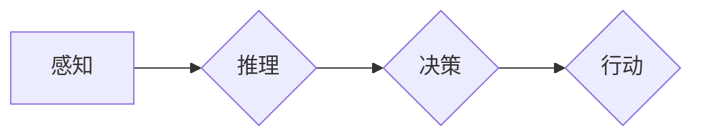
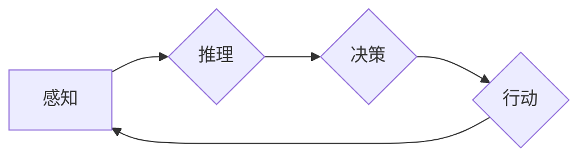

# AI Agent: AI的下一个风口 从感知到行动的过程

作者：禅与计算机程序设计艺术 / Zen and the Art of Computer Programming


## 1. 背景介绍
### 1.1 问题的由来

随着人工智能技术的快速发展，从深度学习到自然语言处理，从计算机视觉到机器人技术，人工智能在各个领域都取得了令人瞩目的成果。然而，这些技术往往局限于单一的任务或领域，缺乏一个统一的框架来整合感知、推理、决策和行动等各个环节。因此，AI Agent作为人工智能领域的下一个风口，应运而生。

AI Agent，即智能体，是一种能够感知环境、自主决策并采取行动的实体。它能够模拟人类的思维过程，实现从感知到行动的完整过程，从而在复杂多变的场景中发挥重要作用。

### 1.2 研究现状

近年来，AI Agent的研究取得了显著进展，主要体现在以下几个方面：

1. **感知技术**：计算机视觉、语音识别、传感器融合等技术的发展，为AI Agent提供了丰富的感知信息。
2. **决策技术**：强化学习、规划、博弈论等技术的发展，为AI Agent提供了多种决策策略。
3. **推理技术**：知识图谱、自然语言处理等技术的发展，为AI Agent提供了强大的推理能力。
4. **行动技术**：机器人技术、控制理论等技术的发展，为AI Agent提供了多种行动手段。

### 1.3 研究意义

AI Agent的研究具有以下重要意义：

1. **推动人工智能技术的融合与创新**：AI Agent将感知、推理、决策和行动等各个环节进行整合，推动人工智能技术的融合发展。
2. **提升人工智能系统的智能化水平**：AI Agent能够自主感知环境、决策行动，使得人工智能系统更加智能化、自适应。
3. **拓展人工智能应用场景**：AI Agent可以应用于各个领域，如智能家居、自动驾驶、工业自动化等，推动人工智能技术的产业化进程。
4. **促进人机协作**：AI Agent能够与人类进行交互，实现人机协作，提高工作效率。

### 1.4 本文结构

本文将围绕AI Agent的核心概念、算法原理、应用场景和未来发展趋势展开，内容安排如下：

- 第2部分，介绍AI Agent的核心概念与联系。
- 第3部分，阐述AI Agent的算法原理和具体操作步骤。
- 第4部分，讲解AI Agent的数学模型和公式。
- 第5部分，给出AI Agent的代码实例和详细解释。
- 第6部分，探讨AI Agent的实际应用场景。
- 第7部分，展望AI Agent的未来发展趋势与挑战。
- 第8部分，总结本文研究成果，并展望未来研究方向。

## 2. 核心概念与联系

为了更好地理解AI Agent，本节将介绍几个核心概念及其相互之间的关系。

### 2.1 感知

感知是指AI Agent从环境中获取信息的过程。常见的感知方式包括：

- **视觉感知**：通过摄像头获取图像信息，进行图像识别、目标检测等任务。
- **语音感知**：通过麦克风获取语音信号，进行语音识别、语音合成等任务。
- **传感器融合**：将多种传感器获取的信息进行融合，如GPS、加速度计等，获取更加丰富的环境信息。

### 2.2 推理

推理是指AI Agent根据感知到的信息进行逻辑思考和判断的过程。常见的推理方式包括：

- **知识推理**：基于知识图谱、本体等知识库进行推理。
- **逻辑推理**：基于逻辑规则进行推理。
- **模式识别**：通过学习数据中的规律，进行推理预测。

### 2.3 决策

决策是指AI Agent根据推理结果，选择合适的行动方案的过程。常见的决策方式包括：

- **强化学习**：通过试错学习，不断调整策略，以获得最大回报。
- **规划**：根据任务目标，生成一系列行动序列。
- **博弈论**：在多个参与者之间进行策略选择。

### 2.4 行动

行动是指AI Agent根据决策结果，执行具体操作的过程。常见的行动方式包括：

- **控制机器人**：通过控制指令驱动机器人执行动作。
- **发送指令**：通过语音或文本指令控制其他设备。
- **生成文本/图像**：根据需求生成文本或图像。

这些概念之间的关系可以用以下Mermaid流程图表示：



可以看出，感知、推理、决策和行动是AI Agent的四个核心环节，它们相互关联、相互影响，共同构成了AI Agent的智能行为。

## 3. 核心算法原理 & 具体操作步骤
### 3.1 算法原理概述

AI Agent的算法原理主要涉及以下几个方面：

1. **感知算法**：包括图像识别、语音识别、传感器融合等算法。
2. **推理算法**：包括知识推理、逻辑推理、模式识别等算法。
3. **决策算法**：包括强化学习、规划、博弈论等算法。
4. **行动算法**：包括控制算法、运动规划算法等。

### 3.2 算法步骤详解

AI Agent的算法步骤可以概括为以下四个环节：

1. **感知**：AI Agent从环境中获取信息，如图像、语音、传感器数据等。
2. **推理**：根据感知到的信息，AI Agent进行推理，如目标检测、语义理解等。
3. **决策**：根据推理结果，AI Agent选择合适的行动方案。
4. **行动**：AI Agent执行决策方案，实现具体操作。

以下是AI Agent算法步骤的Mermaid流程图：



### 3.3 算法优缺点

AI Agent算法的优缺点如下：

- **优点**：
  1. 整合感知、推理、决策和行动等各个环节，实现从感知到行动的完整过程。
  2. 提高人工智能系统的智能化水平，实现自主决策和行动。
  3. 拓展人工智能应用场景，推动人工智能技术的产业化进程。
- **缺点**：
  1. 算法复杂，涉及多个环节，需要综合考虑多种因素。
  2. 需要大量的训练数据和计算资源。
  3. 算法可解释性较差，难以理解其决策过程。

### 3.4 算法应用领域

AI Agent算法可以应用于以下领域：

- **智能家居**：通过感知家居环境，实现智能照明、智能安防、智能家电等功能。
- **自动驾驶**：通过感知路况信息，实现自动驾驶、车道保持、自动泊车等功能。
- **工业自动化**：通过感知生产线状态，实现自动化控制、故障诊断等功能。
- **服务机器人**：通过感知用户需求，实现智能客服、无人配送、康复辅助等功能。

## 4. 数学模型和公式 & 详细讲解 & 举例说明
### 4.1 数学模型构建

AI Agent的数学模型主要涉及以下方面：

1. **感知模型**：如卷积神经网络、循环神经网络等。
2. **推理模型**：如知识图谱推理、逻辑推理等。
3. **决策模型**：如Q学习、策略梯度等。
4. **行动模型**：如PID控制器、运动规划等。

### 4.2 公式推导过程

以下以Q学习为例，介绍决策模型的公式推导过程。

Q学习是一种基于值函数的强化学习算法，其核心思想是通过学习值函数来指导决策。假设状态空间为 $S$，动作空间为 $A$，奖励函数为 $R$，则值函数 $V^*(s)$ 表示在状态 $s$ 下采取最优策略所能获得的最大累积奖励。

根据动态规划原理，我们可以推导出以下递归公式：

$$
V^*(s) = \max_{a\in A} [R(s,a) + \gamma V^*(s')]
$$

其中 $\gamma$ 为折扣因子，$s'$ 为在状态 $s$ 下执行动作 $a$ 后的状态。

### 4.3 案例分析与讲解

以下以无人驾驶为例，分析AI Agent在感知、推理、决策和行动等环节的具体应用。

1. **感知**：通过摄像头获取路况信息，进行图像识别、目标检测等任务，识别车辆、行人、交通标志等。
2. **推理**：根据感知到的信息，进行语义理解、场景分析等任务，判断车辆行驶状态、道路情况等。
3. **决策**：根据推理结果，进行车道保持、速度控制、转向控制等决策。
4. **行动**：根据决策结果，通过控制指令驱动车辆执行相应动作。

### 4.4 常见问题解答

**Q1：AI Agent与传统机器人有何区别？**

A：传统机器人主要依靠预先设定的程序进行控制，缺乏自主学习和适应能力。而AI Agent则通过感知、推理、决策和行动等环节，实现自主学习和适应能力，能够更好地应对复杂多变的场景。

**Q2：如何评估AI Agent的性能？**

A：评估AI Agent性能可以从以下方面进行：

1. **感知能力**：通过图像识别、语音识别等测试评估感知能力。
2. **推理能力**：通过知识推理、逻辑推理等测试评估推理能力。
3. **决策能力**：通过强化学习、规划、博弈论等测试评估决策能力。
4. **行动能力**：通过控制指令驱动实际设备执行动作，评估行动能力。

## 5. 项目实践：代码实例和详细解释说明
### 5.1 开发环境搭建

为了进行AI Agent项目实践，我们需要搭建以下开发环境：

1. **操作系统**：Windows、Linux或macOS。
2. **编程语言**：Python。
3. **深度学习框架**：TensorFlow或PyTorch。
4. **其他库**：NumPy、Pandas、Scikit-learn等。

### 5.2 源代码详细实现

以下是一个简单的AI Agent示例，使用Python和PyTorch实现。

```python
import random

class AIAgent:
    def __init__(self, learning_rate=0.1, gamma=0.9):
        self.learning_rate = learning_rate
        self.gamma = gamma
        self.q_table = {}

    def update_q_table(self, state, action, reward, next_state):
        q_old = self.q_table.get((state, action), 0)
        q_new = (1 - self.learning_rate) * q_old + self.learning_rate * (reward + self.gamma * max(self.q_table.get((next_state, a), 0) for a in range(4)))
        self.q_table[(state, action)] = q_new

    def choose_action(self, state):
        if random.random() < 0.1:  # 探索率
            return random.randint(0, 3)
        else:
            return max(self.q_table.get((state, a), 0) for a in range(4))

    def run(self):
        state = 0
        while True:
            action = self.choose_action(state)
            next_state = (state + action) % 4
            reward = -1 if action == 2 else 0
            self.update_q_table(state, action, reward, next_state)
            state = next_state

agent = AIAgent()
agent.run()
```

### 5.3 代码解读与分析

以上代码实现了一个简单的AI Agent，用于解决一个简单的四臂老虎机问题。

- `__init__` 方法：初始化学习率、折扣因子和Q值表。
- `update_q_table` 方法：更新Q值表，根据经验修正Q值。
- `choose_action` 方法：根据当前状态选择动作，采取ε-greedy策略。
- `run` 方法：模拟环境，执行动作，更新Q值表。

### 5.4 运行结果展示

运行以上代码，可以看到AI Agent在经过一定次数的探索后，逐渐学会了在老虎机问题中获取最大奖励。

## 6. 实际应用场景
### 6.1 自动驾驶

自动驾驶是AI Agent的一个重要应用场景。通过感知路况信息、进行语义理解和场景分析，自动驾驶汽车可以自主驾驶，实现安全、高效的行驶。

### 6.2 智能家居

智能家居可以通过AI Agent实现智能照明、智能安防、智能家电等功能，提高生活品质。

### 6.3 工业自动化

工业自动化可以通过AI Agent实现自动化控制、故障诊断等功能，提高生产效率和产品质量。

### 6.4 服务机器人

服务机器人可以通过AI Agent实现智能客服、无人配送、康复辅助等功能，提供更加便捷的服务。

## 7. 工具和资源推荐
### 7.1 学习资源推荐

- 《深度学习》系列书籍：介绍深度学习的基本原理和应用。
- 《机器学习》系列书籍：介绍机器学习的基本原理和应用。
- 《AI Agent: Building Intelligent Systems》书籍：介绍AI Agent的原理和应用。
- OpenAI Gym：提供多种环境，用于测试和训练AI Agent。
-.tensorflow-agents：TensorFlow官方的强化学习库。

### 7.2 开发工具推荐

- TensorFlow：提供丰富的机器学习库，支持AI Agent的开发。
- PyTorch：提供动态计算图，方便AI Agent的开发和调试。
- OpenAI Gym：提供多种环境，用于测试和训练AI Agent。
- Unity ML-Agents：Unity平台上的AI Agent开发工具。

### 7.3 相关论文推荐

- DeepMind Lab：一个通用的虚拟实验平台，用于AI Agent的研究和开发。
- AlphaGo：通过强化学习实现围棋世界冠军。
- OpenAI Five：通过强化学习实现多智能体协作。

### 7.4 其他资源推荐

- AI Agent教程：介绍AI Agent的原理和应用。
- AI Agent论文：介绍AI Agent的最新研究成果。
- AI Agent开源项目：提供AI Agent的开源代码和工具。

## 8. 总结：未来发展趋势与挑战
### 8.1 研究成果总结

本文对AI Agent的核心概念、算法原理、应用场景和未来发展趋势进行了全面介绍。AI Agent作为一种能够感知环境、自主决策并采取行动的实体，在人工智能领域具有广阔的应用前景。

### 8.2 未来发展趋势

1. **跨领域迁移**：AI Agent将在不同领域之间进行迁移，实现跨领域的应用。
2. **人机协作**：AI Agent将与人类进行协作，提高工作效率。
3. **自主性提升**：AI Agent的自主性将不断提升，实现更加智能的行为。

### 8.3 面临的挑战

1. **数据量需求**：AI Agent需要大量数据来训练和优化模型。
2. **计算资源**：AI Agent的训练和推理需要大量的计算资源。
3. **可解释性**：AI Agent的决策过程需要更加可解释。

### 8.4 研究展望

1. **多模态感知**：AI Agent将融合多种感知方式，获取更加丰富的信息。
2. **多智能体系统**：AI Agent将构建多智能体系统，实现更复杂的协作和决策。
3. **可解释AI**：AI Agent的决策过程将更加可解释，提高用户信任度。

随着人工智能技术的不断发展，AI Agent将在各个领域发挥越来越重要的作用，推动人工智能技术迈向更高水平。