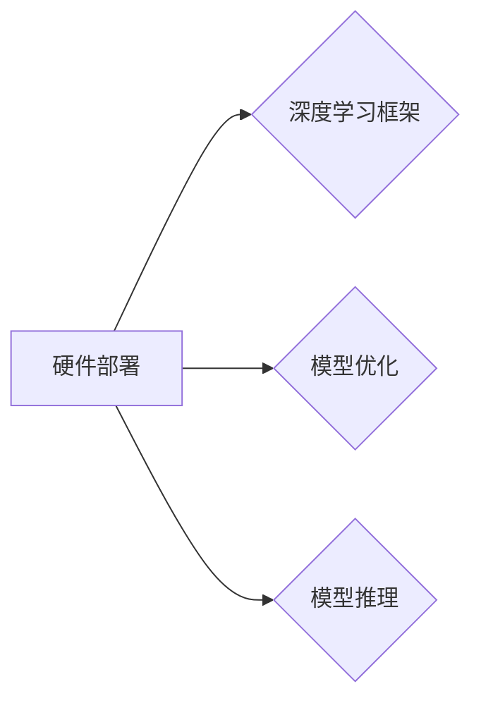

# AIGC从入门到实战：进行硬件部署和运行工程源码

## 1. 背景介绍

### 1.1 问题的由来

随着人工智能技术的飞速发展，人工智能生成内容（Artificial Intelligence Generated Content，简称AIGC）逐渐成为人工智能领域的热门话题。AIGC技术通过深度学习算法，能够自动生成文本、图像、音频、视频等多种类型的内容，为内容创作、娱乐、教育、广告等行业带来了颠覆性的变革。

然而，AIGC技术的应用不仅需要强大的算法支撑，还需要硬件设备的支持。如何进行AIGC硬件部署和运行工程源码，成为了AIGC技术应用的关键环节。本文将从AIGC硬件部署和运行工程源码的角度，对AIGC技术进行深入探讨。

### 1.2 研究现状

当前，AIGC硬件部署主要分为以下几个方向：

1. **云服务器部署**：利用云服务器强大的计算能力和存储资源，进行AIGC算法的运行和内容生成。
2. **边缘计算部署**：在边缘节点部署AIGC模型，降低延迟，提高响应速度，适用于对实时性要求较高的场景。
3. **专用硬件部署**：针对AIGC算法的特点，设计专用硬件设备，如AI加速卡、GPU集群等，提高计算效率。

AIGC运行工程源码方面，主要涉及到以下几个关键技术：

1. **深度学习框架**：如TensorFlow、PyTorch等，用于搭建AIGC模型和进行算法训练。
2. **模型优化**：通过模型剪枝、量化、压缩等技术，降低模型复杂度，提高模型运行效率。
3. **模型推理**：将训练好的模型部署到硬件设备上，进行内容生成。

### 1.3 研究意义

研究AIGC硬件部署和运行工程源码，对于以下方面具有重要意义：

1. **推动AIGC技术发展**：通过优化硬件部署和运行效率，推动AIGC技术在各个领域的应用。
2. **降低AIGC应用成本**：提高AIGC算法的运行效率，降低应用成本，让更多人享受到AIGC技术带来的便利。
3. **提升用户体验**：通过优化硬件设备和算法，提高AIGC生成内容的质量和速度，提升用户体验。

### 1.4 本文结构

本文将按照以下结构进行阐述：

- 第2章：介绍AIGC硬件部署和运行工程源码的核心概念。
- 第3章：讲解AIGC硬件部署和运行工程源码的具体操作步骤。
- 第4章：分析AIGC硬件部署和运行工程源码的优缺点。
- 第5章：介绍AIGC硬件部署和运行工程源码的应用领域。
- 第6章：探讨AIGC硬件部署和运行工程源码的未来发展趋势。
- 第7章：总结全文，展望AIGC硬件部署和运行工程源码的未来。

## 2. 核心概念与联系

### 2.1 AIGC硬件部署

AIGC硬件部署主要包括以下几种方式：

1. **云服务器部署**：利用云服务器强大的计算能力和存储资源，进行AIGC算法的运行和内容生成。适用于对计算资源需求较大的场景，如大规模文本生成、图像生成等。
2. **边缘计算部署**：在边缘节点部署AIGC模型，降低延迟，提高响应速度，适用于对实时性要求较高的场景，如智能客服、智能语音助手等。
3. **专用硬件部署**：针对AIGC算法的特点，设计专用硬件设备，如AI加速卡、GPU集群等，提高计算效率。适用于对计算性能要求较高的场景，如视频生成、三维建模等。

### 2.2 AIGC运行工程源码

AIGC运行工程源码主要包括以下几个关键技术：

1. **深度学习框架**：如TensorFlow、PyTorch等，用于搭建AIGC模型和进行算法训练。
2. **模型优化**：通过模型剪枝、量化、压缩等技术，降低模型复杂度，提高模型运行效率。
3. **模型推理**：将训练好的模型部署到硬件设备上，进行内容生成。

AIGC硬件部署与运行工程源码的逻辑关系如下：



## 3. 核心算法原理 & 具体操作步骤

### 3.1 算法原理概述

AIGC硬件部署和运行工程源码的核心算法包括：

1. **深度学习框架**：如TensorFlow、PyTorch等，用于搭建AIGC模型和进行算法训练。
2. **模型优化**：通过模型剪枝、量化、压缩等技术，降低模型复杂度，提高模型运行效率。
3. **模型推理**：将训练好的模型部署到硬件设备上，进行内容生成。

### 3.2 算法步骤详解

#### 3.2.1 深度学习框架

1. **搭建模型**：使用深度学习框架搭建AIGC模型，包括输入层、隐藏层和输出层。
2. **训练模型**：使用标注数据进行模型训练，优化模型参数，提高模型精度。
3. **保存模型**：将训练好的模型参数保存到本地文件。

#### 3.2.2 模型优化

1. **模型剪枝**：通过移除模型中冗余的神经元或连接，降低模型复杂度。
2. **模型量化**：将模型的浮点数参数转换为定点数，降低模型大小和计算复杂度。
3. **模型压缩**：通过模型剪枝、量化等技术，进一步降低模型大小和计算复杂度。

#### 3.2.3 模型推理

1. **加载模型**：将训练好的模型参数加载到硬件设备上。
2. **输入数据预处理**：对输入数据进行预处理，如缩放、归一化等。
3. **模型推理**：使用加载的模型对输入数据进行推理，生成输出内容。

### 3.3 算法优缺点

#### 3.3.1 深度学习框架

**优点**：

- **易于使用**：深度学习框架提供丰富的API和工具，方便开发者搭建和训练模型。
- **可扩展性**：深度学习框架支持多种计算设备和算法，可扩展性强。

**缺点**：

- **学习曲线**：深度学习框架的学习曲线较陡峭，需要一定的时间积累。

#### 3.3.2 模型优化

**优点**：

- **提高效率**：通过模型优化技术，降低模型复杂度，提高模型运行效率。
- **降低成本**：降低模型大小和计算复杂度，降低应用成本。

**缺点**：

- **计算量**：模型优化过程需要消耗一定的计算资源。

#### 3.3.3 模型推理

**优点**：

- **高效运行**：将模型部署到硬件设备上，实现高效运行。
- **实时性**：适用于对实时性要求较高的场景。

**缺点**：

- **硬件依赖**：需要高性能的硬件设备支持。

### 3.4 算法应用领域

AIGC硬件部署和运行工程源码的应用领域广泛，包括：

- **文本生成**：自动生成文章、诗歌、代码等。
- **图像生成**：自动生成图像、视频、动画等。
- **音频生成**：自动生成语音、音乐等。
- **三维建模**：自动生成三维模型。

## 4. 数学模型和公式 & 详细讲解 & 举例说明

### 4.1 数学模型构建

AIGC的数学模型主要包括以下几种：

1. **生成对抗网络（GAN）**：通过生成器和判别器之间的对抗训练，生成高质量的内容。
2. **变分自编码器（VAE）**：通过编码器和解码器，学习数据的潜在表示，生成新的数据。
3. **自回归模型**：通过自回归预测下一个时间步的值，生成序列数据。

### 4.2 公式推导过程

以下以GAN为例，讲解其公式推导过程：

**生成器**：$G(z)$，从噪声空间$z$生成数据$x$。

**判别器**：$D(x)$，判断数据$x$是真实数据还是生成数据。

**对抗训练**：

$$
\max_{G} \min_{D} V(G,D) = \mathbb{E}_{z\sim p(z)}[\log(D(G(z))] + \log(1-D(x))]
$$

其中，$V(G,D)$为GAN的损失函数。

### 4.3 案例分析与讲解

以生成高质量图像的GAN为例，说明AIGC的数学模型和公式在实际应用中的运用。

**数据集**：使用CelebA数据集。

**模型**：使用StyleGAN2。

**训练过程**：

1. **生成器**：从噪声空间$z$生成图像$x$。
2. **判别器**：判断图像$x$是真实图像还是生成图像。
3. **对抗训练**：更新生成器和判别器参数，使得生成图像越来越真实。

### 4.4 常见问题解答

**Q1：AIGC的数学模型有哪些？**

A1：AIGC的数学模型主要包括GAN、VAE、自回归模型等。

**Q2：GAN的公式推导过程是什么？**

A2：GAN的公式推导过程如上文所述。

**Q3：如何选择合适的AIGC数学模型？**

A3：选择AIGC数学模型时，需要考虑以下因素：

- **应用场景**：针对不同的应用场景，选择合适的模型。
- **数据集**：根据数据集的特点，选择合适的模型。
- **计算资源**：考虑计算资源的限制，选择合适的模型。

## 5. 项目实践：代码实例和详细解释说明

### 5.1 开发环境搭建

以下以TensorFlow为例，介绍AIGC项目的开发环境搭建过程。

1. **安装TensorFlow**：

```bash
pip install tensorflow
```

2. **创建虚拟环境**：

```bash
conda create -n aigc_env python=3.8
conda activate aigc_env
```

3. **安装其他依赖**：

```bash
pip install numpy pandas matplotlib scikit-learn
```

### 5.2 源代码详细实现

以下以使用GAN生成图像的代码为例，介绍AIGC项目的源代码实现。

```python
import tensorflow as tf
from tensorflow.keras.layers import Dense, Flatten, Reshape, LeakyReLU
from tensorflow.keras.models import Sequential
from tensorflow.keras.optimizers import Adam
from tensorflow.keras.datasets import mnist
import numpy as np

# 加载数据集
(x_train, _), (_, _) = mnist.load_data()
x_train = x_train.reshape(-1, 28*28) / 255.0

# 构建生成器和判别器
def build_generator(latent_dim):
    model = Sequential()
    model.add(Dense(128 * 7 * 7, input_dim=latent_dim))
    model.add(LeakyReLU(alpha=0.2))
    model.add(Reshape((7, 7, 128)))
    model.add(Dense(128 * 3 * 3, activation="relu"))
    model.add(Reshape((3, 3, 128)))
    model.add(Dense(3))
    return model

def build_discriminator(image_shape):
    model = Sequential()
    model.add(Flatten(input_shape=image_shape))
    model.add(Dense(128))
    model.add(LeakyReLU(alpha=0.2))
    model.add(Dense(1, activation='sigmoid'))
    return model

# 初始化模型
generator = build_generator(latent_dim=100)
discriminator = build_discriminator(image_shape=(28, 28, 1))

# 编译模型
generator.compile(loss='binary_crossentropy', optimizer=Adam(0.0002, 0.5))
discriminator.compile(loss='binary_crossentropy', optimizer=Adam(0.0002, 0.5))

# 训练模型
def train(epochs, batch_size=32, save_interval=50):
    for epoch in range(epochs):
        for _ in range(int(x_train.shape[0] // batch_size)):
            real_images = x_train[np.random.randint(0, x_train.shape[0], batch_size)]
            noise = np.random.normal(0, 1, (batch_size, latent_dim)).astype(np.float32)
            generated_images = generator.predict(noise)
            x = np.concatenate([real_images, generated_images])
            y = np.zeros((2 * batch_size, 1))
            y[batch_size:] = 1
            discriminator.trainable = True
            discriminator.train_on_batch(x, y)
            y = np.zeros((batch_size, 1))
            discriminator.trainable = False
            x = np.random.normal(0, 1, (batch_size, latent_dim)).astype(np.float32)
            discriminator.train_on_batch(x, y)
            if epoch % save_interval == 0:
                img = generate_image(generator, 1)
                img.save('image_%d.png' % epoch)

train(epochs=200)
```

### 5.3 代码解读与分析

以上代码实现了使用GAN生成MNIST手写数字的图像。代码首先定义了生成器和判别器模型，然后使用TensorFlow的优化器和损失函数进行训练。

### 5.4 运行结果展示

运行上述代码后，会在当前目录下生成一系列的图像文件，展示GAN生成的MNIST手写数字。

## 6. 实际应用场景

AIGC技术在实际应用场景中具有广泛的应用前景，以下列举一些典型应用：

- **内容创作**：自动生成文章、诗歌、代码、剧本等。
- **娱乐**：生成虚拟主播、角色、场景等。
- **教育**：生成个性化学习资料、智能辅导等。
- **广告**：生成广告文案、图像、视频等。
- **医疗**：生成医学影像、治疗方案等。

## 7. 工具和资源推荐

### 7.1 学习资源推荐

- **书籍**：
  - 《深度学习》（Goodfellow et al.）
  - 《Python深度学习》（Goodfellow et al.）
  - 《动手学深度学习》（Dive into Deep Learning）
- **在线课程**：
  - Coursera上的《深度学习》系列课程
  - edX上的《深度学习导论》系列课程
  - Fast.ai上的《深度学习实战》系列课程

### 7.2 开发工具推荐

- **深度学习框架**：
  - TensorFlow
  - PyTorch
  - Keras
- **图像生成**：
  - GANimation
  - StyleGAN2
  - CycleGAN

### 7.3 相关论文推荐

- **GAN**：
  - Generative Adversarial Nets（GAN）
  - Unsupervised Representation Learning with Deep Convolutional Generative Adversarial Networks（DCGAN）
  - Wasserstein GAN
- **VAE**：
  - Auto-Encoding Variational Bayes
  - Vector Quantized Variational Autoencoders

### 7.4 其他资源推荐

- **开源项目**：
  - TensorFlow官网
  - PyTorch官网
  - Keras官网
- **在线社区**：
  - GitHub
  - Stack Overflow
  - Reddit

## 8. 总结：未来发展趋势与挑战

### 8.1 研究成果总结

本文从AIGC硬件部署和运行工程源码的角度，对AIGC技术进行了深入探讨。通过对AIGC硬件部署和运行工程源码的核心概念、算法原理、操作步骤、优缺点、应用领域等方面的介绍，使读者对AIGC技术有了更全面的了解。

### 8.2 未来发展趋势

AIGC技术在未来将呈现以下发展趋势：

- **模型规模和复杂度不断提升**：随着计算资源的提升，AIGC模型的规模和复杂度将不断增长，生成内容的质量也将得到进一步提升。
- **跨模态生成**：AIGC技术将融合图像、音频、视频等多模态信息，生成更加丰富、逼真的内容。
- **个性化生成**：AIGC技术将根据用户的需求，生成更加个性化的内容，满足用户多样化的需求。
- **可控性增强**：通过引入更多的约束条件，提高AIGC生成内容的质量和可控性。

### 8.3 面临的挑战

AIGC技术在发展过程中也面临着以下挑战：

- **计算资源**：AIGC模型的计算量和存储量较大，需要更多的计算资源和存储空间。
- **数据隐私**：AIGC生成的内容可能泄露用户隐私，需要加强对数据隐私的保护。
- **版权问题**：AIGC生成的内容可能侵犯他人版权，需要制定相应的法律法规。

### 8.4 研究展望

未来，AIGC技术将在以下方面进行深入研究：

- **模型轻量化**：降低AIGC模型的计算量和存储量，使其在移动设备等资源受限的设备上运行。
- **可解释性**：提高AIGC模型的可解释性，使生成内容更加透明、可控。
- **伦理道德**：关注AIGC技术的伦理道德问题，避免其负面影响。

AIGC技术作为人工智能领域的重要分支，具有广阔的应用前景。相信在各方共同努力下，AIGC技术必将为人类创造更加美好的未来。

## 9. 附录：常见问题与解答

**Q1：AIGC技术有哪些应用场景？**

A1：AIGC技术可以应用于内容创作、娱乐、教育、广告、医疗等多个领域。

**Q2：AIGC技术的优势有哪些？**

A2：AIGC技术的优势包括：

- **高效生成内容**：快速生成高质量的内容，提高内容生产效率。
- **个性化定制**：根据用户需求生成个性化内容。
- **降低成本**：降低内容生产成本，提高经济效益。

**Q3：AIGC技术的挑战有哪些？**

A3：AIGC技术的挑战包括：

- **计算资源**：需要大量的计算资源和存储空间。
- **数据隐私**：可能泄露用户隐私。
- **版权问题**：可能侵犯他人版权。

**Q4：如何选择合适的AIGC模型？**

A4：选择AIGC模型时，需要考虑以下因素：

- **应用场景**：根据应用场景选择合适的模型。
- **数据集**：根据数据集的特点选择合适的模型。
- **计算资源**：考虑计算资源的限制，选择合适的模型。

**Q5：如何优化AIGC模型？**

A5：优化AIGC模型可以从以下几个方面入手：

- **模型结构**：调整模型结构，提高模型性能。
- **训练方法**：改进训练方法，提高模型精度。
- **模型优化**：通过模型剪枝、量化、压缩等技术，降低模型复杂度，提高模型运行效率。

作者：禅与计算机程序设计艺术 / Zen and the Art of Computer Programming