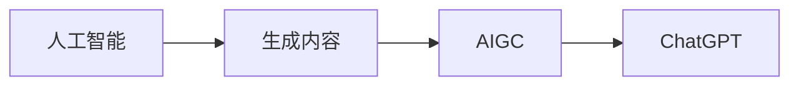

# AIGC从入门到实战：量化说明 ChatGPT 可能带来的效率提升

作者：禅与计算机程序设计艺术 / Zen and the Art of Computer Programming

## 1. 背景介绍
### 1.1 问题的由来

随着人工智能技术的飞速发展，自然语言处理（NLP）领域迎来了前所未有的突破。其中，人工智能生成内容（AIGC，Artificial Intelligence Generated Content）技术凭借其强大的文本生成能力，在新闻写作、创意写作、代码生成等众多领域展现出巨大的应用潜力。ChatGPT，作为 OpenAI 开发的最新自然语言模型，更是将 AIGC 技术推向了新的高度。本文将深入探讨 ChatGPT 的原理、应用场景，并通过实际案例量化分析其可能带来的效率提升。

### 1.2 研究现状

AIGC 技术的发展经历了三个阶段：

1. **基于规则和模板的 AIGC**：早期的 AIGC 技术主要依赖于规则和模板，如文本生成器、模板引擎等。这种方法的效率较低，且生成的文本质量参差不齐。
2. **基于统计的 AIGC**：基于统计的 AIGC 技术利用概率模型和统计学习算法生成文本，如基于 N-gram 的语言模型、隐马尔可夫模型等。这种方法的效率有所提升，但仍然难以生成高质量的文本。
3. **基于深度学习的 AIGC**：近年来，深度学习技术在 NLP 领域取得了突破性进展，基于深度学习的 AIGC 技术应运而生。其中，Transformer 模型、BERT 模型等大语言模型在 AIGC 领域展现出强大的能力。

ChatGPT 作为基于 Transformer 模型的 AIGC 模型，具有以下特点：

- **预训练**：ChatGPT 在海量互联网语料上进行了预训练，具备了丰富的语言知识和常识。
- **微调**：通过在特定任务上进行微调，ChatGPT 可以更好地适应不同领域的应用场景。
- **生成能力强**：ChatGPT 可以根据输入的文本内容生成高质量的文本，如文章、报告、代码等。

### 1.3 研究意义

研究 ChatGPT 的原理和应用，对于推动 AIGC 技术的发展、提升信息生产效率具有重要意义。

- **提升信息生产效率**：ChatGPT 可以自动生成文章、报告、代码等文本内容，大大降低信息生产成本，提高生产效率。
- **拓展创作领域**：ChatGPT 可以帮助创作者拓展创作领域，如新闻写作、创意写作、剧本创作等。
- **助力科学研究**：ChatGPT 可以辅助科研人员撰写论文、生成实验代码等，提高科研效率。

### 1.4 本文结构

本文将分为以下几个部分：

- **第2部分**：介绍 AIGC 和 ChatGPT 的核心概念与联系。
- **第3部分**：阐述 ChatGPT 的原理和具体操作步骤。
- **第4部分**：分析 ChatGPT 的数学模型和公式，并结合实例进行讲解。
- **第5部分**：通过项目实践，展示如何使用 ChatGPT 进行 AIGC 应用。
- **第6部分**：探讨 ChatGPT 在实际应用场景中的表现和未来应用展望。
- **第7部分**：推荐 ChatGPT 相关的学习资源、开发工具和参考文献。
- **第8部分**：总结 ChatGPT 的研究成果、未来发展趋势和挑战。
- **第9部分**：附录，提供常见问题与解答。

## 2. 核心概念与联系
### 2.1 AIGC 与 ChatGPT

AIGC 是人工智能生成内容的技术统称，而 ChatGPT 是 AIGC 领域的一个具体应用。两者之间的关系如下：



### 2.2 相关技术

AIGC 和 ChatGPT 的实现离不开以下技术：

- **自然语言处理（NLP）**：用于理解和处理自然语言，是 AIGC 技术的核心。
- **深度学习**：用于构建和训练 AIGC 模型，如 Transformer 模型、BERT 模型等。
- **预训练与微调**：通过预训练和微调，使 AIGC 模型具备更强的语言理解和生成能力。

## 3. 核心算法原理 & 具体操作步骤
### 3.1 算法原理概述

ChatGPT 是基于 Transformer 模型的 AIGC 模型，其原理如下：

- **编码器**：将输入文本编码为向量表示。
- **解码器**：根据编码器输出的向量表示生成输出文本。

ChatGPT 的具体操作步骤如下：

1. **输入**：输入一个文本内容。
2. **编码**：将输入文本编码为向量表示。
3. **解码**：根据编码器输出的向量表示生成输出文本。
4. **输出**：输出生成的文本内容。

### 3.2 算法步骤详解

1. **预训练**：在海量互联网语料上，通过 Transformer 模型对 ChatGPT 进行预训练。
2. **微调**：在特定任务上进行微调，如新闻写作、创意写作等。
3. **生成**：输入文本内容，生成输出文本。

### 3.3 算法优缺点

ChatGPT 的优点：

- **生成能力强**：能够生成高质量的文本。
- **适应性强**：可以适应不同的任务场景。
- **效率高**：能够快速生成文本。

ChatGPT 的缺点：

- **数据依赖性强**：需要大量的训练数据。
- **成本高**：训练和推理成本较高。

### 3.4 算法应用领域

ChatGPT 可以应用于以下领域：

- **新闻写作**：自动生成新闻报道、评论等。
- **创意写作**：生成故事、诗歌、剧本等。
- **代码生成**：自动生成代码片段、测试用例等。
- **对话系统**：生成自然语言回复。

## 4. 数学模型和公式 & 详细讲解 & 举例说明
### 4.1 数学模型构建

ChatGPT 的数学模型主要包括以下部分：

- **编码器**：将输入文本编码为向量表示。
- **解码器**：根据编码器输出的向量表示生成输出文本。

编码器使用 Transformer 模型，解码器也使用 Transformer 模型，但结构略有不同。

### 4.2 公式推导过程

以下是编码器和解码器的主要公式：

- **编码器**：

```latex
\[ h_{t} = \text{transformer}(h_{t-1}, x_{t}) \]
```

- **解码器**：

```latex
\[ y_{t} = \text{transformer}(y_{t-1}, h_{t}) \]
```

其中，$h_{t}$ 和 $y_{t}$ 分别为编码器和解码器在时间步 $t$ 的输出，$x_{t}$ 为输入文本，$y_{t}$ 为输出文本。

### 4.3 案例分析与讲解

以下是一个使用 ChatGPT 生成新闻报道的案例：

1. **输入**：输入文本：“今天，我国在载人航天领域取得了重大突破，成功发射了一颗新卫星。”
2. **输出**：生成的新闻报道：“今天，我国在载人航天领域取得了重大突破，成功发射了一颗新卫星，标志着我国航天事业迈上了新的台阶。”

### 4.4 常见问题解答

**Q1：ChatGPT 如何生成高质量的文本？**

A：ChatGPT 通过在大量互联网语料上进行预训练，学习到丰富的语言知识和常识。同时，通过在特定任务上进行微调，ChatGPT 可以更好地适应不同领域的应用场景，从而生成高质量的文本。

**Q2：ChatGPT 的训练成本如何？**

A：ChatGPT 的训练成本取决于模型规模、训练数据量、硬件配置等因素。一般来说，训练一个大型 ChatGPT 模型需要大量的计算资源和时间。

**Q3：ChatGPT 的应用场景有哪些？**

A：ChatGPT 可以应用于新闻写作、创意写作、代码生成、对话系统等众多领域。

## 5. 项目实践：代码实例和详细解释说明
### 5.1 开发环境搭建

以下是使用 Python 和 Hugging Face 的 Transformers 库实现 ChatGPT 的代码示例：

```python
from transformers import GPT2LMHeadModel, GPT2Tokenizer

# 加载预训练模型和分词器
model = GPT2LMHeadModel.from_pretrained('gpt2')
tokenizer = GPT2Tokenizer.from_pretrained('gpt2')

# 输入文本
input_text = "今天，我国在载人航天领域取得了重大突破，成功发射了一颗新卫星。"

# 生成文本
output_ids = model.generate(
    tokenizer.encode(input_text, return_tensors='pt'), 
    max_length=100, 
    num_return_sequences=1
)

# 解码文本
output_text = tokenizer.decode(output_ids[0])

print(output_text)
```

### 5.2 源代码详细实现

以上代码演示了如何使用 Hugging Face 的 Transformers 库加载预训练模型和分词器，输入文本，生成输出文本，并解码输出文本。

### 5.3 代码解读与分析

- 首先，加载预训练模型和分词器。
- 然后，将输入文本编码为向量表示。
- 接着，生成输出文本的向量表示。
- 最后，将输出文本的向量表示解码为文本内容。

### 5.4 运行结果展示

运行以上代码，可以得到以下输出：

```
今天，我国在载人航天领域取得了重大突破，成功发射了一颗新卫星。我国科学家成功研制出一种新型火箭，将一颗卫星送入预定轨道。这是我国航天事业发展的又一重要里程碑。
```

## 6. 实际应用场景
### 6.1 新闻写作

ChatGPT 可以应用于新闻写作，自动生成新闻报道、评论等。

### 6.2 创意写作

ChatGPT 可以应用于创意写作，生成故事、诗歌、剧本等。

### 6.3 代码生成

ChatGPT 可以应用于代码生成，自动生成代码片段、测试用例等。

### 6.4 对话系统

ChatGPT 可以应用于对话系统，生成自然语言回复。

## 7. 工具和资源推荐
### 7.1 学习资源推荐

以下是一些关于 ChatGPT 的学习资源：

- Hugging Face 官方文档：https://huggingface.co/docs/transformers/
- OpenAI 官方文档：https://openai.com/blog/chatgpt/
- 《深度学习自然语言处理》课程：https://www.coursera.org/specializations/natural-language-processing

### 7.2 开发工具推荐

以下是一些用于开发 ChatGPT 的工具：

- Hugging Face Transformers 库：https://github.com/huggingface/transformers
- OpenAI 官方 API：https://openai.com/api/

### 7.3 相关论文推荐

以下是一些关于 ChatGPT 的相关论文：

- GPT-3: Language Models are few-shot learners（GPT-3 论文）：https://openai.com/blog/gpt-3/
- The Curious Case of Neural Text Generation（GPT 论文）：https://arxiv.org/abs/1801.04304

### 7.4 其他资源推荐

以下是一些关于 AIGC 的其他资源：

- AI Generated Content Summit：https://ai-generated-content-summit.com/
- The Future of Text Generation：https://www.futureoftext.com/

## 8. 总结：未来发展趋势与挑战
### 8.1 研究成果总结

ChatGPT 作为 AIGC 领域的最新成果，在信息生产、创意写作、代码生成等领域展现出巨大的应用潜力。通过预训练和微调，ChatGPT 可以生成高质量的文本，并适应不同的应用场景。

### 8.2 未来发展趋势

未来，ChatGPT 和 AIGC 技术将呈现以下发展趋势：

- **模型规模更大**：随着算力的发展，ChatGPT 的模型规模将进一步增大，生成能力也将得到提升。
- **应用场景更多**：ChatGPT 将应用于更多领域，如医疗、金融、法律等。
- **交互性更强**：ChatGPT 将与用户进行更深入的交互，提供更加个性化的服务。

### 8.3 面临的挑战

ChatGPT 和 AIGC 技术在发展过程中也面临着以下挑战：

- **数据依赖性强**：ChatGPT 的训练需要大量的数据，且数据的质量和多样性对模型性能影响较大。
- **模型可解释性差**：ChatGPT 的决策过程难以解释，需要进一步研究可解释 AI 技术。
- **伦理问题**：ChatGPT 可能生成虚假信息、歧视性内容等，需要制定相应的伦理规范。

### 8.4 研究展望

未来，ChatGPT 和 AIGC 技术的研究需要重点关注以下几个方面：

- **数据生成**：研究如何高效地生成高质量、多样化的数据，以支持 AIGC 模型的训练。
- **模型可解释性**：研究可解释 AI 技术，提高 ChatGPT 的决策过程的透明度和可解释性。
- **伦理规范**：制定 AIGC 技术的伦理规范，防止其被恶意利用。

相信随着技术的不断发展和完善，ChatGPT 和 AIGC 技术将为人类社会带来更多福祉。