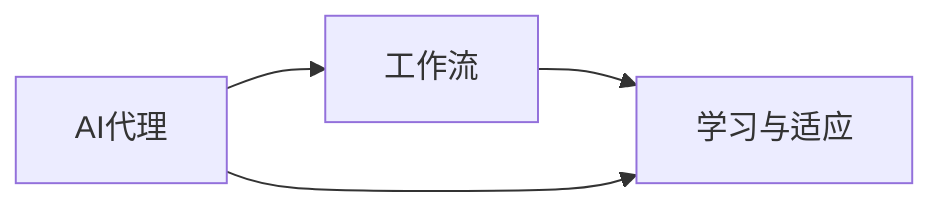

# AI人工智能代理工作流AI Agent WorkFlow：学习与适应的算法框架

## 1. 背景介绍
### 1.1 问题的由来

随着人工智能技术的飞速发展，AI代理（AI Agents）的概念逐渐走进人们的视野。AI代理是一种能够独立执行任务、与环境交互的智能体，它们在智能机器人、智能家居、无人驾驶等领域扮演着越来越重要的角色。然而，在复杂多变的环境中，AI代理需要具备自我学习和适应的能力，以应对不断变化的环境和任务需求。

### 1.2 研究现状

目前，AI代理领域的研究主要集中在以下几个方面：

- **感知与认知**：研究AI代理如何通过传感器获取环境信息，并对其进行理解和处理。
- **决策与规划**：研究AI代理如何根据环境信息和自身目标，进行决策和制定行动计划。
- **行动与执行**：研究AI代理如何将决策转化为实际行动，并与环境进行交互。
- **学习与适应**：研究AI代理如何通过学习环境信息和自身行为，不断改进自己的性能。

### 1.3 研究意义

AI代理工作流的学习与适应算法框架对于AI代理的智能化发展具有重要意义：

- **提高智能代理的自主性**：通过学习与适应，AI代理可以更好地理解环境，自主地进行决策和执行任务。
- **提升智能代理的鲁棒性**：在面对复杂多变的环境时，AI代理可以快速适应，提高其鲁棒性。
- **拓展智能代理的应用范围**：学习与适应能力使得AI代理能够适应不同的任务和环境，从而拓展其应用范围。

### 1.4 本文结构

本文将围绕AI人工智能代理工作流AI Agent WorkFlow的学习与适应算法框架展开，内容安排如下：

- **第2部分**：介绍AI代理工作流的核心概念和相关技术。
- **第3部分**：阐述AI代理工作流的学习与适应算法原理和具体操作步骤。
- **第4部分**：介绍学习与适应算法的数学模型和公式，并结合实例进行讲解。
- **第5部分**：给出AI代理工作流的代码实例和详细解释说明。
- **第6部分**：探讨AI代理工作流在实际应用场景中的应用。
- **第7部分**：推荐AI代理工作流相关的学习资源、开发工具和参考文献。
- **第8部分**：总结全文，展望AI代理工作流未来的发展趋势与挑战。

## 2. 核心概念与联系

### 2.1 AI代理

AI代理是一种具有自主意识和行动能力的智能体，它们可以通过传感器获取环境信息，并对其进行处理和分析，从而进行决策和执行任务。

### 2.2 工作流

工作流是一系列相互关联的任务的有序集合，它们需要按照一定的顺序执行。在工作流中，每个任务都由AI代理完成。

### 2.3 学习与适应

学习与适应是AI代理的核心能力之一，它们可以帮助AI代理不断改进自己的性能，以适应不断变化的环境和任务需求。

以下是这三个核心概念的逻辑关系图：



从图中可以看出，AI代理通过执行工作流中的任务，并不断学习和适应，从而提升自己的智能化水平。

## 3. 核心算法原理 & 具体操作步骤
### 3.1 算法原理概述

AI代理工作流的学习与适应算法框架主要包括以下几个关键环节：

- **感知**：AI代理通过传感器获取环境信息。
- **认知**：AI代理对感知到的信息进行处理和分析。
- **决策**：AI代理根据环境信息和自身目标，进行决策和制定行动计划。
- **执行**：AI代理将决策转化为实际行动，并与环境进行交互。
- **学习**：AI代理根据执行结果和环境反馈，不断改进自己的性能。
- **适应**：AI代理根据环境变化和任务需求，调整自己的策略和行为。

### 3.2 算法步骤详解

以下是AI代理工作流的学习与适应算法的具体步骤：

**Step 1：感知**

AI代理通过传感器获取环境信息，如图像、声音、温度等。

**Step 2：认知**

AI代理对感知到的信息进行处理和分析，提取关键特征，并对其进行理解。

**Step 3：决策**

AI代理根据环境信息和自身目标，进行决策和制定行动计划。

**Step 4：执行**

AI代理将决策转化为实际行动，并与环境进行交互。

**Step 5：学习**

AI代理根据执行结果和环境反馈，不断改进自己的性能。

**Step 6：适应**

AI代理根据环境变化和任务需求，调整自己的策略和行为。

### 3.3 算法优缺点

AI代理工作流的学习与适应算法具有以下优点：

- **灵活性**：AI代理可以根据环境变化和任务需求，灵活调整自己的策略和行为。
- **鲁棒性**：AI代理可以适应复杂多变的环境，具有较强的鲁棒性。
- **自主性**：AI代理可以自主地进行决策和执行任务，无需人工干预。

然而，该算法也存在一定的缺点：

- **计算复杂度**：AI代理工作流的学习与适应算法需要大量的计算资源。
- **数据依赖**：AI代理的性能依赖于大量高质量的数据。

### 3.4 算法应用领域

AI代理工作流的学习与适应算法可以应用于以下领域：

- **智能机器人**：如家庭机器人、服务机器人、工业机器人等。
- **智能家居**：如智能家电、智能安防系统等。
- **无人驾驶**：如自动驾驶汽车、无人配送车等。
- **智能交通**：如智能交通信号灯、智能停车系统等。

## 4. 数学模型和公式 & 详细讲解 & 举例说明
### 4.1 数学模型构建

AI代理工作流的学习与适应算法可以使用以下数学模型进行描述：

- **感知模型**：描述AI代理如何感知环境信息。
- **认知模型**：描述AI代理如何对感知到的信息进行处理和分析。
- **决策模型**：描述AI代理如何进行决策和制定行动计划。
- **执行模型**：描述AI代理如何将决策转化为实际行动，并与环境进行交互。
- **学习模型**：描述AI代理如何根据执行结果和环境反馈，不断改进自己的性能。
- **适应模型**：描述AI代理如何根据环境变化和任务需求，调整自己的策略和行为。

以下是一个简单的感知模型示例：

$$
S = f(E)
$$

其中，$S$ 表示AI代理感知到的环境状态，$E$ 表示环境信息，$f$ 表示感知函数。

### 4.2 公式推导过程

以下是一个简单的决策模型示例：

$$
\begin{aligned}
A &= \arg\max_{a \in A} Q(s,a) \\
Q(s,a) &= R(s,a) + \gamma \max_{a' \in A} Q(s',a')
\end{aligned}
$$

其中，$A$ 表示所有可能的行动集合，$Q(s,a)$ 表示在状态 $s$ 下采取行动 $a$ 的期望收益，$R(s,a)$ 表示在状态 $s$ 下采取行动 $a$ 的即时收益，$\gamma$ 表示折现因子，$s'$ 表示采取行动 $a$ 后的状态。

### 4.3 案例分析与讲解

以下是一个简单的AI代理工作流案例：智能配送机器人。

**感知**：智能配送机器人通过摄像头和传感器获取道路信息、交通状况、行人信息等。

**认知**：智能配送机器人对感知到的信息进行处理和分析，提取关键特征，如道路类型、交通流量、行人位置等。

**决策**：智能配送机器人根据环境信息和自身目标（将货物安全送达目的地），进行决策和制定行动计划，如选择最优路径、调整行驶速度等。

**执行**：智能配送机器人将决策转化为实际行动，如启动电机、调整转向等。

**学习**：智能配送机器人根据执行结果和环境反馈，不断改进自己的性能，如优化路径规划算法、调整速度控制策略等。

**适应**：智能配送机器人根据环境变化和任务需求，调整自己的策略和行为，如遇到拥堵时选择绕行路线。

### 4.4 常见问题解答

**Q1：AI代理工作流的学习与适应算法如何实现？**

A1：AI代理工作流的学习与适应算法可以通过多种方法实现，如强化学习、深度学习、机器学习等。具体方法的选择取决于任务需求、数据特点和环境复杂性等因素。

**Q2：如何评估AI代理工作流的性能？**

A2：AI代理工作流的性能可以通过以下指标进行评估：

- **准确率**：AI代理完成任务的成功率。
- **效率**：AI代理完成任务所需的时间。
- **鲁棒性**：AI代理在面对复杂多变的环境时的表现。
- **适应性**：AI代理在面对环境变化和任务需求时的表现。

## 5. 项目实践：代码实例和详细解释说明
### 5.1 开发环境搭建

为了实现AI代理工作流的学习与适应算法，我们需要搭建以下开发环境：

- **Python**：用于编写AI代理工作流代码。
- **TensorFlow**：用于深度学习模型训练和推理。
- **ROS（Robot Operating System）**：用于机器人系统开发和控制。

### 5.2 源代码详细实现

以下是一个简单的AI代理工作流代码示例，用于实现智能配送机器人的路径规划功能。

```python
import numpy as np
import matplotlib.pyplot as plt
import tensorflow as tf

# 创建地图
map_size = (10, 10)
map = np.zeros(map_size)

# 设置障碍物
obstacles = [(3, 3), (4, 4), (5, 5)]
for obstacle in obstacles:
    map[obstacle] = 1

# 创建节点
nodes = []
for i in range(map_size[0]):
    for j in range(map_size[1]):
        if map[i, j] == 0:
            nodes.append((i, j))

# 创建图
graph = {}
for node in nodes:
    neighbors = []
    for neighbor in nodes:
        if abs(node[0] - neighbor[0]) + abs(node[1] - neighbor[1]) == 1:
            neighbors.append(neighbor)
    graph[node] = neighbors

# Dijkstra算法计算最短路径
def dijkstra(start, end, graph):
    distances = {node: float('inf') for node in graph}
    distances[start] = 0
    path = {}
    current_node = start
    while distances[current_node] != float('inf'):
        for neighbor in graph[current_node]:
            tentative_distance = distances[current_node] + 1
            if tentative_distance < distances[neighbor]:
                distances[neighbor] = tentative_distance
                path[neighbor] = current_node
        min_distance = min([distances[node] for node in distances if distances[node] != float('inf')])
        current_node = [node for node in distances if distances[node] == min_distance][0]
    return path

# 测试路径规划
start = (0, 0)
end = (9, 9)
path = dijkstra(start, end, graph)

# 绘制路径
plt.imshow(map, cmap='gray')
for node in path:
    plt.scatter(node[0], node[1], c='red')
plt.show()
```

### 5.3 代码解读与分析

上述代码使用了Dijkstra算法实现了智能配送机器人的路径规划功能。代码首先创建了一个地图，并设置了障碍物。然后，创建了一个节点列表，用于表示地图上的每个点。接着，创建了一个图，用于表示节点之间的连接关系。最后，使用Dijkstra算法计算了从起点到终点的最短路径，并使用matplotlib绘制了路径。

### 5.4 运行结果展示

运行上述代码，将得到一个包含障碍物和路径的图像。

## 6. 实际应用场景
### 6.1 智能配送机器人

智能配送机器人是AI代理工作流的一个典型应用场景。通过路径规划、环境感知、决策和执行等环节，智能配送机器人可以自主地在复杂环境中进行配送任务。

### 6.2 智能家居

智能家居是AI代理工作流的另一个重要应用场景。通过传感器感知家庭环境、根据用户需求进行决策和执行任务，智能家居可以实现更加便捷、舒适的生活体验。

### 6.3 智能交通

智能交通是AI代理工作流在交通领域的应用。通过感知交通状况、规划最优路径、控制车辆行驶等环节，智能交通可以有效缓解交通拥堵，提高交通效率。

## 7. 工具和资源推荐
### 7.1 学习资源推荐

- **《人工智能：一种现代的方法》（Artificial Intelligence: A Modern Approach）**：这是一本经典的AI教材，详细介绍了AI的基本概念、方法和算法。
- **《深度学习》（Deep Learning）**：这是一本深度学习领域的经典教材，介绍了深度学习的原理和算法。
- **ROS官网（http://www.ros.org/）**：ROS是一个开源机器人操作系统，提供了丰富的机器人开发和控制工具。

### 7.2 开发工具推荐

- **TensorFlow**：一个开源的深度学习框架，提供了丰富的深度学习模型和工具。
- **PyTorch**：一个开源的深度学习框架，具有灵活的编程接口和动态计算图。
- **ROS（Robot Operating System）**：一个开源的机器人操作系统，提供了丰富的机器人开发和控制工具。

### 7.3 相关论文推荐

- **《A Few Useful Things to Know about Machine Learning》**：这篇论文介绍了机器学习的基本概念和常见陷阱。
- **《Deep Learning for NLP》**：这篇论文介绍了深度学习在自然语言处理领域的应用。
- **《Introduction to Deep Learning for NLP》**：这篇论文介绍了深度学习在自然语言处理领域的入门知识。

### 7.4 其他资源推荐

- **AI村（https://www.aicvillage.com/）**：一个AI领域的社区，提供了丰富的AI知识和资源。
- **CSDN（https://www.csdn.net/）**：一个IT领域的社区，提供了丰富的技术文章和教程。
- **GitHub（https://github.com/）**：一个代码托管平台，提供了丰富的开源项目和代码。

## 8. 总结：未来发展趋势与挑战
### 8.1 研究成果总结

本文对AI人工智能代理工作流AI Agent WorkFlow：学习与适应的算法框架进行了系统性的介绍，阐述了AI代理工作流的核心概念、算法原理和应用场景。通过实例代码和案例分析，展示了AI代理工作流在实际应用中的价值。

### 8.2 未来发展趋势

随着人工智能技术的不断发展，AI代理工作流将呈现以下发展趋势：

- **多模态感知**：AI代理将融合多种感知数据，如视觉、听觉、触觉等，以更全面地感知环境。
- **强化学习**：AI代理将采用强化学习等先进算法，以实现更加智能的决策和执行。
- **跨领域迁移**：AI代理将具备跨领域迁移能力，以适应不同的应用场景和任务需求。
- **可解释性**：AI代理将具备更强的可解释性，以便于用户理解其决策和执行过程。

### 8.3 面临的挑战

尽管AI代理工作流在智能化发展方面取得了显著进展，但仍然面临着以下挑战：

- **数据获取**：高质量的数据是AI代理工作流的基础，如何获取大量高质量数据是一个重要挑战。
- **算法复杂度**：AI代理工作流中的算法复杂度较高，如何降低算法复杂度，提高算法效率是一个重要挑战。
- **可解释性**：如何提高AI代理工作流的可解释性，以便于用户理解其决策和执行过程是一个重要挑战。

### 8.4 研究展望

为了应对AI代理工作流面临的挑战，未来的研究可以从以下几个方面展开：

- **数据增强**：研究如何通过数据增强技术，提高数据质量和数量。
- **算法优化**：研究如何优化算法，降低算法复杂度，提高算法效率。
- **可解释性研究**：研究如何提高AI代理工作流的可解释性，以便于用户理解其决策和执行过程。

相信随着人工智能技术的不断发展，AI代理工作流将不断改进和完善，为人类社会创造更大的价值。

---

作者：禅与计算机程序设计艺术 / Zen and the Art of Computer Programming