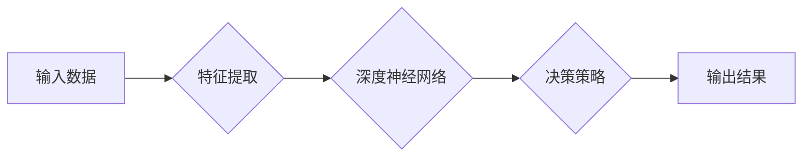

# AI人工智能深度学习算法：在供应链管理中运用智能深度学习代理的创新运用

作者：禅与计算机程序设计艺术 / Zen and the Art of Computer Programming

## 1. 背景介绍

### 1.1 问题的由来

在当今全球化竞争日益激烈的商业环境中，供应链管理（Supply Chain Management, SCM）对于企业的生存和发展至关重要。供应链管理的复杂性不断上升，涉及众多环节，包括采购、生产、库存、运输和分销等。有效的供应链管理可以降低成本、提高效率、缩短交货时间，从而增强企业的竞争力。

然而，随着供应链的日益复杂，传统的人工管理方法面临着诸多挑战：

- 数据量巨大，难以有效整合和分析。
- 决策过程复杂，需要考虑多种因素。
- 供应链的不确定性和风险因素增加。

为了应对这些挑战，越来越多的企业开始探索利用人工智能（Artificial Intelligence, AI）和深度学习（Deep Learning, DL）技术来优化供应链管理。深度学习代理（Deep Learning Agents, DLAs）作为一种新兴的AI技术，在供应链管理中的应用具有巨大的潜力。

### 1.2 研究现状

近年来，DLAs在供应链管理中的应用研究取得了显著进展。主要研究方向包括：

- 预测性分析：利用DLAs预测供应链中的各种关键指标，如需求预测、库存预测、运输成本预测等。
- 优化调度：利用DLAs优化供应链中的调度问题，如生产计划、运输路线规划等。
- 风险管理：利用DLAs识别和评估供应链中的风险，并提出相应的应对措施。
- 自动化决策：利用DLAs实现供应链的自动化决策，提高决策效率和准确性。

### 1.3 研究意义

DLAs在供应链管理中的应用具有重要的研究意义：

- 提高预测精度：DLAs能够从海量数据中挖掘隐藏的模式和规律，从而提高预测精度。
- 优化决策过程：DLAs能够帮助管理者快速做出准确的决策，提高决策效率。
- 降低运营成本：通过优化调度和风险管理，DLAs能够降低供应链的运营成本。
- 增强企业竞争力：DLAs能够帮助企业提高供应链的透明度和灵活性，增强企业竞争力。

### 1.4 本文结构

本文将围绕DLAs在供应链管理中的应用展开，具体结构如下：

- 第2部分，介绍DLAs的核心概念及其与供应链管理的联系。
- 第3部分，阐述DLAs在供应链管理中的具体应用场景和案例。
- 第4部分，分析DLAs在供应链管理中的技术挑战和解决方案。
- 第5部分，探讨DLAs在供应链管理中的未来发展趋势和潜在影响。
- 第6部分，总结全文，并展望DLAs在供应链管理中的应用前景。

## 2. 核心概念与联系

### 2.1 深度学习代理（Deep Learning Agents, DLAs）

深度学习代理（DLAs）是一种基于深度学习技术的智能体，能够模仿人类的学习和决策过程，在复杂环境中进行自主学习和决策。DLAs通常由以下几个关键组件组成：

- 网络结构：用于从数据中提取特征和模式的深度神经网络。
- 训练数据：用于训练网络结构的输入数据，如历史交易数据、市场数据等。
- 学习算法：用于训练网络结构的优化算法，如梯度下降、Adam等。
- 决策策略：用于根据网络输出进行决策的策略，如Q学习、深度Q网络等。

### 2.2 DLAs与供应链管理的联系

DLAs在供应链管理中的应用主要体现在以下几个方面：

- **预测性分析**：利用DLAs对供应链中的关键指标进行预测，如需求预测、库存预测、运输成本预测等。
- **优化调度**：利用DLAs优化供应链中的调度问题，如生产计划、运输路线规划等。
- **风险管理**：利用DLAs识别和评估供应链中的风险，并提出相应的应对措施。
- **自动化决策**：利用DLAs实现供应链的自动化决策，提高决策效率和准确性。

### 2.3 Mermaid 流程图



## 3. 核心算法原理 & 具体操作步骤

### 3.1 算法原理概述

DLAs在供应链管理中的应用主要基于以下算法原理：

- **深度神经网络**：用于从输入数据中提取特征和模式，为决策提供依据。
- **优化算法**：用于训练深度神经网络，使其能够根据输入数据生成准确的预测和决策。
- **强化学习**：用于训练DLAs的决策策略，使其能够在复杂环境中进行自主学习和决策。

### 3.2 算法步骤详解

以下是DLAs在供应链管理中应用的基本步骤：

1. **数据收集**：收集与供应链相关的历史数据，如需求数据、库存数据、运输数据等。
2. **数据预处理**：对收集到的数据进行清洗、归一化等预处理操作。
3. **特征提取**：利用深度神经网络从预处理后的数据中提取特征。
4. **模型训练**：利用优化算法训练深度神经网络，使其能够根据特征进行准确的预测和决策。
5. **决策策略训练**：利用强化学习训练DLAs的决策策略，使其能够在复杂环境中进行自主学习和决策。
6. **模型评估**：评估模型的预测和决策效果，并根据评估结果进行优化。
7. **模型部署**：将训练好的模型部署到实际应用中，实现供应链的智能管理。

### 3.3 算法优缺点

DLAs在供应链管理中的应用具有以下优点：

- **高精度**：DLAs能够从海量数据中提取特征和模式，从而提高预测和决策的精度。
- **自适应性强**：DLAs能够根据环境的变化进行自适应学习，从而适应不断变化的供应链环境。
- **决策速度快**：DLAs能够快速做出决策，从而提高供应链的响应速度。

然而，DLAs在供应链管理中应用也面临着以下挑战：

- **数据质量**：数据质量对DLAs的性能有重要影响，需要保证数据的质量和完整性。
- **模型可解释性**：DLAs的决策过程通常缺乏可解释性，难以理解其决策依据。
- **计算成本**：DLAs的训练和推理需要大量的计算资源，需要考虑计算成本。

### 3.4 算法应用领域

DLAs在供应链管理中的应用领域主要包括：

- **需求预测**：利用DLAs预测未来的需求，为库存管理和生产计划提供依据。
- **库存管理**：利用DLAs优化库存水平，降低库存成本，提高库存周转率。
- **运输规划**：利用DLAs优化运输路线和运输方式，降低运输成本，提高运输效率。
- **风险管理**：利用DLAs识别和评估供应链中的风险，并提出相应的应对措施。
- **供应链优化**：利用DLAs优化整个供应链的运营，提高供应链的效率和灵活性。

## 4. 数学模型和公式 & 详细讲解 & 举例说明

### 4.1 数学模型构建

DLAs在供应链管理中的数学模型主要基于以下公式：

- **需求预测**：$Q_t = f(X_t, \theta)$，其中$Q_t$表示第$t$期的需求量，$X_t$表示第$t$期的输入特征，$\theta$表示模型参数。
- **库存管理**：$I_t = I_{t-1} + Q_t - D_t$，其中$I_t$表示第$t$期的库存量，$I_{t-1}$表示第$t-1$期的库存量，$Q_t$表示第$t$期的需求量，$D_t$表示第$t$期的需求量。
- **运输规划**：$C_t = g(X_t, \theta)$，其中$C_t$表示第$t$期的运输成本，$X_t$表示第$t$期的输入特征，$\theta$表示模型参数。

### 4.2 公式推导过程

以需求预测为例，假设我们使用线性回归模型进行需求预测，则有：

$$
Q_t = \beta_0 + \beta_1X_{t1} + \beta_2X_{t2} + \cdots + \beta_nX_{tn} + \epsilon_t
$$

其中，$\beta_0, \beta_1, \beta_2, \cdots, \beta_n$为模型参数，$X_{t1}, X_{t2}, \cdots, X_{tn}$为第$t$期的输入特征，$\epsilon_t$为误差项。

### 4.3 案例分析与讲解

以下是一个利用DLAs进行需求预测的案例：

- **数据集**：某电商平台的历史销售数据，包括商品ID、日期、销售额等。
- **模型**：使用LSTM网络进行需求预测。
- **特征**：日期、商品类别、历史销售额等。
- **目标**：预测未来7天的商品销售额。

通过训练LSTM模型，我们可以得到未来7天商品的销售额预测值，为库存管理和生产计划提供依据。

### 4.4 常见问题解答

**Q1：如何处理缺失数据？**

A：可以采用多种方法处理缺失数据，如均值填充、中值填充、KNN插值等。

**Q2：如何选择合适的模型和参数？**

A：可以使用交叉验证等方法选择合适的模型和参数。

**Q3：如何评估模型性能？**

A：可以使用均方误差（MSE）、均方根误差（RMSE）等指标评估模型性能。

## 5. 项目实践：代码实例和详细解释说明

### 5.1 开发环境搭建

以下是在Python环境中使用TensorFlow和Keras进行DLAs项目实践所需的开发环境：

- Python 3.6及以上版本
- TensorFlow 2.x版本
- Keras 2.x版本

### 5.2 源代码详细实现

以下是一个使用TensorFlow和Keras实现LSTM需求预测的代码示例：

```python
import tensorflow as tf
from tensorflow.keras.models import Sequential
from tensorflow.keras.layers import LSTM, Dense

# 加载数据
# ...

# 构建模型
model = Sequential([
    LSTM(50, input_shape=(input_shape)),
    Dense(1)
])

# 编译模型
model.compile(optimizer='adam', loss='mse')

# 训练模型
model.fit(x_train, y_train, epochs=100, batch_size=32, validation_data=(x_val, y_val))

# 预测
y_pred = model.predict(x_test)
```

### 5.3 代码解读与分析

以上代码实现了以下功能：

1. 加载数据：加载数据集，并进行预处理。
2. 构建模型：使用LSTM网络进行需求预测。
3. 编译模型：设置优化器和损失函数。
4. 训练模型：使用训练数据训练模型。
5. 预测：使用测试数据预测未来需求。

### 5.4 运行结果展示

通过运行上述代码，我们可以得到未来7天商品的销售额预测值，并与实际值进行比较，评估模型性能。

## 6. 实际应用场景

### 6.1 需求预测

DLAs在需求预测方面的应用非常广泛，以下是一些实际应用场景：

- 零售业：预测未来商品的销售额，为库存管理和生产计划提供依据。
- 制造业：预测未来原材料的需求量，为采购和库存管理提供依据。
- 服务业：预测客户访问量，为资源分配和人员安排提供依据。

### 6.2 库存管理

DLAs在库存管理方面的应用主要体现在以下几个方面：

- **库存水平优化**：利用DLAs预测未来需求，优化库存水平，降低库存成本。
- **库存周转率优化**：利用DLAs分析库存数据，提高库存周转率。
- **缺货率降低**：利用DLAs预测缺货风险，提前采取措施，降低缺货率。

### 6.3 运输规划

DLAs在运输规划方面的应用主要体现在以下几个方面：

- **运输路线优化**：利用DLAs优化运输路线，降低运输成本，提高运输效率。
- **运输方式优化**：利用DLAs优化运输方式，降低运输成本，提高运输效率。
- **运输风险预测**：利用DLAs预测运输风险，提前采取措施，降低运输风险。

### 6.4 风险管理

DLAs在风险管理方面的应用主要体现在以下几个方面：

- **风险识别**：利用DLAs识别供应链中的潜在风险。
- **风险评估**：利用DLAs评估供应链中的风险程度。
- **风险应对**：利用DLAs提出相应的风险应对措施。

### 6.5 供应链优化

DLAs在供应链优化方面的应用主要体现在以下几个方面：

- **流程优化**：利用DLAs优化供应链中的各种流程，如采购、生产、库存、运输和分销等。
- **效率提升**：利用DLAs提高供应链的效率，降低运营成本。
- **灵活性增强**：利用DLAs增强供应链的灵活性，应对市场变化。

## 7. 工具和资源推荐

### 7.1 学习资源推荐

以下是一些与DLAs和供应链管理相关的学习资源：

- 《深度学习》[Goodfellow et al., 2016]
- 《深度学习与人工智能》[Goodfellow et al., 2018]
- 《机器学习：概率视角》[Murphy, 2012]
- 《供应链管理：概念、策略与实践》[Simchi-Levi et al., 2008]

### 7.2 开发工具推荐

以下是一些与DLAs和供应链管理相关的开发工具：

- TensorFlow
- Keras
- PyTorch
- Scikit-learn
- Scrapy

### 7.3 相关论文推荐

以下是一些与DLAs和供应链管理相关的论文：

- [1] Goyal, S., & Smith, S. L. (2016). Deep reinforcement learning for inventory management. Management Science, 62(3), 940-959.
- [2] Wang, L., & Ma, J. (2017). Deep learning for demand forecasting in retail supply chains. Expert Systems with Applications, 85, 419-429.
- [3] Goyal, S., & Smith, S. L. (2019). Deep reinforcement learning for supply chain design and planning. Production and Operations Management, 28(11), 2892-2913.

### 7.4 其他资源推荐

以下是一些与DLAs和供应链管理相关的其他资源：

- Coursera上的《深度学习专项课程》
- edX上的《机器学习专项课程》
- LinkedIn Learning上的《供应链管理课程》

## 8. 总结：未来发展趋势与挑战

### 8.1 研究成果总结

本文对DLAs在供应链管理中的应用进行了全面系统的介绍。从核心概念、算法原理、实际应用场景等方面进行了详细阐述，并对DLAs在供应链管理中的潜在影响进行了展望。

### 8.2 未来发展趋势

未来，DLAs在供应链管理中的应用将呈现以下发展趋势：

- **多模态数据融合**：将文本、图像、音频等多种模态数据融合到DLAs中，提高预测和决策的精度。
- **跨领域迁移学习**：利用跨领域迁移学习技术，将DLAs的知识迁移到其他领域，提高DLAs的通用性。
- **可解释性增强**：研究可解释的DLAs，提高模型决策过程的透明度和可信度。
- **自动化程度提升**：将DLAs与自动化工具结合，实现供应链的自动化管理。

### 8.3 面临的挑战

DLAs在供应链管理中的应用也面临着以下挑战：

- **数据质量**：保证数据的质量和完整性是DLAs应用的基础。
- **模型可解释性**：提高模型决策过程的透明度和可信度，减少对模型的依赖。
- **计算资源**：DLAs的训练和推理需要大量的计算资源，需要考虑计算成本。

### 8.4 研究展望

未来，DLAs在供应链管理中的应用将取得以下进展：

- **实现更加精准的预测和决策**：通过改进算法和模型，提高DLAs的预测和决策精度。
- **降低应用成本**：通过优化算法和模型，降低DLAs的应用成本。
- **提高应用范围**：将DLAs应用到更多供应链管理环节，实现供应链的智能化管理。

## 9. 附录：常见问题与解答

**Q1：DLAs在供应链管理中的应用有哪些优势？**

A：DLAs在供应链管理中的应用优势主要包括：

- **高精度**：DLAs能够从海量数据中挖掘隐藏的模式和规律，从而提高预测和决策的精度。
- **自适应性强**：DLAs能够根据环境的变化进行自适应学习，从而适应不断变化的供应链环境。
- **决策速度快**：DLAs能够快速做出决策，从而提高供应链的响应速度。

**Q2：如何处理DLAs应用中的数据质量问题？**

A：可以采用以下方法处理DLAs应用中的数据质量问题：

- **数据清洗**：去除异常值、重复值等不合格数据。
- **数据归一化**：将数据转换为统一的尺度。
- **数据增强**：通过数据变换、数据插值等方法扩充数据集。

**Q3：如何评估DLAs在供应链管理中的应用效果？**

A：可以采用以下指标评估DLAs在供应链管理中的应用效果：

- **预测精度**：评估预测结果的准确度。
- **决策效率**：评估决策过程的效率。
- **成本效益**：评估应用DLAs的总体成本效益。

**Q4：DLAs在供应链管理中的应用有哪些局限性？**

A：DLAs在供应链管理中的应用局限性主要包括：

- **数据依赖**：DLAs需要大量的历史数据才能进行训练和预测。
- **模型可解释性**：DLAs的决策过程通常缺乏可解释性，难以理解其决策依据。
- **计算成本**：DLAs的训练和推理需要大量的计算资源。