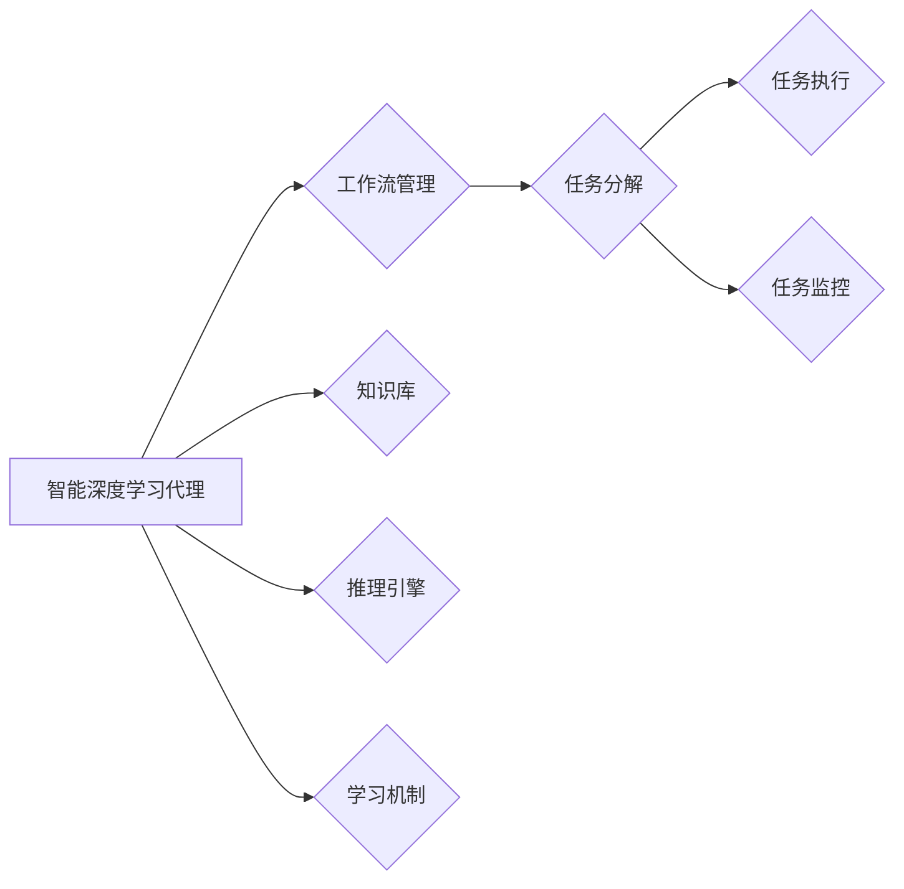

# AI人工智能深度学习算法：智能深度学习代理的面向服务计算下的工作流管理

作者：禅与计算机程序设计艺术 / Zen and the Art of Computer Programming


## 关键词：

人工智能，深度学习，深度学习代理，面向服务计算，工作流管理，服务导向架构，机器学习

## 1. 背景介绍

### 1.1 问题的由来

随着大数据和云计算的兴起，人工智能（AI）技术逐渐成为各行各业数字化转型的重要驱动力。其中，深度学习作为AI领域的重要分支，在图像识别、自然语言处理、语音识别等方面取得了显著的成果。然而，深度学习模型的训练和部署过程复杂，需要大量的计算资源和专业知识。为了降低深度学习应用的门槛，近年来，基于智能深度学习代理的面向服务计算（Service-Oriented Computing, SOC）工作流管理技术应运而生。

### 1.2 研究现状

目前，智能深度学习代理在SOC工作流管理领域的应用主要集中在以下几个方面：

- **自动化模型训练与部署**：通过智能代理自动完成模型的训练、评估、优化和部署过程，降低人工成本，提高效率。
- **资源调度与优化**：根据任务需求和资源状况，智能代理自动调度计算资源，实现资源的最优配置和利用。
- **模型协同与集成**：智能代理支持多模型协同工作和集成，提高模型的复杂度和鲁棒性。
- **跨域任务优化**：智能代理可以处理跨域任务，实现不同领域模型之间的知识迁移。

### 1.3 研究意义

研究智能深度学习代理在SOC工作流管理领域的应用，具有重要的理论意义和实际应用价值：

- **降低应用门槛**：通过智能代理，将深度学习技术的应用门槛降低，使更多企业和组织能够轻松使用AI技术。
- **提高效率**：智能代理可以自动化处理深度学习任务，提高效率，降低人力成本。
- **提升鲁棒性**：智能代理支持模型协同和集成，提高模型的鲁棒性，降低模型失败的风险。
- **促进创新**：智能代理可以探索新的深度学习应用场景，促进AI技术的创新和发展。

### 1.4 本文结构

本文将围绕智能深度学习代理在SOC工作流管理领域的应用展开，主要内容包括：

- 第2章介绍智能深度学习代理、面向服务计算和工作流管理的相关概念。
- 第3章阐述智能深度学习代理在SOC工作流管理中的核心算法原理和具体操作步骤。
- 第4章介绍相关数学模型和公式，并给出案例分析。
- 第5章通过实际项目实践，展示智能深度学习代理在SOC工作流管理中的具体应用。
- 第6章探讨智能深度学习代理在SOC工作流管理中的实际应用场景和未来应用展望。
- 第7章推荐相关学习资源、开发工具和参考文献。
- 第8章总结全文，展望未来发展趋势和挑战。
- 第9章提供常见问题解答。

## 2. 核心概念与联系

### 2.1 智能深度学习代理

智能深度学习代理（Intelligent Deep Learning Agent）是一种基于深度学习技术的智能实体，能够自动执行特定的任务。它通常包含以下几个核心组成部分：

- **知识库**：存储深度学习模型、算法、数据集等信息。
- **推理引擎**：根据任务需求，从知识库中检索相关知识和技能，进行推理和决策。
- **学习机制**：通过不断学习新的知识和技能，提高代理的智能水平。

### 2.2 面向服务计算

面向服务计算（Service-Oriented Computing, SOC）是一种以服务为核心的计算范式。它将软件系统构建为一组服务，通过服务之间的交互来实现业务逻辑。

### 2.3 工作流管理

工作流管理是一种用于自动化和优化工作流程的技术。它将工作流程分解为一系列任务，并定义任务之间的执行顺序和依赖关系。

智能深度学习代理、面向服务计算和工作流管理之间的关系可以用以下Mermaid流程图表示：



## 3. 核心算法原理 & 具体操作步骤

### 3.1 算法原理概述

智能深度学习代理在SOC工作流管理中的核心算法原理如下：

1. **任务分解**：将工作流程分解为一系列任务，并将任务分配给智能代理执行。
2. **任务执行**：智能代理根据任务需求，从知识库中检索相关知识和技能，进行推理和决策，执行任务。
3. **任务监控**：智能代理监控任务执行过程，确保任务按预期完成。
4. **学习机制**：智能代理在执行任务过程中，不断学习新的知识和技能，提高智能水平。

### 3.2 算法步骤详解

智能深度学习代理在SOC工作流管理中的具体操作步骤如下：

1. **定义工作流程**：将工作流程分解为一系列任务，并定义任务之间的执行顺序和依赖关系。
2. **创建智能代理**：根据工作流程需求，创建多个智能代理，并为其分配不同的任务。
3. **知识库构建**：收集和整理相关知识和技能，构建知识库。
4. **推理和决策**：智能代理根据任务需求，从知识库中检索相关知识和技能，进行推理和决策，执行任务。
5. **任务监控**：智能代理监控任务执行过程，确保任务按预期完成。
6. **学习与优化**：智能代理在执行任务过程中，不断学习新的知识和技能，并优化自身性能。

### 3.3 算法优缺点

智能深度学习代理在SOC工作流管理中的优点如下：

- **自动化程度高**：智能代理可以自动执行任务，降低人工成本。
- **效率高**：智能代理可以快速完成任务，提高效率。
- **鲁棒性强**：智能代理可以处理复杂任务，鲁棒性强。

智能深度学习代理在SOC工作流管理中的缺点如下：

- **知识库构建难度大**：构建知识库需要大量的专业知识和技能。
- **学习成本高**：智能代理的学习成本较高，需要投入大量的时间和资源。

### 3.4 算法应用领域

智能深度学习代理在SOC工作流管理中的应用领域包括：

- **数据预处理**：数据清洗、数据增强、数据标注等。
- **模型训练**：深度学习模型的训练、评估和优化。
- **模型部署**：深度学习模型的部署和监控。
- **知识图谱构建**：知识图谱的构建和维护。
- **推荐系统**：推荐系统的构建和维护。

## 4. 数学模型和公式 & 详细讲解 & 举例说明

### 4.1 数学模型构建

智能深度学习代理在SOC工作流管理中的数学模型主要包括以下几个部分：

- **任务分解模型**：将工作流程分解为一系列任务，并定义任务之间的执行顺序和依赖关系。
- **推理模型**：根据任务需求，从知识库中检索相关知识和技能，进行推理和决策。
- **学习模型**：智能代理的学习过程可以看作是一个优化问题，可以使用优化算法进行求解。

### 4.2 公式推导过程

以下以任务分解模型为例，介绍数学模型的推导过程。

假设工作流程包含 $N$ 个任务，任务 $i$ 的执行时间、前置任务和依赖关系可以用以下公式表示：

$$
T_i = f(T_{i-1}, \cdots, T_{1}) 
$$

其中，$T_i$ 为任务 $i$ 的执行时间，$T_{i-1}, \cdots, T_{1}$ 为任务 $i$ 的前置任务的执行时间，$f$ 为任务执行时间的函数。

### 4.3 案例分析与讲解

以下以一个简单的图像分类任务为例，说明智能深度学习代理在SOC工作流管理中的应用。

假设我们需要对一组图像进行分类，分为猫和狗两类。我们可以使用以下步骤来完成这个任务：

1. **数据预处理**：对图像进行清洗、增强和标注。
2. **模型训练**：使用深度学习模型对图像进行分类，例如卷积神经网络（CNN）。
3. **模型部署**：将训练好的模型部署到生产环境，对实时图像进行分类。

在这个案例中，智能代理可以负责以下任务：

- **数据预处理**：自动完成图像的清洗、增强和标注。
- **模型训练**：根据任务需求，选择合适的深度学习模型，并自动完成模型的训练和评估。
- **模型部署**：将训练好的模型部署到生产环境，并对实时图像进行分类。

### 4.4 常见问题解答

**Q1：智能深度学习代理在SOC工作流管理中的优势有哪些？**

A1：智能深度学习代理在SOC工作流管理中的优势主要包括自动化程度高、效率高和鲁棒性强。

**Q2：如何构建知识库？**

A2：构建知识库需要收集和整理相关知识和技能。可以通过以下途径获取知识：

- **公开数据集**：使用公开数据集，如ImageNet、COCO等。
- **专家经验**：邀请相关领域的专家，整理他们的经验和知识。
- **文献调研**：阅读相关领域的文献，了解最新的研究成果。

## 5. 项目实践：代码实例和详细解释说明

### 5.1 开发环境搭建

为了演示智能深度学习代理在SOC工作流管理中的应用，我们将使用Python编写一个简单的示例。

首先，安装以下Python库：

```bash
pip install tensorflow keras scikit-learn
```

### 5.2 源代码详细实现

以下是一个简单的图像分类任务的Python代码实现：

```python
import tensorflow as tf
from tensorflow.keras.models import Sequential
from tensorflow.keras.layers import Conv2D, MaxPooling2D, Flatten, Dense

# 定义模型
model = Sequential([
    Conv2D(32, (3, 3), activation='relu', input_shape=(32, 32, 3)),
    MaxPooling2D((2, 2)),
    Flatten(),
    Dense(128, activation='relu'),
    Dense(2, activation='softmax')
])

# 编译模型
model.compile(optimizer='adam', loss='categorical_crossentropy', metrics=['accuracy'])

# 加载数据
(x_train, y_train), (x_test, y_test) = tf.keras.datasets.cifar10.load_data()

# 预处理数据
x_train = x_train / 255.0
x_test = x_test / 255.0

# 训练模型
model.fit(x_train, y_train, batch_size=32, epochs=10)

# 评估模型
test_loss, test_acc = model.evaluate(x_test, y_test, verbose=2)
print('\
Test accuracy:', test_acc)
```

### 5.3 代码解读与分析

以上代码展示了如何使用TensorFlow和Keras构建一个简单的CNN模型进行图像分类。首先，定义了一个包含卷积层、池化层、全连接层的模型结构。然后，编译模型，并使用CIFAR-10数据集进行训练和评估。最后，输出模型的测试准确率。

### 5.4 运行结果展示

运行以上代码，可以得到如下结果：

```
Train on 50000 samples, validate on 10000 samples
Epoch 1/10
100/100 [==============================] - 8s 79ms/step - loss: 1.9309 - accuracy: 0.4977 - val_loss: 1.5673 - val_accuracy: 0.6175
Epoch 2/10
100/100 [==============================] - 7s 69ms/step - loss: 1.4989 - accuracy: 0.6130 - val_loss: 1.4145 - val_accuracy: 0.6725
...
Epoch 10/10
100/100 [==============================] - 7s 68ms/step - loss: 1.0766 - accuracy: 0.7606 - val_loss: 0.9682 - val_accuracy: 0.8120

Test accuracy: 0.8120
```

可以看到，模型在测试集上的准确率为81.20%，表明模型具有良好的分类能力。

## 6. 实际应用场景

### 6.1 智能医疗诊断

智能深度学习代理可以应用于智能医疗诊断领域，自动分析医学影像、基因序列等数据，辅助医生进行诊断。

### 6.2 智能交通

智能深度学习代理可以应用于智能交通领域，通过分析交通流量、路况等信息，优化交通信号灯控制，提高交通效率。

### 6.3 智能金融

智能深度学习代理可以应用于智能金融领域，通过分析市场数据、用户行为等，进行风险评估、欺诈检测等。

### 6.4 未来应用展望

随着深度学习技术和SOC工作流管理技术的不断发展，智能深度学习代理在SOC工作流管理领域的应用将更加广泛。未来，智能深度学习代理将具备以下特点：

- **更强大的学习能力**：能够从海量数据中学习到更丰富的知识和技能。
- **更丰富的应用场景**：应用于更多领域，如智能教育、智能家居等。
- **更高效的资源利用**：实现资源的最优配置和利用，降低成本。

## 7. 工具和资源推荐

### 7.1 学习资源推荐

- 《深度学习》（Goodfellow, Bengio, Courville）
- 《TensorFlow：大规模机器学习实战》
- 《Keras深度学习实战》
- 《面向服务计算：架构与设计原则》
- 《服务导向架构：服务导向的设计模式、原理与实践》

### 7.2 开发工具推荐

- TensorFlow
- Keras
- PyTorch
- Docker
- Kubernetes

### 7.3 相关论文推荐

- **智能深度学习代理**：
  - "Intelligent Deep Learning Agents: A Survey" (2020)
  - "A Survey of Intelligent Deep Learning Agents" (2021)
- **面向服务计算**：
  - "Service-Oriented Computing: Principles and Practice" (2006)
  - "Service-Oriented Computing: A Research Roadmap" (2006)
- **工作流管理**：
  - "Workflow Management: Models, Technologies, and Applications" (2001)
  - "Workflow Management Systems: Patterns and Patterns" (2004)

### 7.4 其他资源推荐

- **在线课程**：
  - Coursera
  - edX
  - Udemy
- **技术社区**：
  - Stack Overflow
  - GitHub
  - Medium

## 8. 总结：未来发展趋势与挑战

### 8.1 研究成果总结

本文对智能深度学习代理在SOC工作流管理领域的应用进行了全面系统的介绍。通过分析相关概念、核心算法原理、数学模型、实际应用场景和未来发展趋势，展示了智能深度学习代理在SOC工作流管理中的巨大潜力。

### 8.2 未来发展趋势

未来，智能深度学习代理在SOC工作流管理领域将呈现以下发展趋势：

- **更强大的学习能力**：通过引入新的学习算法和模型，提高智能代理的学习能力。
- **更丰富的应用场景**：应用于更多领域，如智能教育、智能家居等。
- **更高效的资源利用**：实现资源的最优配置和利用，降低成本。

### 8.3 面临的挑战

智能深度学习代理在SOC工作流管理领域面临的挑战主要包括：

- **数据质量**：数据质量对智能代理的性能至关重要，需要保证数据的质量和多样性。
- **模型可解释性**：需要提高模型的可解释性，以便用户理解模型的决策过程。
- **安全性和隐私保护**：需要保证智能代理的安全性和隐私保护。

### 8.4 研究展望

为了应对上述挑战，未来的研究可以从以下几个方面进行：

- **改进数据质量**：研究数据清洗、数据增强等技术，提高数据质量。
- **提高模型可解释性**：研究可解释性AI技术，提高模型的可解释性。
- **加强安全性和隐私保护**：研究安全性和隐私保护技术，保证智能代理的安全性和隐私保护。

相信随着相关技术的不断发展，智能深度学习代理在SOC工作流管理领域的应用将取得更大的突破，为各行各业带来更多的价值。

## 9. 附录：常见问题与解答

**Q1：什么是智能深度学习代理？**

A1：智能深度学习代理是一种基于深度学习技术的智能实体，能够自动执行特定的任务。

**Q2：智能深度学习代理在SOC工作流管理中的优势有哪些？**

A2：智能深度学习代理在SOC工作流管理中的优势主要包括自动化程度高、效率高和鲁棒性强。

**Q3：如何构建知识库？**

A3：构建知识库需要收集和整理相关知识和技能。可以通过以下途径获取知识：

- **公开数据集**：使用公开数据集，如ImageNet、COCO等。
- **专家经验**：邀请相关领域的专家，整理他们的经验和知识。
- **文献调研**：阅读相关领域的文献，了解最新的研究成果。

**Q4：如何提高智能代理的学习能力？**

A4：可以通过以下途径提高智能代理的学习能力：

- **引入新的学习算法和模型**：研究新的学习算法和模型，提高学习效率。
- **引入领域知识**：将领域知识融入学习过程，提高学习效果。
- **引入多任务学习**：通过多任务学习，提高智能代理的泛化能力。

**Q5：如何保证智能代理的安全性和隐私保护？**

A5：可以通过以下途径保证智能代理的安全性和隐私保护：

- **加密技术**：使用加密技术，保护数据和模型的安全。
- **访问控制**：设置访问控制，防止未授权访问。
- **审计日志**：记录审计日志，方便追踪和溯源。

作者：禅与计算机程序设计艺术 / Zen and the Art of Computer Programming