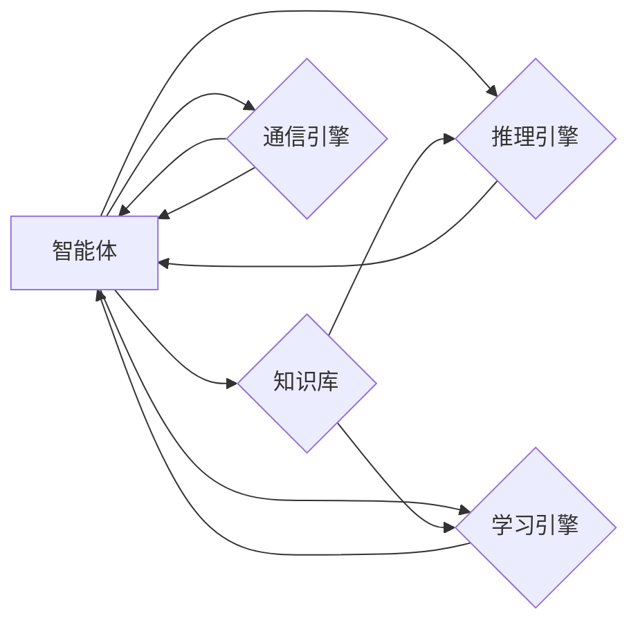

# AI智能体的下一代平台

作者：禅与计算机程序设计艺术 / Zen and the Art of Computer Programming

## 1. 背景介绍
### 1.1 问题的由来

随着人工智能（AI）技术的快速发展，智能体（Agent）已经成为AI研究的热点。智能体是一种能够感知环境、执行动作并基于感知和动作产生决策的实体。从早期的专家系统到如今的深度学习模型，智能体在各个领域都发挥着越来越重要的作用。然而，现有的智能体平台存在一些局限性，难以满足未来AI发展的需求。因此，构建AI智能体的下一代平台成为了一个迫切的课题。

### 1.2 研究现状

目前，智能体平台的研究主要集中在以下几个方面：

1. **分布式智能体**：为了提高智能体的处理能力和可扩展性，研究者们提出了分布式智能体架构，通过将多个智能体分布式部署在多个节点上，实现并行处理和数据共享。

2. **强化学习智能体**：强化学习（Reinforcement Learning，RL）是一种重要的智能体学习方法，研究者们开发了各种强化学习框架和算法，用于构建具有自主决策能力的智能体。

3. **多智能体系统**：多智能体系统（Multi-Agent System，MAS）是由多个智能体组成的系统，它们可以相互协作或竞争，以实现共同的目标。

4. **认知智能体**：认知智能体（Cognitive Agent）是一种模仿人类认知过程的智能体，它们能够进行推理、学习、规划等认知活动。

### 1.3 研究意义

构建AI智能体的下一代平台具有重要的研究意义：

1. **提高智能体处理能力和可扩展性**：下一代平台可以支持更多节点和智能体的分布式部署，从而提高智能体的处理能力和可扩展性。

2. **推动强化学习技术的发展**：下一代平台可以提供更强大的强化学习框架和算法，推动强化学习技术的发展和应用。

3. **促进多智能体系统的应用**：下一代平台可以支持更复杂的多智能体系统，拓展多智能体系统的应用领域。

4. **推动认知智能体的研究**：下一代平台可以提供更丰富的认知功能，推动认知智能体的研究和发展。

### 1.4 本文结构

本文将围绕AI智能体的下一代平台展开，主要内容包括：

- 核心概念与联系
- 核心算法原理与具体操作步骤
- 数学模型和公式
- 项目实践
- 实际应用场景
- 工具和资源推荐
- 总结：未来发展趋势与挑战

## 2. 核心概念与联系

为了更好地理解AI智能体的下一代平台，本节将介绍几个核心概念及其相互联系：

- **智能体（Agent）**：智能体是一种能够感知环境、执行动作并基于感知和动作产生决策的实体。
- **知识库（Knowledge Base）**：知识库是存储智能体所需知识的数据库，包括事实、规则、模型等。
- **推理引擎（Inference Engine）**：推理引擎是智能体的核心组件，负责根据知识库中的知识进行推理，产生决策。
- **学习引擎（Learning Engine）**：学习引擎负责智能体在环境中的学习过程，包括经验学习和知识学习。
- **通信引擎（Communication Engine）**：通信引擎负责智能体之间的信息交换和协同。

它们的逻辑关系如下图所示：



可以看出，智能体是整个平台的核心，知识库、推理引擎、学习引擎和通信引擎都是智能体的组成部分。智能体通过知识库获取知识，通过推理引擎产生决策，通过学习引擎不断学习，并通过通信引擎与其他智能体进行信息交换和协同。

## 3. 核心算法原理 & 具体操作步骤
### 3.1 算法原理概述

AI智能体的下一代平台的核心算法主要包括以下几种：

1. **分布式算法**：分布式算法用于实现智能体的分布式部署和协同工作。
2. **强化学习算法**：强化学习算法用于实现智能体的自主学习和决策。
3. **多智能体系统算法**：多智能体系统算法用于实现多个智能体之间的协同工作。
4. **认知算法**：认知算法用于实现智能体的认知功能，如推理、学习、规划等。

### 3.2 算法步骤详解

以下以分布式算法为例，介绍其具体操作步骤：

1. **节点划分**：将智能体划分为多个节点，每个节点负责处理部分数据和服务。
2. **通信协议**：设计智能体之间的通信协议，实现节点之间的信息交换。
3. **任务分配**：根据节点的处理能力和数据负载，将任务分配给相应的节点。
4. **并行计算**：各节点并行执行任务，提高整体处理效率。
5. **结果合并**：将各节点计算结果合并，得到最终结果。

### 3.3 算法优缺点

分布式算法具有以下优点：

1. **提高处理能力**：通过分布式部署，提高智能体的处理能力。
2. **提高可扩展性**：通过节点扩展，提高智能体的可扩展性。

分布式算法的缺点：

1. **通信开销**：节点之间的通信开销可能导致性能下降。
2. **同步问题**：节点之间的同步可能导致性能下降。

### 3.4 算法应用领域

分布式算法在以下领域得到广泛应用：

1. **大数据处理**：如搜索引擎、社交网络分析等。
2. **云计算**：如分布式计算、分布式存储等。

## 4. 数学模型和公式 & 详细讲解 & 举例说明
### 4.1 数学模型构建

以下是分布式算法的数学模型：

$$
\begin{aligned}
R(t) &= R_1(t) + R_2(t) + \ldots + R_n(t) \\
R_i(t) &= \frac{X_i(t)}{T_i(t)}
\end{aligned}
$$

其中，$R(t)$ 为智能体在时间 $t$ 的总处理能力，$R_i(t)$ 为节点 $i$ 在时间 $t$ 的处理能力，$X_i(t)$ 为节点 $i$ 在时间 $t$ 的数据量，$T_i(t)$ 为节点 $i$ 在时间 $t$ 的处理时间。

### 4.2 公式推导过程

分布式算法的公式推导过程如下：

1. 假设智能体的处理能力为 $R$，节点 $i$ 的处理能力为 $R_i$。
2. 假设节点 $i$ 在时间 $t$ 的数据量为 $X_i$，处理时间为 $T_i$。
3. 则节点 $i$ 在时间 $t$ 的处理能力为 $R_i(t) = \frac{X_i(t)}{T_i(t)}$。
4. 智能体在时间 $t$ 的总处理能力为 $R(t) = R_1(t) + R_2(t) + \ldots + R_n(t)$。

### 4.3 案例分析与讲解

以下以搜索引擎为例，讲解分布式算法的应用：

1. **节点划分**：将搜索引擎划分为多个节点，每个节点负责处理一部分网页。
2. **通信协议**：设计节点之间的通信协议，实现节点之间的信息交换。
3. **任务分配**：根据节点的处理能力和数据负载，将网页分配给相应的节点。
4. **并行计算**：各节点并行处理分配的网页，提取关键词、计算网页权重等。
5. **结果合并**：将各节点计算结果合并，构建全局索引。

### 4.4 常见问题解答

**Q1：分布式算法是否适用于所有场景？**

A1：分布式算法适用于需要大量计算和数据处理的场景，但对于计算量较小或数据量较小的场景，分布式算法可能不适用。

**Q2：如何选择合适的通信协议？**

A2：选择合适的通信协议需要考虑以下因素：网络带宽、延迟、可靠性等。

**Q3：如何进行任务分配？**

A3：任务分配可以通过多种方式实现，如负载均衡、兴趣分配等。

## 5. 项目实践：代码实例和详细解释说明
### 5.1 开发环境搭建

以下是使用Python和Dask构建分布式算法的示例：

```python
import dask.distributed as dd

# 启动分布式计算集群
client = dd.Client()

# 定义任务函数
def process_data(data):
    # 处理数据
    return data

# 将任务提交到集群
future = client.submit(process_data, data)

# 获取结果
result = future.result()
```

### 5.2 源代码详细实现

以下是使用Dask进行分布式计算的源代码：

```python
import dask.distributed as dd

# 启动分布式计算集群
client = dd.Client()

# 定义任务函数
def process_data(data):
    # 处理数据
    return data

# 将任务提交到集群
future = client.submit(process_data, data)

# 获取结果
result = future.result()
```

### 5.3 代码解读与分析

以上代码展示了使用Dask进行分布式计算的简单示例。首先，启动分布式计算集群，然后定义任务函数，将任务提交到集群，最后获取结果。

### 5.4 运行结果展示

运行以上代码，将在Dask集群中执行任务函数，并返回处理结果。

## 6. 实际应用场景
### 6.1 大数据分析

分布式算法在数据分析领域得到广泛应用，如：

1. **搜索引擎**：将搜索引擎划分为多个节点，每个节点处理一部分网页，提高搜索效率。
2. **社交媒体分析**：分析大量社交媒体数据，挖掘用户行为和情感。

### 6.2 云计算

分布式算法在云计算领域得到广泛应用，如：

1. **分布式存储**：分布式存储系统可以提高存储容量和可靠性。
2. **分布式计算**：分布式计算可以提高计算效率。

### 6.4 未来应用展望

随着AI技术的不断发展，分布式算法将在更多领域得到应用，如：

1. **智能交通**：实现智能交通控制系统，提高交通效率。
2. **智能医疗**：辅助医生进行诊断和治疗。

## 7. 工具和资源推荐
### 7.1 学习资源推荐

以下是学习分布式算法的资源推荐：

1. **《分布式计算原理与实现》**：介绍了分布式计算的基本原理和实现方法。
2. **《大规模分布式计算系统》**：介绍了大规模分布式计算系统的架构和设计。
3. **《分布式算法与数据结构》**：介绍了分布式算法和数据结构。

### 7.2 开发工具推荐

以下是开发分布式算法的工具推荐：

1. **Dask**：Dask是一个并行计算库，可以方便地进行分布式计算。
2. **PySpark**：PySpark是一个基于Apache Spark的Python库，可以进行分布式计算。

### 7.3 相关论文推荐

以下是相关论文推荐：

1. **《The Google File System》**：介绍了Google文件系统的设计原理。
2. **《MapReduce: Simplified Data Processing on Large Clusters》**：介绍了MapReduce算法。
3. **《Distributed Algorithms》**：介绍了分布式算法的设计原理。

### 7.4 其他资源推荐

以下是其他资源推荐：

1. **Apache Hadoop**：Hadoop是一个开源的大数据处理框架。
2. **Apache Spark**：Spark是一个开源的分布式计算框架。
3. **Dask**：Dask是一个开源的并行计算库。

## 8. 总结：未来发展趋势与挑战
### 8.1 研究成果总结

本文对AI智能体的下一代平台进行了探讨，介绍了核心概念、算法原理、实际应用场景等。随着AI技术的不断发展，分布式算法、强化学习、多智能体系统等将成为下一代平台的核心技术。

### 8.2 未来发展趋势

以下是AI智能体的未来发展趋势：

1. **分布式算法**：分布式算法将继续发展，支持更大规模的分布式计算。
2. **强化学习**：强化学习将成为下一代平台的核心技术，实现智能体的自主学习和决策。
3. **多智能体系统**：多智能体系统将得到广泛应用，实现多个智能体之间的协同工作。
4. **认知算法**：认知算法将得到进一步发展，实现智能体的认知功能。

### 8.3 面临的挑战

以下是AI智能体面临的挑战：

1. **数据隐私**：如何保护用户数据隐私成为一个重要挑战。
2. **安全**：如何确保智能体的安全性和可靠性成为一个重要挑战。
3. **伦理**：如何处理智能体带来的伦理问题成为一个重要挑战。

### 8.4 研究展望

未来，AI智能体的研究将朝着以下方向发展：

1. **跨学科研究**：AI智能体的研究将与其他学科（如认知科学、心理学等）进行交叉研究。
2. **开源生态**：建立完善的AI智能体开源生态，推动技术发展。
3. **标准化**：制定AI智能体的标准，促进技术交流和合作。

通过不断克服挑战，AI智能体的下一代平台将更好地服务于人类社会，推动人工智能技术的进步。

## 9. 附录：常见问题与解答

**Q1：分布式算法是否适用于所有场景？**

A1：分布式算法适用于需要大量计算和数据处理的场景，但对于计算量较小或数据量较小的场景，分布式算法可能不适用。

**Q2：如何选择合适的通信协议？**

A2：选择合适的通信协议需要考虑以下因素：网络带宽、延迟、可靠性等。

**Q3：如何进行任务分配？**

A3：任务分配可以通过多种方式实现，如负载均衡、兴趣分配等。

**Q4：如何处理数据隐私问题？**

A4：为了处理数据隐私问题，可以采取以下措施：
1. 对敏感数据进行脱敏处理。
2. 使用差分隐私等隐私保护技术。
3. 建立数据共享平台，实现数据的安全共享。

**Q5：如何确保智能体的安全性和可靠性？**

A5：为了确保智能体的安全性和可靠性，可以采取以下措施：
1. 设计安全的通信协议。
2. 对智能体进行安全测试。
3. 建立安全监控体系。

**Q6：如何处理智能体带来的伦理问题？**

A6：为了处理智能体带来的伦理问题，可以采取以下措施：
1. 建立智能体伦理规范。
2. 对智能体进行伦理评估。
3. 加强对智能体的监管。

通过不断探索和实践，AI智能体的下一代平台将不断成熟，为人类社会带来更多福祉。