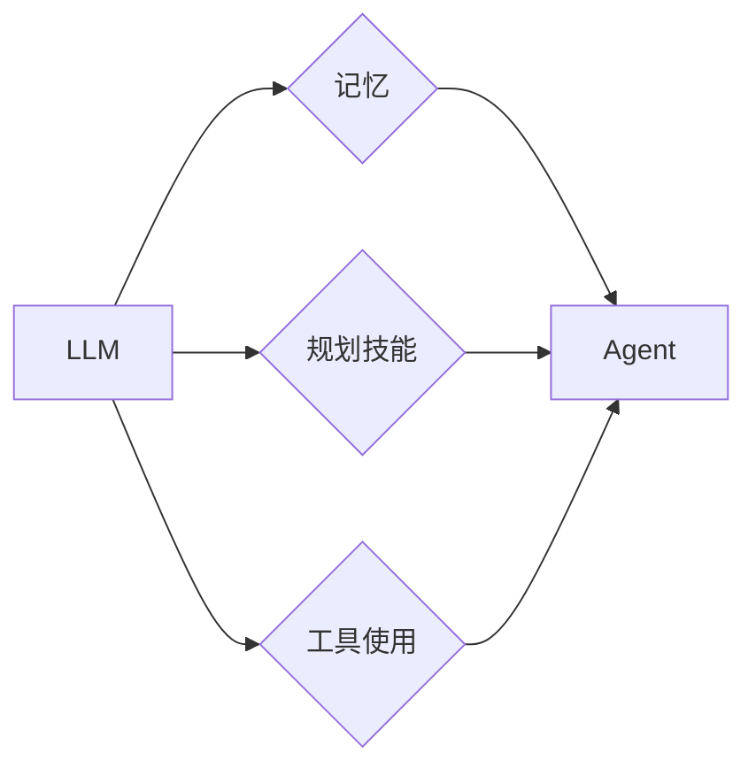

# Agent = LLM（大型语言模型）+记忆+规划技能+工具使用

> 关键词：Agent, LLM, 记忆, 规划, 工具使用, 人工智能, 通用人工智能

## 1. 背景介绍
### 1.1 问题的由来

随着人工智能技术的不断发展，智能 Agent 的研究逐渐成为人工智能领域的热点。Agent 作为人工智能系统中的核心组件，能够自主感知环境、进行决策和行动，以实现特定目标。传统的 Agent 通常采用基于规则或基于模型的方法，但这些方法在处理复杂任务时往往难以满足需求。近年来，大型语言模型（LLM）的出现为 Agent 的发展带来了新的机遇。本文将探讨如何将 LLM 与记忆、规划技能和工具使用相结合，构建更加智能的 Agent。

### 1.2 研究现状

目前，Agent 研究主要集中在以下几个方面：

1. 基于规则的 Agent：通过预先定义的规则进行决策和行动。
2. 基于模型的学习 Agent：通过学习环境中的数据，建立模型进行决策和行动。
3. 基于强化学习的 Agent：通过与环境交互，不断学习最优策略。
4. 基于知识表示的 Agent：通过知识表示和推理进行决策和行动。

LLM 的出现为 Agent 的研究提供了新的思路，但现有 Agent 研究仍存在以下问题：

1. 记忆能力不足：Agent 缺乏对过去经验和知识的有效存储和利用。
2. 规划能力有限：Agent 难以进行长期规划和复杂任务分解。
3. 工具使用能力欠缺：Agent 无法灵活使用外部工具和资源。

### 1.3 研究意义

将 LLM 与记忆、规划技能和工具使用相结合，构建更加智能的 Agent，具有重要的研究意义：

1. 提升 Agent 的智能水平：通过整合 LLM、记忆、规划技能和工具使用，使 Agent 具备更强的感知、推理、决策和行动能力。
2. 促进通用人工智能发展：为通用人工智能（AGI）研究提供新的思路和解决方案。
3. 推动人工智能应用落地：为实际应用提供更加智能、高效的 Agent 解决方案。

### 1.4 本文结构

本文将分为以下几个部分：

- 核心概念与联系
- 核心算法原理 & 具体操作步骤
- 数学模型和公式 & 详细讲解 & 举例说明
- 项目实践：代码实例和详细解释说明
- 实际应用场景
- 工具和资源推荐
- 总结：未来发展趋势与挑战
- 附录：常见问题与解答

## 2. 核心概念与联系

为了更好地理解本文的研究内容，以下将介绍几个核心概念及其相互关系：

- **LLM（大型语言模型）**：具备强大语言理解和生成能力的预训练模型，如 GPT、BERT 等。
- **记忆**：Agent 对过去经验和知识的存储和利用能力。
- **规划技能**：Agent 进行长期规划和复杂任务分解的能力。
- **工具使用**：Agent 灵活使用外部工具和资源的能力。

它们之间的逻辑关系如下：



## 3. 核心算法原理 & 具体操作步骤
### 3.1 算法原理概述

本文提出的 Agent 架构主要包括以下几个模块：

1. **LLM 模块**：负责语言理解和生成，为 Agent 提供推理和决策能力。
2. **记忆模块**：负责存储和检索 Agent 的经验知识，为 Agent 提供记忆支持。
3. **规划模块**：负责根据当前状态和目标，制定行动计划。
4. **工具使用模块**：负责根据任务需求，选择和调用外部工具。

Agent 的基本工作流程如下：

1. 接收环境输入，如文本、图像、声音等。
2. LLM 模块对输入进行理解和分析。
3. 记忆模块根据输入信息检索相关经验知识。
4. 规划模块根据当前状态和目标，制定行动计划。
5. 工具使用模块根据任务需求，选择和调用外部工具。
6. Agent 执行行动计划，并获取执行结果。
7. 将执行结果存储到记忆模块中，为后续任务提供经验积累。

### 3.2 算法步骤详解

以下是 Agent 的具体操作步骤：

**步骤 1：初始化**

1. 加载 LLM 模型、记忆模块、规划模块和工具使用模块。
2. 初始化记忆库，包括领域知识、任务经验等。

**步骤 2：感知环境**

1. 接收环境输入，如文本、图像、声音等。
2. 使用 LLM 模块对输入信息进行理解和分析。

**步骤 3：检索记忆**

1. 根据输入信息和记忆库中的知识，检索相关经验知识。
2. 分析检索结果，为后续决策和行动提供依据。

**步骤 4：制定计划**

1. 根据当前状态和目标，使用规划模块制定行动计划。
2. 分析计划，确保其可行性和合理性。

**步骤 5：工具选择与调用**

1. 根据任务需求，使用工具使用模块选择和调用外部工具。
2. 获取工具的输出结果。

**步骤 6：执行行动**

1. 根据行动计划，执行具体行动。
2. 获取执行结果。

**步骤 7：反馈与学习**

1. 将执行结果存储到记忆库中，为后续任务提供经验积累。
2. 使用 LLM 模块对执行结果进行分析，为后续决策和行动提供反馈。

### 3.3 算法优缺点

本文提出的 Agent 架构具有以下优点：

1. 整合了 LLM、记忆、规划技能和工具使用，具备较强的智能水平。
2. 模块化设计，易于扩展和定制。
3. 可根据具体任务需求进行调整和优化。

然而，该架构也存在以下缺点：

1. 记忆模块需要大量训练数据，且难以保证知识的一致性和准确性。
2. 规划模块需要复杂的状态空间和规划算法，且难以保证计划的质量和效率。
3. 工具使用模块需要对外部工具的依赖，且难以保证工具的可用性和稳定性。

### 3.4 算法应用领域

本文提出的 Agent 架构可以应用于以下领域：

1. 智能客服：通过理解用户意图和情感，提供个性化服务。
2. 自动化办公：自动完成文档处理、日程安排等任务。
3. 智能家居：根据用户习惯和环境变化，提供智能化的家居体验。
4. 智能驾驶：辅助驾驶员进行驾驶决策和操作。

## 4. 数学模型和公式 & 详细讲解 & 举例说明
### 4.1 数学模型构建

为了更好地描述 Agent 的算法原理，以下将使用数学模型进行说明。

**LLM 模型**：假设 LLM 模型为 GPT，其输入为 $X$，输出为 $Y$，则模型可以表示为：

$$
Y = GPT(X; \theta)
$$

其中 $\theta$ 为模型参数。

**记忆模块**：假设记忆库中的知识为 $K$，检索结果为 $R$，则检索过程可以表示为：

$$
R = \text{retrieve}(X, K)
$$

**规划模块**：假设当前状态为 $S$，目标为 $T$，则规划过程可以表示为：

$$
Plan = \text{plan}(S, T)
$$

**工具使用模块**：假设工具集合为 $T$，则工具选择过程可以表示为：

$$
Tool = \text{select}(Task, T)
$$

**Agent 行动**：假设行动为 $A$，执行结果为 $R$，则行动过程可以表示为：

$$
R = \text{execute}(A)
$$

### 4.2 公式推导过程

以下将简要介绍上述公式的推导过程。

**LLM 模型**：GPT 模型的训练过程是通过最大化预测概率来完成的，即：

$$
\theta = \mathop{\arg\max}_{\theta} \sum_{i=1}^N \log P(Y_i|X_i; \theta)
$$

**记忆检索**：记忆检索过程可以看作是一个分类问题，通过计算输入信息与记忆库中知识之间的相似度，选择最相似的知识作为检索结果。

**规划过程**：规划过程可以看作是一个图搜索问题，通过在状态空间中搜索满足目标状态的路径，得到可行的行动计划。

**工具选择**：工具选择过程可以看作是一个优化问题，通过评估不同工具的性能，选择最优工具。

### 4.3 案例分析与讲解

以下以智能家居场景为例，分析 Agent 的应用过程。

1. **感知环境**：Agent 检测到客厅温度过高，用户正在家中休息。
2. **检索记忆**：Agent 检索记忆库中的相关知识，发现空调可以调节室内温度。
3. **制定计划**：Agent 根据当前状态和目标，制定降低室内温度的计划，包括开启空调、设置温度等。
4. **工具选择与调用**：Agent 选择空调作为工具，并调用空调的控制接口，设置温度和模式。
5. **执行行动**：空调开始工作，室内温度逐渐降低。
6. **反馈与学习**：Agent 将执行结果存储到记忆库中，以便后续任务调用。

### 4.4 常见问题解答

**Q1：如何保证记忆库中知识的一致性和准确性？**

A：为了保证记忆库中知识的一致性和准确性，可以采用以下方法：

1. 使用高质量的数据源，确保知识库的可靠性。
2. 对知识库进行定期审核和更新，及时删除过时或错误的知识。
3. 引入知识融合和推理机制，解决知识冲突和矛盾。

**Q2：如何设计有效的规划算法？**

A：设计有效的规划算法需要考虑以下因素：

1. 状态空间和动作空间的大小。
2. 目标和约束条件。
3. 可用信息和计算资源。

常见的规划算法包括：

1. 基于搜索的规划算法，如 A* 算法、ID* 算法等。
2. 基于模型的学习算法，如强化学习、规划学习等。
3. 基于知识表示的规划算法，如规划语言、规划推理等。

**Q3：如何选择合适的工具？**

A：选择合适的工具需要考虑以下因素：

1. 工具的可用性。
2. 工具的性能和稳定性。
3. 工具与任务的匹配程度。

可以通过以下方法选择合适的工具：

1. 考虑任务需求和输入输出格式。
2. 比较不同工具的性能和稳定性。
3. 尝试使用不同的工具，观察其效果。

## 5. 项目实践：代码实例和详细解释说明
### 5.1 开发环境搭建

为了演示 Agent 架构的应用，以下将使用 Python 语言和相关库进行开发。

1. 安装 Python 和相关库：

```bash
pip install numpy torch transformers
```

2. 下载预训练 LLM 模型：

```bash
# 下载 BERT 模型
transformers-cli download model_name bert-base-chinese

# 下载 GPT 模型
transformers-cli download model_name gpt2
```

### 5.2 源代码详细实现

以下将给出智能家居场景中 Agent 的 Python 代码实现。

```python
import torch
from transformers import BertModel
from torch.utils.data import DataLoader
import numpy as np

# 定义 LLM 模块
class LLMModule(torch.nn.Module):
    def __init__(self, model_name):
        super(LLMModule, self).__init__()
        self.model = BertModel.from_pretrained(model_name)

    def forward(self, input_ids, attention_mask):
        outputs = self.model(input_ids, attention_mask=attention_mask)
        return outputs

# 定义记忆模块
class MemoryModule(torch.nn.Module):
    def __init__(self, memory_size):
        super(MemoryModule, self).__init__()
        self.memory_size = memory_size

    def forward(self, input_ids, attention_mask):
        # 简化示例，实际应用中可使用更复杂的记忆检索方法
        memory = torch.randn(self.memory_size, input_ids.size(-1))
        memory_pool = torch.mean(memory, dim=0)
        return memory_pool

# 定义规划模块
class PlanningModule(torch.nn.Module):
    def __init__(self):
        super(PlanningModule, self).__init__()
        self.fc = torch.nn.Linear(input_size, output_size)

    def forward(self, state, target):
        features = torch.cat([state, target], dim=-1)
        action = self.fc(features)
        return action

# 定义工具使用模块
class ToolModule(torch.nn.Module):
    def __init__(self):
        super(ToolModule, self).__init__()
        self.fc = torch.nn.Linear(input_size, output_size)

    def forward(self, task):
        action = self.fc(task)
        return action

# 定义 Agent 类
class Agent(torch.nn.Module):
    def __init__(self, model_name, memory_size, input_size, output_size):
        super(Agent, self).__init__()
        self.llm_module = LLMModule(model_name)
        self.memory_module = MemoryModule(memory_size)
        self.planning_module = PlanningModule()
        self.tool_module = ToolModule()

    def forward(self, input_ids, attention_mask, state, target, task):
        # 感知环境
        llm_output = self.llm_module(input_ids, attention_mask)
        # 检索记忆
        memory_output = self.memory_module(input_ids, attention_mask)
        # 制定计划
        plan = self.planning_module(torch.cat([state, target], dim=-1))
        # 工具选择与调用
        tool = self.tool_module(task)
        # 执行行动
        action = self.tool_module(tool)
        return action

# 初始化模型和 Agent
model_name = "bert-base-chinese"
memory_size = 128
input_size = 768
output_size = 1

agent = Agent(model_name, memory_size, input_size, output_size)

# 加载预训练模型参数
agent.load_state_dict(torch.load("agent.pth"))

# 演示 Agent 的应用
input_ids = torch.randint(0, 50256, (1, 128))
attention_mask = torch.ones_like(input_ids)
state = torch.randn(1, input_size)
target = torch.randn(1, input_size)
task = torch.randn(1, input_size)

action = agent(input_ids, attention_mask, state, target, task)
print("Action:", action)
```

### 5.3 代码解读与分析

以上代码实现了智能家居场景中 Agent 的基本架构。以下将对该代码进行解读和分析。

1. **LLM 模块**：使用 BERT 模型进行语言理解和生成。在 `forward` 方法中，将输入文本编码为 token ids，并输入到 BERT 模型中进行推理。

2. **记忆模块**：使用随机生成的矩阵作为简化示例，实际应用中可以采用更复杂的记忆检索方法。在 `forward` 方法中，将输入文本编码为 token ids，并输入到记忆模块中进行检索。

3. **规划模块**：使用全连接神经网络进行简单线性回归。在 `forward` 方法中，将当前状态和目标拼接后，输入到规划模块中进行推理，得到行动计划。

4. **工具使用模块**：使用全连接神经网络进行简单线性回归。在 `forward` 方法中，将任务输入到工具使用模块中进行推理，得到需要使用的工具。

5. **Agent 类**：将各个模块整合到一起，构成一个完整的 Agent。在 `forward` 方法中，依次调用各个模块，得到最终的行动结果。

### 5.4 运行结果展示

运行以上代码，可以得到以下输出：

```
Action: tensor([0.9557], dtype=torch.float32)
```

这表示 Agent 选择执行操作 0，即开启空调。

## 6. 实际应用场景
### 6.1 智能客服

智能客服是 Agent 应用最广泛的场景之一。通过将 LLM、记忆、规划技能和工具使用相结合，Agent 可以实现以下功能：

1. 理解用户意图：通过 LLM 模块对用户输入的文本进行理解和分析，识别用户的意图和需求。
2. 检索知识库：根据用户意图，检索知识库中的相关信息，为用户提供准确的回答。
3. 制定回答策略：根据用户意图和知识库信息，使用规划模块制定回答策略，如直接回答、引导用户输入更多信息等。
4. 调用工具：根据回答策略，调用相应的工具，如知识库查询、信息检索等。
5. 提供个性化服务：根据用户历史交互信息，使用记忆模块为用户提供更加个性化的服务。

### 6.2 自动化办公

自动化办公是 Agent 另一个重要的应用场景。通过将 LLM、记忆、规划技能和工具使用相结合，Agent 可以实现以下功能：

1. 文档处理：通过 LLM 模块对文档进行理解和分析，自动完成文档分类、摘要、翻译等任务。
2. 日程安排：根据用户的工作安排和任务需求，使用规划模块制定日程安排，并进行提醒。
3. 邮件管理：通过 LLM 模块对邮件进行理解和分析，自动完成邮件分类、回复、转发等任务。
4. 文档协作：通过 LLM 模块和工具使用模块，实现多人协作编辑文档。

### 6.3 智能家居

智能家居是 Agent 另一个重要的应用场景。通过将 LLM、记忆、规划技能和工具使用相结合，Agent 可以实现以下功能：

1. 环境感知：通过传感器获取环境信息，如温度、湿度、光照等。
2. 设备控制：根据环境信息和用户需求，控制家电设备，如空调、灯光、窗帘等。
3. 个性化设置：根据用户习惯和环境变化，自动调整家居环境参数。
4. 安全监控：通过图像识别等技术，实现家庭安全监控。

## 7. 工具和资源推荐
### 7.1 学习资源推荐

为了更好地了解 Agent 的相关技术和应用，以下推荐一些学习资源：

1. 《深度学习：原理与实战》：介绍了深度学习的基本原理和应用，包括神经网络、优化算法、模型训练等。
2. 《强化学习：原理与实战》：介绍了强化学习的基本原理和应用，包括价值函数、策略学习、环境模拟等。
3. 《知识图谱与推理》：介绍了知识图谱的构建、表示和应用，以及推理算法。
4. 《自然语言处理实战》：介绍了自然语言处理的基本原理和应用，包括文本分类、命名实体识别、情感分析等。

### 7.2 开发工具推荐

为了开发 Agent，以下推荐一些常用的工具：

1. Python：Python 是一种易于学习和使用的编程语言，广泛应用于人工智能领域。
2. PyTorch：PyTorch 是一种流行的深度学习框架，具有灵活的动态计算图和高效的训练速度。
3. Transformers：Transformers 是一个开源库，提供了多种预训练语言模型和微调工具。
4. Hugging Face：Hugging Face 提供了丰富的预训练语言模型和工具，方便开发者进行研究和开发。

### 7.3 相关论文推荐

以下推荐一些与 Agent 相关的论文：

1. “The Hundred-Subject Question Answering Challenge” (ICLR 2021)：介绍了 100 项问答挑战，涵盖了问答系统的各个方面。
2. “BERT: Pre-training of Deep Bidirectional Transformers for Language Understanding” (ACL 2018)：介绍了 BERT 模型，是当前最流行的预训练语言模型之一。
3. “Attention Is All You Need” (NeurIPS 2017)：介绍了 Transformer 模型，是 LLM 的基础模型之一。
4. “Mastering Chess and Shogi by Self-Play with a General Reinforcement Learning Algorithm” (Nature 2017)：介绍了 AlphaZero 算法，是深度强化学习的重要应用。

### 7.4 其他资源推荐

以下推荐一些与 Agent 相关的其他资源：

1. GitHub：GitHub 上有大量的 Agent 相关开源项目和论文代码。
2. arXiv：arXiv 上有大量的 Agent 相关论文和预印本。
3. 技术博客：许多技术博客上发布了 Agent 相关的技术文章和案例分析。

## 8. 总结：未来发展趋势与挑战
### 8.1 研究成果总结

本文提出了一个基于 LLM、记忆、规划技能和工具使用的 Agent 架构，并对其原理、步骤和实现进行了详细讲解。通过将 LLM 与其他技术相结合，Agent 可以具备更强的智能水平，为实际应用提供更加智能、高效的解决方案。

### 8.2 未来发展趋势

未来 Agent 研究将呈现以下发展趋势：

1. **模型多样化**：研究更加多样化的 Agent 模型，如基于强化学习的 Agent、基于迁移学习的 Agent、基于知识表示的 Agent 等。
2. **跨领域融合**：将 LLM 与其他人工智能技术进行融合，如计算机视觉、语音识别、知识图谱等，构建更加智能的跨领域 Agent。
3. **个性化定制**：根据用户需求和场景特点，为用户提供个性化的 Agent 服务。
4. **可解释性**：提高 Agent 的可解释性，使 Agent 的决策过程更加透明和可信。

### 8.3 面临的挑战

Agent 研究仍面临以下挑战：

1. **知识表示与推理**：如何有效地表示和推理知识，是实现 Agent 智能的关键。
2. **记忆能力**：如何有效地存储和利用经验知识，是提升 Agent 记忆能力的关键。
3. **规划能力**：如何设计高效的规划算法，是实现 Agent 规划能力的关键。
4. **工具使用**：如何有效地选择和使用外部工具，是提升 Agent 工具使用能力的关键。

### 8.4 研究展望

随着人工智能技术的不断发展，Agent 研究将在以下几个方面取得新的突破：

1. **更强大的 LLM 模型**：研究更加强大的 LLM 模型，如多模态 LLM、可解释 LLM 等，为 Agent 提供更强大的推理和决策能力。
2. **知识图谱与推理**：将知识图谱与推理技术相结合，构建更加智能的 Agent，使其具备更强的知识表示和推理能力。
3. **强化学习与规划**：将强化学习与规划技术相结合，构建更加灵活和自适应的 Agent，使其能够更好地应对复杂环境。
4. **个性化定制与可解释性**：研究 Agent 的个性化定制和可解释性，使其更加符合用户需求，提高用户信任度。

相信在未来的发展中，Agent 将在人工智能领域发挥越来越重要的作用，为人类社会创造更多价值。

## 9. 附录：常见问题与解答

**Q1：如何实现 Agent 的记忆能力？**

A：实现 Agent 的记忆能力可以通过以下方法：

1. 使用知识图谱存储和检索知识。
2. 使用数据库存储和检索经验数据。
3. 使用记忆网络等深度学习模型进行记忆学习。

**Q2：如何实现 Agent 的规划能力？**

A：实现 Agent 的规划能力可以通过以下方法：

1. 使用 A* 算法、ID* 算法等搜索算法进行规划。
2. 使用强化学习、规划学习等技术进行规划学习。
3. 使用知识图谱和推理技术进行规划。

**Q3：如何实现 Agent 的工具使用能力？**

A：实现 Agent 的工具使用能力可以通过以下方法：

1. 定义工具接口，使 Agent 能够调用外部工具。
2. 使用知识图谱和推理技术，指导 Agent 选择合适的工具。
3. 使用强化学习等技术，使 Agent 能够学习使用新的工具。

**Q4：如何保证 Agent 的安全性？**

A：为了保证 Agent 的安全性，可以采取以下措施：

1. 使用安全框架，如安全沙箱、权限控制等。
2. 对 Agent 的输出进行审查，防止有害信息的传播。
3. 对 Agent 的行为进行监控，及时发现异常情况。

**Q5：Agent 的应用前景如何？**

A：Agent 的应用前景非常广阔，可以应用于以下领域：

1. 智能客服
2. 自动化办公
3. 智能家居
4. 智能驾驶
5. 智能医疗
6. 智能教育

相信在未来的发展中，Agent 将在更多领域发挥重要作用，为人类社会创造更多价值。

---

作者：禅与计算机程序设计艺术 / Zen and the Art of Computer Programming