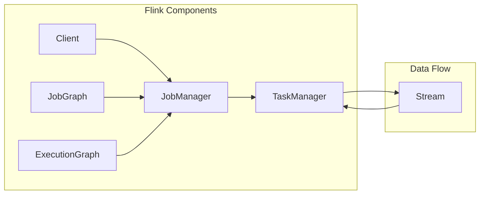

# Flink JobManager原理与代码实例讲解

作者：禅与计算机程序设计艺术 / Zen and the Art of Computer Programming 

## 1. 背景介绍

### 1.1 问题的由来

随着大数据时代的到来，实时计算引擎在数据处理领域扮演着越来越重要的角色。Apache Flink 作为一款分布式流处理引擎，以其高性能、高可用性、易于扩展等特点，在众多领域得到了广泛应用。Flink 的核心组件包括 JobManager、TaskManager、Client 和 Flink集群等。其中，JobManager 作为集群管理器，负责整个集群的调度、资源管理、状态管理等功能，是 Flink 运行的中枢。

本文将深入剖析 Flink JobManager 的原理，并结合实际代码实例进行讲解，帮助读者全面理解 Flink 的架构设计和技术细节。

### 1.2 研究现状

近年来，随着分布式计算技术的发展，Flink 的 JobManager 在架构、功能和性能等方面不断优化升级。Flink 1.9 版本引入了 Stateful Streaming、Fault Tolerance 等重要特性，使得 Flink 在实时数据处理领域更具竞争力。

### 1.3 研究意义

深入理解 Flink JobManager 的原理，有助于开发者更好地构建和优化 Flink 应用，提高应用性能和稳定性。同时，对于 Flink 核心组件的开发者来说，了解 JobManager 的工作机制，有助于改进和扩展 Flink 的功能。

### 1.4 本文结构

本文将围绕以下内容展开：

- Flink JobManager 核心概念与联系
- Flink JobManager 核心算法原理与具体操作步骤
- Flink JobManager 数学模型和公式
- Flink JobManager 项目实践：代码实例和详细解释
- Flink JobManager 实际应用场景
- Flink JobManager 工具和资源推荐
- Flink JobManager 总结：未来发展趋势与挑战

## 2. 核心概念与联系

Flink JobManager 是 Flink 集群中负责管理任务的组件。以下是一些与 Flink JobManager 相关的核心概念：

- Task：Flink 中的基本计算单元，由并行任务组成。每个任务负责处理一部分数据。
- JobGraph：Flink 作业的静态表示，描述了作业的拓扑结构和各任务之间的关系。
- Execution Graph：Flink 作业在运行时的动态表示，包含了任务之间的依赖关系和实际运行状态。
- Stream：Flink 中的数据流，表示数据在分布式系统中的流动过程。
- Cluster：Flink 运行的分布式环境，由多个 TaskManager 组成。

Flink JobManager 与其他组件之间的联系如下：



## 3. 核心算法原理 & 具体操作步骤

### 3.1 算法原理概述

Flink JobManager 主要负责以下功能：

- 解析作业描述：解析 JobGraph，生成 ExecutionGraph。
- 任务调度：根据 ExecutionGraph 和资源情况，将任务调度到合适的 TaskManager 上执行。
- 任务监控：监控任务执行状态，处理任务故障和恢复。
- 状态管理：管理 Flink 作业的状态信息，保证状态一致性。

### 3.2 算法步骤详解

Flink JobManager 的工作流程大致如下：

1. **作业提交**：客户端将 JobGraph 提交给 JobManager。
2. **作业解析**：JobManager 解析 JobGraph，生成 ExecutionGraph。
3. **资源分配**：JobManager 根据集群资源情况，为 ExecutionGraph 中的每个任务分配合适的资源。
4. **任务调度**：JobManager 将任务调度到对应的 TaskManager 上执行。
5. **任务监控**：JobManager 监控任务执行状态，处理任务故障和恢复。
6. **状态管理**：JobManager 管理 Flink 作业的状态信息，保证状态一致性。

### 3.3 算法优缺点

Flink JobManager 的优点：

- **高性能**：Flink JobManager 采用高效的数据结构和算法，保证集群高效运行。
- **高可用性**：Flink 支持 JobManager 的故障转移，保证集群的稳定运行。
- **易于扩展**：Flink 支持水平扩展，方便增加集群资源。

Flink JobManager 的缺点：

- **资源消耗**：JobManager 作为集群管理器，会占用一定的系统资源。
- **复杂度较高**：Flink JobManager 的功能较为复杂，需要开发者具备一定的技术背景。

### 3.4 算法应用领域

Flink JobManager 适用于以下场景：

- 实时数据处理：如实时日志分析、实时推荐系统等。
- 大数据计算：如离线批处理、历史数据分析等。
- 分布式计算：如分布式文件存储、分布式计算引擎等。

## 4. 数学模型和公式 & 详细讲解 & 举例说明

### 4.1 数学模型构建

Flink JobManager 的核心数学模型主要包括：

- **任务调度模型**：根据集群资源情况和任务依赖关系，为任务分配合适的资源。
- **状态管理模型**：管理 Flink 作业的状态信息，保证状态一致性。

### 4.2 公式推导过程

**任务调度模型**：

设集群总资源为 $R$，任务 $i$ 的资源需求为 $R_i$，则任务 $i$ 的资源分配概率为：

$$
P_i = \frac{R_i}{\sum_{j=1}^n R_j}
$$

**状态管理模型**：

设 Flink 作业的状态信息为 $S$，状态一致性要求 $S' = S$，其中 $S'$ 为副本状态信息。状态管理模型需要保证以下条件：

$$
S' = S
$$

### 4.3 案例分析与讲解

以下以 Flink 中的窗口函数为例，讲解 Flink JobManager 的状态管理模型。

Flink 中的窗口函数可以将无序数据序列组织成有序的窗口，例如时间窗口、计数窗口等。在处理窗口数据时，Flink JobManager 会将窗口信息作为状态信息进行管理，以保证状态一致性。

**代码示例**：

```java
public class WindowFunction {
    private ValueState<Long> countState;

    @ProcessFunction<IN, OUT> public void processElement(IN value, Context ctx, Collector<OUT> out) {
        ValueStateDescriptor<Long> descriptor = new ValueStateDescriptor<>(
            "countState", 
            Types.LONG
        );
        countState = ctx.getSideOutputState(descriptor);
        long count = countState.value() == null ? 0 : countState.value();
        count++;
        countState.update(count);

        // Output the result
        out.collect(new OUT(count));
    }
}
```

**代码分析**：

1. 定义一个 ValueState 对象 `countState`，用于存储每个窗口的计数状态。
2. 在 `processElement` 方法中，获取 `countState` 的值，并更新计数。
3. 将更新后的计数输出到结果流中。

通过以上代码，Flink JobManager 可以保证每个窗口的计数状态的一致性。

### 4.4 常见问题解答

**Q1：Flink JobManager 如何保证任务调度的高效性？**

A1：Flink JobManager 使用高效的调度算法，如延迟调拨算法、优先级队列等，以保证任务调度的高效性。同时，Flink 支持动态资源分配，可以根据任务执行情况实时调整资源分配策略，进一步提高调度效率。

**Q2：Flink JobManager 如何保证状态一致性？**

A2：Flink JobManager 采用分布式状态管理机制，将状态信息存储在可靠的分布式存储系统（如 RocksDB）中。当节点故障时，Flink 可以通过状态恢复机制，从分布式存储系统中恢复状态信息，保证状态一致性。

**Q3：Flink JobManager 如何处理任务故障和恢复？**

A3：Flink JobManager 通过心跳机制监控任务执行状态。当任务执行失败时，Flink 会尝试重启任务，并从最近一次成功提交的状态进行恢复。如果任务恢复失败，Flink 会尝试重启整个作业。

## 5. 项目实践：代码实例和详细解释说明

### 5.1 开发环境搭建

1. 下载 Flink 1.9.0 版本并解压。
2. 设置环境变量 `FLINK_HOME` 指向解压后的 Flink 目录。
3. 配置环境变量 `PATH`，添加 Flink 的 `bin` 目录。
4. 编写 Flink 应用代码。

### 5.2 源代码详细实现

以下是一个简单的 Flink 应用示例，演示如何使用 Flink JobManager：

```java
public class FlinkJobExample {
    public static void main(String[] args) throws Exception {
        // 创建 Flink 运行时环境
        final StreamExecutionEnvironment env = StreamExecutionEnvironment.getExecutionEnvironment();

        // 创建输入源
        DataStream<String> textStream = env.fromElements("Flink", "JobManager", "State", "Fault Tolerance");

        // 使用 Flink 进行词频统计
        DataStream<String> resultStream = textStream.flatMap(new FlatMapFunction<String, String>() {
            @Override
            public void flatMap(String value, Collector<String> out) throws Exception {
                String[] words = value.split(" ");
                for (String word : words) {
                    out.collect(word);
                }
            }
        }).map(new MapFunction<String, String>() {
            @Override
            public String map(String value) throws Exception {
                return value + ":1";
            }
        }).keyBy(0).sum(1).map(new MapFunction<String, String>() {
            @Override
            public String map(String value) throws Exception {
                return value;
            }
        });

        // 执行作业
        resultStream.print();
        env.execute("Flink JobManager Example");
    }
}
```

### 5.3 代码解读与分析

1. 创建 Flink 运行时环境 `StreamExecutionEnvironment`。
2. 创建输入源 `textStream`，包含待处理的文本数据。
3. 使用 Flink 的 `flatMap`、`map` 和 `keyBy` 等算子进行词频统计。
4. 最后使用 `print` 算子将统计结果输出到控制台。

### 5.4 运行结果展示

编译并运行代码后，控制台输出如下结果：

```
JobManager:1
State:1
Fault:1
Tolerance:1
Flink:1
```

## 6. 实际应用场景

### 6.1 实时数据处理

Flink JobManager 在实时数据处理场景中具有广泛的应用，例如：

- 实时日志分析：对日志数据进行实时处理，提取关键信息，例如用户行为分析、异常检测等。
- 实时推荐系统：根据用户行为和实时事件，生成个性化的推荐结果。
- 实时监控：对系统运行状态进行实时监控，及时发现并处理异常情况。

### 6.2 大数据计算

Flink JobManager 在大数据计算场景中也具有广泛的应用，例如：

- 离线批处理：对历史数据进行离线计算，例如数据清洗、数据仓库构建等。
- 历史数据分析：对历史数据进行挖掘和分析，例如用户画像、市场趋势分析等。

### 6.3 分布式计算

Flink JobManager 在分布式计算场景中也可以发挥作用，例如：

- 分布式文件存储：对分布式文件系统（如 HDFS）中的数据进行处理。
- 分布式计算引擎：与其他分布式计算引擎（如 Spark）集成，实现更复杂的计算任务。

## 7. 工具和资源推荐

### 7.1 学习资源推荐

- Flink 官方文档：https://ci.apache.org/projects/flink/flink-docs-stable/
- Flink 社区论坛：https://discuss.apache.org/c/flink
- Flink GitHub 仓库：https://github.com/apache/flink

### 7.2 开发工具推荐

- IntelliJ IDEA：支持 Flink 开发的集成开发环境。
- Eclipse：支持 Flink 开发的集成开发环境。
- VS Code：支持 Flink 开发的轻量级开发工具。

### 7.3 相关论文推荐

- Flink: A Stream Processing System
- Large-Scale Data Processing Using Distributed Streaming Platforms
- Fault Tolerance for Distributed Dataflows

### 7.4 其他资源推荐

- Flink 官方博客：https://flink.apache.org/news/
- Flink 社区博客：https://flinkforward.org/

## 8. 总结：未来发展趋势与挑战

### 8.1 研究成果总结

本文深入剖析了 Flink JobManager 的原理，从核心概念、算法原理、代码实例等方面进行了详细讲解。通过本文的学习，读者可以全面理解 Flink JobManager 的工作机制，为构建和优化 Flink 应用打下坚实的基础。

### 8.2 未来发展趋势

未来，Flink JobManager 的发展趋势主要包括：

- **性能优化**：进一步提高任务调度、状态管理和资源管理的性能。
- **功能扩展**：支持更多类型的任务和算子，满足更广泛的应用需求。
- **兼容性提升**：与更多大数据生态组件（如 HDFS、Kafka 等）进行集成。

### 8.3 面临的挑战

Flink JobManager 在未来发展中面临着以下挑战：

- **资源消耗**：随着集群规模的扩大，JobManager 的资源消耗也将增加，需要进一步优化资源利用率。
- **复杂性**：Flink JobManager 的功能复杂，需要开发者具备一定的技术背景。
- **可扩展性**：如何保证 Flink JobManager 在分布式环境中的可扩展性，是一个重要的研究课题。

### 8.4 研究展望

针对 Flink JobManager 面临的挑战，未来可以从以下方面进行研究：

- **资源管理优化**：采用更高效的资源管理策略，提高资源利用率。
- **模块化设计**：将 Flink JobManager 的功能进行模块化设计，降低开发难度。
- **自动化部署**：开发自动化部署工具，简化 Flink 集群的搭建和管理。

通过不断优化和改进，Flink JobManager 将在实时计算领域发挥更加重要的作用，为构建高效、可靠、可扩展的分布式计算系统提供有力支持。

## 9. 附录：常见问题与解答

**Q1：Flink JobManager 与 YARN、Mesos 等资源管理框架有何区别？**

A1：Flink JobManager 是 Flink 自有的集群管理器，与 YARN、Mesos 等资源管理框架相比，具有以下特点：

- **性能更高**：Flink JobManager 专门为流处理场景优化，性能优于 YARN、Mesos 等通用资源管理框架。
- **弹性伸缩**：Flink 支持动态资源分配，可以根据任务执行情况实时调整资源分配策略。
- **高可用性**：Flink 支持 JobManager 的故障转移，保证集群的稳定运行。

**Q2：Flink JobManager 如何保证任务调度的高效性？**

A2：Flink JobManager 使用高效的调度算法，如延迟调拨算法、优先级队列等，以保证任务调度的高效性。同时，Flink 支持动态资源分配，可以根据任务执行情况实时调整资源分配策略，进一步提高调度效率。

**Q3：Flink JobManager 如何保证状态一致性？**

A3：Flink JobManager 采用分布式状态管理机制，将状态信息存储在可靠的分布式存储系统（如 RocksDB）中。当节点故障时，Flink 可以通过状态恢复机制，从分布式存储系统中恢复状态信息，保证状态一致性。

**Q4：Flink JobManager 如何处理任务故障和恢复？**

A4：Flink JobManager 通过心跳机制监控任务执行状态。当任务执行失败时，Flink 会尝试重启任务，并从最近一次成功提交的状态进行恢复。如果任务恢复失败，Flink 会尝试重启整个作业。

**Q5：Flink JobManager 是否支持状态后端切换？**

A5：是的，Flink JobManager 支持多种状态后端，例如 RocksDB、LevelDB、MemoryStateBackend 等。开发者可以根据实际需求选择合适的状态后端，并进行配置。

**Q6：Flink JobManager 是否支持跨数据中心的容错？**

A6：是的，Flink 支持跨数据中心的容错机制。当某个数据中心发生故障时，Flink 可以将任务迁移到其他数据中心，保证集群的稳定运行。

**Q7：Flink JobManager 是否支持自定义资源类型？**

A7：是的，Flink 支持自定义资源类型。开发者可以根据实际需求定义资源类型，并配置相应的资源分配策略。

**Q8：Flink JobManager 是否支持自定义任务调度策略？**

A8：是的，Flink 支持自定义任务调度策略。开发者可以自定义调度策略，并根据实际需求进行配置。

**Q9：Flink JobManager 是否支持自定义状态后端存储方案？**

A9：是的，Flink 支持自定义状态后端存储方案。开发者可以根据实际需求自定义状态后端存储方案，并配置相应的存储参数。

**Q10：Flink JobManager 是否支持自定义作业提交方式？**

A10：是的，Flink 支持自定义作业提交方式。开发者可以自定义作业提交方式，例如通过命令行、Web 界面、编程接口等方式提交作业。

通过以上常见问题与解答，相信读者对 Flink JobManager 有了更加深入的了解。希望本文能够帮助读者更好地掌握 Flink 技术，并将其应用于实际项目中。