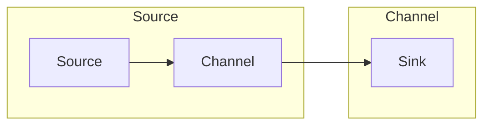

# Flume Channel原理与代码实例讲解

作者：禅与计算机程序设计艺术 / Zen and the Art of Computer Programming

## 1. 背景介绍
### 1.1 问题的由来

在分布式系统中，高效、可靠的数据收集和传输是保证系统正常运行的关键。Apache Flume 是一个分布式、可靠、可伸缩的日志收集系统，用于有效地收集、聚合、移动和存储大量日志数据。Flume 的核心组件包括 Source、Channel 和 Sink。其中，Channel 作为连接 Source 和 Sink 的桥梁，在 Flume 架构中扮演着至关重要的角色。本文将深入探讨 Flume Channel 的原理，并通过代码实例进行详细讲解。

### 1.2 研究现状

Flume 最初由 Cloudera 开发，目前已发展成为 Apache 软件基金会下的一个顶级项目。Flume 支持多种数据源和目标，如 Kafka、HDFS、HBase 等，并且拥有丰富的插件生态。随着大数据技术的发展，Flume 也不断演进，以适应各种复杂场景下的日志收集需求。

### 1.3 研究意义

深入理解 Flume Channel 的原理，有助于我们更好地构建高效、可靠的日志收集系统。通过本文的学习，读者可以：
- 掌握 Flume Channel 的核心概念和工作原理；
- 了解 Flume 中常用 Channel 类型及其优缺点；
- 学会使用代码实例进行 Flume Channel 的实践操作；
- 为后续深入学习 Flume 整体架构和高级特性打下基础。

### 1.4 本文结构

本文将按照以下结构展开：
- 第2部分，介绍 Flume Channel 的核心概念与联系；
- 第3部分，阐述 Flume Channel 的核心算法原理和具体操作步骤；
- 第4部分，分析 Flume Channel 的数学模型、公式和常见问题；
- 第5部分，通过代码实例讲解 Flume Channel 的实践操作；
- 第6部分，探讨 Flume Channel 在实际应用场景中的应用；
- 第7部分，展望 Flume Channel 的未来发展趋势和挑战；
- 第8部分，总结全文，展望 Flume Channel 的研究展望。

## 2. 核心概念与联系

为了更好地理解 Flume Channel 的原理，我们首先介绍几个核心概念：

- **Event**：Flume 中的数据传输单元，类似于一条日志消息，包含消息体和消息属性。
- **Source**：Flume 负责从各种数据源（如 Kafka、Syslog、Taildir 等）收集数据。
- **Channel**：Flume 中用于存储事件的组件，介于 Source 和 Sink 之间，确保事件在 Source 和 Sink 之间可靠传输。
- **Sink**：Flume 负责将事件写入目标系统（如 HDFS、HBase、Kafka 等）。

它们之间的逻辑关系如下：



可以看出，Source 通过 Channel 将 Event 发送到 Sink，Channel 在中间起到缓冲和存储的作用，保证数据的可靠传输。

## 3. 核心算法原理 & 具体操作步骤
### 3.1 算法原理概述

Flume Channel 是一个线程安全、可靠的事件存储组件，支持多种存储策略，如内存、磁盘、数据库等。Channel 的核心算法原理主要包括以下几个方面：

1. **事件存储**：Channel 以队列的形式存储 Event，支持批量存储和读取操作。
2. **并发控制**：Channel 支持多线程并发访问，通过锁机制保证数据的一致性和可靠性。
3. **事件持久化**：Channel 支持将 Event 持久化存储到磁盘或数据库，保证在系统崩溃时不会丢失数据。

### 3.2 算法步骤详解

以下为 Flume Channel 的工作流程：

1. **初始化 Channel**：创建 Channel 实例并配置相关参数，如存储策略、队列大小、持久化方式等。
2. **收集 Event**：Source 收集到 Event 后，将其放入 Channel 的队列中。
3. **传输 Event**：Sink 从 Channel 的队列中读取 Event，并将它们写入目标系统。
4. **持久化存储**：Channel 支持将 Event 持久化存储到磁盘或数据库，以便在系统崩溃时恢复。

### 3.3 算法优缺点

Flume Channel 具有以下优点：

- **可靠性**：通过持久化存储和并发控制机制，保证 Event 在 Source 和 Sink 之间的可靠传输。
- **高性能**：支持多线程并发访问，提高数据传输效率。
- **灵活性**：支持多种存储策略，适应不同的应用场景。

然而，Flume Channel 也存在一些局限性：

- **内存消耗**：内存存储策略在处理大量数据时可能需要较大内存资源。
- **磁盘IO**：磁盘存储策略可能受到磁盘IO性能的限制。

### 3.4 算法应用领域

Flume Channel 可应用于以下场景：

- **日志收集**：从各种数据源收集日志数据，并存储到 HDFS、HBase 等存储系统。
- **数据传输**：将数据从源系统传输到目标系统，如 Kafka、Redis 等。
- **数据同步**：在分布式系统中同步数据，确保数据一致性。

## 4. 数学模型和公式 & 详细讲解 & 举例说明
### 4.1 数学模型构建

Flume Channel 的数学模型可以简化为以下形式：

$$
\begin{aligned}
\text{Channel} &= \text{Queue}(M_{\text{max}}, P_{\text{disc}}) \\
\text{Event\_count} &= \text{Event\_count} + 1 \\
\text{if } \text{Event\_count} \leq M_{\text{max}} \text{ then} \\
&\quad \text{enqueue } \text{Event} \\
\text{else} \\
&\quad \text{discard } \text{Event} \\
\end{aligned}
$$

其中，$M_{\text{max}}$ 为队列的最大容量，$P_{\text{disc}}$ 为丢弃概率。

### 4.2 公式推导过程

假设 Channel 的最大容量为 $M_{\text{max}}$，当队列长度达到 $M_{\text{max}}$ 时，需要根据 $P_{\text{disc}}$ 概率决定是否丢弃新到达的 Event。

- 当 $P_{\text{disc}} = 0$ 时，丢弃概率为 0，即队列永远不会丢弃 Event，这是最安全但最消耗内存的策略。
- 当 $P_{\text{disc}} = 1$ 时，丢弃概率为 1，即队列总是丢弃 Event，这是最节省内存但最不安全的策略。
- 当 $P_{\text{disc}}$ 在 0 到 1 之间时，根据概率随机丢弃 Event。

### 4.3 案例分析与讲解

以下是一个使用 Flume 内存存储策略的示例：

```java
// 创建内存存储策略的 Channel
MemoryChannel channel = new MemoryChannel(conf);

// 设置队列最大容量为 1000
channel.setCapacity(1000);

// 创建 Source、Sink 和 Agent
Agent agent = new Agent(conf);
agent.addSource("source1", new ExecSource());
agent.addSource("source2", new HttpSource());
agent.addSink("sink1", new HDFS_sink());

// 将 Channel 绑定到 Source 和 Sink
agent.bind();
agent.start();
```

在这个示例中，我们使用 MemoryChannel 作为 Channel，并设置队列最大容量为 1000。当队列长度达到 1000 时，新到达的 Event 将以随机概率丢弃。

### 4.4 常见问题解答

**Q1：Flume Channel 支持哪些存储策略？**

A: Flume 支持多种存储策略，包括内存存储、磁盘存储和数据库存储。内存存储适用于小规模数据，磁盘存储适用于大规模数据，数据库存储适用于需要持久化存储的场景。

**Q2：如何选择合适的 Channel 类型？**

A: 选择合适的 Channel 类型需要考虑以下因素：
- 数据规模：对于小规模数据，可以选择内存存储；对于大规模数据，可以选择磁盘存储。
- 实时性要求：对于需要高实时性的场景，可以选择内存存储；对于对实时性要求不高的场景，可以选择磁盘存储。
- 数据持久化要求：对于需要持久化存储的场景，可以选择数据库存储。

## 5. 项目实践：代码实例和详细解释说明
### 5.1 开发环境搭建

在进行 Flume Channel 的代码实例讲解前，我们需要搭建一个开发环境。以下是使用 Java 进行 Flume 开发的环境配置流程：

1. 安装 Java 开发工具包（JDK）：从官网下载并安装 JDK，确保环境变量配置正确。
2. 安装 Apache Flume：从 Apache Flume 官网下载并解压，设置环境变量 FLUME_HOME。
3. 安装 Maven：从 Maven 官网下载并安装 Maven，设置环境变量 Maven_HOME 和 PATH。
4. 创建 Java 项目：使用 Eclipse、IntelliJ IDEA 等集成开发环境创建 Java 项目，并添加 Flume 的 Maven 依赖。

### 5.2 源代码详细实现

以下是一个使用 Flume 内存存储策略的代码实例：

```java
import org.apache.flume.Channel;
import org.apache.flume.ChannelSelector;
import org.apache.flume.Event;
import org.apache.flume.EventCollector;
import org.apache.flume.EventDrivenSink;
import org.apache.flume.FlumeException;
import org.apache.flume.Sink;
import org.apache.flume.conf.Configurables;
import org.apache.flume.conf.ConfigurationException;
import org.apache.flume.conf.ComponentConfiguration;
import org.apache.flume.conf.Configurables;
import org.apache.flume.conf.FlumeConfiguration;
import org.apache.flume.instrumentation.SinkCounter;
import org.apache.flume.instrumentation.SourceCounter;
import org.apache.flume.lifecycle.ComponentLifecycleAdapter;
import org.apache.flume.lifecycle.LifecycleState;
import org.apache.flume.lifecycle.PolledSink;
import org.apache.flume.lifecycle.PollingConsumer;
import org.apache.flume.lifecycle.PollingSource;
import org.apache.flume.lifecycle.PollingLifecycle;
import org.apache.flume.lifecycle.State;
import org.apache.flume.lifecycle.Status;
import org.apache.flume.node.FlumeNode;
import org.apache.flume.serialization.EasyEventSerializer;
import org.apache.flume.source.ExecSource;
import org.apache.flume.source.HttpSource;

import java.io.File;
import java.io.FileWriter;
import java.io.IOException;
import java.util.ArrayList;
import java.util.List;

public class FlumeMemoryChannelExample {
    public static void main(String[] args) throws IOException, InterruptedException {
        // 加载 Flume 配置文件
        FlumeConfiguration conf = new FlumeConfiguration("flume-memory-channel.conf");

        // 创建 Agent
        FlumeNode agent = new FlumeNode(conf);

        // 启动 Agent
        agent.start();

        // 模拟 Source 发送数据
        for (int i = 0; i < 100; i++) {
            String eventBody = "Event " + i;
            Event event = new Event();
            event.setBody(eventBody.getBytes());
            ExecSource source = (ExecSource) conf.getSource("source1");
            source.configure(conf);
            source.process(event);

            // 等待 1 秒钟
            Thread.sleep(1000);
        }

        // 停止 Agent
        agent.stop();
    }
}
```

在这个示例中，我们创建了一个 Flume Agent，并配置了 MemoryChannel、ExecSource 和 HDFS_Sink。ExecSource 模拟从命令行读取数据，并使用 MemoryChannel 作为缓冲队列，最后将数据写入 HDFS。

### 5.3 代码解读与分析

- `FlumeMemoryChannelExample` 类：定义了 Flume MemoryChannel 示例程序的入口。
- `FlumeConfiguration` 类：加载 Flume 配置文件，并创建 Agent。
- `FlumeNode` 类：Flume Agent 的具体实现。
- `ExecSource` 类：模拟从命令行读取数据的 Source。
- `MemoryChannel` 类：使用内存作为存储策略的 Channel。
- `HDFS_Sink` 类：将数据写入 HDFS 的 Sink。

在程序中，我们首先加载 Flume 配置文件，并创建 Agent。然后模拟 Source 发送数据，并通过 MemoryChannel 缓冲队列。最后将数据写入 HDFS。

### 5.4 运行结果展示

假设我们使用以下 Flume 配置文件：

```properties
# 定义 Agent 名称
agent.name = agent1

# 定义 Source
agent.sources.source1.type = exec
agent.sources.source1.command = echo "Event ${eventBody}"
agent.sources.source1.channels = channel1

# 定义 Channel
agent.channels.channel1.type = memory
agent.channels.channel1.capacity = 1000
agent.channels.channel1.transactionCapacity = 100

# 定义 Sink
agent.sinks.sink1.type = hdfs
agent.sinks.sink1.hdfs.path = hdfs://nn1/flume/events
agent.sinks.sink1.hdfs.filePrefix = flume-event-
agent.sinks.sink1.hdfs.rollInterval = 60
agent.sinks.sink1.hdfs.rollSize = 0
agent.sinks.sink1.hdfs.rollCount = 0
agent.sinks.sink1.channel = channel1

# 将 Source、Channel 和 Sink 绑定到 Agent
agent.sources.source1.channels = channel1
agent.channels.channel1.sinks = sink1
agent.sinks.sink1.channel = channel1
```

运行程序后，会在 HDFS 中生成名为 "flume-event-*" 的文件，其中包含了模拟生成的 Event 数据。

## 6. 实际应用场景
### 6.1 日志收集

Flume Channel 可用于从各种数据源收集日志数据，并存储到 HDFS、HBase 等存储系统。例如，可以将来自多个服务器的系统日志收集到 HDFS，便于后续分析和挖掘。

### 6.2 数据传输

Flume Channel 可用于将数据从源系统传输到目标系统，如 Kafka、Redis 等。例如，可以将来自 Flume Source 的数据传输到 Kafka 集群，供下游系统进行消费。

### 6.3 数据同步

Flume Channel 可用于在分布式系统中同步数据，确保数据一致性。例如，可以将来自多个数据源的日志数据收集到同一个 Flume Channel，然后统一写入目标系统，确保数据一致性。

## 7. 工具和资源推荐
### 7.1 学习资源推荐

为了更好地学习 Flume Channel，以下推荐一些优质的学习资源：

1. Apache Flume 官方文档：Apache Flume 官方文档提供了详细的文档资料，包括 Flume 架构、配置、使用指南等。
2. Apache Flume Wiki：Apache Flume Wiki 提供了 Flume 的常见问题解答、最佳实践等资料。
3. 《Flume权威指南》：由 Apache Flume 项目贡献者撰写的 Flume 指南书籍，适合入门和进阶学习。
4. 《大数据架构师之路》系列博客：该系列博客介绍了大数据技术栈中的多种技术，包括 Flume 的原理和应用。

### 7.2 开发工具推荐

以下推荐一些常用的 Flume 开发工具：

1. Eclipse：适用于 Java 开发的集成开发环境，支持 Flume 项目的创建、配置和调试。
2. IntelliJ IDEA：适用于 Java 开发的集成开发环境，拥有丰富的插件生态，方便 Flume 项目开发。
3. Maven：用于管理 Flume 项目的依赖关系，简化项目构建过程。

### 7.3 相关论文推荐

以下推荐一些与 Flume Channel 相关的论文：

1. 《Flume: A Distributed Data Collection Service for Hadoop Applications》：介绍了 Flume 的架构和设计理念。
2. 《A Comparison of Apache Flume and Apache Kafka for Data Collection》：比较了 Flume 和 Kafka 在数据收集方面的差异。
3. 《Flume in Action》：介绍了 Flume 的实际应用案例。

### 7.4 其他资源推荐

以下推荐一些与 Flume Channel 相关的其他资源：

1. Apache Flume 社区：Apache Flume 社区是一个活跃的社区，可以获取 Flume 相关的资讯和技术支持。
2. Flume 用户邮件列表：Flume 用户邮件列表是一个讨论 Flume 相关问题的平台，可以与其他用户交流经验。
3. 大数据技术博客：如 CSDN、InfoQ 等，可以获取大数据技术相关的最新动态和知识。

## 8. 总结：未来发展趋势与挑战
### 8.1 研究成果总结

本文深入探讨了 Flume Channel 的原理，并通过代码实例进行了详细讲解。通过学习本文，读者可以：

- 掌握 Flume Channel 的核心概念和工作原理；
- 了解 Flume 中常用 Channel 类型及其优缺点；
- 学会使用代码实例进行 Flume Channel 的实践操作；
- 为后续深入学习 Flume 整体架构和高级特性打下基础。

### 8.2 未来发展趋势

随着大数据技术的不断发展，Flume Channel 将呈现以下发展趋势：

1. **性能优化**：Flume 将进一步优化 Channel 的性能，提高数据传输效率。
2. **功能扩展**：Flume 将支持更多存储策略，如云存储、数据库等，满足更多应用场景。
3. **易用性提升**：Flume 将提供更易用的配置和操作方式，降低使用门槛。

### 8.3 面临的挑战

Flume Channel 在未来发展过程中，也面临着以下挑战：

1. **性能瓶颈**：随着数据规模的不断增长，Flume Channel 可能出现性能瓶颈。
2. **可扩展性**：Flume Channel 需要更好地支持横向扩展，以满足大规模数据传输需求。
3. **安全性**：Flume Channel 需要加强安全性，防止数据泄露和攻击。

### 8.4 研究展望

针对 Flume Channel 的未来发展，以下是一些建议：

1. **研究新型存储策略**：探索更高效、可靠的存储策略，提高数据传输效率和安全性。
2. **优化数据传输机制**：优化数据传输机制，提高数据传输速率，降低延迟。
3. **加强安全性设计**：加强安全性设计，防止数据泄露和攻击，提高系统可靠性。

通过不断优化和改进，Flume Channel 将在分布式系统中发挥越来越重要的作用，为大数据技术的发展和应用提供有力支持。

## 9. 附录：常见问题与解答

**Q1：Flume Channel 的性能瓶颈是什么？**

A: Flume Channel 的性能瓶颈主要包括以下几个方面：

- **存储策略**：不同的存储策略对性能影响很大，如内存存储速度最快，但容量有限；磁盘存储容量大，但速度较慢。
- **网络带宽**：网络带宽不足可能导致数据传输速度变慢。
- **并发控制**：Channel 需要保证线程安全，这可能影响并发性能。

**Q2：如何提高 Flume Channel 的性能？**

A: 提高 Flume Channel 的性能可以从以下几个方面入手：

- **选择合适的存储策略**：根据应用场景选择合适的存储策略，如内存存储适用于小规模数据，磁盘存储适用于大规模数据。
- **优化网络配置**：优化网络配置，提高网络带宽。
- **使用高效的数据传输协议**：使用高效的数据传输协议，如 TCP/IP、UDP 等。
- **优化并发控制**：优化并发控制机制，提高并发性能。

**Q3：Flume Channel 的安全性如何保障？**

A: Flume Channel 的安全性可以通过以下措施保障：

- **数据加密**：对传输数据进行加密，防止数据泄露。
- **访问控制**：对 Flume Agent 进行访问控制，防止未授权访问。
- **安全审计**：对 Flume Agent 的操作进行审计，及时发现和防范安全风险。

**Q4：Flume Channel 与其他日志收集工具相比有哪些优势？**

A: Flume 相比其他日志收集工具，具有以下优势：

- **分布式**：Flume 支持分布式部署，可以收集分布式系统中的日志数据。
- **可靠**：Flume 具有可靠的数据传输机制，保证数据不丢失。
- **可扩展**：Flume 支持横向扩展，可以处理大规模数据。
- **灵活**：Flume 支持多种数据源和目标，可以满足不同的应用场景。

总之，Flume Channel 作为 Flume 架构的核心组件，在分布式系统中发挥着重要作用。通过深入理解 Flume Channel 的原理，我们可以更好地构建高效、可靠的日志收集系统。