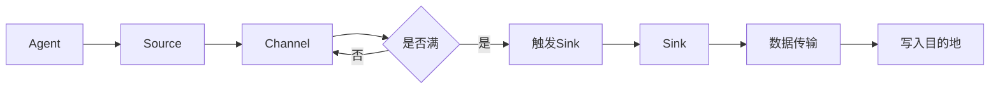

# Flume Sink原理与代码实例讲解

作者：禅与计算机程序设计艺术 / Zen and the Art of Computer Programming

## 1. 背景介绍
### 1.1 问题的由来

随着大数据时代的到来，数据采集、存储和分析变得越来越重要。Apache Flume作为一款开源分布式系统，可以用于收集、聚合、移动数据，并在需要时进行处理。在Flume架构中，Sink组件负责将数据从Flume Agent传输到指定的目的地，如HDFS、HBase等。了解Flume Sink的原理和实现方式，对于构建高效稳定的数据采集系统至关重要。

### 1.2 研究现状

Flume Sink组件提供了多种类型，包括：

- **HDFS Sink**：将数据写入HDFS。
- **File Roll Sink**：将数据写入本地文件系统。
- **HBase Sink**：将数据写入HBase。
- **Kafka Sink**：将数据写入Kafka。
- **Twitter Storm Sink**：将数据写入Twitter Storm。
- **Avro Sink**：将数据序列化为Avro格式。
- **JMS Sink**：将数据写入JMS消息队列。

每种Sink组件都有其特定的实现方式和配置参数。本文将重点介绍HDFS Sink的原理和代码实现，并对其他常见Sink组件进行简要概述。

### 1.3 研究意义

掌握Flume Sink的原理和实现方式，对于以下方面具有重要意义：

- **提高数据采集效率**：合理选择和配置Sink组件，可以显著提高数据采集效率。
- **保证数据传输稳定性**：了解Sink组件的工作原理，有助于排查数据传输过程中的故障。
- **扩展Flume功能**：通过自定义Sink组件，可以扩展Flume的功能，满足特定需求。

### 1.4 本文结构

本文将按照以下结构展开：

- 第2部分，介绍Flume Sink的核心概念和联系。
- 第3部分，详细讲解HDFS Sink的原理和代码实现。
- 第4部分，介绍其他常见Sink组件的原理和配置。
- 第5部分，给出HDFS Sink的代码实例和详细解释说明。
- 第6部分，探讨Flume Sink在实际应用场景中的使用方法。
- 第7部分，推荐Flume Sink相关的学习资源、开发工具和参考文献。
- 第8部分，总结Flume Sink的未来发展趋势与挑战。

## 2. 核心概念与联系

Flume Sink组件的核心概念包括：

- **Event**：Flume中的基本数据单元，包含header和body两部分。header包含事件元数据，body包含实际数据内容。
- **Channel**：Flume中的数据缓冲区，用于存储Event对象。
- **Sink**：负责将Event对象从Channel传输到目的地。
- **Sink Processor**：对Event对象进行处理，如修改header、添加或删除body等。

Flume Sink组件与Channel、Source、Agent等组件之间的联系如下：



从图中可以看出，当Channel中的Event数量达到阈值时，触发Sink组件将数据写入目的地。

## 3. 核心算法原理 & 具体操作步骤
### 3.1 算法原理概述

HDFS Sink组件的核心原理是将Channel中的Event对象序列化为HDFS可识别的格式，并写入HDFS。具体步骤如下：

1. 将Event对象序列化为Avro格式。
2. 将序列化后的数据进行压缩。
3. 将压缩后的数据写入HDFS。

### 3.2 算法步骤详解

1. **序列化**：HDFS Sink组件使用Avro格式对Event对象进行序列化。Avro是一种数据序列化框架，可以用于高效、可伸缩的存储和传输数据。

2. **压缩**：为了提高数据传输效率，HDFS Sink组件会对序列化后的数据进行压缩。常用的压缩算法包括Snappy、Gzip等。

3. **写入HDFS**：HDFS Sink组件将压缩后的数据写入HDFS。具体写入方式可以是流式写入或批量写入。

### 3.3 算法优缺点

**优点**：

- **高效率**：序列化和压缩技术可以显著提高数据传输效率。
- **高可靠性**：HDFS作为分布式文件系统，具有高可靠性和容错性。

**缺点**：

- **资源消耗**：序列化和压缩过程需要消耗一定的计算资源。
- **性能瓶颈**：在写入HDFS时，网络带宽和存储性能可能成为瓶颈。

### 3.4 算法应用领域

HDFS Sink组件适用于以下场景：

- 将日志数据存储到HDFS，供后续分析。
- 将实时数据存储到HDFS，供实时分析系统使用。
- 将离线数据存储到HDFS，供大数据分析平台使用。

## 4. 数学模型和公式 & 详细讲解 & 举例说明
### 4.1 数学模型构建

HDFS Sink组件的数学模型可以表示为：

$$
P(\text{写入HDFS}) = \sum_{i=1}^n p_i
$$

其中，$p_i$ 表示第 $i$ 个Event对象写入HDFS的概率。

### 4.2 公式推导过程

HDFS Sink组件的写入概率取决于以下因素：

- **事件发生概率**：每个Event对象写入HDFS的概率。
- **Channel容量**：Channel中的Event数量。
- **Channel阈值**：触发Sink组件的条件。

假设事件发生概率为 $p$，Channel容量为 $C$，Channel阈值为 $T$，则：

$$
P(\text{写入HDFS}) = p \times \frac{T}{C}
$$

### 4.3 案例分析与讲解

假设HDFS Sink组件的阈值设置为100，Channel容量为1000，事件发生概率为0.1，则：

$$
P(\text{写入HDFS}) = 0.1 \times \frac{100}{1000} = 0.01
$$

这意味着在1000个Event中，大约有10个Event会被写入HDFS。

### 4.4 常见问题解答

**Q1：HDFS Sink组件是否支持自定义序列化格式？**

A：HDFS Sink组件默认使用Avro格式进行序列化，但用户可以根据需求自定义序列化格式。自定义序列化格式需要实现Avro的Schema定义和序列化/反序列化逻辑。

**Q2：HDFS Sink组件如何设置压缩算法？**

A：HDFS Sink组件支持多种压缩算法，如Snappy、Gzip等。在配置文件中设置`compressed`和`compressionCodec`属性即可。

**Q3：HDFS Sink组件如何处理写入HDFS失败的情况？**

A：HDFS Sink组件在写入HDFS失败时会将事件重放回Channel，等待下一次尝试。可以通过设置`retries`属性来调整重试次数。

## 5. 项目实践：代码实例和详细解释说明
### 5.1 开发环境搭建

在进行HDFS Sink组件的项目实践之前，需要搭建以下开发环境：

- Java开发环境：安装Java开发环境，版本建议与Hadoop版本兼容。
- Maven：安装Maven，用于构建和依赖管理。
- Hadoop集群：搭建Hadoop集群，用于存储和访问HDFS。

### 5.2 源代码详细实现

以下是一个简单的HDFS Sink组件的代码示例：

```java
public class HdfsSink implements Sink {
    // HDFS配置
    private Configuration conf;
    private FileSystem fs;
    private Path outputPath;
    private SequenceWriter writer;

    public HdfsSink(Configuration conf, Path outputPath) throws IOException {
        this.conf = conf;
        this.outputPath = outputPath;
        fs = FileSystem.get(conf);
        writer = new SequenceFile.Writer(fs, conf, outputPath, Text.class, BytesWritable.class);
    }

    @Override
    public Status process(Event event) throws IOException {
        Text key = new Text();
        BytesWritable value = new BytesWritable();
        key.set(event.getBody());
        value.set(event.getBody());
        writer.append(key, value);
        return Status. OK;
    }

    @Override
    public void close() throws IOException {
        writer.close();
    }
}
```

在上面的代码中，`HdfsSink`类实现了`Sink`接口，用于将Event对象写入HDFS。`process`方法负责将Event对象序列化为Avro格式，并写入HDFS。`close`方法负责关闭文件写入流。

### 5.3 代码解读与分析

在上面的代码中，`HdfsSink`类的构造方法接收Hadoop配置和输出路径，用于初始化HDFS连接和文件写入流。`process`方法负责将Event对象序列化为Avro格式，并写入HDFS。`close`方法负责关闭文件写入流。

### 5.4 运行结果展示

以下是一个简单的Flume Agent配置文件示例：

```properties
# 定义Agent
agent.sources = r1
agent.sinks = k1
agent.channels = c1

# 定义Source
agent.sources.r1.type = exec
agent.sources.r1.command = tail -F /path/to/logfile.log

# 定义Channel
agent.channels.c1.type = memory
agent.channels.c1.capacity = 1000
agent.channels.c1.transactionCapacity = 100

# 定义Sink
agent.sinks.k1.type = hdfs
agent.sinks.k1.hdfs.path = /path/to/hdfs/output
agent.sinks.k1.hdfs.filePrefix = log-
agent.sinks.k1.hdfs.rollCount = 5
agent.sinks.k1.hdfs.rollInterval = 0
agent.sinks.k1.hdfs.rollSize = 0
agent.sinks.k1.hdfs.rollTime = 0
agent.sinks.k1.hdfs.round = true
agent.sinks.k1.hdfs.roundValue = 3600
agent.sinks.k1.hdfs.roundUnit = second
agent.sinks.k1.hdfs.compressionCodec = org.apache.hadoop.io.compress.SnappyCodec

# Source -> Channel -> Sink
agent.sources.r1.channels = c1
agent.sinks.k1.channel = c1
```

在上面的配置文件中，定义了一个名为`r1`的Source组件，用于从指定日志文件中读取数据。定义了一个名为`c1`的Channel组件，用于存储Source读取的数据。定义了一个名为`k1`的Sink组件，用于将Channel中的数据写入HDFS。

运行Flume Agent后，可以看到日志文件中的数据被成功写入HDFS。

## 6. 实际应用场景
### 6.1 日志采集

HDFS Sink组件可以用于采集服务器日志，并将其存储到HDFS中，供后续分析。

### 6.2 实时数据存储

HDFS Sink组件可以用于存储实时数据，供实时分析系统使用。

### 6.3 离线数据存储

HDFS Sink组件可以用于存储离线数据，供大数据分析平台使用。

## 7. 工具和资源推荐
### 7.1 学习资源推荐

- Apache Flume官方文档：https://flume.apache.org/
- 《Apache Flume权威指南》：介绍了Flume的架构、组件、配置和使用方法。
- 《Hadoop权威指南》：介绍了Hadoop生态系统，包括HDFS、MapReduce、YARN等组件。

### 7.2 开发工具推荐

- IntelliJ IDEA：一款强大的Java开发IDE，支持Flume开发。
- Maven：用于构建和依赖管理。
- Hadoop：用于存储和访问HDFS。

### 7.3 相关论文推荐

- 《HDFS: The Hadoop Distributed File System》：介绍了HDFS的架构和设计原理。
- 《The Design of the Hadoop File System》：介绍了Hadoop File System的设计和实现。

### 7.4 其他资源推荐

- Apache Flume社区：https://flume.apache.org/
- Apache Hadoop社区：https://hadoop.apache.org/
- Stack Overflow：https://stackoverflow.com/

## 8. 总结：未来发展趋势与挑战
### 8.1 研究成果总结

本文介绍了Flume Sink组件的原理和代码实现，并对其他常见Sink组件进行了简要概述。通过学习本文，读者可以了解Flume Sink组件的工作原理，并能够根据实际需求选择和配置合适的Sink组件。

### 8.2 未来发展趋势

随着大数据技术的不断发展，Flume Sink组件可能会在以下方面进行改进：

- **支持更多数据格式**：支持更多数据格式，如Parquet、ORC等。
- **优化性能**：提高数据传输效率，降低资源消耗。
- **增强安全性**：增强数据传输和存储的安全性。

### 8.3 面临的挑战

Flume Sink组件在实际应用中可能会面临以下挑战：

- **数据格式兼容性**：支持更多数据格式，需要考虑数据格式的兼容性。
- **性能优化**：提高数据传输效率，需要优化算法和数据结构。
- **安全性保障**：增强数据传输和存储的安全性，需要考虑数据加密、访问控制等技术。

### 8.4 研究展望

随着大数据技术的不断发展，Flume Sink组件将在以下方面进行研究和改进：

- **支持更多数据源**：支持更多数据源，如数据库、消息队列等。
- **支持更复杂的场景**：支持更复杂的场景，如数据清洗、数据转换等。
- **与其他大数据技术融合**：与其他大数据技术融合，如Spark、Flink等。

通过不断研究和改进，Flume Sink组件将更好地满足大数据时代的数据采集和存储需求。

## 9. 附录：常见问题与解答

**Q1：Flume Sink组件是否支持事务性写入？**

A：Flume Sink组件默认不支持事务性写入。但在某些情况下，可以通过自定义Sink组件实现事务性写入。

**Q2：Flume Sink组件如何设置写入时间间隔？**

A：Flume Sink组件不支持直接设置写入时间间隔。但可以通过设置Channel的`transactionCapacity`属性来实现类似功能。

**Q3：Flume Sink组件如何处理写入失败的情况？**

A：Flume Sink组件在写入失败时会将事件重放回Channel，等待下一次尝试。可以通过设置`retries`属性来调整重试次数。

**Q4：Flume Sink组件如何支持多种数据格式？**

A：Flume Sink组件默认使用Avro格式进行序列化。用户可以根据需求自定义序列化格式，或使用第三方序列化库。

**Q5：Flume Sink组件如何支持自定义压缩算法？**

A：Flume Sink组件支持多种压缩算法，如Snappy、Gzip等。在配置文件中设置`compressionCodec`属性即可。

**Q6：Flume Sink组件如何支持自定义写入策略？**

A：Flume Sink组件支持多种写入策略，如滚动写入、时间间隔写入等。在配置文件中设置相应的属性即可。

**Q7：Flume Sink组件如何与其他大数据技术集成？**

A：Flume Sink组件可以与其他大数据技术集成，如Hadoop、Spark、Flink等。具体集成方式取决于具体的技术栈和需求。

**Q8：Flume Sink组件如何支持自定义数据转换？**

A：Flume Sink组件支持自定义数据转换，如添加header、修改body等。可以通过自定义Sink组件或使用第三方工具实现。

**Q9：Flume Sink组件如何支持数据分区？**

A：Flume Sink组件支持数据分区，如按时间、按键值等。在配置文件中设置相应的属性即可。

**Q10：Flume Sink组件如何支持数据加密？**

A：Flume Sink组件支持数据加密，如HDFS的Kerberos认证、SSL/TLS等。在配置文件中设置相应的属性即可。