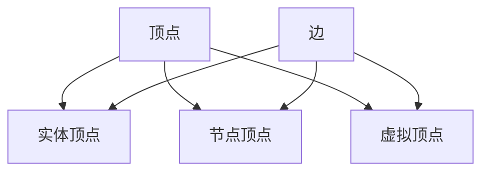

# Graph Vertex原理与代码实例讲解

作者：禅与计算机程序设计艺术 / Zen and the Art of Computer Programming

## 1. 背景介绍
### 1.1 问题的由来

图论是计算机科学中一个重要的分支，它用于描述对象之间的关系。在图论中，图由顶点（Vertex）和边（Edge）组成。顶点代表图中的对象，边代表对象之间的关系。图在计算机科学和实际应用中有着广泛的应用，如社交网络、网络拓扑、蛋白质结构分析等。

在图论中，顶点是一个核心概念，它代表图中的元素或实体。顶点的特性、关系以及与其他顶点的连接方式对于理解和分析图结构至关重要。本文将深入探讨图顶点的原理，并提供代码实例来展示如何实现图顶点及其相关操作。

### 1.2 研究现状

图顶点的理论研究已经相当成熟，但在实际应用中，如何有效地表示和管理图顶点仍然是研究的重点。近年来，随着大数据和云计算技术的发展，图顶点在数据存储、分析和挖掘方面得到了越来越多的关注。

### 1.3 研究意义

深入理解图顶点的原理对于以下方面具有重要意义：

- 提高图算法的效率
- 改进图数据结构的表示
- 优化图在复杂系统中的应用

### 1.4 本文结构

本文将按照以下结构展开：

- 第2部分介绍图顶点的核心概念和联系。
- 第3部分详细阐述图顶点的算法原理和具体操作步骤。
- 第4部分通过数学模型和公式对图顶点进行详细讲解，并结合实例进行分析。
- 第5部分提供代码实例和详细解释说明。
- 第6部分探讨图顶点在实际应用场景中的具体应用。
- 第7部分推荐相关的学习资源、开发工具和参考文献。
- 第8部分总结研究成果，展望未来发展趋势和挑战。
- 第9部分提供常见问题与解答。

## 2. 核心概念与联系

### 2.1 图顶点定义

图顶点（Vertex）是图论中的基本元素，代表图中的实体或对象。每个顶点都有其独特的标识符（ID）和属性（如名称、类型等）。

### 2.2 图顶点类型

根据不同的应用场景，图顶点可以分为以下几种类型：

- 实体顶点：代表现实世界中的实体，如人、地点、组织等。
- 节点顶点：代表网络结构中的节点，如电路节点、网络节点等。
- 虚拟顶点：代表抽象概念或关系，如事件、过程等。

### 2.3 图顶点关系

图顶点之间的关系可以通过边（Edge）来表示。边连接两个顶点，代表它们之间的某种关系。常见的边类型包括：

- 有向边：表示有方向的连接，如因果关系、继承关系等。
- 无向边：表示无方向的连接，如朋友关系、合作伙伴关系等。
- 加权边：表示连接的权重，如距离、成本等。

图顶点及其关系的逻辑关系可以用以下Mermaid流程图表示：



## 3. 核心算法原理 & 具体操作步骤
### 3.1 算法原理概述

图顶点的核心算法主要涉及以下方面：

- 顶点创建和初始化
- 顶点查找和访问
- 顶点属性管理
- 顶点关系维护

### 3.2 算法步骤详解

以下是图顶点操作的基本步骤：

**1. 创建和初始化顶点**

```python
class Vertex:
    def __init__(self, id, **attr):
        self.id = id
        self.attr = attr
        self.adjacent = {}  # 顶点连接的边列表
```

**2. 添加边**

```python
def add_edge(self, target_id, weight=1):
    self.adjacent[target_id] = weight
```

**3. 查找和访问顶点**

```python
def find_vertex(self, id):
    return self.vertices.get(id)
```

**4. 维护顶点属性**

```python
def set_attribute(self, key, value):
    self.attr[key] = value

def get_attribute(self, key):
    return self.attr.get(key)
```

### 3.3 算法优缺点

图顶点算法具有以下优点：

- 灵活性：可以根据实际应用需求灵活定义顶点的属性和关系。
- 可扩展性：方便扩展新的顶点类型和关系类型。
- 易于维护：便于管理和维护顶点的属性和关系。

然而，图顶点算法也存在一些缺点：

- 内存占用较大：如果图规模较大，顶点的存储和关系维护需要占用较多的内存。
- 性能开销：图顶点的查找和访问操作可能涉及多次哈希表查询，存在性能开销。

### 3.4 算法应用领域

图顶点算法在以下领域有广泛的应用：

- 社交网络分析：用于分析用户之间的关系，如朋友、关注者等。
- 网络拓扑分析：用于分析网络结构和性能，如路由优化、故障排除等。
- 蛋白质结构分析：用于分析蛋白质结构，如蛋白质-蛋白质相互作用、信号通路等。

## 4. 数学模型和公式 & 详细讲解 & 举例说明
### 4.1 数学模型构建

图顶点的数学模型主要涉及以下概念：

- 顶点集合：表示图中的所有顶点，通常用 $V$ 表示。
- 边集合：表示图中所有边的集合，通常用 $E$ 表示。
- 顶点度数：表示顶点连接的边的数量，通常用 $d(v)$ 表示。

### 4.2 公式推导过程

以下是图顶点度数的计算公式：

$$
d(v) = |N(v)| = \sum_{u \in N(v)} \delta(v,u)
$$

其中 $N(v)$ 表示顶点 $v$ 的邻接顶点集合，$\delta(v,u)$ 表示顶点 $v$ 和 $u$ 之间是否存在边。

### 4.3 案例分析与讲解

假设存在以下图：

```
A -- B -- C
|       |
D -- E
```

其中顶点集合 $V = \{A, B, C, D, E\}$，边集合 $E = \{(A,B), (B,C), (D,E)\}$。

则顶点度数如下：

- $d(A) = 1$
- $d(B) = 2$
- $d(C) = 1$
- $d(D) = 1$
- $d(E) = 1$

### 4.4 常见问题解答

**Q1：如何高效地存储图顶点？**

A：可以使用邻接表或邻接矩阵来存储图顶点。邻接表适合稀疏图，而邻接矩阵适合稠密图。

**Q2：如何快速查找图顶点？**

A：可以使用哈希表或平衡二叉搜索树（如红黑树）来存储图顶点，以提高查找效率。

**Q3：如何计算图中所有顶点的度数？**

A：可以使用深度优先搜索（DFS）或广度优先搜索（BFS）算法遍历图，并计算每个顶点的度数。

## 5. 项目实践：代码实例和详细解释说明
### 5.1 开发环境搭建

本节将以Python语言为例，展示如何实现图顶点及其相关操作。以下是开发环境搭建步骤：

1. 安装Python 3.8或更高版本。
2. 安装PyCharm或其他Python开发工具。
3. 安装以下库：`networkx`、`matplotlib`、`numpy`。

### 5.2 源代码详细实现

以下是使用`networkx`库实现图顶点的代码实例：

```python
import networkx as nx
import matplotlib.pyplot as plt

# 创建图
G = nx.Graph()

# 添加顶点
G.add_node(1, name='顶点1', age=30)
G.add_node(2, name='顶点2', age=25)
G.add_node(3, name='顶点3', age=35)

# 添加边
G.add_edge(1, 2)
G.add_edge(2, 3)

# 打印顶点信息
print(f"顶点1: {G.nodes[1]}")
print(f"顶点2: {G.nodes[2]}")
print(f"顶点3: {G.nodes[3]}")

# 绘制图
nx.draw(G, with_labels=True)
plt.show()
```

### 5.3 代码解读与分析

上述代码首先导入所需的库，然后创建一个图对象 `G`。接着，使用 `add_node()` 方法添加三个顶点，每个顶点都有名称和年龄属性。使用 `add_edge()` 方法添加两条边，表示顶点之间的关系。最后，使用 `print()` 函数打印每个顶点的信息，并使用 `nx.draw()` 方法绘制图。

### 5.4 运行结果展示

运行上述代码后，将输出以下信息：

```
顶点1: {'name': '顶点1', 'age': 30}
顶点2: {'name': '顶点2', 'age': 25}
顶点3: {'name': '顶点3', 'age': 35}
```

同时，将绘制以下图形：

```
A (1) -- B (2)
|       |
C (3)
```

其中，顶点1、顶点2、顶点3分别用数字1、2、3表示。

## 6. 实际应用场景
### 6.1 社交网络分析

图顶点在社交网络分析中有着广泛的应用。例如，可以使用图顶点表示用户，并使用边表示用户之间的关系。通过分析图顶点及其关系，可以揭示用户之间的社交关系、兴趣爱好、影响力等。

### 6.2 网络拓扑分析

图顶点在网络拓扑分析中同样具有重要应用。例如，可以使用图顶点表示网络节点，并使用边表示节点之间的连接关系。通过分析图顶点及其关系，可以优化网络结构、提高网络性能、进行故障排查等。

### 6.3 蛋白质结构分析

图顶点在蛋白质结构分析中有着重要应用。例如，可以使用图顶点表示氨基酸残基，并使用边表示残基之间的化学键。通过分析图顶点及其关系，可以研究蛋白质结构、蛋白质功能、蛋白质相互作用等。

## 7. 工具和资源推荐
### 7.1 学习资源推荐

- 《图论及其应用》
- 《算法导论》
- 《图论教程》

### 7.2 开发工具推荐

- Python
- PyCharm
- NetworkX
- Matplotlib

### 7.3 相关论文推荐

- "Graph-based clustering of time series" (Chakrabarti, 2004)
- "Community detection in large networks" (Fortunato, 2010)
- "Exploiting and Engineering Graph Structure for Information Retrieval" (Leskovec, 2011)

### 7.4 其他资源推荐

- 图论在线教程：https://www.geeksforgeeks.org/introduction-to-graph/
- NetworkX官网：https://networkx.org/

## 8. 总结：未来发展趋势与挑战
### 8.1 研究成果总结

本文深入探讨了图顶点的原理和应用，介绍了图顶点的核心算法、数学模型以及代码实例。通过本文的学习，读者可以掌握图顶点的基本概念、操作方法和应用场景。

### 8.2 未来发展趋势

随着大数据和人工智能技术的不断发展，图顶点在以下方面具有广阔的发展前景：

- 高效存储和检索图顶点
- 图顶点表示学习
- 图顶点在深度学习中的应用

### 8.3 面临的挑战

尽管图顶点在理论和应用方面取得了显著进展，但在以下方面仍面临挑战：

- 高度稀疏图的处理
- 图顶点表示学习的准确性
- 图顶点在深度学习中的应用

### 8.4 研究展望

未来，图顶点的研究将朝着以下方向发展：

- 研究高效存储和检索图顶点的方法
- 探索图顶点表示学习的新方法
- 探索图顶点在深度学习中的应用

相信在学术界和产业界的共同努力下，图顶点将在理论和应用方面取得更大的突破，为构建智能化、高效化、可解释的图分析系统做出贡献。

## 9. 附录：常见问题与解答

**Q1：什么是图顶点？**

A：图顶点是图论中的基本元素，代表图中的实体或对象。每个顶点都有其独特的标识符（ID）和属性（如名称、类型等）。

**Q2：图顶点在哪些领域有应用？**

A：图顶点在社交网络分析、网络拓扑分析、蛋白质结构分析等领域有着广泛的应用。

**Q3：如何高效存储图顶点？**

A：可以使用邻接表或邻接矩阵来存储图顶点。

**Q4：如何快速查找图顶点？**

A：可以使用哈希表或平衡二叉搜索树（如红黑树）来存储图顶点，以提高查找效率。

**Q5：如何计算图中所有顶点的度数？**

A：可以使用深度优先搜索（DFS）或广度优先搜索（BFS）算法遍历图，并计算每个顶点的度数。

**Q6：图顶点在深度学习中有哪些应用？**

A：图顶点可以用于表示图数据，并应用于图神经网络（GNN）等深度学习模型中。

**Q7：如何选择合适的图顶点表示方法？**

A：选择合适的图顶点表示方法需要根据具体应用场景和数据特点进行选择。例如，对于社交网络分析，可以使用节点表示用户，边表示用户之间的关系。对于网络拓扑分析，可以使用节点表示网络节点，边表示节点之间的连接关系。

**Q8：如何评估图顶点表示学习方法的性能？**

A：评估图顶点表示学习方法的性能可以通过以下指标进行：

- 准确率：表示模型预测正确的比例。
- 精确率：表示模型预测正确的正类样本数占总正类样本数的比例。
- 召回率：表示模型预测正确的正类样本数占总负类样本数的比例。
- F1分数：表示精确率和召回率的调和平均值。

通过以上指标可以评估图顶点表示学习方法的性能，并根据评估结果进行优化和改进。