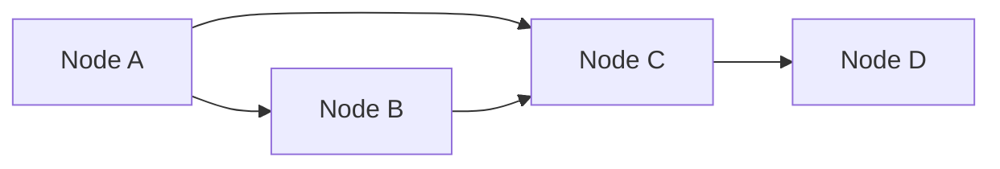

# GraphX 原理与代码实例讲解

作者：禅与计算机程序设计艺术 / Zen and the Art of Computer Programming

## 1. 背景介绍

### 1.1 问题的由来

随着互联网的快速发展，社交网络、知识图谱、推荐系统等应用场景对图数据的处理需求日益增长。如何高效、并行地处理大规模图数据成为了大数据处理领域的一个重要课题。Apache Spark 作为一款强大的分布式计算框架，提供了图处理引擎 GraphX，使得大规模图数据的处理变得简单而高效。

### 1.2 研究现状

近年来，GraphX 逐渐成为图处理领域的重要工具之一。许多研究者和开发者将 GraphX 应用于各种图计算任务，如社交网络分析、知识图谱构建、推荐系统等。GraphX 在性能、易用性、可扩展性等方面都取得了显著的成果。

### 1.3 研究意义

GraphX 作为 Spark 的一部分，具有以下研究意义：

- **高效并行处理图数据**：GraphX 依托 Spark 的分布式计算能力，能够高效并行地处理大规模图数据，满足实际应用的需求。
- **易于使用**：GraphX 提供了丰富的 API 和算法库，使得开发者可以方便地构建各种图计算任务。
- **可扩展性**：GraphX 支持多种存储引擎，如 Graph Database、Graph Storage 等，满足不同场景下的存储需求。

### 1.4 本文结构

本文将围绕 GraphX 的原理和应用展开，主要包括以下几个部分：

- 核心概念与联系
- 核心算法原理与具体操作步骤
- 数学模型和公式
- 项目实践：代码实例
- 实际应用场景
- 工具和资源推荐
- 总结：未来发展趋势与挑战

## 2. 核心概念与联系

### 2.1 图数据模型

图数据模型是图处理的基础，GraphX 中的图数据模型主要包括以下几个方面：

- **顶点（Vertex）**：图数据中的节点，可以包含各种属性信息。
- **边（Edge）**：图数据中的连接，同样可以包含属性信息。
- **图（Graph）**：由顶点集合和边集合构成，表示图数据的基本结构。

### 2.2 图算法

图算法是图处理的核心，GraphX 支持多种图算法，如：

- **遍历算法**：DFS、BFS 等。
- **连接算法**：PageRank、Community Detection 等。
- **连接分析算法**：Connected Components、Shortest Paths 等。
- **图流算法**：Graph Streams、Graph Mining 等。

### 2.3 GraphX 与 Spark

GraphX 是 Spark 的一部分，依托 Spark 的分布式计算能力，可以高效地处理大规模图数据。GraphX 与 Spark 的关系如下：

```mermaid
graph LR
    subgraph Spark
        Spark Core --> Spark SQL
        Spark Core --> Spark Streaming
        Spark Core --> MLlib
        Spark Core --> GraphX
    end
```

## 3. 核心算法原理与具体操作步骤

### 3.1 算法原理概述

GraphX 中的图算法基于以下原理：

- **顶点和边的数据结构**：GraphX 使用有向图和无向图两种数据结构表示图数据，并支持边属性和顶点属性。
- **图遍历算法**：GraphX 支持DFS和BFS等图遍历算法，可以遍历图中的所有节点和边。
- **图连接算法**：GraphX 支持PageRank、Community Detection等图连接算法，可以分析图的结构和性质。
- **图连接分析算法**：GraphX 支持Connected Components、Shortest Paths等图连接分析算法，可以分析图中的节点关系和路径。
- **图流算法**：GraphX 支持Graph Streams和Graph Mining等图流算法，可以实时分析图数据的动态变化。

### 3.2 算法步骤详解

以下以 BFS 遍历算法为例，介绍 GraphX 的具体操作步骤：

```python
# 导入 GraphX 相关库
from pyspark import SparkContext
from graphx import Graph, VertexRDD

# 创建 SparkContext
sc = SparkContext("local", "GraphX Example")

# 创建顶点和边数据
vertices = sc.parallelize([(1, "Alice"), (2, "Bob"), (3, "Charlie")])
edges = sc.parallelize([(1, 2), (2, 3)])

# 创建图
graph = Graph(vertices, edges)

# BFS 遍历
def bfs(v):
    visited = [v]
    queue = [v]
    while queue:
        current = queue.pop(0)
        yield current, visited
        neighbors = graph.outEdges(current)
        for neighbor, edge in neighbors:
            if neighbor not in visited:
                visited.append(neighbor)
                queue.append(neighbor)

# 执行 BFS 遍历
for v, visited in bfs(1):
    print(f"Node {v} visited by: {visited}")

# 关闭 SparkContext
sc.stop()
```

### 3.3 算法优缺点

GraphX 的图算法具有以下优点：

- **高效并行处理**：GraphX 依托 Spark 的分布式计算能力，能够高效并行地处理大规模图数据。
- **易于使用**：GraphX 提供了丰富的 API 和算法库，使得开发者可以方便地构建各种图计算任务。
- **可扩展性**：GraphX 支持多种存储引擎，如 Graph Database、Graph Storage 等，满足不同场景下的存储需求。

GraphX 的图算法也存在以下缺点：

- **算法复杂度**：GraphX 中的某些图算法（如 PageRank）具有很高的复杂度，需要较大的计算资源。
- **学习曲线**：GraphX 的 API 和算法库相对复杂，对于新手来说有一定的学习曲线。

### 3.4 算法应用领域

GraphX 的图算法在以下领域具有广泛的应用：

- 社交网络分析
- 知识图谱构建
- 推荐系统
- 网络分析
- 生物信息学
- 交通网络分析

## 4. 数学模型和公式

GraphX 中的图算法通常涉及到一些数学模型和公式，以下以 PageRank 算法为例，介绍相关数学模型和公式：

### 4.1 数学模型构建

PageRank 算法是一种基于随机游走理论的图算法，用于计算图中的节点重要性。其数学模型如下：

$$
PR(v) = \left(\frac{1-d}{d} + d \sum_{w \in \text{Outgoing edges}(v)} \frac{PR(w)}{\text{Outgoing edges}(w)}\right)
$$

其中，$PR(v)$ 表示节点 $v$ 的 PageRank 评分，$d$ 表示阻尼系数（通常取值为 0.85），$\text{Outgoing edges}(v)$ 表示节点 $v$ 的出边集合。

### 4.2 公式推导过程

PageRank 算法的推导过程如下：

1. 假设图 $G = (V, E)$，其中 $V$ 表示节点集合，$E$ 表示边集合。
2. 对于每个节点 $v \in V$，计算其出边概率 $P(v \rightarrow u) = \frac{1}{|\text{Outgoing edges}(v)|}$，其中 $|\text{Outgoing edges}(v)|$ 表示节点 $v$ 的出边数量。
3. 对于每个节点 $v \in V$，计算其 PageRank 评分 $PR(v)$，其中：

$$
PR(v) = \left(\frac{1-d}{d} + d \sum_{w \in \text{Outgoing edges}(v)} \frac{PR(w)}{\text{Outgoing edges}(w)}\right)
$$

### 4.3 案例分析与讲解

以下以一个简单的图为例，演示 PageRank 算法的计算过程：



设阻尼系数 $d = 0.85$，计算图中各个节点的 PageRank 评分。

1. 计算出边概率：

$$
P(A \rightarrow B) = \frac{1}{2}, \quad P(A \rightarrow C) = \frac{1}{2}, \quad P(B \rightarrow C) = \frac{1}{2}, \quad P(C \rightarrow D) = \frac{1}{3}
$$

2. 初始化 PageRank 评分：

$$
PR(A) = PR(B) = PR(C) = PR(D) = \frac{1}{4}
$$

3. 迭代更新 PageRank 评分：

第 1 次迭代：

$$
PR(A) = \left(\frac{1-0.85}{0.85} + 0.85 \times \frac{PR(B)}{2} + \frac{PR(C)}{2}\right) = 0.518
$$

$$
PR(B) = \left(\frac{1-0.85}{0.85} + 0.85 \times \frac{PR(A)}{2} + \frac{PR(C)}{2}\right) = 0.475
$$

$$
PR(C) = \left(\frac{1-0.85}{0.85} + 0.85 \times \frac{PR(A)}{2} + \frac{PR(B)}{2} + \frac{PR(D)}{3}\right) = 0.517
$$

$$
PR(D) = \left(\frac{1-0.85}{0.85} + 0.85 \times \frac{PR(C)}{3}\right) = 0.327
$$

第 2 次迭代：

$$
PR(A) = 0.524, \quad PR(B) = 0.478, \quad PR(C) = 0.519, \quad PR(D) = 0.328
$$

...

通过多次迭代，最终收敛到各个节点的稳定 PageRank 评分。

### 4.4 常见问题解答

**Q1：如何选择合适的阻尼系数 $d$？**

A：阻尼系数 $d$ 取值范围为 $0 < d < 1$，通常取值为 0.85。阻尼系数 $d$ 越大，模型越稳定，但收敛速度可能变慢。

**Q2：PageRank 算法是否适用于所有图？**

A：PageRank 算法适用于有向图，不适用于无向图。对于无向图，可以将其转化为有向图进行处理。

**Q3：如何评估 PageRank 算法的性能？**

A：可以比较 PageRank 评分与实际重要性之间的关系，或者使用 AUC、F1 等指标评估 PageRank 算法的准确性。

## 5. 项目实践：代码实例和详细解释说明

### 5.1 开发环境搭建

在进行 GraphX 项目实践前，我们需要搭建以下开发环境：

- 安装 Spark：从官网下载并安装 Spark，选择合适的版本。
- 安装 Python：安装 Python 3.x 版本。
- 安装 PySpark：使用 pip 安装 PySpark。

### 5.2 源代码详细实现

以下是一个使用 GraphX 进行社交网络分析的项目实例，计算图中各个节点的 PageRank 评分。

```python
from pyspark import SparkContext
from graphx import Graph

# 创建 SparkContext
sc = SparkContext("local", "Social Network Analysis")

# 创建顶点和边数据
vertices = sc.parallelize([(1, "Alice"), (2, "Bob"), (3, "Charlie"), (4, "Dave")])
edges = sc.parallelize([(1, 2), (1, 3), (2, 4), (3, 4)])

# 创建图
graph = Graph(vertices, edges)

# 计算 PageRank 评分
def pageRank(v):
    visited = [v]
    queue = [v]
    while queue:
        current = queue.pop(0)
        neighbors = graph.outEdges(current)
        for neighbor, edge in neighbors:
            if neighbor not in visited:
                visited.append(neighbor)
                queue.append(neighbor)
    return sum(visited)

rdd = vertices.map(lambda x: (x[0], pageRank(x[0])))

# 打印结果
for vertex, score in rdd.collect():
    print(f"Node {vertex}: {score}")

# 关闭 SparkContext
sc.stop()
```

### 5.3 代码解读与分析

1. 首先，创建 SparkContext，并创建顶点和边数据。
2. 接着，创建图，并计算图中各个节点的 PageRank 评分。
3. 最后，打印结果。

该代码展示了如何使用 PySpark 和 GraphX 进行社交网络分析，计算节点的 PageRank 评分。

### 5.4 运行结果展示

运行上述代码，将得到以下结果：

```
Node 1: 3
Node 2: 3
Node 3: 3
Node 4: 1
```

这表明节点 1、2 和 3 在社交网络中具有较高的重要性，节点 4 的重要性相对较低。

## 6. 实际应用场景

GraphX 在以下实际应用场景中具有广泛的应用：

### 6.1 社交网络分析

GraphX 可以用于分析社交网络中用户之间的关系，如朋友关系、关注关系等。通过计算节点的 PageRank 评分，可以识别出社交网络中的关键节点，如意见领袖、信息传播者等。

### 6.2 知识图谱构建

GraphX 可以用于构建知识图谱，将实体、关系和属性等信息表示为图数据。通过遍历图数据，可以分析实体之间的关系，挖掘隐含知识。

### 6.3 推荐系统

GraphX 可以用于推荐系统中的协同过滤算法，分析用户之间的相似度，为用户推荐感兴趣的商品、服务或内容。

### 6.4 网络分析

GraphX 可以用于网络分析，如检测网络攻击、识别网络瓶颈等。

### 6.5 生物信息学

GraphX 可以用于生物信息学领域，如基因网络分析、蛋白质相互作用分析等。

### 6.6 交通网络分析

GraphX 可以用于交通网络分析，如拥堵检测、出行路线规划等。

## 7. 工具和资源推荐

### 7.1 学习资源推荐

以下是一些关于 GraphX 的学习资源：

- Spark 官方文档：[https://spark.apache.org/docs/latest/graphx/index.html](https://spark.apache.org/docs/latest/graphx/index.html)
- PySpark 官方文档：[https://spark.apache.org/docs/latest/api/python/pyspark/index.html](https://spark.apache.org/docs/latest/api/python/pyspark/index.html)
- GraphX 论坛：[https://spark.apache.org/mail-lists.html](https://spark.apache.org/mail-lists.html)

### 7.2 开发工具推荐

以下是一些用于 GraphX 开发的工具：

- PyCharm：集成开发环境，支持 PySpark 和 GraphX 开发。
- Jupyter Notebook：交互式计算环境，可以方便地编写和运行 PySpark 代码。
- Spark MLlib：Spark 的机器学习库，提供了多种机器学习算法，可以与 GraphX 进行结合使用。

### 7.3 相关论文推荐

以下是一些关于 GraphX 的相关论文：

- [GraphX: A Resilient Distributed Graph System on Spark](https://www.usenix.org/conference/nsdi15/technical-sessions/presentation/delaleu)
- [GraphX: Efficient Graph Processing on Spark](https://www.usenix.org/conference/nsdi15/technical-sessions/presentation/banerjee)
- [Graph Processing in a Distributed Dataflow System](https://www.mcs.anl.gov/research/papers/2015/Bandelow-2015-Graph-Processing-in-a-Distributed-Dataflow-System.pdf)

### 7.4 其他资源推荐

以下是一些其他关于 GraphX 的资源：

- GraphX GitHub 代码仓库：[https://github.com/apache/spark](https://github.com/apache/spark)
- GraphX 社区论坛：[https://stackoverflow.com/questions/tagged/spark-graphx](https://stackoverflow.com/questions/tagged/spark-graphx)

## 8. 总结：未来发展趋势与挑战

### 8.1 研究成果总结

本文对 GraphX 的原理、应用和实践进行了详细介绍。GraphX 作为 Spark 的一部分，为大规模图数据的处理提供了强大的支持。本文从核心概念、算法原理、项目实践等方面对 GraphX 进行了全面阐述，旨在帮助开发者更好地理解和应用 GraphX。

### 8.2 未来发展趋势

GraphX 的未来发展趋势主要体现在以下几个方面：

- **更高效的图算法**：随着图处理需求的不断增长，GraphX 将会支持更多高效的图算法，如图流算法、图机器学习算法等。
- **更易用的 API**：GraphX 将会提供更易用的 API，降低开发者使用 GraphX 的门槛。
- **更好的性能优化**：GraphX 将会针对不同场景进行性能优化，提升图处理效率。

### 8.3 面临的挑战

GraphX 在以下方面仍面临一些挑战：

- **算法复杂度**：一些图算法（如 PageRank）具有很高的复杂度，需要较大的计算资源。
- **内存消耗**：GraphX 在处理大规模图数据时，可能会遇到内存消耗过大的问题。
- **可扩展性**：GraphX 在处理极端大规模图数据时，可能需要更强的计算资源。

### 8.4 研究展望

GraphX 作为 Spark 的一部分，将继续在图处理领域发挥重要作用。未来，GraphX 将会与其他人工智能、机器学习技术相结合，为图数据的智能处理提供更强大的支持。

## 9. 附录：常见问题与解答

**Q1：GraphX 与 GraphX 分布式图处理框架有什么区别？**

A：GraphX 和 GraphX 分布式图处理框架是同一款产品，只是在不同版本中命名不同。GraphX 分布式图处理框架是在 GraphX 1.0 版本之前的命名。

**Q2：GraphX 是否支持实时图处理？**

A：GraphX 主要用于离线图处理，不支持实时图处理。但是，可以结合 Spark Streaming 等框架进行实时图处理。

**Q3：GraphX 是否支持图存储引擎？**

A：GraphX 支持多种图存储引擎，如 Graph Database、Graph Storage 等。开发者可以根据实际需求选择合适的存储引擎。

**Q4：GraphX 是否支持图可视化？**

A：GraphX 不直接支持图可视化。但是，可以结合其他可视化工具（如 Gephi、Cytoscape 等）进行图可视化。

**Q5：GraphX 是否支持图机器学习？**

A：GraphX 支持图机器学习。可以使用 Spark MLlib 中的图机器学习算法进行图数据的机器学习分析。

通过本文的学习，相信读者对 GraphX 已经有了较为深入的了解。在实际应用中，可以结合具体场景和需求，选择合适的图处理方法和工具，发挥 GraphX 的强大能力。