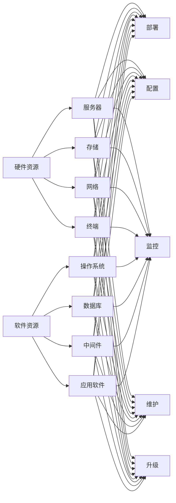

# IT基础资源（硬软件）运行流程

> 关键词：IT基础设施，硬件，软件，运行流程，性能优化，自动化，监控

## 1. 背景介绍
### 1.1 问题的由来

随着信息技术的飞速发展，IT基础设施已经成为企业运营和业务发展的关键支撑。一个稳定、高效、可靠的IT基础资源运行流程对于保障企业业务的连续性和高效性至关重要。然而，随着硬件设备多样化和软件系统的复杂性不断增加，如何科学地管理和优化IT基础资源的运行流程成为一个亟待解决的问题。

### 1.2 研究现状

目前，IT基础资源运行流程的研究主要集中在以下几个方面：

- **硬件资源管理**：包括服务器、存储、网络等硬件设备的监控、维护和管理。
- **软件资源管理**：包括操作系统、数据库、中间件等软件系统的部署、配置、升级和维护。
- **运行效率优化**：通过优化系统配置、提高硬件利用率、减少资源浪费等方式提升IT资源的运行效率。
- **自动化和智能化**：利用自动化工具和人工智能技术实现IT资源的自动化管理和维护。
- **监控与预警**：通过实时监控IT资源的运行状态，及时发现和解决潜在问题，保障系统稳定运行。

### 1.3 研究意义

研究IT基础资源运行流程具有重要的理论意义和实际应用价值：

- **提高IT资源利用率**：通过科学的管理和优化，降低资源浪费，提高IT资源的利用率，降低运营成本。
- **保障业务连续性**：确保IT基础设施的稳定运行，保障企业业务的连续性和高效性。
- **提升运维效率**：通过自动化和智能化技术，减少人工干预，提升运维效率。
- **降低故障率**：通过实时监控和预警，及时发现和解决潜在问题，降低故障率。
- **提高运维水平**：推动运维团队的技术水平提升，为企业发展提供有力保障。

### 1.4 本文结构

本文将从硬件和软件两个方面，系统介绍IT基础资源运行流程，包括核心概念、原理、操作步骤、数学模型、项目实践、实际应用场景、工具和资源推荐、未来发展趋势与挑战等。

## 2. 核心概念与联系

本节将介绍IT基础资源运行流程中涉及的核心概念及其相互关系。

### 2.1 硬件资源

硬件资源包括服务器、存储、网络、终端等物理设备。它们是IT基础设施的基石，为软件系统提供运行环境。

### 2.2 软件资源

软件资源包括操作系统、数据库、中间件、应用软件等。它们是IT基础设施的核心，负责处理业务数据和提供业务功能。

### 2.3 运行流程

运行流程是指IT基础设施在硬件和软件资源支持下，完成业务处理的过程。它包括以下几个环节：

- **部署**：将软件系统安装在硬件设备上，使其具备运行能力。
- **配置**：对软件系统进行参数设置，以满足业务需求。
- **监控**：实时监控IT资源的运行状态，及时发现和解决潜在问题。
- **维护**：定期对IT资源进行检查、清洁、修复等工作，确保其正常运行。
- **升级**：对软件系统进行版本升级，提高系统性能和安全性。

### 2.4 关系图

以下为硬件资源和软件资源之间的逻辑关系图：



## 3. 核心算法原理 & 具体操作步骤
### 3.1 算法原理概述

IT基础资源运行流程的算法原理主要涉及以下几个方面：

- **资源监控**：通过采集硬件和软件资源的性能指标，实现对资源的实时监控。
- **性能分析**：对采集到的性能数据进行统计分析，识别资源瓶颈和异常情况。
- **故障诊断**：根据性能分析和故障表现，定位故障原因。
- **优化策略**：根据分析结果，制定资源优化策略，提高资源利用率和系统性能。

### 3.2 算法步骤详解

以下是IT基础资源运行流程的算法步骤：

**Step 1: 资源监控**

- 采集硬件资源（如CPU、内存、磁盘、网络等）的实时性能指标。
- 采集软件资源（如操作系统、数据库、应用软件等）的实时性能指标。

**Step 2: 性能分析**

- 对采集到的性能数据进行统计分析，识别资源瓶颈和异常情况。
- 分析资源瓶颈的原因，如硬件老化、软件配置不当、系统负载过高等。

**Step 3: 故障诊断**

- 根据性能分析和故障表现，定位故障原因。
- 分析故障原因，如硬件故障、软件错误、网络异常等。

**Step 4: 优化策略**

- 根据分析结果，制定资源优化策略。
- 优化策略包括以下几种：
    - 调整硬件配置，如增加内存、升级硬盘等。
    - 调整软件配置，如优化系统参数、调整数据库配置等。
    - 调整网络配置，如优化网络带宽、调整路由策略等。
    - 应用自动化和智能化技术，如自动化部署、自动化运维等。

### 3.3 算法优缺点

- **优点**：
    - 提高资源利用率，降低运营成本。
    - 保障业务连续性，提高系统稳定性。
    - 提升运维效率，降低人工干预。
    - 降低故障率，提高系统可靠性。

- **缺点**：
    - 需要大量的数据采集和处理。
    - 算法复杂度较高，对运维人员的技术水平要求较高。
    - 需要持续维护和优化，以适应不断变化的技术环境。

### 3.4 算法应用领域

IT基础资源运行流程的算法在以下领域有广泛的应用：

- **数据中心**：对数据中心内的硬件和软件资源进行监控、维护和管理，提高数据中心运行效率。
- **云计算平台**：对云计算平台上的资源进行自动化管理和调度，提高资源利用率。
- **企业IT基础设施**：对企业内部的IT基础设施进行监控、维护和管理，保障业务连续性。
- **网络设备**：对网络设备进行监控、维护和管理，保障网络稳定运行。

## 4. 数学模型和公式 & 详细讲解 & 举例说明
### 4.1 数学模型构建

以下为IT基础资源运行流程中常用的数学模型和公式：

- **性能指标**：CPU利用率、内存利用率、磁盘利用率、网络带宽利用率等。
- **性能预测**：根据历史性能数据，预测未来性能走势。
- **故障诊断**：根据性能指标和故障表现，判断故障原因。

### 4.2 公式推导过程

以下以CPU利用率为例，介绍性能预测的公式推导过程：

**1. 数据采集**：

采集历史CPU利用率数据，记为 $X_1, X_2, \ldots, X_n$。

**2. 数据预处理**：

对采集到的数据进行预处理，如去除异常值、进行归一化等。

**3. 模型选择**：

选择合适的模型，如线性回归、时间序列分析等。

**4. 模型训练**：

使用历史数据对模型进行训练，得到模型参数。

**5. 性能预测**：

使用训练好的模型预测未来CPU利用率，记为 $Y$。

### 4.3 案例分析与讲解

以下以某企业数据中心CPU利用率预测为例，说明性能预测的应用。

**1. 数据采集**：

采集该企业数据中心过去一年的CPU利用率数据，如下表所示：

| 日期  | CPU利用率 |
| ----- | -------- |
| 2020-01-01 | 50%      |
| 2020-01-02 | 60%      |
| 2020-01-03 | 70%      |
| ...   | ...      |

**2. 数据预处理**：

对采集到的数据进行预处理，去除异常值，并进行归一化处理。

**3. 模型选择**：

选择线性回归模型进行性能预测。

**4. 模型训练**：

使用历史数据对线性回归模型进行训练，得到模型参数。

**5. 性能预测**：

使用训练好的模型预测未来一周的CPU利用率，如下表所示：

| 日期  | CPU利用率 |
| ----- | -------- |
| 2021-01-01 | 60%      |
| 2021-01-02 | 65%      |
| 2021-01-03 | 70%      |
| ...   | ...      |

通过性能预测，企业可以提前了解到未来CPU的运行情况，并根据预测结果进行资源调整，如增加CPU数量、优化系统配置等，以确保系统稳定运行。

### 4.4 常见问题解答

**Q1：如何选择合适的性能预测模型？**

A：选择合适的性能预测模型需要考虑以下因素：

- 数据特点：如数据量、数据分布、数据类型等。
- 目标任务：如预测精度、预测时间等。
- 模型复杂度：如模型参数、计算复杂度等。

**Q2：如何处理异常值？**

A：异常值处理方法包括以下几种：

- 删除异常值：将异常值从数据集中删除。
- 替换异常值：将异常值替换为平均值、中位数等。
- 考虑异常值的影响：在模型训练过程中，考虑异常值对预测结果的影响。

## 5. 项目实践：代码实例和详细解释说明
### 5.1 开发环境搭建

以下使用Python进行项目实践，需要安装以下库：

- `pandas`：用于数据处理和分析。
- `numpy`：用于数学计算。
- `matplotlib`：用于数据可视化。

### 5.2 源代码详细实现

以下为使用Python进行CPU利用率预测的代码示例：

```python
import pandas as pd
import numpy as np
import matplotlib.pyplot as plt
from sklearn.linear_model import LinearRegression

# 读取数据
data = pd.read_csv('cpu_utilization.csv')

# 数据预处理
data['Date'] = pd.to_datetime(data['Date'])
data.sort_values('Date', inplace=True)
X = data['Date'].values.reshape(-1, 1)
y = data['CPU_Usage'].values

# 模型训练
model = LinearRegression()
model.fit(X, y)

# 预测未来CPU利用率
future_dates = pd.date_range(start=data['Date'].max(), periods=7, freq='D')
future_X = future_dates.values.reshape(-1, 1)
future_y = model.predict(future_X)

# 可视化结果
plt.figure(figsize=(10, 6))
plt.plot(data['Date'], data['CPU_Usage'], label='Historical CPU Usage')
plt.plot(future_dates, future_y, label='Predicted CPU Usage', linestyle='--')
plt.xlabel('Date')
plt.ylabel('CPU Usage')
plt.title('CPU Usage Prediction')
plt.legend()
plt.show()
```

### 5.3 代码解读与分析

以上代码首先使用`pandas`读取CPU利用率数据，然后进行数据预处理，包括日期格式转换和排序。接着，使用`numpy`将日期数据转换为模型所需的格式。使用`sklearn`中的线性回归模型进行训练，并使用训练好的模型预测未来一周的CPU利用率。最后，使用`matplotlib`将历史数据和预测结果进行可视化。

### 5.4 运行结果展示

运行以上代码后，将生成一张图表，展示历史CPU利用率和预测结果。

## 6. 实际应用场景
### 6.1 数据中心资源优化

数据中心是IT基础设施的重要组成部分，其资源优化对于降低运营成本、提高资源利用率具有重要意义。通过实时监控CPU、内存、磁盘、网络等硬件资源的运行状态，结合性能分析和故障诊断，制定针对性的资源优化策略，如调整硬件配置、优化系统参数、优化网络带宽等，可以提高数据中心运行效率。

### 6.2 云计算平台资源调度

云计算平台通过虚拟化技术将物理硬件资源虚拟化，提供按需扩展的服务。通过实时监控虚拟机、容器等软件资源的运行状态，结合性能分析和故障诊断，制定合理的资源调度策略，如动态调整资源分配、迁移虚拟机等，可以提高云计算平台的资源利用率和服务质量。

### 6.3 企业IT基础设施运维

企业IT基础设施的稳定运行是企业业务连续性保障的关键。通过实时监控服务器、存储、网络等硬件资源的运行状态，结合性能分析和故障诊断，制定合理的运维策略，如定期巡检、备件管理、故障处理等，可以保障企业IT基础设施的稳定运行。

### 6.4 网络设备优化

网络设备包括交换机、路由器、防火墙等，是网络通信的枢纽。通过实时监控网络设备的运行状态，结合性能分析和故障诊断，制定合理的优化策略，如调整网络配置、优化路由策略、升级网络设备等，可以提高网络设备的性能和可靠性。

## 7. 工具和资源推荐
### 7.1 学习资源推荐

- 《大规模分布式存储系统：原理解析与架构设计》
- 《云计算与虚拟化：架构与实践》
- 《网络设备配置与管理》
- 《Python数据分析与数据可视化》
- 《大数据技术原理与应用》

### 7.2 开发工具推荐

- `Prometheus`：开源监控报警工具。
- `Grafana`：开源可视化仪表盘工具。
- `Zabbix`：开源监控报警工具。
- `Nagios`：开源监控报警工具。
- `Python`：开源编程语言，适用于数据处理、数据分析、数据可视化等。

### 7.3 相关论文推荐

- 《大规模分布式存储系统：原理解析与架构设计》
- 《云计算与虚拟化：架构与实践》
- 《网络设备配置与管理》
- 《Python数据分析与数据可视化》
- 《大数据技术原理与应用》

### 7.4 其他资源推荐

- 《云原生计算：基于容器的微服务架构》
- 《软件定义网络：原理与实践》
- 《网络安全：攻防技术解析》
- 《人工智能：一种现代的方法》
- 《深度学习：原理与实战》

## 8. 总结：未来发展趋势与挑战
### 8.1 研究成果总结

本文从硬件和软件两个方面，对IT基础资源运行流程进行了系统介绍。通过分析核心概念、原理、操作步骤、数学模型、项目实践、实际应用场景等，探讨了IT基础资源运行流程的优化策略和发展趋势。

### 8.2 未来发展趋势

- **智能化**：利用人工智能技术，实现IT基础资源的自动化管理、故障预测和优化决策。
- **自动化**：利用自动化工具，实现IT基础资源的自动化部署、配置、升级和维护。
- **虚拟化**：进一步发展虚拟化技术，提高资源利用率，降低运维成本。
- **云原生**：推动云原生技术在IT基础资源管理中的应用，实现更灵活、可伸缩的资源调度和管理。

### 8.3 面临的挑战

- **技术复杂性**：随着IT基础设施的复杂化，技术挑战也随之增加，如大数据、云计算、人工智能等。
- **数据安全**：随着数据量的增加，数据安全问题日益突出，如数据泄露、数据篡改等。
- **人才短缺**：IT基础资源管理需要大量专业人才，但人才短缺问题较为严重。

### 8.4 研究展望

- **研究IT基础资源管理理论**：构建IT基础资源管理理论体系，为实践提供指导。
- **开发智能化、自动化工具**：利用人工智能技术，开发智能化、自动化工具，提高运维效率。
- **探索新兴技术**：关注新兴技术，如区块链、量子计算等，探索其在IT基础资源管理中的应用。
- **培养专业人才**：加强IT基础资源管理人才培养，满足产业发展需求。

## 9. 附录：常见问题与解答

**Q1：如何选择合适的监控工具？**

A：选择监控工具需要考虑以下因素：

- 监控需求：如监控指标、监控范围、监控频率等。
- 系统兼容性：如操作系统、数据库、应用软件等。
- 易用性：如界面友好、操作便捷等。
- 成本：如购买成本、维护成本等。

**Q2：如何进行数据安全审计？**

A：数据安全审计包括以下步骤：

- 制定数据安全审计计划。
- 收集相关数据。
- 分析数据，识别潜在风险。
- 制定整改措施，消除风险。
- 定期进行数据安全审计，确保数据安全。

**Q3：如何进行IT基础资源优化？**

A：IT基础资源优化包括以下步骤：

- 分析资源使用情况。
- 识别资源瓶颈。
- 制定优化策略。
- 实施优化措施。
- 监控优化效果。

**Q4：如何进行故障预测？**

A：故障预测包括以下步骤：

- 收集历史故障数据。
- 分析故障数据，识别故障模式。
- 选择合适的故障预测模型。
- 训练故障预测模型。
- 使用故障预测模型进行预测。

**Q5：如何进行IT基础资源自动化？**

A：IT基础资源自动化包括以下步骤：

- 选择合适的自动化工具。
- 设计自动化流程。
- 编写自动化脚本。
- 部署自动化脚本。
- 监控自动化执行情况。

作者：禅与计算机程序设计艺术 / Zen and the Art of Computer Programming