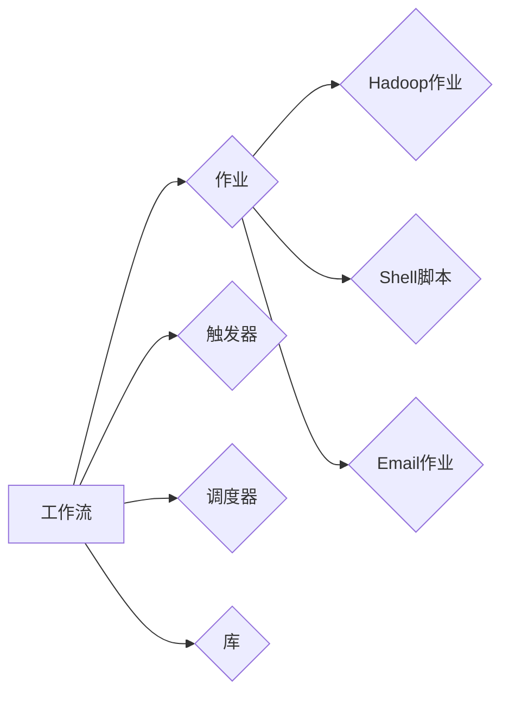

# Oozie工作流调度原理与代码实例讲解

作者：禅与计算机程序设计艺术 / Zen and the Art of Computer Programming

## 1. 背景介绍
### 1.1 问题的由来

随着大数据时代的到来，数据处理和分析的需求日益增长。Hadoop等分布式计算框架的出现，使得大规模数据处理成为可能。然而，Hadoop本身并不支持复杂的工作流管理和调度。为了解决这一问题，Apache Oozie应运而生。

Oozie是一个开源的工作流调度引擎，它可以定义、协调和管理Hadoop作业的执行。通过Oozie，用户可以将多个Hadoop作业（如MapReduce、Spark、Shell脚本等）组合成一个复杂的工作流，并对其进行调度和管理。

### 1.2 研究现状

Oozie已经发展多年，目前处于稳定版阶段。它支持多种工作流类型，如简单的工作流、控制流、Java工作流等，能够满足不同用户的需求。此外，Oozie还支持多种触发器，如时间触发器、事件触发器等，使得工作流的调度更加灵活。

### 1.3 研究意义

Oozie作为Hadoop生态系统中重要的一部分，具有重要的研究意义：

1. 简化工作流管理：Oozie将多个Hadoop作业组合成一个工作流，用户只需定义工作流的逻辑，无需关心作业之间的调度和依赖关系。
2. 提高效率：Oozie可以自动化工作流的执行，节省用户的时间和精力。
3. 提升可靠性：Oozie可以监控工作流的执行状态，确保工作流的正确执行。
4. 优化资源利用：Oozie可以根据工作流的需求动态分配资源，提高资源利用效率。

### 1.4 本文结构

本文将分为以下几个部分：

- 第2部分：介绍Oozie的核心概念和组成。
- 第3部分：详细讲解Oozie的工作流调度原理。
- 第4部分：给出Oozie的代码实例和详细解释。
- 第5部分：探讨Oozie的实际应用场景。
- 第6部分：展望Oozie的未来发展趋势与挑战。
- 第7部分：推荐Oozie的学习资源、开发工具和参考文献。
- 第8部分：总结全文，并对Oozie技术的发展进行展望。
- 第9部分：附录，解答常见问题。

## 2. 核心概念与联系

### 2.1 核心概念

Oozie的核心概念主要包括：

- **工作流（Workflow）**：Oozie工作流是一系列作业的集合，用于定义作业之间的执行顺序和依赖关系。
- **作业（Job）**：Oozie中的作业包括Hadoop作业、Shell脚本、Email作业等，是工作流的基本执行单元。
- **触发器（Trigger）**：触发器用于控制工作流的执行时机，如时间触发器、事件触发器等。
- **调度器（Coordinator）**：调度器负责根据工作流和触发器的定义，决定何时执行工作流。
- **库（Library）**：库用于存储共享资源，如工作流模板、作业定义等。

### 2.2 关系图

以下为Oozie核心概念的关系图：



## 3. 核心算法原理 & 具体操作步骤
### 3.1 算法原理概述

Oozie的工作流调度原理主要基于以下步骤：

1. 用户定义工作流，指定作业之间的执行顺序和依赖关系。
2. Oozie解析工作流定义，生成作业执行计划。
3. 调度器根据触发器的定义，决定何时执行工作流。
4. Oozie按照作业执行计划，依次执行作业。
5. Oozie监控作业执行状态，根据需要重启或杀死作业。
6. 作业执行完成后，Oozie将结果存储到数据库中。

### 3.2 算法步骤详解

以下是Oozie工作流调度算法的具体步骤：

1. **定义工作流**：用户使用Oozie提供的XML定义文件，定义工作流的逻辑、作业、触发器等。

2. **解析工作流定义**：Oozie解析工作流定义文件，生成作业执行计划。执行计划包括作业的执行顺序、依赖关系等。

3. **触发器判断**：调度器根据触发器的定义，判断何时执行工作流。例如，时间触发器会在指定时间执行工作流，事件触发器会在特定事件发生时执行工作流。

4. **作业执行**：Oozie按照作业执行计划，依次执行作业。作业可以是Hadoop作业、Shell脚本、Email作业等。

5. **作业监控**：Oozie监控作业执行状态，根据需要重启或杀死作业。

6. **作业结果存储**：作业执行完成后，Oozie将结果存储到数据库中，方便用户查询和分析。

### 3.3 算法优缺点

Oozie工作流调度算法的优点：

- **简单易用**：Oozie使用XML定义文件，用户可以轻松定义工作流。
- **灵活可靠**：Oozie支持多种工作流类型和触发器，能够满足不同用户的需求。
- **可扩展性**：Oozie支持自定义作业，可以扩展到其他Hadoop生态组件。

Oozie工作流调度算法的缺点：

- **学习曲线**：Oozie使用XML定义文件，对于不熟悉XML的用户来说，学习曲线较陡峭。
- **性能瓶颈**：Oozie的性能瓶颈在于数据库读写操作，在高并发场景下可能会成为瓶颈。

### 3.4 算法应用领域

Oozie工作流调度算法适用于以下领域：

- **大数据处理**：Oozie可以协调和管理Hadoop作业的执行，实现大数据处理工作流的自动化。
- **数据仓库**：Oozie可以协调和管理数据仓库的ETL作业，实现数据仓库的自动化。
- **数据集成**：Oozie可以协调和管理数据集成工作流，实现数据集成过程的自动化。

## 4. 数学模型和公式 & 详细讲解 & 举例说明
### 4.1 数学模型构建

Oozie工作流调度算法的数学模型可以表示为：

$$
\text{调度过程} = \{ \text{定义工作流} \rightarrow \text{解析工作流} \rightarrow \text{触发器判断} \rightarrow \text{作业执行} \rightarrow \text{作业监控} \rightarrow \text{作业结果存储} \}
$$

### 4.2 公式推导过程

Oozie工作流调度算法的公式推导过程如下：

1. **定义工作流**：用户使用XML定义文件，定义工作流。

2. **解析工作流**：Oozie解析XML定义文件，生成作业执行计划。

3. **触发器判断**：Oozie根据触发器的定义，判断何时执行工作流。

4. **作业执行**：Oozie按照作业执行计划，依次执行作业。

5. **作业监控**：Oozie监控作业执行状态，根据需要重启或杀死作业。

6. **作业结果存储**：Oozie将作业结果存储到数据库中。

### 4.3 案例分析与讲解

假设有一个数据仓库项目，需要将多个Hadoop作业组合成一个工作流，实现数据的ETL过程。以下是该工作流的XML定义文件：

```xml
<workflow-app xmlns="uri:oozie:workflow:0.4" name="data-warehousing" xmlns:ns2="uri:oozie:scheduler:0.4">
    <start to="load-data">
        <name>start</name>
        <ok>load-data</ok>
    </start>
    <action name="load-data">
        <shell>
            <command>hadoop jar /path/to/etl.jar</command>
        </shell>
        <ok to="transform-data"/>
        <error to="fail"/>
    </action>
    <action name="transform-data">
        <shell>
            <command>hadoop jar /path/to/transform.jar</command>
        </shell>
        <ok to="load-transformed-data"/>
        <error to="fail"/>
    </action>
    <action name="load-transformed-data">
        <shell>
            <command>hadoop jar /path/to/load.jar</command>
        </shell>
        <ok to="end"/>
        <error to="fail"/>
    </action>
    <end name="end"/>
    <fail name="fail"/>
</workflow-app>
```

该工作流包含三个作业：load-data、transform-data和load-transformed-data，分别对应数据加载、数据转换和数据加载。作业之间的执行顺序和依赖关系由XML定义文件中的`to`属性指定。

### 4.4 常见问题解答

**Q1：Oozie如何处理作业失败的情况？**

A：Oozie会根据作业定义文件中的错误处理逻辑，执行相应的错误处理动作。例如，可以使用`<fail to="retry" retries="3" retry_delay="30000"/>`指定作业失败时重试3次，每次重试间隔30秒。

**Q2：Oozie支持哪些触发器？**

A：Oozie支持多种触发器，如时间触发器、事件触发器、数据库触发器等。用户可以根据实际需求选择合适的触发器。

**Q3：Oozie如何监控作业执行状态？**

A：Oozie会定期检查作业的执行状态，并将状态信息存储到数据库中。用户可以查询数据库，了解作业的执行情况。

## 5. 项目实践：代码实例和详细解释说明
### 5.1 开发环境搭建

在进行Oozie项目实践之前，需要搭建以下开发环境：

- Java开发环境：安装Java Development Kit (JDK) 和 Eclipse 或 IntelliJ IDEA等Java IDE。
- Hadoop环境：安装Hadoop集群，并启动HDFS、YARN等组件。
- Oozie环境：安装Oozie，并启动Oozie服务。

### 5.2 源代码详细实现

以下是一个简单的Oozie工作流示例，用于加载数据、转换数据并加载到数据仓库：

```xml
<workflow-app xmlns="uri:oozie:workflow:0.4" name="data-warehousing" xmlns:ns2="uri:oozie:scheduler:0.4">
    <start to="load-data">
        <name>start</name>
        <ok>load-data</ok>
    </start>
    <action name="load-data">
        <shell>
            <command>hadoop fs -cat /path/to/input.txt | hadoop jar /path/to/etl.jar -input /path/to/input.txt -output /path/to/output</command>
        </shell>
        <ok to="transform-data"/>
        <error to="fail"/>
    </action>
    <action name="transform-data">
        <shell>
            <command>hadoop jar /path/to/transform.jar -input /path/to/output -output /path/to/output-transformed</command>
        </shell>
        <ok to="load-transformed-data"/>
        <error to="fail"/>
    </action>
    <action name="load-transformed-data">
        <shell>
            <command>hadoop jar /path/to/load.jar -input /path/to/output-transformed -output /path/to/output-load</command>
        </shell>
        <ok to="end"/>
        <error to="fail"/>
    </action>
    <end name="end"/>
    <fail name="fail"/>
</workflow-app>
```

该工作流包含三个作业：load-data、transform-data和load-transformed-data，分别对应数据加载、数据转换和数据加载。作业之间的执行顺序和依赖关系由XML定义文件中的`to`属性指定。

### 5.3 代码解读与分析

该工作流定义了一个名为data-warehousing的工作流，包含三个作业。以下是作业的解读和分析：

- load-data作业：使用Hadoop的`fs`命令读取本地文件`/path/to/input.txt`，并使用`hadoop jar`命令执行ETL程序，将数据写入HDFS上的`/path/to/output`目录。
- transform-data作业：使用Hadoop的`fs`命令读取HDFS上的`/path/to/output`目录中的数据，并使用`hadoop jar`命令执行数据转换程序，将转换后的数据写入`/path/to/output-transformed`目录。
- load-transformed-data作业：使用Hadoop的`fs`命令读取HDFS上的`/path/to/output-transformed`目录中的数据，并使用`hadoop jar`命令执行数据加载程序，将数据加载到数据仓库。

### 5.4 运行结果展示

将以上工作流定义文件保存为data-warehousing.xml，然后使用以下命令启动工作流：

```bash
oozie workflow -run data-warehousing.xml -conf oozie workflow conf.xml
```

其中，conf.xml文件用于配置工作流的运行参数，如Hadoop集群地址、HDFS路径等。

运行完成后，可以在Oozie的Web界面中查看工作流的执行状态和结果。

## 6. 实际应用场景
### 6.1 数据仓库项目

Oozie可以用于构建数据仓库项目中的ETL工作流，实现数据的抽取、转换和加载。

### 6.2 大数据分析项目

Oozie可以用于构建大数据分析项目中的数据处理流程，实现数据预处理、特征提取、模型训练等步骤。

### 6.3 其他应用场景

Oozie还可以应用于以下场景：

- 数据集成
- 机器学习项目
- Web应用后端
- 工作流自动化

## 7. 工具和资源推荐
### 7.1 学习资源推荐

以下是学习Oozie的推荐资源：

- Apache Oozie官网：https://oozie.apache.org/
- Apache Oozie用户指南：https://oozie.apache.org/docs/latest/oozie.html
- Apache Oozie开发者指南：https://oozie.apache.org/docs/latest/oozie_developer_guide.html

### 7.2 开发工具推荐

以下是开发Oozie工作流所需的工具：

- Java IDE：如Eclipse、IntelliJ IDEA
- 文本编辑器：如Visual Studio Code、Sublime Text

### 7.3 相关论文推荐

以下是关于Oozie的相关论文：

- Oozie: Workflow Scheduler for Hadoop

### 7.4 其他资源推荐

以下是其他关于Oozie的资源：

- Oozie社区论坛：https://mail-archives.apache.org/markdown/mailing-lists.html?listname=users
- Oozie博客：https://community.apache.org/apache-oozie/

## 8. 总结：未来发展趋势与挑战
### 8.1 研究成果总结

本文介绍了Oozie工作流调度原理与代码实例，从核心概念、算法原理、代码实例等方面对Oozie进行了详细讲解。通过本文的学习，读者可以了解Oozie的基本概念、工作原理和应用场景，并能够根据实际需求进行Oozie工作流的开发。

### 8.2 未来发展趋势

随着大数据和云计算的不断发展，Oozie的工作流调度功能将得到进一步扩展：

- Oozie将支持更多Hadoop生态组件，如Spark、Flink等。
- Oozie将支持更多触发器，如时间触发器、事件触发器等。
- Oozie将支持更多作业类型，如机器学习作业、流处理作业等。
- Oozie将支持更多数据源，如数据库、NoSQL数据库等。

### 8.3 面临的挑战

Oozie在未来的发展中也将面临以下挑战：

- Oozie的性能瓶颈：Oozie的性能瓶颈主要在于数据库读写操作，在高并发场景下可能会成为瓶颈。
- Oozie的易用性：Oozie使用XML定义文件，对于不熟悉XML的用户来说，学习曲线较陡峭。
- Oozie的生态兼容性：随着Hadoop生态的不断发展，Oozie需要与更多组件进行集成。

### 8.4 研究展望

为了应对未来的挑战，Oozie需要在以下几个方面进行改进：

- 优化数据库读写操作，提高性能。
- 简化Oozie的工作流定义，提高易用性。
- 与更多Hadoop生态组件进行集成，提升生态兼容性。

通过不断改进和完善，Oozie将成为大数据工作流调度领域的重要工具，为用户带来更加便捷、高效、可靠的工作流管理体验。

## 9. 附录：常见问题与解答

**Q1：Oozie与Azkaban有何区别？**

A：Oozie和Azkaban都是Hadoop工作流调度引擎，但它们在架构和功能上有所不同。Oozie是Apache软件基金会的一个项目，具有更丰富的功能和更广泛的生态支持；Azkaban是LinkedIn开发的一个开源项目，更适合小型工作流调度。

**Q2：Oozie如何处理并行作业？**

A：Oozie支持并行作业，可以使用`<fork>`元素定义并行作业。在并行作业中，每个子作业可以独立执行，并返回结果。

**Q3：Oozie如何处理循环？**

A：Oozie支持循环，可以使用`<loop>`元素定义循环。在循环中，可以将作业作为循环体，循环执行指定次数或直到满足特定条件。

**Q4：Oozie如何处理异常情况？**

A：Oozie支持异常处理，可以使用`<catch>`元素捕获异常。在异常处理中，可以定义错误处理逻辑，如重试作业、跳过作业等。

**Q5：Oozie如何与其他系统集成？**

A：Oozie可以通过多种方式与其他系统集成，如JDBC、REST API、Webhooks等。用户可以根据实际需求选择合适的集成方式。