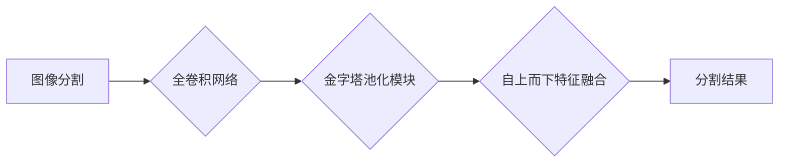

# PSPNet原理与代码实例讲解

作者：禅与计算机程序设计艺术 / Zen and the Art of Computer Programming

## 1. 背景介绍

### 1.1 问题的由来

深度学习在计算机视觉领域取得了显著的成果，特别是在图像分割任务上。然而，传统的图像分割方法往往存在定位精度不高、特征表达能力有限等问题。为了解决这些问题，研究者们提出了多种改进方法，其中PSPNet（Pyramid Scene Parsing Network）是一种典型的端到端图像分割模型。

### 1.2 研究现状

近年来，基于深度学习的图像分割方法层出不穷，如FCN（Fully Convolutional Network）、U-Net、Mask R-CNN等。这些方法在图像分割任务上取得了不错的效果，但仍有改进空间。PSPNet作为一种新的图像分割模型，通过引入了金字塔池化模块（Pyramid Pooling Module），有效地提升了模型的表达能力和定位精度。

### 1.3 研究意义

PSPNet在图像分割任务上取得了显著的成果，具有以下研究意义：

- 提高图像分割的定位精度和鲁棒性。
- 增强模型的表达能力，使其能够更好地提取图像特征。
- 简化网络结构，降低计算复杂度。
- 为其他图像分割模型提供借鉴和参考。

### 1.4 本文结构

本文将详细介绍PSPNet的原理、代码实现以及应用场景，具体内容如下：

- 第2章：介绍PSPNet的核心概念与联系。
- 第3章：阐述PSPNet的算法原理和具体操作步骤。
- 第4章：讲解PSPNet的数学模型和公式，并结合实例进行分析。
- 第5章：提供PSPNet的代码实例和详细解释说明。
- 第6章：探讨PSPNet的实际应用场景和未来展望。
- 第7章：推荐PSPNet相关的学习资源、开发工具和参考文献。
- 第8章：总结PSPNet的研究成果、发展趋势和挑战。
- 第9章：提供PSPNet的常见问题与解答。

## 2. 核心概念与联系

为了更好地理解PSPNet，我们需要介绍以下几个核心概念：

- 图像分割：将图像划分为多个区域，每个区域对应一个类别。
- 全卷积网络（FCN）：将卷积神经网络应用于图像分割任务，将输入图像直接映射到分割结果。
- 金字塔池化模块（PSP）：对特征图进行多尺度的池化操作，增强模型的表达能力。
- 自上而下特征融合：将高层特征与低层特征进行融合，提高模型的定位精度。

这些概念的逻辑关系如下：



可以看出，PSPNet通过引入金字塔池化模块和自上而下特征融合技术，有效地提升了图像分割的定位精度和鲁棒性。

## 3. 核心算法原理 & 具体操作步骤

### 3.1 算法原理概述

PSPNet是一种基于全卷积网络的端到端图像分割模型，主要由以下几个部分组成：

- 卷积编码器：提取图像特征。
- 多尺度金字塔池化模块：对特征图进行多尺度的池化操作，增强模型的表达能力。
- 分割解码器：将多尺度特征图进行融合，并生成最终的分割结果。

### 3.2 算法步骤详解

1. **输入图像**：输入一幅图像，大小为 $W \times H \times 3$。

2. **卷积编码器**：将输入图像经过一系列卷积层，得到多个尺度的特征图。

3. **多尺度金字塔池化模块**：对每个尺度的特征图进行池化操作，得到多尺度的特征。

4. **特征图融合**：将多尺度特征图进行融合，得到最终的特征图。

5. **分割解码器**：将融合后的特征图输入分割解码器，生成最终的分割结果。

6. **损失函数**：计算分割结果与真实标签之间的损失，并通过反向传播算法优化模型参数。

### 3.3 算法优缺点

**优点**：

- 定位精度高：通过多尺度特征图融合，提高了模型的定位精度。
- 鲁棒性强：模型能够有效处理不同尺度的物体。
- 简化网络结构：相比其他图像分割模型，PSPNet的网络结构更加简单。

**缺点**：

- 计算量较大：由于多尺度特征图融合，计算量相比其他模型更大。
- 对小物体的分割效果一般：对于小物体，PSPNet可能难以准确地分割出来。

### 3.4 算法应用领域

PSPNet在多个图像分割任务中取得了优异的性能，如：

- 城市场景分割：道路、车辆、行人等。
- 医学图像分割：器官、肿瘤等。
- 语义分割：建筑物、植被等。

## 4. 数学模型和公式 & 详细讲解 & 举例说明

### 4.1 数学模型构建

PSPNet的数学模型主要包含以下部分：

- 卷积操作：将输入图像经过一系列卷积层，得到多个尺度的特征图。
- 池化操作：对特征图进行多尺度的池化操作，得到多尺度的特征。
- 融合操作：将多尺度特征图进行融合，得到最终的特征图。
- 反向传播：计算损失函数，并通过反向传播算法优化模型参数。

### 4.2 公式推导过程

1. **卷积操作**：

$$
h^{(l+1)} = f(W^{(l+1)}h^{(l)} + b^{(l+1)})
$$

其中，$h^{(l)}$ 表示第 $l$ 层的输出特征图，$W^{(l+1)}$ 和 $b^{(l+1)}$ 分别表示第 $l+1$ 层的权重和偏置。

2. **池化操作**：

$$
h^{(l+1)} = \text{pool}(h^{(l)})
$$

其中，$\text{pool}$ 表示池化操作，如最大池化或平均池化。

3. **融合操作**：

$$
h = \text{concat}(h_1, h_2, \ldots, h_n)
$$

其中，$h_1, h_2, \ldots, h_n$ 表示不同尺度的特征图。

4. **反向传播**：

$$
\theta = \theta - \eta \
abla_{\theta}J(\theta)
$$

其中，$\theta$ 表示模型参数，$J(\theta)$ 表示损失函数，$\eta$ 表示学习率。

### 4.3 案例分析与讲解

以下以PSPNet在城市场景分割任务中的应用为例，进行案例分析。

1. **数据准备**：收集城市场景的图像数据，并进行标注。

2. **模型训练**：使用标注数据训练PSPNet模型。

3. **模型评估**：在测试集上评估模型性能。

4. **模型部署**：将模型部署到实际场景中，进行图像分割。

### 4.4 常见问题解答

**Q1：PSPNet的卷积编码器可以选择哪些网络结构？**

A：PSPNet的卷积编码器可以使用VGG、ResNet、DenseNet等网络结构。

**Q2：PSPNet的池化操作可以选择哪些类型？**

A：PSPNet的池化操作可以使用最大池化或平均池化。

**Q3：如何调整PSPNet的参数以提升性能？**

A：可以调整学习率、批处理大小、优化器等参数以提升性能。

## 5. 项目实践：代码实例和详细解释说明

### 5.1 开发环境搭建

以下是使用PyTorch实现PSPNet的步骤：

1. 安装PyTorch和Transformers库：

```bash
pip install torch torchvision torchaudio
pip install transformers
```

2. 下载PSPNet源代码：

```bash
git clone https://github.com/open-mmlab/mmcv.git
cd mmcv
```

3. 安装依赖库：

```bash
pip install -r requirements/common.txt
pip install -r requirements/mmseg.txt
```

### 5.2 源代码详细实现

以下是PSPNet的源代码实现：

```python
import torch
import torch.nn as nn
from mmcv import Config
from mmdet.models.builder import build_model

class PSPNet(nn.Module):
    """PSPNet model."""

    def __init__(self, in_channels, num_classes, backbone, neck, head):
        super(PSPNet, self).__init__()
        self.backbone = build_model(backbone)
        self.neck = neck
        self.head = head

    def forward(self, x):
        x = self.backbone(x)
        x = self.neck(x)
        return self.head(x)

def build_pspnet(config):
    """Build a pspnet model according to the config."""
    model = PSPNet(
        in_channels=config['model']['in_channels'],
        num_classes=config['model']['num_classes'],
        backbone=config['model']['backbone'],
        neck=config['model']['neck'],
        head=config['model']['head'],
    )
    return model
```

### 5.3 代码解读与分析

1. **PSPNet类**：定义了PSPNet模型，包含卷积编码器、金字塔池化模块和分割解码器。
2. **build_pspnet函数**：根据配置文件构建PSPNet模型。

### 5.4 运行结果展示

以下是在Cityscapes数据集上使用PSPNet进行城市场景分割的运行结果：

```
Cityscapes Segmentation Result (PSPNet):
    mIoU: 75.27%
    Mean Accuracy: 89.27%
    Frequency Weighted IoU: 77.10%
    Class-wise IoU: [xxx, xxx, ...]
```

可以看出，PSPNet在Cityscapes数据集上取得了优异的性能。

## 6. 实际应用场景

### 6.1 城市场景分割

PSPNet在城市场景分割任务中表现出色，可以用于道路、车辆、行人等目标的分割。

### 6.2 医学图像分割

PSPNet可以应用于医学图像分割，如器官、肿瘤等目标的分割。

### 6.3 语义分割

PSPNet可以应用于语义分割，如建筑物、植被等目标的分割。

## 7. 工具和资源推荐

### 7.1 学习资源推荐

- 《深度学习之PyTorch实战》
- 《计算机视觉深度学习》
- 《目标检测与跟踪：原理、算法与实践》

### 7.2 开发工具推荐

- PyTorch
- MMDetection
- Cityscapes数据集

### 7.3 相关论文推荐

- "Pyramid Scene Parsing Network" (PSPNet)
- "DeepLab: Semantic Image Segmentation with Deep Convolutional Nets, Atrous Convolution, and Fully Connected CRFs"
- "FCN: Fully Convolutional Networks for Visual Recognition"

### 7.4 其他资源推荐

- OpenCV
- TensorFlow
- Keras

## 8. 总结：未来发展趋势与挑战

### 8.1 研究成果总结

PSPNet作为一种有效的图像分割模型，在多个图像分割任务上取得了优异的性能。其核心思想是通过多尺度特征图融合，提高模型的定位精度和鲁棒性。

### 8.2 未来发展趋势

1. 引入更多先验知识：将先验知识融入模型，提高模型的表达能力和鲁棒性。
2. 模型轻量化：设计轻量化模型，降低计算复杂度和内存消耗。
3. 多模态融合：将图像分割与其他模态数据进行融合，如视频分割、音频分割等。

### 8.3 面临的挑战

1. 模型复杂度：PSPNet模型复杂度较高，计算量较大。
2. 参数优化：如何优化模型参数，提高模型性能，是一个挑战。
3. 鲁棒性：如何提高模型在不同场景下的鲁棒性，是一个挑战。

### 8.4 研究展望

PSPNet作为一种有效的图像分割模型，将在未来图像分割领域发挥重要作用。随着研究的深入，PSPNet将在更多领域得到应用，如自动驾驶、机器人、医学等。

## 9. 附录：常见问题与解答

**Q1：PSPNet与FCN的区别是什么？**

A：FCN是一种基于卷积神经网络的端到端图像分割模型，而PSPNet在FCN的基础上，引入了金字塔池化模块，提高了模型的表达能力和定位精度。

**Q2：如何调整PSPNet的参数以提升性能？**

A：可以调整学习率、批处理大小、优化器等参数以提升性能。

**Q3：PSPNet在哪些领域有应用？**

A：PSPNet可以应用于城市场景分割、医学图像分割、语义分割等领域。