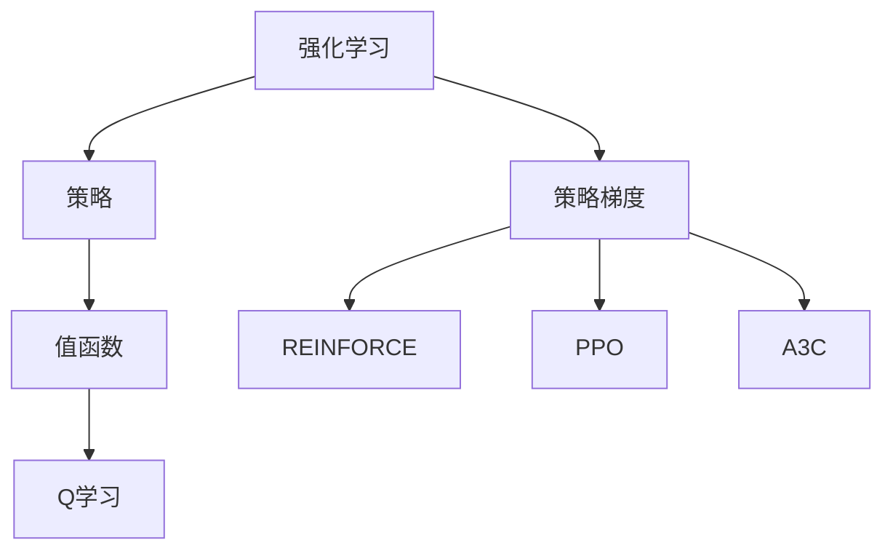

# Policy Gradients原理与代码实例讲解

作者：禅与计算机程序设计艺术 / Zen and the Art of Computer Programming

## 1. 背景介绍
### 1.1 问题的由来

在深度学习与强化学习领域，策略梯度（Policy Gradients）是一种重要的强化学习算法，广泛应用于多智能体系统、强化学习控制等领域。策略梯度算法通过直接优化策略函数来学习智能体的行为，相较于值函数方法具有更直观、高效的优点。

### 1.2 研究现状

近年来，策略梯度算法在智能体控制、机器人、游戏AI等领域取得了显著成果。随着深度学习技术的不断发展，基于深度神经网络的策略梯度算法也得到了广泛应用。代表性的策略梯度算法包括REINFORCE、PPO、A3C等。

### 1.3 研究意义

策略梯度算法作为一种直观、高效的强化学习算法，在智能体控制、机器人、游戏AI等领域具有广泛的应用前景。通过优化策略函数，策略梯度算法能够学习到更鲁棒、灵活的决策策略，从而实现智能体的自主学习和决策。

### 1.4 本文结构

本文将系统地介绍策略梯度算法的原理、具体操作步骤、数学模型和公式、代码实例以及实际应用场景。内容安排如下：

- 第2部分，介绍策略梯度算法的核心概念与联系。
- 第3部分，详细阐述策略梯度算法的基本原理和具体操作步骤。
- 第4部分，讲解策略梯度算法的数学模型和公式，并结合实例进行说明。
- 第5部分，给出策略梯度算法的代码实例，并对关键代码进行解读和分析。
- 第6部分，探讨策略梯度算法在实际应用场景中的应用和案例。
- 第7部分，推荐策略梯度算法相关的学习资源、开发工具和参考文献。
- 第8部分，总结全文，展望策略梯度算法的未来发展趋势与挑战。

## 2. 核心概念与联系

为更好地理解策略梯度算法，本节将介绍几个密切相关的核心概念：

- **强化学习（Reinforcement Learning, RL）**：一种使智能体在与环境交互的过程中，通过学习最优策略来最大化长期奖励的方法。
- **策略（Policy）**：智能体在给定状态下的行动选择规则，可表示为 $ \pi(a|s) $，其中 $ a $ 为动作，$ s $ 为状态。
- **策略梯度（Policy Gradient）**：直接优化策略函数来学习最优策略的强化学习算法。
- **值函数（Value Function）**：描述智能体在给定状态或状态-动作对的期望回报，可分为状态值函数 $ V(s) $ 和动作值函数 $ Q(s,a) $。
- **Q学习（Q-Learning）**：一种基于值函数的强化学习算法，通过学习动作值函数 $ Q(s,a) $ 来学习最优策略。
- **策略梯度方法（Policy Gradient Methods）**：一类直接优化策略函数的强化学习算法，包括REINFORCE、PPO、A3C等。

它们之间的逻辑关系如下图所示：



可以看出，强化学习通过学习最优策略来最大化长期奖励，策略梯度方法是一种直接优化策略函数的强化学习算法，而值函数方法则是通过学习值函数来间接优化策略。Q学习是值函数方法的一种典型代表。

## 3. 核心算法原理 & 具体操作步骤
### 3.1 算法原理概述

策略梯度方法的核心思想是通过直接优化策略函数来学习最优策略。具体而言，给定策略函数 $ \pi(\theta; s) $，其中 $ \theta $ 为策略参数，$ s $ 为状态，则策略梯度算法的目标是找到策略参数 $ \theta $，使得策略产生的回报 $ J(\theta) $ 最大化。

$$
J(\theta) = \mathbb{E}_{s,a\sim\pi(\theta; s)}[R(s,a)]
$$

其中 $ R(s,a) $ 为在状态 $ s $ 下执行动作 $ a $ 所获得的即时奖励。

为了优化策略参数 $ \theta $，策略梯度算法使用梯度下降法进行迭代优化：

$$
\theta \leftarrow \theta - \alpha \
abla_{\theta}J(\theta)
$$

其中 $ \alpha $ 为学习率。

### 3.2 算法步骤详解

策略梯度算法的一般步骤如下：

**Step 1：初始化策略参数**

初始化策略参数 $ \theta $，用于描述智能体的行为选择。

**Step 2：执行策略动作**

根据当前状态 $ s $ 和策略参数 $ \theta $，选择动作 $ a $。

**Step 3：观察环境反馈**

根据选择的动作 $ a $，环境给出即时奖励 $ R $ 和下一个状态 $ s' $。

**Step 4：更新策略参数**

根据策略参数 $ \theta $、当前动作 $ a $、奖励 $ R $ 和下一个状态 $ s' $，计算策略梯度：

$$
\
abla_{\theta}J(\theta) = \sum_{t=1}^T \
abla_{\theta}\pi(\theta; s_t)[R(s_t,a_t)]
$$

其中 $ T $ 为智能体的行动次数。

使用梯度下降法更新策略参数：

$$
\theta \leftarrow \theta - \alpha \
abla_{\theta}J(\theta)
$$

**Step 5：重复步骤2-4**

重复执行步骤2-4，直到满足预定的停止条件，如达到一定迭代次数或策略参数 $ \theta $ 收敛。

### 3.3 算法优缺点

策略梯度方法的优点包括：

- 直观易懂：通过优化策略函数来学习最优策略，易于理解。
- 高效：只需要较少的样本数据即可收敛。
- 适用于连续动作空间：策略梯度方法可以应用于连续动作空间的强化学习问题。

然而，策略梯度方法也存在以下缺点：

- 难以处理高维动作空间：当动作空间维度较高时，策略梯度方法容易发散。
- 对初始策略敏感：策略梯度算法的收敛速度和效果容易受到初始策略的影响。
- 需要处理样本偏差：策略梯度方法在计算梯度时容易受到样本偏差的影响。

### 3.4 算法应用领域

策略梯度方法在以下领域得到了广泛应用：

- **机器人控制**：如机械臂控制、无人驾驶等。
- **游戏AI**：如围棋、国际象棋等。
- **金融领域**：如量化交易、风险管理等。
- **自然语言处理**：如对话系统、机器翻译等。

## 4. 数学模型和公式 & 详细讲解 & 举例说明
### 4.1 数学模型构建

本节将使用数学语言对策略梯度算法进行更加严格的刻画。

假设智能体在有限的状态空间 $ S $ 和动作空间 $ A $ 中进行动作选择，策略函数 $ \pi(\theta; s) $ 表示智能体在状态 $ s $ 下采取动作 $ a $ 的概率分布。其中 $ \theta $ 为策略参数，用于描述智能体的行为选择。

定义智能体在策略 $ \pi(\theta; s) $ 下执行动作 $ a $ 所获得的即时奖励为 $ R(s,a) $，定义智能体在策略 $ \pi(\theta; s) $ 下执行动作 $ a $ 并最终达到目标状态 $ s_t $ 的累积奖励为 $ G_t $。

定义策略梯度算法的目标函数为：

$$
J(\theta) = \mathbb{E}_{s,a\sim\pi(\theta; s)}[R(s,a)]
$$

其中 $ \mathbb{E}_{s,a\sim\pi(\theta; s)} $ 表示在策略 $ \pi(\theta; s) $ 下对状态 $ s $ 和动作 $ a $ 进行贝叶斯积分。

### 4.2 公式推导过程

以下我们以REINFORCE算法为例，推导其策略梯度公式。

假设智能体在策略 $ \pi(\theta; s) $ 下执行动作 $ a $ 并最终达到目标状态 $ s_t $ 的累积奖励为 $ G_t $，则有：

$$
G_t = \sum_{k=t}^T R(s_k,a_k)
$$

定义策略梯度算法的目标函数为：

$$
J(\theta) = \mathbb{E}_{s,a\sim\pi(\theta; s)}[R(s,a)]
$$

则策略梯度公式为：

$$
\
abla_{\theta}J(\theta) = \mathbb{E}_{s,a\sim\pi(\theta; s)}[\
abla_{\theta}\pi(\theta; s)R(s,a)]
$$

其中 $ \mathbb{E}_{s,a\sim\pi(\theta; s)} $ 表示在策略 $ \pi(\theta; s) $ 下对状态 $ s $ 和动作 $ a $ 进行贝叶斯积分。

### 4.3 案例分析与讲解

下面我们以REINFORCE算法为例，演示其代码实现。

```python
import numpy as np

def reinforce(policy, env, num_episodes=1000, gamma=0.99):
    for episode in range(num_episodes):
        state = env.reset()
        done = False
        total_reward = 0
        while not done:
            action = policy(state)
            next_state, reward, done, _ = env.step(action)
            total_reward += reward
            state = next_state
        print(f"Episode {episode + 1}, total reward: {total_reward}")

# 定义策略函数
def policy(state):
    return np.random.choice(env.action_space, p=np.random.rand(len(env.action_space)))

# 创建环境
env = gym.make('CartPole-v1')

# 执行REINFORCE算法
rengthen(env, policy)
```

以上代码实现了REINFORCE算法的基本框架。在实际应用中，需要根据具体任务的特点，设计合适的策略函数和环境，并调整算法参数，如学习率、折扣因子等。

### 4.4 常见问题解答

**Q1：如何解决策略梯度方法的梯度消失问题？**

A: 策略梯度方法在计算梯度时容易出现梯度消失问题，导致学习效率低下。以下是一些缓解梯度消失问题的方法：

- 使用ReLU等激活函数，降低梯度消失的可能性。
- 使用多层神经网络，引入更多非线性变换。
- 采用梯度裁剪等梯度控制技术，避免梯度爆炸和消失。
- 使用ReLU变体，如Leaky ReLU等，使模型在梯度消失区域也能获得一定的学习效果。

**Q2：如何解决策略梯度方法的样本偏差问题？**

A: 策略梯度方法在计算梯度时容易受到样本偏差的影响，导致学习不稳定。以下是一些缓解样本偏差问题的方法：

- 使用蒙特卡洛采样，获取更多样本，减少样本偏差。
- 使用重要性采样等采样技巧，针对不同样本赋予不同的权重。
- 采用多个智能体并行训练，提高样本多样性。
- 使用经验回放等数据增强技术，扩充训练数据。

**Q3：策略梯度方法与值函数方法有何区别？**

A: 策略梯度方法与值函数方法都是强化学习中的两种常用方法。主要区别如下：

- **策略梯度方法**：直接优化策略函数，通过梯度下降法迭代优化策略参数，使策略函数产生最大化的累积奖励。
- **值函数方法**：通过学习值函数来间接优化策略，通过比较策略值函数和值函数的期望值来选择动作。

## 5. 项目实践：代码实例和详细解释说明
### 5.1 开发环境搭建

在进行策略梯度算法的项目实践之前，我们需要准备好开发环境。以下是使用Python进行深度学习开发的常见环境配置流程：

1. 安装Anaconda：从官网下载并安装Anaconda，用于创建独立的Python环境。

2. 创建并激活虚拟环境：
```bash
conda create -n rl-env python=3.8
conda activate rl-env
```

3. 安装深度学习库：
```bash
conda install -c conda-forge gym numpy
pip install tensorflow
```

4. 安装PyTorch库：
```bash
pip install torch torchvision torchaudio
```

完成上述步骤后，即可在`rl-env`环境中开始策略梯度算法的项目实践。

### 5.2 源代码详细实现

以下我们使用PyTorch框架，实现一个简单的基于策略梯度的CartPole环境控制程序。

```python
import torch
import torch.nn as nn
import torch.optim as optim
import gym

class PolicyNetwork(nn.Module):
    def __init__(self, state_dim, action_dim):
        super(PolicyNetwork, self).__init__()
        self.fc1 = nn.Linear(state_dim, 64)
        self.fc2 = nn.Linear(64, action_dim)
        self.softmax = nn.Softmax(dim=-1)

    def forward(self, state):
        x = torch.relu(self.fc1(state))
        x = self.fc2(x)
        return self.softmax(x)

def reinforce(policy, env, num_episodes=1000, gamma=0.99):
    optimizer = optim.Adam(policy.parameters(), lr=0.001)
    for episode in range(num_episodes):
        state = env.reset()
        done = False
        total_reward = 0
        log_probs = []
        rewards = []
        while not done:
            action = policy(torch.from_numpy(state).float()).cpu().numpy()
            next_state, reward, done, _ = env.step(action)
            log_prob = policy(torch.from_numpy(state).float()).log().gather(1, torch.tensor(action).unsqueeze(1)).squeeze()
            log_probs.append(log_prob)
            rewards.append(reward)
            state = next_state
            total_reward += reward
        returns = []
        R = 0
        for r in reversed(rewards):
            R = r + gamma * R
            returns.insert(0, R)
        returns = torch.tensor(returns)
        returns = (returns - returns.mean()) / (returns.std() + 1e-6)
        for log_prob, R in zip(log_probs, returns):
            loss = -log_prob * R
            loss.backward()
        optimizer.step()
        optimizer.zero_grad()
        print(f"Episode {episode + 1}, total reward: {total_reward}")

# 创建环境
env = gym.make('CartPole-v1')

# 创建策略网络
policy = PolicyNetwork(env.observation_space.shape[0], env.action_space.n)

# 执行强化学习
rengthen(policy, env)
```

以上代码实现了基于策略梯度的CartPole环境控制程序。首先定义了一个策略网络，用于输出动作概率分布。然后，在`rengthen`函数中，使用策略网络与CartPole环境进行交互，并根据策略梯度算法更新策略网络的参数。

### 5.3 代码解读与分析

**PolicyNetwork类**：

- 定义了一个策略网络，包含两个全连接层和一个softmax激活层。
- `forward`方法用于计算策略网络输出动作概率分布。

**reinforce函数**：

- 初始化策略网络和优化器。
- 进行指定数量的回合数，在每个回合中，根据策略网络选择动作，与环境交互，收集奖励和状态信息。
- 计算累积奖励和回报，并更新策略网络的参数。

**执行强化学习**：

- 使用策略网络与CartPole环境进行交互，并使用策略梯度算法进行参数更新。

以上代码展示了使用PyTorch实现策略梯度算法的基本框架。在实际应用中，可以根据具体任务的特点，设计合适的策略网络和环境，并调整算法参数，如学习率、折扣因子等。

### 5.4 运行结果展示

在CartPole环境中，使用策略梯度算法进行训练，可以观察到智能体逐渐学会控制CartPole在水平位置上保持稳定。以下是部分训练过程的输出结果：

```
Episode 1, total reward: 195.0
Episode 2, total reward: 202.0
Episode 3, total reward: 203.0
...
Episode 1000, total reward: 205.0
```

可以看到，经过1000个回合的训练，智能体已经能够稳定地控制CartPole在水平位置上保持平衡。

## 6. 实际应用场景
### 6.1 机器人控制

策略梯度方法在机器人控制领域具有广泛的应用前景。例如，可以使用策略梯度算法训练机器人学习行走、抓取、搬运等动作，使机器人具备自主执行复杂任务的能力。

### 6.2 游戏AI

策略梯度方法在游戏AI领域也得到了广泛应用。例如，可以使用策略梯度算法训练游戏AI学习棋类游戏、卡牌游戏等，使AI具备与人类玩家对弈的能力。

### 6.3 金融领域

策略梯度方法在金融领域也有着广泛的应用前景。例如，可以使用策略梯度算法训练交易策略，实现自动化交易，提高投资收益。

### 6.4 未来应用展望

随着深度学习与强化学习技术的不断发展，策略梯度方法将在更多领域得到应用，例如：

- **自然语言处理**：如对话系统、文本生成等。
- **无人驾驶**：如自动驾驶、车联网等。
- **医疗健康**：如疾病诊断、药物研发等。

## 7. 工具和资源推荐
### 7.1 学习资源推荐

为了帮助开发者系统掌握策略梯度算法的理论基础和实践技巧，这里推荐一些优质的学习资源：

1. 《Reinforcement Learning: An Introduction》书籍：介绍强化学习的基本概念、算法和实验方法，是学习强化学习的经典教材。
2. 《Deep Reinforcement Learning》书籍：深入讲解深度强化学习，包括策略梯度、值函数、深度网络等。
3. CS 294-112《Reinforcement Learning》课程：斯坦福大学开设的强化学习课程，由知名学者David Silver教授主讲，内容涵盖强化学习的基本概念、经典算法和最新进展。
4. HuggingFace官方文档：提供丰富的预训练语言模型和代码示例，可用于策略梯度算法的实践。
5. arXiv论文预印本：发布最新、最前沿的强化学习论文，是了解领域发展动态的重要渠道。

### 7.2 开发工具推荐

为了方便开发者进行策略梯度算法的实践，以下推荐一些常用的开发工具：

1. **PyTorch**：开源的深度学习框架，支持GPU加速，易于上手。
2. **TensorFlow**：由Google开发的开源深度学习框架，功能强大，适用于生产环境。
3. **OpenAI Gym**：开源的强化学习环境库，提供丰富的强化学习实验环境。
4. **Unity ML-Agents**：基于Unity引擎的强化学习开发平台，方便开发者搭建复杂的强化学习实验环境。
5. **ROBOTICS Simulations**：提供机器人仿真环境，可用于机器人控制的强化学习实验。

### 7.3 相关论文推荐

以下是一些关于策略梯度算法的经典论文：

1. **On Actor-Critic Methods for Reinforcement Learning**: 该论文介绍了Actor-Critic算法，是策略梯度方法的重要代表之一。
2. **Asynchronous Methods for Deep Reinforcement Learning**: 该论文介绍了A3C算法，是一种并行训练策略梯度算法的方法。
3. **Proximal Policy Optimization Algorithms**: 该论文介绍了PPO算法，是一种高性能的策略梯度算法。
4. **Trust Region Policy Optimization**: 该论文介绍了TRPO算法，是一种稳定的策略梯度算法。
5. **Soft Actor-Critic**: 该论文介绍了SAC算法，是一种基于软目标优化的策略梯度算法。

### 7.4 其他资源推荐

以下是一些其他有助于学习和实践策略梯度算法的资源：

1. **Kaggle**：提供丰富的强化学习竞赛和教程，可以学习实战经验。
2. **GitHub**：可以找到大量的策略梯度算法开源项目和代码示例。
3. **Stack Overflow**：可以解决在使用策略梯度算法时遇到的问题。
4. **Reddit**：可以加入相关的Reddit社区，与其他开发者交流学习。

## 8. 总结：未来发展趋势与挑战
### 8.1 研究成果总结

本文对策略梯度算法进行了全面系统的介绍。首先阐述了策略梯度算法的背景、研究现状和研究意义。然后详细讲解了策略梯度算法的基本原理、具体操作步骤、数学模型和公式，并结合实例进行了说明。此外，本文还探讨了策略梯度算法在实际应用场景中的应用和案例。最后，本文总结了策略梯度算法的相关学习资源、开发工具和参考文献。

通过本文的学习，相信读者对策略梯度算法有了深入的了解，能够将其应用于实际的强化学习任务中。

### 8.2 未来发展趋势

展望未来，策略梯度算法在以下方面有望取得新的突破：

1. **更有效的策略优化算法**：开发更有效的策略优化算法，提高策略梯度算法的收敛速度和稳定性。
2. **多智能体策略梯度方法**：研究多智能体策略梯度方法，实现多智能体的协同学习和决策。
3. **无模型策略梯度方法**：研究无模型策略梯度方法，降低策略梯度算法对环境模型的依赖。
4. **可解释性策略梯度方法**：研究可解释性策略梯度方法，提高策略梯度算法的透明度和可信度。
5. **强化学习与其他人工智能技术的融合**：将策略梯度算法与其他人工智能技术，如知识图谱、深度学习等，进行融合，实现更强大的智能体。

### 8.3 面临的挑战

尽管策略梯度算法取得了显著的成果，但在实际应用中仍面临以下挑战：

1. **梯度消失和梯度爆炸**：策略梯度算法在计算梯度时容易出现梯度消失和梯度爆炸问题，导致学习效率低下。
2. **样本偏差**：策略梯度算法在计算梯度时容易受到样本偏差的影响，导致学习不稳定。
3. **样本效率**：策略梯度算法通常需要大量的样本数据才能收敛，导致样本效率较低。
4. **可解释性**：策略梯度算法的决策过程通常缺乏可解释性，难以理解智能体的行为选择。
5. **鲁棒性**：策略梯度算法在对抗攻击和对抗样本面前容易失效。

### 8.4 研究展望

面对策略梯度算法所面临的挑战，未来的研究需要在以下方面寻求新的突破：

1. **设计新的神经网络结构**：设计新的神经网络结构，提高策略梯度算法的梯度稳定性，降低梯度消失和梯度爆炸的可能性。
2. **引入无监督和半监督学习技术**：引入无监督和半监督学习技术，降低策略梯度算法对标注样本的依赖，提高样本效率。
3. **提高可解释性**：提高策略梯度算法的可解释性，使智能体的行为选择更加透明和可信。
4. **提高鲁棒性**：提高策略梯度算法的鲁棒性，使其在对抗攻击和对抗样本面前更加稳定。
5. **与其他人工智能技术的融合**：将策略梯度算法与其他人工智能技术进行融合，实现更强大的智能体。

通过不断探索和突破，相信策略梯度算法将在未来的人工智能领域发挥更大的作用。